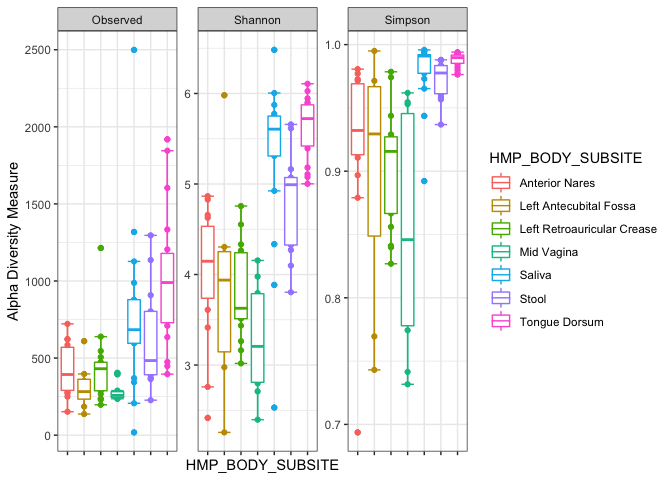

## Objective
The goal of this app was to easily visualize and compare microbial community compositions between selected human body subsites using the publicly available HMP (Human Microbiome Project) V1-3 16S amplicon data found within the HMP16SData library in R. Microbiome analysis often involves conducting a relative abundance analysis, alpha diversity analysis, ordination analysis, and recently network analysis to understand the composition, relative abundance, and role of microbial species within a specific environment. Here, I wanted to compare the species presence, abundance, and overall networks between different human body sites, while also making the comparison easy and replicable, even for users unfamiliar with microbiome analysis. 

## Initial Data Setup
### Required libraries in R
To utilize this app, the following list of libraries must be installed:

```r
library(phyloseq)
library(SpiecEasi)
library(magrittr)
library(ggplot2)
library(dplyr)
library(plotly)
library(seqtime)
```
For this app, all data come from the HMP16SData library, available in R.
The HMP16SData library can be installed using BiocManager using the following command:
`BiocManager::install("HMP16SData")`

From this dataset, the Tongue Dorsum, Saliva, Left retroauricular Crease,Left Antecubital Fossa, Mid Vagina, Stool, and Anterior Nares human body subsites were selected, converted to phyloseq objects, and merged together for a comprehensive, full body site dataset, called V13_HMP_phylo1, where all taxa were present at least once in an individual sample. All 5 body sites (Oral, Skin, Gastrointestinal Tract, Urogenital Tract, and Airways) are represented by these 7 subsites, allowing for comparison to be possible not just between human body subsites, but also between the more general human body sites. 
Below is a brief overview of the V13_HMP_phylo1:

```r
load("~/HMP16S/V13_HMP_phylo1.RData")
V13_HMP_phylo1
```

```
## phyloseq-class experiment-level object
## otu_table()   OTU Table:         [ 29643 taxa and 1120 samples ]
## sample_data() Sample Data:       [ 1120 samples by 8 sample variables ]
## tax_table()   Taxonomy Table:    [ 29643 taxa by 6 taxonomic ranks ]
## phy_tree()    Phylogenetic Tree: [ 29643 tips and 26276 internal nodes ]
```
Altogether, in addition to body study site and subsite, microbial composition comparisons can also be made by sex, run center, and the number of visits made by each given subject. 

```r
colnames(sample_data(V13_HMP_phylo1))
```

```
## [1] "RSID"             "VISITNO"          "SEX"             
## [4] "RUN_CENTER"       "HMP_BODY_SITE"    "HMP_BODY_SUBSITE"
## [7] "SRS_SAMPLE_ID"    "Study"
```

```r
head(sample_data(V13_HMP_phylo1))
```

```
##                RSID VISITNO    SEX RUN_CENTER          HMP_BODY_SITE
## 700013549 158013734       1 Female        BCM Gastrointestinal Tract
## 700014386 158398106       1   Male     BCM,BI Gastrointestinal Tract
## 700014488 158438567       1   Male     BI,BCM Gastrointestinal Tract
## 700014497 158418336       1   Male     BI,BCM Gastrointestinal Tract
## 700014555 158458797       1 Female     BI,BCM Gastrointestinal Tract
## 700014718 158479027       1   Male    JCVI,BI Gastrointestinal Tract
##           HMP_BODY_SUBSITE SRS_SAMPLE_ID Study
## 700013549            Stool     SRS012191 Stool
## 700014386            Stool          <NA> Stool
## 700014488            Stool          <NA> Stool
## 700014497            Stool          <NA> Stool
## 700014555            Stool          <NA> Stool
## 700014718            Stool          <NA> Stool
```
By this manner, we can see if certain microbial species dominate specific body regions, are appearing from specific centers or are sex-specific. 

## Alpha Diversity Analysis
First, let's compare the alpha diversity between the human body subsites and sites. Alpha diversity is the measure of microbial diversity (taxonomic variation) within a sample. We can use different measures of richness, such as the Shannon or Simpson index, to quantify the alpha diversity of a given sample or sample category. For a more comprehensive analysis, we will use 3 richness measures- Observed, Shannon, and Simpson. Ideally, we would include as many samples as possible in this analysis. However, this would take too much time and memory to visualize. For the companion shiny app, for both Alpha Diversity Analysis and PCoA Analysis, only 100 samples were used to compare the taxonomic variation between categories. In the app, we can compare the differences in alpha diversity between subsites, sites, sex, and center by simply changing the input in the Comparison option.
Below, we show how to do the alpha diversity analysis just between subsites.

```r
richness_measures <- c("Observed", "Shannon", "Simpson")
sample_samples <- function(x, size) {
    sampled_names <-
        sample_names(x) %>%
        sample(size)

    prune_samples(sampled_names, x)
}
V13_HMP_phylo1 %>% sample_samples(100) -> V13_HMP_phylo1_100
  richnessmeasures <- c("Observed", "Shannon", "Simpson")
plot_richness(V13_HMP_phylo1_100, x= "HMP_BODY_SUBSITE", color= "HMP_BODY_SUBSITE", measures=richnessmeasures) + stat_boxplot(geom="errorbar") + geom_boxplot() + theme_bw() + theme(axis.text.x = element_blank())
```

<!-- -->


From the boxplot comparison, we can conclude that the saliva,stool, and tongue samples show the most species diversity while samples from the midvagina are the most homegenous in terms of microbial species diversity.

## PCoA Analysis
Next, we can conduct a principal component ordination analysis of the 100 sample dataset, using the Bray Curtis distance method. Again, in the app, the color and shape of the samples can be customized by different categories. Users can also view how species separate in addition to how samples separate, by selecting biplot. 

```r
V13_HMP_phylo1_ord_100 <- ordinate(V13_HMP_phylo1_100, method="PCoA", distance="bray")
plot1 <- plot_ordination(V13_HMP_phylo1_100, V13_HMP_phylo1_ord_100, color="Study", shape="SEX") + ggtitle("PCoA of Samples")
plot1
```

<!-- -->

```r
plot2 <- plot_ordination(V13_HMP_phylo1_100, V13_HMP_phylo1_ord_100, color="RUN_CENTER", shape="HMP_BODY_SITE", type = "biplot") + ggtitle("PCoA of Samples and Species")
plot2
```

<!-- -->


From these 2 plots, we can see that samples differ most by the subsite where they were retrieved. Sex and run center did not influence the distribution of the samples. Samples cluster together based on subsite or body site. 

## Relative Abundance 
We can plot the relative abundance of taxa for each distinct subsites of the human body. To make this faster in the companion shiny app, we only included the most abundant taxa and samples with reads above 5000 for each subsite.
Briefly, samples belonging to a specific subsite were merged together by the subset_samples function. Then, only taxa that occurred at least than 3 times in at least 20 % of all samples were kept, while all other, less abundant taxa were discarded. Lastly, any samples with low reads (less than 5000 total) were removed.
Although in the app, we can select which subsite we want to see of the 7 possible options and also color by taxonomic rank (from Phylum to Genus), here, we will only show one subsite, where all bars are colored by Phylum. 


```r
  new_body_site_phylo <- list()
  body_sites <- as.list(unique(sample_data(V13_HMP_phylo1)$HMP_BODY_SUBSITE))
  print(body_sites)
```

```
## [[1]]
## [1] "Stool"
## 
## [[2]]
## [1] "Tongue Dorsum"
## 
## [[3]]
## [1] "Saliva"
## 
## [[4]]
## [1] "Anterior Nares"
## 
## [[5]]
## [1] "Left Retroauricular Crease"
## 
## [[6]]
## [1] "Left Antecubital Fossa"
## 
## [[7]]
## [1] "Mid Vagina"
```

```r
    for(body_site in unique(sample_data(V13_HMP_phylo1)$HMP_BODY_SUBSITE)){
     #print(body_site)
     phylo_reduced1 <- subset_samples(V13_HMP_phylo1, HMP_BODY_SUBSITE == body_site)
    #print(phylo_reduced1)
    phylo_reduced2 = filter_taxa(phylo_reduced1, function(x) sum(x > 3) > (0.2*length(x)), TRUE)
    phylo_reduced3 <- prune_samples(sample_sums(phylo_reduced2)>=5000, phylo_reduced2)
    phylo_reduced3_percent = transform_sample_counts(phylo_reduced3, function(x) 100 * x/sum(x))
    new_body_site_phylo[[body_site]] = phylo_reduced3_percent
    }
  phylo_to_use = new_body_site_phylo[[body_sites[[1]]]]
  plot_bar(phylo_to_use, x = "Sample", y = "Abundance", fill = "PHYLUM") + 
    geom_bar(stat="identity") + theme_classic() + 
    theme(axis.text.x = element_text(angle=45, hjust=1)) + 
    ylab("Percentage of Sequences") +
    ggtitle(paste(body_sites[[1]], "Phylum", "Relative Abundance", sep=" "))
```

<!-- -->


Bacteroidetes are most abundant, followed by Firmicutes and Proteobacteria for Stool Samples.The relative abundance across subsites can also be plotted, as shown below:

```r
load("~/HMP16S/V13_HMP_allsubsites.RData")
V13_HMP_psmelt_3 <- psmelt(V13_HMP_phylo1_allsubsites3)
#V13_HMP_psmelt_3$alphacol <- as.factor(ifelse(V13_HMP_psmelt_3$Sample != "Stool", 0.75, 1))
ggplot(V13_HMP_psmelt_3, aes(Sample, Abundance, fill = V13_HMP_psmelt_3$PHYLUM)) + geom_bar(stat="identity") + theme(axis.title.x = element_blank()) + ylab("Percentage of Sequences") + theme_classic() + theme(axis.text.x = element_text(angle=45, hjust=1)) + guides(alpha=FALSE)
```

<!-- -->

Actinobacteria, Firmicutes, and Bacteroidetes are most abundant across subsites.

## Subsite Network Analysis
To create networks of each subsite, all subsite-specific samples were merged together. As this would be time-consuming to see here, please view the initial code within `HMP_net_creation.R` The `SpiecEasi` network package was used to measure the relationship between taxa by neighborhood selection (by the function `spiec.easi` and the `mb` parameter), preventing any indirect, spurious associations. For each subsite, the resulting phyloseq object and igraph were kept and plotted using the `plot_network` function from SpiecEasi. This allowed for relationships present in each subsite to be easily visualized. In the app, users can select at which taxonomic level they prefer to see the network. Here, we will show how the network looks at Phylum level only.Each network was also resized by hub score to help users find the most important taxa within each subsite.

```r
load("~/HMP16S/HMP_subsite_graphs_list.RData")
new_phylo_for_net <- subsite_graphs_list[["Stool"]]
plot_network(new_phylo_for_net[["Graph"]], new_phylo_for_net[["Phylo"]], type='taxa', color= "PHYLUM", label=NULL) + ggtitle(paste("Stool", "Phylum", "Network", sep= " "))
```

<!-- -->

```r
plot_network(new_phylo_for_net[["Graph"]], new_phylo_for_net[["Phylo"]], type='taxa', color= "PHYLUM", label=NULL, point_size = hub_score(new_phylo_for_net[["Graph"]])$vector*10) + ggtitle(paste("Stool", "Phylum", "Hub","Network", sep= " "))
```

<!-- -->


## Complete body subsite Network
To create the complete body subsite network, first only taxa present in at least 20 % of all samples were kept, with all others being discarded by the `filterTaxonMatrix` function from seqtime. The otu table and accompanying taxonomic table were then changed accordingly to keep only these resultant abundant taxa.The data used in the code chunk below was generated in the `HMP16Screation.R` file. The filtering and network creation took too long to feature here and should be viewed in the file mentioned above.

```r
load("~/HMP16S/V13_HMP_spiec.RData")
V13_HMP_phylo.f1 <- merge_phyloseq(V13_HMP_phylo.f, sample_data(V13_HMP_phylo1))
p1 <- plot_network(V13_HMP_spiec.graph, V13_HMP_phylo.f1, type="taxa", color= "PHYLUM", label=NULL) + ggtitle("Combined Body Subsite Network at Phylum")
ggplotly(p1)
```

<!--html_preserve--><div id="htmlwidget-9cb47f0562a8ddd289d5" style="width:672px;height:480px;" class="plotly html-widget"></div>
<script type="application/json" data-for="htmlwidget-9cb47f0562a8ddd289d5">{"x":{"data":[{"x":[8.22332179701338,8.2126416098202,14.368923493118,11.1911599718677,13.509884574771,13.6783821461405,10.1960409462259,12.062017104699,10.149651230041,8.95950538172056,9.44973750231457,11.773236245496,11.4743604929684,10.6769549251587,12.030126846936,6.17267927201217,13.5755857293484,12.6807318413675,9.45157806072672,11.8412132025163,5.37077355769371,11.2706089166218,7.62399033295971,13.0674279293758,7.34214666061707,0.0984761347754811,-9.15366949620466,-9.74080448006822,-8.92563867506309,-8.09178735958772,0.020087500599823,-2.35376080443585,0.171562341122475,-1.07415791122139,-0.734181959983084,-1.41494123880284,-1.52915453696759,0.736245914303475,-0.0409880238630535,-0.350413343477784,-6.94266709279317,8.65471797048802,12.5651918212352,11.980611818563,16.1738907991389,11.5864739369903,11.8637284906576,11.9591447535853,13.2746775296692,9.40479582220213,8.64947518824674,10.1826196770503,9.35278298429471,8.15779183425929,8.411961837367,14.2189813502092,7.63315639177681,12.6836663092351,12.6893481310472,9.49714655616606,13.0321255653348,11.9173460589898,10.2617188958684,9.75148440193596,7.70852262256735,12.5940905746318,11.0524890831859,10.4666716762123,12.320170011296,9.32916206352261,7.00939873403988,11.3364930681944,13.5596337586379,11.0095112401013,6.78606889874364,7.12637830447826,11.6356359932368,13.5675844656251,8.63150573805998],"y":[-5.39072935980512,-6.30909546042553,-2.33843018031092,-1.49442544457982,-3.57884303117274,-2.97663080678065,-5.9289750132304,-2.18685634004021,-8.73818857764706,-7.21513045856343,-4.39608995985947,-8.00660919156278,-3.59746022657565,-10.0497532954321,-0.982154581575648,-4.78031493137479,-2.20212741387552,-9.56604903668437,-5.48767846233178,-2.8129140486729,-4.50012915521217,-6.73497940018679,-5.887671072216,-2.26680619981489,-3.58115330982432,4.49541272137928,0.612697312765239,0.0733056548906535,-0.540132552917005,-1.84019822650851,-11.4799343621663,-12.8773263833905,-12.5326540997411,-12.8512649451312,-11.9250103640295,-13.4674283638294,-12.2041281839934,-13.7179916920849,-13.0971838699971,-13.9057455190043,-3.39658969530088,-4.0319952809576,-4.11254349252297,-7.46160685071254,-4.92472547881608,-4.67607887784131,-4.33349208585492,-3.53978948362789,-4.27218207492583,-2.12021627150607,-3.26809565948769,-1.27471969673661,-9.09298288756345,-4.12412232918578,-4.52308458542464,-5.00250155082473,-7.39102265486292,-2.95436931010509,-2.51215071023316,-6.29947534076039,-4.84468118876707,-9.6702736401881,-7.05322186604156,-2.93799697698854,-1.36621731750558,-5.01096512859169,-2.40862206137775,-8.36071542846514,-5.98435793333439,-7.85693161856312,-3.83247332134409,-8.60094707396651,-5.61405749143701,-9.16798179236157,-5.53642849216381,-6.49691284585838,-5.29418072994783,-4.17680249927886,-8.42450223783154],"text":["PHYLUM: Actinobacteria<br />shape: 19<br />x:  8.22332180<br />y:  -5.39072936","PHYLUM: Actinobacteria<br />shape: 19<br />x:  8.21264161<br />y:  -6.30909546","PHYLUM: Actinobacteria<br />shape: 19<br />x: 14.36892349<br />y:  -2.33843018","PHYLUM: Actinobacteria<br />shape: 19<br />x: 11.19115997<br />y:  -1.49442544","PHYLUM: Actinobacteria<br />shape: 19<br />x: 13.50988457<br />y:  -3.57884303","PHYLUM: Actinobacteria<br />shape: 19<br />x: 13.67838215<br />y:  -2.97663081","PHYLUM: Actinobacteria<br />shape: 19<br />x: 10.19604095<br />y:  -5.92897501","PHYLUM: Actinobacteria<br />shape: 19<br />x: 12.06201710<br />y:  -2.18685634","PHYLUM: Actinobacteria<br />shape: 19<br />x: 10.14965123<br />y:  -8.73818858","PHYLUM: Actinobacteria<br />shape: 19<br />x:  8.95950538<br />y:  -7.21513046","PHYLUM: Actinobacteria<br />shape: 19<br />x:  9.44973750<br />y:  -4.39608996","PHYLUM: Actinobacteria<br />shape: 19<br />x: 11.77323625<br />y:  -8.00660919","PHYLUM: Actinobacteria<br />shape: 19<br />x: 11.47436049<br />y:  -3.59746023","PHYLUM: Actinobacteria<br />shape: 19<br />x: 10.67695493<br />y: -10.04975330","PHYLUM: Actinobacteria<br />shape: 19<br />x: 12.03012685<br />y:  -0.98215458","PHYLUM: Actinobacteria<br />shape: 19<br />x:  6.17267927<br />y:  -4.78031493","PHYLUM: Actinobacteria<br />shape: 19<br />x: 13.57558573<br />y:  -2.20212741","PHYLUM: Actinobacteria<br />shape: 19<br />x: 12.68073184<br />y:  -9.56604904","PHYLUM: Actinobacteria<br />shape: 19<br />x:  9.45157806<br />y:  -5.48767846","PHYLUM: Actinobacteria<br />shape: 19<br />x: 11.84121320<br />y:  -2.81291405","PHYLUM: Actinobacteria<br />shape: 19<br />x:  5.37077356<br />y:  -4.50012916","PHYLUM: Actinobacteria<br />shape: 19<br />x: 11.27060892<br />y:  -6.73497940","PHYLUM: Actinobacteria<br />shape: 19<br />x:  7.62399033<br />y:  -5.88767107","PHYLUM: Actinobacteria<br />shape: 19<br />x: 13.06742793<br />y:  -2.26680620","PHYLUM: Actinobacteria<br />shape: 19<br />x:  7.34214666<br />y:  -3.58115331","PHYLUM: Actinobacteria<br />shape: 19<br />x:  0.09847613<br />y:   4.49541272","PHYLUM: Actinobacteria<br />shape: 19<br />x: -9.15366950<br />y:   0.61269731","PHYLUM: Actinobacteria<br />shape: 19<br />x: -9.74080448<br />y:   0.07330565","PHYLUM: Actinobacteria<br />shape: 19<br />x: -8.92563868<br />y:  -0.54013255","PHYLUM: Actinobacteria<br />shape: 19<br />x: -8.09178736<br />y:  -1.84019823","PHYLUM: Actinobacteria<br />shape: 19<br />x:  0.02008750<br />y: -11.47993436","PHYLUM: Actinobacteria<br />shape: 19<br />x: -2.35376080<br />y: -12.87732638","PHYLUM: Actinobacteria<br />shape: 19<br />x:  0.17156234<br />y: -12.53265410","PHYLUM: Actinobacteria<br />shape: 19<br />x: -1.07415791<br />y: -12.85126495","PHYLUM: Actinobacteria<br />shape: 19<br />x: -0.73418196<br />y: -11.92501036","PHYLUM: Actinobacteria<br />shape: 19<br />x: -1.41494124<br />y: -13.46742836","PHYLUM: Actinobacteria<br />shape: 19<br />x: -1.52915454<br />y: -12.20412818","PHYLUM: Actinobacteria<br />shape: 19<br />x:  0.73624591<br />y: -13.71799169","PHYLUM: Actinobacteria<br />shape: 19<br />x: -0.04098802<br />y: -13.09718387","PHYLUM: Actinobacteria<br />shape: 19<br />x: -0.35041334<br />y: -13.90574552","PHYLUM: Actinobacteria<br />shape: 19<br />x: -6.94266709<br />y:  -3.39658970","PHYLUM: Actinobacteria<br />shape: 19<br />x:  8.65471797<br />y:  -4.03199528","PHYLUM: Actinobacteria<br />shape: 19<br />x: 12.56519182<br />y:  -4.11254349","PHYLUM: Actinobacteria<br />shape: 19<br />x: 11.98061182<br />y:  -7.46160685","PHYLUM: Actinobacteria<br />shape: 19<br />x: 16.17389080<br />y:  -4.92472548","PHYLUM: Actinobacteria<br />shape: 19<br />x: 11.58647394<br />y:  -4.67607888","PHYLUM: Actinobacteria<br />shape: 19<br />x: 11.86372849<br />y:  -4.33349209","PHYLUM: Actinobacteria<br />shape: 19<br />x: 11.95914475<br />y:  -3.53978948","PHYLUM: Actinobacteria<br />shape: 19<br />x: 13.27467753<br />y:  -4.27218207","PHYLUM: Actinobacteria<br />shape: 19<br />x:  9.40479582<br />y:  -2.12021627","PHYLUM: Actinobacteria<br />shape: 19<br />x:  8.64947519<br />y:  -3.26809566","PHYLUM: Actinobacteria<br />shape: 19<br />x: 10.18261968<br />y:  -1.27471970","PHYLUM: Actinobacteria<br />shape: 19<br />x:  9.35278298<br />y:  -9.09298289","PHYLUM: Actinobacteria<br />shape: 19<br />x:  8.15779183<br />y:  -4.12412233","PHYLUM: Actinobacteria<br />shape: 19<br />x:  8.41196184<br />y:  -4.52308459","PHYLUM: Actinobacteria<br />shape: 19<br />x: 14.21898135<br />y:  -5.00250155","PHYLUM: Actinobacteria<br />shape: 19<br />x:  7.63315639<br />y:  -7.39102265","PHYLUM: Actinobacteria<br />shape: 19<br />x: 12.68366631<br />y:  -2.95436931","PHYLUM: Actinobacteria<br />shape: 19<br />x: 12.68934813<br />y:  -2.51215071","PHYLUM: Actinobacteria<br />shape: 19<br />x:  9.49714656<br />y:  -6.29947534","PHYLUM: Actinobacteria<br />shape: 19<br />x: 13.03212557<br />y:  -4.84468119","PHYLUM: Actinobacteria<br />shape: 19<br />x: 11.91734606<br />y:  -9.67027364","PHYLUM: Actinobacteria<br />shape: 19<br />x: 10.26171890<br />y:  -7.05322187","PHYLUM: Actinobacteria<br />shape: 19<br />x:  9.75148440<br />y:  -2.93799698","PHYLUM: Actinobacteria<br />shape: 19<br />x:  7.70852262<br />y:  -1.36621732","PHYLUM: Actinobacteria<br />shape: 19<br />x: 12.59409057<br />y:  -5.01096513","PHYLUM: Actinobacteria<br />shape: 19<br />x: 11.05248908<br />y:  -2.40862206","PHYLUM: Actinobacteria<br />shape: 19<br />x: 10.46667168<br />y:  -8.36071543","PHYLUM: Actinobacteria<br />shape: 19<br />x: 12.32017001<br />y:  -5.98435793","PHYLUM: Actinobacteria<br />shape: 19<br />x:  9.32916206<br />y:  -7.85693162","PHYLUM: Actinobacteria<br />shape: 19<br />x:  7.00939873<br />y:  -3.83247332","PHYLUM: Actinobacteria<br />shape: 19<br />x: 11.33649307<br />y:  -8.60094707","PHYLUM: Actinobacteria<br />shape: 19<br />x: 13.55963376<br />y:  -5.61405749","PHYLUM: Actinobacteria<br />shape: 19<br />x: 11.00951124<br />y:  -9.16798179","PHYLUM: Actinobacteria<br />shape: 19<br />x:  6.78606890<br />y:  -5.53642849","PHYLUM: Actinobacteria<br />shape: 19<br />x:  7.12637830<br />y:  -6.49691285","PHYLUM: Actinobacteria<br />shape: 19<br />x: 11.63563599<br />y:  -5.29418073","PHYLUM: Actinobacteria<br />shape: 19<br />x: 13.56758447<br />y:  -4.17680250","PHYLUM: Actinobacteria<br />shape: 19<br />x:  8.63150574<br />y:  -8.42450224"],"type":"scatter","mode":"markers","marker":{"autocolorscale":false,"color":"rgba(248,118,109,1)","opacity":1,"size":15.1181102362205,"symbol":"circle","line":{"width":1.88976377952756,"color":"rgba(248,118,109,1)"}},"hoveron":"points","name":"Actinobacteria","legendgroup":"Actinobacteria","showlegend":true,"xaxis":"x","yaxis":"y","hoverinfo":"text","frame":null},{"x":[12.7357608387939,13.1415643669702,11.8850788687728,14.1565314409169,13.2266717741482,12.4724603644704,2.42612229583512,10.9361656723429,11.9687831776159,1.00176402649699,-3.63048996580207,-2.22369270924148,-1.23724305399012,-2.07137428518262,-0.0949444065949423,-4.48627193046681,0.0928003665070029,-1.22013225818636,-5.8241136600136,-4.49022037318333,-3.25636393310801,-3.54486223740316,-2.79081401053973,-5.22024579781835,-1.21210730312658,-3.69642314173488,0.241782177387858,0.739242396942687,-2.75083632007452,-3.57482137130683,3.5520244549983,3.02295265730613],"y":[4.9490583498349,6.45433266055195,6.73057975681773,5.18905567467114,5.72277321669733,7.16606455056506,6.57932392262202,3.99825822052751,5.26405742124921,5.96966870550466,1.1971016244039,0.194583344423173,-1.00958332231105,-0.755711017135654,-0.0877767003542998,-0.551623002097491,-0.635014649291043,1.18143498276318,-1.20572098362461,-1.46856685460593,-0.543610482819058,0.483946109920721,-1.27973757609804,-1.86140732950881,-1.68647457536541,-1.79816038934728,10.3621757212054,8.6306405440867,11.2436571407103,10.7095328190658,12.319299874073,12.8973046807582],"text":["PHYLUM: Bacteroidetes<br />shape: 19<br />x: 12.73576084<br />y:   4.94905835","PHYLUM: Bacteroidetes<br />shape: 19<br />x: 13.14156437<br />y:   6.45433266","PHYLUM: Bacteroidetes<br />shape: 19<br />x: 11.88507887<br />y:   6.73057976","PHYLUM: Bacteroidetes<br />shape: 19<br />x: 14.15653144<br />y:   5.18905567","PHYLUM: Bacteroidetes<br />shape: 19<br />x: 13.22667177<br />y:   5.72277322","PHYLUM: Bacteroidetes<br />shape: 19<br />x: 12.47246036<br />y:   7.16606455","PHYLUM: Bacteroidetes<br />shape: 19<br />x:  2.42612230<br />y:   6.57932392","PHYLUM: Bacteroidetes<br />shape: 19<br />x: 10.93616567<br />y:   3.99825822","PHYLUM: Bacteroidetes<br />shape: 19<br />x: 11.96878318<br />y:   5.26405742","PHYLUM: Bacteroidetes<br />shape: 19<br />x:  1.00176403<br />y:   5.96966871","PHYLUM: Bacteroidetes<br />shape: 19<br />x: -3.63048997<br />y:   1.19710162","PHYLUM: Bacteroidetes<br />shape: 19<br />x: -2.22369271<br />y:   0.19458334","PHYLUM: Bacteroidetes<br />shape: 19<br />x: -1.23724305<br />y:  -1.00958332","PHYLUM: Bacteroidetes<br />shape: 19<br />x: -2.07137429<br />y:  -0.75571102","PHYLUM: Bacteroidetes<br />shape: 19<br />x: -0.09494441<br />y:  -0.08777670","PHYLUM: Bacteroidetes<br />shape: 19<br />x: -4.48627193<br />y:  -0.55162300","PHYLUM: Bacteroidetes<br />shape: 19<br />x:  0.09280037<br />y:  -0.63501465","PHYLUM: Bacteroidetes<br />shape: 19<br />x: -1.22013226<br />y:   1.18143498","PHYLUM: Bacteroidetes<br />shape: 19<br />x: -5.82411366<br />y:  -1.20572098","PHYLUM: Bacteroidetes<br />shape: 19<br />x: -4.49022037<br />y:  -1.46856685","PHYLUM: Bacteroidetes<br />shape: 19<br />x: -3.25636393<br />y:  -0.54361048","PHYLUM: Bacteroidetes<br />shape: 19<br />x: -3.54486224<br />y:   0.48394611","PHYLUM: Bacteroidetes<br />shape: 19<br />x: -2.79081401<br />y:  -1.27973758","PHYLUM: Bacteroidetes<br />shape: 19<br />x: -5.22024580<br />y:  -1.86140733","PHYLUM: Bacteroidetes<br />shape: 19<br />x: -1.21210730<br />y:  -1.68647458","PHYLUM: Bacteroidetes<br />shape: 19<br />x: -3.69642314<br />y:  -1.79816039","PHYLUM: Bacteroidetes<br />shape: 19<br />x:  0.24178218<br />y:  10.36217572","PHYLUM: Bacteroidetes<br />shape: 19<br />x:  0.73924240<br />y:   8.63064054","PHYLUM: Bacteroidetes<br />shape: 19<br />x: -2.75083632<br />y:  11.24365714","PHYLUM: Bacteroidetes<br />shape: 19<br />x: -3.57482137<br />y:  10.70953282","PHYLUM: Bacteroidetes<br />shape: 19<br />x:  3.55202445<br />y:  12.31929987","PHYLUM: Bacteroidetes<br />shape: 19<br />x:  3.02295266<br />y:  12.89730468"],"type":"scatter","mode":"markers","marker":{"autocolorscale":false,"color":"rgba(205,150,0,1)","opacity":1,"size":15.1181102362205,"symbol":"circle","line":{"width":1.88976377952756,"color":"rgba(205,150,0,1)"}},"hoveron":"points","name":"Bacteroidetes","legendgroup":"Bacteroidetes","showlegend":true,"xaxis":"x","yaxis":"y","hoverinfo":"text","frame":null},{"x":[2.50619754797268,5.90141175867487,4.62685812329761,4.1207466959155,5.71263946732081,4.70117535397904,5.32980754901353,6.01413600431656,6.63766139617522,5.96019530111386,3.24195736614712,1.58894146335304,1.1258072212295,2.93196277102491,1.87716717841446,0.965168924873169,-6.29129382234837,-7.97009583627198,-6.5520916297654,-6.89049905384813,-6.66557137913192,-5.84899314954274,-6.49128593115791,-5.36500097501055,-7.96905521895783,-7.02627005610293,-7.53458001564173,-5.72517985637321,6.03494324584144,4.41185882488064,-9.15928126856121,-8.39858058695122,-7.52328901559869,-9.07026163836623,-9.22295411467001,-8.43755488473733,5.19648873729517,-8.94879861327656,4.13239100185847,5.08312105428624,5.18484169319531,4.34577705268952,6.49401215328342,3.01525829737943,2.91683000011213,3.2754947732199,2.93585059929276,-7.63799915168137,3.53450417623164,-4.3216114975408,-4.04992357380342,13.7893377052109,12.60042678782,-9.88988418496754,2.5189964314094,0.138042646936968,-1.36258248487693,-0.181594954482515,-0.144370064440061,-3.57033934766935,0.48624118362874,-2.84907798173927,-2.4456376150351,-1.47428765566155,5.27690043620525,9.93086371196542,3.93236100498841,2.36412029497674,8.50446659343775,2.23442085536543,9.6279903028426,1.00459463697092,-1.95696203264533,-0.837764384042724,-0.673100625663222,1.43418088681424,-1.45906761838411,-2.98262033592501,-0.3305840134779,-0.733673117589056,-0.191893903073846,-1.69520568544251,2.22999593390352,-3.09842574854679,-2.89805954600044,-1.61235984489414,-2.28843985093192,-2.80733549614338,-5.65267860225771,-0.954753711262761,-3.93828996892787,-1.69471325843345,-3.01988132675169,-4.1542909943323,-3.20852296868515,-3.89879105619934,-2.44043647204923,-4.31026298425599,-3.89212030019297,-5.42646650218207,-1.60498216733421],"y":[12.2969953691245,4.48597979967731,5.47339095464375,5.28014200820541,5.76063750329363,7.01118357919716,6.34749839359696,6.97621576790481,5.89645061394827,2.07165908127731,2.7021859844943,-6.49619952574865,-7.42593831817797,-6.22856695394822,-8.05429093622257,-9.79602406456759,6.85793661010692,2.15659019180699,2.1814250123655,4.48084925524394,6.46971760944318,4.83259254098257,5.95784960449476,5.15658735704272,5.12264715191356,5.53259924918071,6.32313947185846,6.37106638162009,-11.2542360133737,-9.84292089060639,-6.30635047635572,-4.2340237493733,-6.74396615568593,-5.14684782689847,-3.8689419175998,-6.4211900961047,-11.8882227802733,-2.98481804075752,-11.8126251681191,-12.8674974599565,-10.7345827791226,-11.1223794070414,-12.1964845651326,-13.4419994088438,-10.9253274305464,-12.3795367117394,-11.7249890690829,-5.46054160583713,-9.57874743520996,2.35487753622149,4.18198416133969,2.94396639711119,3.4755273510196,-4.40005470944167,4.67366321424862,6.69812469612043,8.7725806963864,5.56758788680969,7.8052863607023,3.01057950948553,1.85886524649722,3.473675529107,9.74772737094309,2.80231992345642,0.80104227713219,4.29360345105409,-0.841591334341027,0.522644005160151,2.74202633469887,-0.706844539122593,3.26563002253561,0.933242925766812,6.67705886978999,6.92869358647728,7.64983183878452,-0.768475588467764,2.19633235012616,2.64374451866774,2.14362721225907,2.69624744933187,3.43021470441369,7.81740777441217,-5.72578576273488,-8.43153757082866,-7.94383752935704,-6.62248837558426,-9.51605481071827,-6.8604593013175,-4.94263300306796,-7.48813489019099,-9.46340313616859,-8.01963068821864,-9.38415206115616,-6.85543729958894,-6.23414207081485,-6.2774719364267,-8.3350864690594,-8.64046878822846,-7.37086654932577,-8.40491798595564,-9.04506489569864],"text":["PHYLUM: Firmicutes<br />shape: 19<br />x:  2.50619755<br />y:  12.29699537","PHYLUM: Firmicutes<br />shape: 19<br />x:  5.90141176<br />y:   4.48597980","PHYLUM: Firmicutes<br />shape: 19<br />x:  4.62685812<br />y:   5.47339095","PHYLUM: Firmicutes<br />shape: 19<br />x:  4.12074670<br />y:   5.28014201","PHYLUM: Firmicutes<br />shape: 19<br />x:  5.71263947<br />y:   5.76063750","PHYLUM: Firmicutes<br />shape: 19<br />x:  4.70117535<br />y:   7.01118358","PHYLUM: Firmicutes<br />shape: 19<br />x:  5.32980755<br />y:   6.34749839","PHYLUM: Firmicutes<br />shape: 19<br />x:  6.01413600<br />y:   6.97621577","PHYLUM: Firmicutes<br />shape: 19<br />x:  6.63766140<br />y:   5.89645061","PHYLUM: Firmicutes<br />shape: 19<br />x:  5.96019530<br />y:   2.07165908","PHYLUM: Firmicutes<br />shape: 19<br />x:  3.24195737<br />y:   2.70218598","PHYLUM: Firmicutes<br />shape: 19<br />x:  1.58894146<br />y:  -6.49619953","PHYLUM: Firmicutes<br />shape: 19<br />x:  1.12580722<br />y:  -7.42593832","PHYLUM: Firmicutes<br />shape: 19<br />x:  2.93196277<br />y:  -6.22856695","PHYLUM: Firmicutes<br />shape: 19<br />x:  1.87716718<br />y:  -8.05429094","PHYLUM: Firmicutes<br />shape: 19<br />x:  0.96516892<br />y:  -9.79602406","PHYLUM: Firmicutes<br />shape: 19<br />x: -6.29129382<br />y:   6.85793661","PHYLUM: Firmicutes<br />shape: 19<br />x: -7.97009584<br />y:   2.15659019","PHYLUM: Firmicutes<br />shape: 19<br />x: -6.55209163<br />y:   2.18142501","PHYLUM: Firmicutes<br />shape: 19<br />x: -6.89049905<br />y:   4.48084926","PHYLUM: Firmicutes<br />shape: 19<br />x: -6.66557138<br />y:   6.46971761","PHYLUM: Firmicutes<br />shape: 19<br />x: -5.84899315<br />y:   4.83259254","PHYLUM: Firmicutes<br />shape: 19<br />x: -6.49128593<br />y:   5.95784960","PHYLUM: Firmicutes<br />shape: 19<br />x: -5.36500098<br />y:   5.15658736","PHYLUM: Firmicutes<br />shape: 19<br />x: -7.96905522<br />y:   5.12264715","PHYLUM: Firmicutes<br />shape: 19<br />x: -7.02627006<br />y:   5.53259925","PHYLUM: Firmicutes<br />shape: 19<br />x: -7.53458002<br />y:   6.32313947","PHYLUM: Firmicutes<br />shape: 19<br />x: -5.72517986<br />y:   6.37106638","PHYLUM: Firmicutes<br />shape: 19<br />x:  6.03494325<br />y: -11.25423601","PHYLUM: Firmicutes<br />shape: 19<br />x:  4.41185882<br />y:  -9.84292089","PHYLUM: Firmicutes<br />shape: 19<br />x: -9.15928127<br />y:  -6.30635048","PHYLUM: Firmicutes<br />shape: 19<br />x: -8.39858059<br />y:  -4.23402375","PHYLUM: Firmicutes<br />shape: 19<br />x: -7.52328902<br />y:  -6.74396616","PHYLUM: Firmicutes<br />shape: 19<br />x: -9.07026164<br />y:  -5.14684783","PHYLUM: Firmicutes<br />shape: 19<br />x: -9.22295411<br />y:  -3.86894192","PHYLUM: Firmicutes<br />shape: 19<br />x: -8.43755488<br />y:  -6.42119010","PHYLUM: Firmicutes<br />shape: 19<br />x:  5.19648874<br />y: -11.88822278","PHYLUM: Firmicutes<br />shape: 19<br />x: -8.94879861<br />y:  -2.98481804","PHYLUM: Firmicutes<br />shape: 19<br />x:  4.13239100<br />y: -11.81262517","PHYLUM: Firmicutes<br />shape: 19<br />x:  5.08312105<br />y: -12.86749746","PHYLUM: Firmicutes<br />shape: 19<br />x:  5.18484169<br />y: -10.73458278","PHYLUM: Firmicutes<br />shape: 19<br />x:  4.34577705<br />y: -11.12237941","PHYLUM: Firmicutes<br />shape: 19<br />x:  6.49401215<br />y: -12.19648457","PHYLUM: Firmicutes<br />shape: 19<br />x:  3.01525830<br />y: -13.44199941","PHYLUM: Firmicutes<br />shape: 19<br />x:  2.91683000<br />y: -10.92532743","PHYLUM: Firmicutes<br />shape: 19<br />x:  3.27549477<br />y: -12.37953671","PHYLUM: Firmicutes<br />shape: 19<br />x:  2.93585060<br />y: -11.72498907","PHYLUM: Firmicutes<br />shape: 19<br />x: -7.63799915<br />y:  -5.46054161","PHYLUM: Firmicutes<br />shape: 19<br />x:  3.53450418<br />y:  -9.57874744","PHYLUM: Firmicutes<br />shape: 19<br />x: -4.32161150<br />y:   2.35487754","PHYLUM: Firmicutes<br />shape: 19<br />x: -4.04992357<br />y:   4.18198416","PHYLUM: Firmicutes<br />shape: 19<br />x: 13.78933771<br />y:   2.94396640","PHYLUM: Firmicutes<br />shape: 19<br />x: 12.60042679<br />y:   3.47552735","PHYLUM: Firmicutes<br />shape: 19<br />x: -9.88988418<br />y:  -4.40005471","PHYLUM: Firmicutes<br />shape: 19<br />x:  2.51899643<br />y:   4.67366321","PHYLUM: Firmicutes<br />shape: 19<br />x:  0.13804265<br />y:   6.69812470","PHYLUM: Firmicutes<br />shape: 19<br />x: -1.36258248<br />y:   8.77258070","PHYLUM: Firmicutes<br />shape: 19<br />x: -0.18159495<br />y:   5.56758789","PHYLUM: Firmicutes<br />shape: 19<br />x: -0.14437006<br />y:   7.80528636","PHYLUM: Firmicutes<br />shape: 19<br />x: -3.57033935<br />y:   3.01057951","PHYLUM: Firmicutes<br />shape: 19<br />x:  0.48624118<br />y:   1.85886525","PHYLUM: Firmicutes<br />shape: 19<br />x: -2.84907798<br />y:   3.47367553","PHYLUM: Firmicutes<br />shape: 19<br />x: -2.44563762<br />y:   9.74772737","PHYLUM: Firmicutes<br />shape: 19<br />x: -1.47428766<br />y:   2.80231992","PHYLUM: Firmicutes<br />shape: 19<br />x:  5.27690044<br />y:   0.80104228","PHYLUM: Firmicutes<br />shape: 19<br />x:  9.93086371<br />y:   4.29360345","PHYLUM: Firmicutes<br />shape: 19<br />x:  3.93236100<br />y:  -0.84159133","PHYLUM: Firmicutes<br />shape: 19<br />x:  2.36412029<br />y:   0.52264401","PHYLUM: Firmicutes<br />shape: 19<br />x:  8.50446659<br />y:   2.74202633","PHYLUM: Firmicutes<br />shape: 19<br />x:  2.23442086<br />y:  -0.70684454","PHYLUM: Firmicutes<br />shape: 19<br />x:  9.62799030<br />y:   3.26563002","PHYLUM: Firmicutes<br />shape: 19<br />x:  1.00459464<br />y:   0.93324293","PHYLUM: Firmicutes<br />shape: 19<br />x: -1.95696203<br />y:   6.67705887","PHYLUM: Firmicutes<br />shape: 19<br />x: -0.83776438<br />y:   6.92869359","PHYLUM: Firmicutes<br />shape: 19<br />x: -0.67310063<br />y:   7.64983184","PHYLUM: Firmicutes<br />shape: 19<br />x:  1.43418089<br />y:  -0.76847559","PHYLUM: Firmicutes<br />shape: 19<br />x: -1.45906762<br />y:   2.19633235","PHYLUM: Firmicutes<br />shape: 19<br />x: -2.98262034<br />y:   2.64374452","PHYLUM: Firmicutes<br />shape: 19<br />x: -0.33058401<br />y:   2.14362721","PHYLUM: Firmicutes<br />shape: 19<br />x: -0.73367312<br />y:   2.69624745","PHYLUM: Firmicutes<br />shape: 19<br />x: -0.19189390<br />y:   3.43021470","PHYLUM: Firmicutes<br />shape: 19<br />x: -1.69520569<br />y:   7.81740777","PHYLUM: Firmicutes<br />shape: 19<br />x:  2.22999593<br />y:  -5.72578576","PHYLUM: Firmicutes<br />shape: 19<br />x: -3.09842575<br />y:  -8.43153757","PHYLUM: Firmicutes<br />shape: 19<br />x: -2.89805955<br />y:  -7.94383753","PHYLUM: Firmicutes<br />shape: 19<br />x: -1.61235984<br />y:  -6.62248838","PHYLUM: Firmicutes<br />shape: 19<br />x: -2.28843985<br />y:  -9.51605481","PHYLUM: Firmicutes<br />shape: 19<br />x: -2.80733550<br />y:  -6.86045930","PHYLUM: Firmicutes<br />shape: 19<br />x: -5.65267860<br />y:  -4.94263300","PHYLUM: Firmicutes<br />shape: 19<br />x: -0.95475371<br />y:  -7.48813489","PHYLUM: Firmicutes<br />shape: 19<br />x: -3.93828997<br />y:  -9.46340314","PHYLUM: Firmicutes<br />shape: 19<br />x: -1.69471326<br />y:  -8.01963069","PHYLUM: Firmicutes<br />shape: 19<br />x: -3.01988133<br />y:  -9.38415206","PHYLUM: Firmicutes<br />shape: 19<br />x: -4.15429099<br />y:  -6.85543730","PHYLUM: Firmicutes<br />shape: 19<br />x: -3.20852297<br />y:  -6.23414207","PHYLUM: Firmicutes<br />shape: 19<br />x: -3.89879106<br />y:  -6.27747194","PHYLUM: Firmicutes<br />shape: 19<br />x: -2.44043647<br />y:  -8.33508647","PHYLUM: Firmicutes<br />shape: 19<br />x: -4.31026298<br />y:  -8.64046879","PHYLUM: Firmicutes<br />shape: 19<br />x: -3.89212030<br />y:  -7.37086655","PHYLUM: Firmicutes<br />shape: 19<br />x: -5.42646650<br />y:  -8.40491799","PHYLUM: Firmicutes<br />shape: 19<br />x: -1.60498217<br />y:  -9.04506490"],"type":"scatter","mode":"markers","marker":{"autocolorscale":false,"color":"rgba(124,174,0,1)","opacity":1,"size":15.1181102362205,"symbol":"circle","line":{"width":1.88976377952756,"color":"rgba(124,174,0,1)"}},"hoveron":"points","name":"Firmicutes","legendgroup":"Firmicutes","showlegend":true,"xaxis":"x","yaxis":"y","hoverinfo":"text","frame":null},{"x":[7.25618635999962,8.98247305218099,8.43399386720717],"y":[3.9606510460658,6.71058483714876,5.4431664673364],"text":["PHYLUM: Fusobacteria<br />shape: 19<br />x:  7.25618636<br />y:   3.96065105","PHYLUM: Fusobacteria<br />shape: 19<br />x:  8.98247305<br />y:   6.71058484","PHYLUM: Fusobacteria<br />shape: 19<br />x:  8.43399387<br />y:   5.44316647"],"type":"scatter","mode":"markers","marker":{"autocolorscale":false,"color":"rgba(0,190,103,1)","opacity":1,"size":15.1181102362205,"symbol":"circle","line":{"width":1.88976377952756,"color":"rgba(0,190,103,1)"}},"hoveron":"points","name":"Fusobacteria","legendgroup":"Fusobacteria","showlegend":true,"xaxis":"x","yaxis":"y","hoverinfo":"text","frame":null},{"x":[16.2918652328509],"y":[4.09131571798545],"text":"PHYLUM: p__<br />shape: 19<br />x: 16.29186523<br />y:   4.09131572","type":"scatter","mode":"markers","marker":{"autocolorscale":false,"color":"rgba(0,191,196,1)","opacity":1,"size":15.1181102362205,"symbol":"circle","line":{"width":1.88976377952756,"color":"rgba(0,191,196,1)"}},"hoveron":"points","name":"p__","legendgroup":"p__","showlegend":true,"xaxis":"x","yaxis":"y","hoverinfo":"text","frame":null},{"x":[15.8303376349798,7.1551219316092,14.6364120147726,6.82810092743872,7.71348582069801,10.1047423134554,10.9362815154246,11.1974238601354,11.2675035475079,10.7562092934918,11.5955068388244,1.99370468824509,2.04741129620547,2.87826957541932,2.94168014399166,10.5348703292885,1.8092137348157,2.41487596899539,1.9843385497399],"y":[2.55724254322298,2.01951756975304,3.10776611274701,12.1300957648988,11.8515220071925,10.8252131969482,10.1501090438589,9.3230491458,8.67460585774401,6.73116654358583,8.12564207719068,9.41712999772342,7.38194673646739,9.33900390764906,8.48224585183982,7.95370840870769,4.09585918478054,7.20866726956651,8.64581019587696],"text":["PHYLUM: Proteobacteria<br />shape: 19<br />x: 15.83033763<br />y:   2.55724254","PHYLUM: Proteobacteria<br />shape: 19<br />x:  7.15512193<br />y:   2.01951757","PHYLUM: Proteobacteria<br />shape: 19<br />x: 14.63641201<br />y:   3.10776611","PHYLUM: Proteobacteria<br />shape: 19<br />x:  6.82810093<br />y:  12.13009576","PHYLUM: Proteobacteria<br />shape: 19<br />x:  7.71348582<br />y:  11.85152201","PHYLUM: Proteobacteria<br />shape: 19<br />x: 10.10474231<br />y:  10.82521320","PHYLUM: Proteobacteria<br />shape: 19<br />x: 10.93628152<br />y:  10.15010904","PHYLUM: Proteobacteria<br />shape: 19<br />x: 11.19742386<br />y:   9.32304915","PHYLUM: Proteobacteria<br />shape: 19<br />x: 11.26750355<br />y:   8.67460586","PHYLUM: Proteobacteria<br />shape: 19<br />x: 10.75620929<br />y:   6.73116654","PHYLUM: Proteobacteria<br />shape: 19<br />x: 11.59550684<br />y:   8.12564208","PHYLUM: Proteobacteria<br />shape: 19<br />x:  1.99370469<br />y:   9.41713000","PHYLUM: Proteobacteria<br />shape: 19<br />x:  2.04741130<br />y:   7.38194674","PHYLUM: Proteobacteria<br />shape: 19<br />x:  2.87826958<br />y:   9.33900391","PHYLUM: Proteobacteria<br />shape: 19<br />x:  2.94168014<br />y:   8.48224585","PHYLUM: Proteobacteria<br />shape: 19<br />x: 10.53487033<br />y:   7.95370841","PHYLUM: Proteobacteria<br />shape: 19<br />x:  1.80921373<br />y:   4.09585918","PHYLUM: Proteobacteria<br />shape: 19<br />x:  2.41487597<br />y:   7.20866727","PHYLUM: Proteobacteria<br />shape: 19<br />x:  1.98433855<br />y:   8.64581020"],"type":"scatter","mode":"markers","marker":{"autocolorscale":false,"color":"rgba(0,169,255,1)","opacity":1,"size":15.1181102362205,"symbol":"circle","line":{"width":1.88976377952756,"color":"rgba(0,169,255,1)"}},"hoveron":"points","name":"Proteobacteria","legendgroup":"Proteobacteria","showlegend":true,"xaxis":"x","yaxis":"y","hoverinfo":"text","frame":null},{"x":[4.79514863245647,2.91781269448418],"y":[3.74552020426511,4.63560284948471],"text":["PHYLUM: Tenericutes<br />shape: 19<br />x:  4.79514863<br />y:   3.74552020","PHYLUM: Tenericutes<br />shape: 19<br />x:  2.91781269<br />y:   4.63560285"],"type":"scatter","mode":"markers","marker":{"autocolorscale":false,"color":"rgba(199,124,255,1)","opacity":1,"size":15.1181102362205,"symbol":"circle","line":{"width":1.88976377952756,"color":"rgba(199,124,255,1)"}},"hoveron":"points","name":"Tenericutes","legendgroup":"Tenericutes","showlegend":true,"xaxis":"x","yaxis":"y","hoverinfo":"text","frame":null},{"x":[8.44309499003007,5.13761277265118,6.85151978305928,4.93879626484209,6.7560267129095],"y":[9.18142157889042,10.5120533317001,9.29385958081316,8.9136137194852,9.84134050889184],"text":["PHYLUM: TM7<br />shape: 19<br />x:  8.44309499<br />y:   9.18142158","PHYLUM: TM7<br />shape: 19<br />x:  5.13761277<br />y:  10.51205333","PHYLUM: TM7<br />shape: 19<br />x:  6.85151978<br />y:   9.29385958","PHYLUM: TM7<br />shape: 19<br />x:  4.93879626<br />y:   8.91361372","PHYLUM: TM7<br />shape: 19<br />x:  6.75602671<br />y:   9.84134051"],"type":"scatter","mode":"markers","marker":{"autocolorscale":false,"color":"rgba(255,97,204,1)","opacity":1,"size":15.1181102362205,"symbol":"circle","line":{"width":1.88976377952756,"color":"rgba(255,97,204,1)"}},"hoveron":"points","name":"TM7","legendgroup":"TM7","showlegend":true,"xaxis":"x","yaxis":"y","hoverinfo":"text","frame":null},{"x":[8.2126416098202,8.22332179701338,null,8.22332179701338,9.44973750231457,null,8.22332179701338,9.45157806072672,null,8.22332179701338,8.64947518824674,null,7.63315639177681,8.22332179701338,null,8.2126416098202,10.1960409462259,null,8.2126416098202,9.45157806072672,null,7.62399033295971,8.2126416098202,null,7.63315639177681,8.2126416098202,null,8.2126416098202,9.49714655616606,null,7.00939873403988,8.2126416098202,null,7.12637830447826,8.2126416098202,null,8.2126416098202,8.63150573805998,null,13.509884574771,14.368923493118,null,13.6783821461405,14.368923493118,null,13.5755857293484,14.368923493118,null,11.9591447535853,14.368923493118,null,11.1911599718677,12.030126846936,null,11.1911599718677,11.8412132025163,null,11.1911599718677,13.0674279293758,null,11.1911599718677,12.6836663092351,null,11.1911599718677,12.6893481310472,null,7.70852262256735,11.1911599718677,null,13.509884574771,13.6783821461405,null,12.062017104699,13.509884574771,null,11.8637284906576,13.509884574771,null,13.2746775296692,13.509884574771,null,12.6836663092351,13.509884574771,null,12.320170011296,13.509884574771,null,13.5755857293484,13.6783821461405,null,13.0674279293758,13.6783821461405,null,13.2746775296692,13.6783821461405,null,12.5940905746318,13.6783821461405,null,11.0524890831859,13.6783821461405,null,10.1960409462259,11.773236245496,null,10.1960409462259,11.980611818563,null,10.1960409462259,11.9591447535853,null,10.1960409462259,12.320170011296,null,9.32916206352261,10.1960409462259,null,7.00939873403988,10.1960409462259,null,11.8412132025163,12.062017104699,null,11.5864739369903,12.062017104699,null,10.1826196770503,12.062017104699,null,12.062017104699,12.6836663092351,null,10.149651230041,11.2706089166218,null,10.149651230041,10.2617188958684,null,10.149651230041,10.4666716762123,null,10.149651230041,11.0095112401013,null,8.63150573805998,10.149651230041,null,8.95950538172056,9.35278298429471,null,8.15779183425929,8.95950538172056,null,8.95950538172056,9.49714655616606,null,8.95950538172056,10.2617188958684,null,8.95950538172056,10.4666716762123,null,8.63150573805998,8.95950538172056,null,6.17267927201217,9.44973750231457,null,9.44973750231457,11.8412132025163,null,9.44973750231457,11.2706089166218,null,8.65471797048802,9.44973750231457,null,8.64947518824674,9.44973750231457,null,9.44973750231457,9.75148440193596,null,11.773236245496,12.6807318413675,null,11.773236245496,11.980611818563,null,10.4666716762123,11.773236245496,null,11.773236245496,12.320170011296,null,11.3364930681944,11.773236245496,null,11.0095112401013,11.773236245496,null,11.4743604929684,12.5651918212352,null,8.64947518824674,11.4743604929684,null,11.4743604929684,12.6893481310472,null,11.4743604929684,13.0321255653348,null,11.4743604929684,13.5675844656251,null,9.35278298429471,10.6769549251587,null,10.6769549251587,11.9173460589898,null,10.4666716762123,10.6769549251587,null,10.6769549251587,11.3364930681944,null,10.6769549251587,11.0095112401013,null,11.8412132025163,12.030126846936,null,10.1826196770503,12.030126846936,null,12.030126846936,12.6836663092351,null,5.37077355769371,6.17267927201217,null,6.17267927201217,null,6.17267927201217,8.65471797048802,null,6.17267927201217,8.411961837367,null,11.8412132025163,13.5755857293484,null,12.5651918212352,13.5755857293484,null,11.9591447535853,13.5755857293484,null,11.9173460589898,12.6807318413675,null,11.3364930681944,12.6807318413675,null,9.45157806072672,11.5864739369903,null,8.15779183425929,9.45157806072672,null,9.45157806072672,10.2617188958684,null,11.8412132025163,12.5651918212352,null,11.8412132025163,12.6836663092351,null,11.8412132025163,12.6893481310472,null,11.8412132025163,12.5940905746318,null,5.37077355769371,7.34214666061707,null,5.37077355769371,null,5.37077355769371,8.65471797048802,null,11.2706089166218,12.5651918212352,null,11.2706089166218,11.980611818563,null,11.2706089166218,12.5940905746318,null,10.4666716762123,11.2706089166218,null,11.0095112401013,11.2706089166218,null,7.62399033295971,8.15779183425929,null,7.62399033295971,9.49714655616606,null,12.6893481310472,13.0674279293758,null,13.0321255653348,13.0674279293758,null,11.0524890831859,13.0674279293758,null,7.34214666061707,8.64947518824674,null,7.34214666061707,8.411961837367,null,7.34214666061707,9.75148440193596,null,7.00939873403988,7.34214666061707,null,6.78606889874364,7.34214666061707,null,7.70852262256735,null,0.020087500599823,null,0.0984761347754811,null,0.0984761347754811,null,0.0984761347754811,null,7.70852262256735,null,7.00939873403988,null,0.0984761347754811,null,0.0984761347754811,null,-6.94266709279317,null,-9.74080448006822,-9.15366949620466,null,-9.15366949620466,-8.92563867506309,null,-9.74080448006822,-8.92563867506309,null,-8.92563867506309,-8.09178735958772,null,-8.09178735958772,-6.94266709279317,null,0.020087500599823,0.171562341122475,null,-0.734181959983084,0.020087500599823,null,-1.52915453696759,0.020087500599823,null,-0.0409880238630535,0.020087500599823,null,-2.35376080443585,-1.07415791122139,null,-2.35376080443585,-1.41494123880284,null,-2.35376080443585,-1.52915453696759,null,-1.07415791122139,0.171562341122475,null,-0.734181959983084,0.171562341122475,null,0.171562341122475,0.736245914303475,null,-0.0409880238630535,0.171562341122475,null,-1.07415791122139,-0.734181959983084,null,-1.52915453696759,-1.07415791122139,null,-1.07415791122139,-0.350413343477784,null,-1.52915453696759,-0.734181959983084,null,-1.52915453696759,-1.41494123880284,null,-1.41494123880284,-0.0409880238630535,null,-1.41494123880284,-0.350413343477784,null,-0.0409880238630535,0.736245914303475,null,-0.350413343477784,0.736245914303475,null,-0.350413343477784,-0.0409880238630535,null,8.65471797048802,11.0524890831859,null,8.65471797048802,11.6356359932368,null,12.5651918212352,12.6893481310472,null,11.6356359932368,12.5651918212352,null,12.5651918212352,13.5675844656251,null,11.980611818563,13.0321255653348,null,11.9173460589898,11.980611818563,null,10.4666716762123,11.980611818563,null,11.3364930681944,11.980611818563,null,14.2189813502092,16.1738907991389,null,11.5864739369903,14.2189813502092,null,11.5864739369903,12.6836663092351,null,9.49714655616606,11.5864739369903,null,11.5864739369903,12.5940905746318,null,11.8637284906576,13.2746775296692,null,8.411961837367,11.8637284906576,null,11.8637284906576,14.2189813502092,null,11.8637284906576,13.0321255653348,null,9.75148440193596,11.8637284906576,null,11.8637284906576,13.5596337586379,null,11.9591447535853,13.2746775296692,null,9.40479582220213,11.9591447535853,null,11.9591447535853,12.320170011296,null,12.320170011296,13.2746775296692,null,9.40479582220213,10.1826196770503,null,8.15779183425929,9.40479582220213,null,7.70852262256735,9.40479582220213,null,8.411961837367,8.64947518824674,null,8.64947518824674,9.75148440193596,null,7.70852262256735,8.64947518824674,null,7.00939873403988,8.64947518824674,null,9.75148440193596,10.1826196770503,null,7.70852262256735,10.1826196770503,null,10.1826196770503,11.0524890831859,null,7.63315639177681,9.35278298429471,null,9.35278298429471,11.3364930681944,null,9.35278298429471,11.0095112401013,null,8.63150573805998,9.35278298429471,null,7.70852262256735,8.15779183425929,null,6.78606889874364,8.411961837367,null,13.0321255653348,14.2189813502092,null,6.78606889874364,7.63315639177681,null,7.12637830447826,7.63315639177681,null,7.63315639177681,8.63150573805998,null,12.6836663092351,12.6893481310472,null,12.6836663092351,13.0321255653348,null,12.6836663092351,13.5675844656251,null,12.6893481310472,13.5675844656251,null,9.49714655616606,10.2617188958684,null,13.0321255653348,13.5596337586379,null,11.6356359932368,13.0321255653348,null,11.3364930681944,11.9173460589898,null,11.0095112401013,11.9173460589898,null,10.2617188958684,11.6356359932368,null,9.75148440193596,11.0524890831859,null,7.00939873403988,7.70852262256735,null,12.320170011296,12.5940905746318,null,9.32916206352261,10.4666716762123,null,10.4666716762123,11.3364930681944,null,10.4666716762123,11.0095112401013,null,8.63150573805998,10.4666716762123,null,11.3364930681944,12.320170011296,null,9.32916206352261,11.3364930681944,null,7.12637830447826,9.32916206352261,null,7.00939873403988,7.12637830447826,null,11.6356359932368,13.5596337586379,null,13.5596337586379,13.5675844656251,null,6.78606889874364,7.12637830447826,null,11.6356359932368,13.5675844656251],"y":[-6.30909546042553,-5.39072935980512,null,-5.39072935980512,-4.39608995985947,null,-5.39072935980512,-5.48767846233178,null,-5.39072935980512,-3.26809565948769,null,-7.39102265486292,-5.39072935980512,null,-6.30909546042553,-5.9289750132304,null,-6.30909546042553,-5.48767846233178,null,-5.887671072216,-6.30909546042553,null,-7.39102265486292,-6.30909546042553,null,-6.30909546042553,-6.29947534076039,null,-3.83247332134409,-6.30909546042553,null,-6.49691284585838,-6.30909546042553,null,-6.30909546042553,-8.42450223783154,null,-3.57884303117274,-2.33843018031092,null,-2.97663080678065,-2.33843018031092,null,-2.20212741387552,-2.33843018031092,null,-3.53978948362789,-2.33843018031092,null,-1.49442544457982,-0.982154581575648,null,-1.49442544457982,-2.8129140486729,null,-1.49442544457982,-2.26680619981489,null,-1.49442544457982,-2.95436931010509,null,-1.49442544457982,-2.51215071023316,null,-1.36621731750558,-1.49442544457982,null,-3.57884303117274,-2.97663080678065,null,-2.18685634004021,-3.57884303117274,null,-4.33349208585492,-3.57884303117274,null,-4.27218207492583,-3.57884303117274,null,-2.95436931010509,-3.57884303117274,null,-5.98435793333439,-3.57884303117274,null,-2.20212741387552,-2.97663080678065,null,-2.26680619981489,-2.97663080678065,null,-4.27218207492583,-2.97663080678065,null,-5.01096512859169,-2.97663080678065,null,-2.40862206137775,-2.97663080678065,null,-5.9289750132304,-8.00660919156278,null,-5.9289750132304,-7.46160685071254,null,-5.9289750132304,-3.53978948362789,null,-5.9289750132304,-5.98435793333439,null,-7.85693161856312,-5.9289750132304,null,-3.83247332134409,-5.9289750132304,null,-2.8129140486729,-2.18685634004021,null,-4.67607887784131,-2.18685634004021,null,-1.27471969673661,-2.18685634004021,null,-2.18685634004021,-2.95436931010509,null,-8.73818857764706,-6.73497940018679,null,-8.73818857764706,-7.05322186604156,null,-8.73818857764706,-8.36071542846514,null,-8.73818857764706,-9.16798179236157,null,-8.42450223783154,-8.73818857764706,null,-7.21513045856343,-9.09298288756345,null,-4.12412232918578,-7.21513045856343,null,-7.21513045856343,-6.29947534076039,null,-7.21513045856343,-7.05322186604156,null,-7.21513045856343,-8.36071542846514,null,-8.42450223783154,-7.21513045856343,null,-4.78031493137479,-4.39608995985947,null,-4.39608995985947,-2.8129140486729,null,-4.39608995985947,-6.73497940018679,null,-4.0319952809576,-4.39608995985947,null,-3.26809565948769,-4.39608995985947,null,-4.39608995985947,-2.93799697698854,null,-8.00660919156278,-9.56604903668437,null,-8.00660919156278,-7.46160685071254,null,-8.36071542846514,-8.00660919156278,null,-8.00660919156278,-5.98435793333439,null,-8.60094707396651,-8.00660919156278,null,-9.16798179236157,-8.00660919156278,null,-3.59746022657565,-4.11254349252297,null,-3.26809565948769,-3.59746022657565,null,-3.59746022657565,-2.51215071023316,null,-3.59746022657565,-4.84468118876707,null,-3.59746022657565,-4.17680249927886,null,-9.09298288756345,-10.0497532954321,null,-10.0497532954321,-9.6702736401881,null,-8.36071542846514,-10.0497532954321,null,-10.0497532954321,-8.60094707396651,null,-10.0497532954321,-9.16798179236157,null,-2.8129140486729,-0.982154581575648,null,-1.27471969673661,-0.982154581575648,null,-0.982154581575648,-2.95436931010509,null,-4.50012915521217,-4.78031493137479,null,-4.78031493137479,null,-4.78031493137479,-4.0319952809576,null,-4.78031493137479,-4.52308458542464,null,-2.8129140486729,-2.20212741387552,null,-4.11254349252297,-2.20212741387552,null,-3.53978948362789,-2.20212741387552,null,-9.6702736401881,-9.56604903668437,null,-8.60094707396651,-9.56604903668437,null,-5.48767846233178,-4.67607887784131,null,-4.12412232918578,-5.48767846233178,null,-5.48767846233178,-7.05322186604156,null,-2.8129140486729,-4.11254349252297,null,-2.8129140486729,-2.95436931010509,null,-2.8129140486729,-2.51215071023316,null,-2.8129140486729,-5.01096512859169,null,-4.50012915521217,-3.58115330982432,null,-4.50012915521217,null,-4.50012915521217,-4.0319952809576,null,-6.73497940018679,-4.11254349252297,null,-6.73497940018679,-7.46160685071254,null,-6.73497940018679,-5.01096512859169,null,-8.36071542846514,-6.73497940018679,null,-9.16798179236157,-6.73497940018679,null,-5.887671072216,-4.12412232918578,null,-5.887671072216,-6.29947534076039,null,-2.51215071023316,-2.26680619981489,null,-4.84468118876707,-2.26680619981489,null,-2.40862206137775,-2.26680619981489,null,-3.58115330982432,-3.26809565948769,null,-3.58115330982432,-4.52308458542464,null,-3.58115330982432,-2.93799697698854,null,-3.83247332134409,-3.58115330982432,null,-5.53642849216381,-3.58115330982432,null,-1.36621731750558,null,-11.4799343621663,null,4.49541272137928,null,4.49541272137928,null,4.49541272137928,null,-1.36621731750558,null,-3.83247332134409,null,4.49541272137928,null,4.49541272137928,null,-3.39658969530088,null,0.0733056548906535,0.612697312765239,null,0.612697312765239,-0.540132552917005,null,0.0733056548906535,-0.540132552917005,null,-0.540132552917005,-1.84019822650851,null,-1.84019822650851,-3.39658969530088,null,-11.4799343621663,-12.5326540997411,null,-11.9250103640295,-11.4799343621663,null,-12.2041281839934,-11.4799343621663,null,-13.0971838699971,-11.4799343621663,null,-12.8773263833905,-12.8512649451312,null,-12.8773263833905,-13.4674283638294,null,-12.8773263833905,-12.2041281839934,null,-12.8512649451312,-12.5326540997411,null,-11.9250103640295,-12.5326540997411,null,-12.5326540997411,-13.7179916920849,null,-13.0971838699971,-12.5326540997411,null,-12.8512649451312,-11.9250103640295,null,-12.2041281839934,-12.8512649451312,null,-12.8512649451312,-13.9057455190043,null,-12.2041281839934,-11.9250103640295,null,-12.2041281839934,-13.4674283638294,null,-13.4674283638294,-13.0971838699971,null,-13.4674283638294,-13.9057455190043,null,-13.0971838699971,-13.7179916920849,null,-13.9057455190043,-13.7179916920849,null,-13.9057455190043,-13.0971838699971,null,-4.0319952809576,-2.40862206137775,null,-4.0319952809576,-5.29418072994783,null,-4.11254349252297,-2.51215071023316,null,-5.29418072994783,-4.11254349252297,null,-4.11254349252297,-4.17680249927886,null,-7.46160685071254,-4.84468118876707,null,-9.6702736401881,-7.46160685071254,null,-8.36071542846514,-7.46160685071254,null,-8.60094707396651,-7.46160685071254,null,-5.00250155082473,-4.92472547881608,null,-4.67607887784131,-5.00250155082473,null,-4.67607887784131,-2.95436931010509,null,-6.29947534076039,-4.67607887784131,null,-4.67607887784131,-5.01096512859169,null,-4.33349208585492,-4.27218207492583,null,-4.52308458542464,-4.33349208585492,null,-4.33349208585492,-5.00250155082473,null,-4.33349208585492,-4.84468118876707,null,-2.93799697698854,-4.33349208585492,null,-4.33349208585492,-5.61405749143701,null,-3.53978948362789,-4.27218207492583,null,-2.12021627150607,-3.53978948362789,null,-3.53978948362789,-5.98435793333439,null,-5.98435793333439,-4.27218207492583,null,-2.12021627150607,-1.27471969673661,null,-4.12412232918578,-2.12021627150607,null,-1.36621731750558,-2.12021627150607,null,-4.52308458542464,-3.26809565948769,null,-3.26809565948769,-2.93799697698854,null,-1.36621731750558,-3.26809565948769,null,-3.83247332134409,-3.26809565948769,null,-2.93799697698854,-1.27471969673661,null,-1.36621731750558,-1.27471969673661,null,-1.27471969673661,-2.40862206137775,null,-7.39102265486292,-9.09298288756345,null,-9.09298288756345,-8.60094707396651,null,-9.09298288756345,-9.16798179236157,null,-8.42450223783154,-9.09298288756345,null,-1.36621731750558,-4.12412232918578,null,-5.53642849216381,-4.52308458542464,null,-4.84468118876707,-5.00250155082473,null,-5.53642849216381,-7.39102265486292,null,-6.49691284585838,-7.39102265486292,null,-7.39102265486292,-8.42450223783154,null,-2.95436931010509,-2.51215071023316,null,-2.95436931010509,-4.84468118876707,null,-2.95436931010509,-4.17680249927886,null,-2.51215071023316,-4.17680249927886,null,-6.29947534076039,-7.05322186604156,null,-4.84468118876707,-5.61405749143701,null,-5.29418072994783,-4.84468118876707,null,-8.60094707396651,-9.6702736401881,null,-9.16798179236157,-9.6702736401881,null,-7.05322186604156,-5.29418072994783,null,-2.93799697698854,-2.40862206137775,null,-3.83247332134409,-1.36621731750558,null,-5.98435793333439,-5.01096512859169,null,-7.85693161856312,-8.36071542846514,null,-8.36071542846514,-8.60094707396651,null,-8.36071542846514,-9.16798179236157,null,-8.42450223783154,-8.36071542846514,null,-8.60094707396651,-5.98435793333439,null,-7.85693161856312,-8.60094707396651,null,-6.49691284585838,-7.85693161856312,null,-3.83247332134409,-6.49691284585838,null,-5.29418072994783,-5.61405749143701,null,-5.61405749143701,-4.17680249927886,null,-5.53642849216381,-6.49691284585838,null,-5.29418072994783,-4.17680249927886],"text":["id: 1<br />PHYLUM: Actinobacteria<br />x:  8.21264161<br />y:  -6.30909546","id: 1<br />PHYLUM: Actinobacteria<br />x:  8.22332180<br />y:  -5.39072936",null,"id: 2<br />PHYLUM: Actinobacteria<br />x:  8.22332180<br />y:  -5.39072936","id: 2<br />PHYLUM: Actinobacteria<br />x:  9.44973750<br />y:  -4.39608996",null,"id: 3<br />PHYLUM: Actinobacteria<br />x:  8.22332180<br />y:  -5.39072936","id: 3<br />PHYLUM: Actinobacteria<br />x:  9.45157806<br />y:  -5.48767846",null,"id: 4<br />PHYLUM: Actinobacteria<br />x:  8.22332180<br />y:  -5.39072936","id: 4<br />PHYLUM: Actinobacteria<br />x:  8.64947519<br />y:  -3.26809566",null,"id: 5<br />PHYLUM: Actinobacteria<br />x:  7.63315639<br />y:  -7.39102265","id: 5<br />PHYLUM: Actinobacteria<br />x:  8.22332180<br />y:  -5.39072936",null,"id: 6<br />PHYLUM: Actinobacteria<br />x:  8.21264161<br />y:  -6.30909546","id: 6<br />PHYLUM: Actinobacteria<br />x: 10.19604095<br />y:  -5.92897501",null,"id: 7<br />PHYLUM: Actinobacteria<br />x:  8.21264161<br />y:  -6.30909546","id: 7<br />PHYLUM: Actinobacteria<br />x:  9.45157806<br />y:  -5.48767846",null,"id: 8<br />PHYLUM: Actinobacteria<br />x:  7.62399033<br />y:  -5.88767107","id: 8<br />PHYLUM: Actinobacteria<br />x:  8.21264161<br />y:  -6.30909546",null,"id: 9<br />PHYLUM: Actinobacteria<br />x:  7.63315639<br />y:  -7.39102265","id: 9<br />PHYLUM: Actinobacteria<br />x:  8.21264161<br />y:  -6.30909546",null,"id: 10<br />PHYLUM: Actinobacteria<br />x:  8.21264161<br />y:  -6.30909546","id: 10<br />PHYLUM: Actinobacteria<br />x:  9.49714656<br />y:  -6.29947534",null,"id: 11<br />PHYLUM: Actinobacteria<br />x:  7.00939873<br />y:  -3.83247332","id: 11<br />PHYLUM: Actinobacteria<br />x:  8.21264161<br />y:  -6.30909546",null,"id: 12<br />PHYLUM: Actinobacteria<br />x:  7.12637830<br />y:  -6.49691285","id: 12<br />PHYLUM: Actinobacteria<br />x:  8.21264161<br />y:  -6.30909546",null,"id: 13<br />PHYLUM: Actinobacteria<br />x:  8.21264161<br />y:  -6.30909546","id: 13<br />PHYLUM: Actinobacteria<br />x:  8.63150574<br />y:  -8.42450224",null,"id: 14<br />PHYLUM: Actinobacteria<br />x: 13.50988457<br />y:  -3.57884303","id: 14<br />PHYLUM: Actinobacteria<br />x: 14.36892349<br />y:  -2.33843018",null,"id: 15<br />PHYLUM: Actinobacteria<br />x: 13.67838215<br />y:  -2.97663081","id: 15<br />PHYLUM: Actinobacteria<br />x: 14.36892349<br />y:  -2.33843018",null,"id: 16<br />PHYLUM: Actinobacteria<br />x: 13.57558573<br />y:  -2.20212741","id: 16<br />PHYLUM: Actinobacteria<br />x: 14.36892349<br />y:  -2.33843018",null,"id: 17<br />PHYLUM: Actinobacteria<br />x: 11.95914475<br />y:  -3.53978948","id: 17<br />PHYLUM: Actinobacteria<br />x: 14.36892349<br />y:  -2.33843018",null,"id: 18<br />PHYLUM: Actinobacteria<br />x: 11.19115997<br />y:  -1.49442544","id: 18<br />PHYLUM: Actinobacteria<br />x: 12.03012685<br />y:  -0.98215458",null,"id: 19<br />PHYLUM: Actinobacteria<br />x: 11.19115997<br />y:  -1.49442544","id: 19<br />PHYLUM: Actinobacteria<br />x: 11.84121320<br />y:  -2.81291405",null,"id: 20<br />PHYLUM: Actinobacteria<br />x: 11.19115997<br />y:  -1.49442544","id: 20<br />PHYLUM: Actinobacteria<br />x: 13.06742793<br />y:  -2.26680620",null,"id: 21<br />PHYLUM: Actinobacteria<br />x: 11.19115997<br />y:  -1.49442544","id: 21<br />PHYLUM: Actinobacteria<br />x: 12.68366631<br />y:  -2.95436931",null,"id: 22<br />PHYLUM: Actinobacteria<br />x: 11.19115997<br />y:  -1.49442544","id: 22<br />PHYLUM: Actinobacteria<br />x: 12.68934813<br />y:  -2.51215071",null,"id: 23<br />PHYLUM: Actinobacteria<br />x:  7.70852262<br />y:  -1.36621732","id: 23<br />PHYLUM: Actinobacteria<br />x: 11.19115997<br />y:  -1.49442544",null,"id: 24<br />PHYLUM: Actinobacteria<br />x: 13.50988457<br />y:  -3.57884303","id: 24<br />PHYLUM: Actinobacteria<br />x: 13.67838215<br />y:  -2.97663081",null,"id: 25<br />PHYLUM: Actinobacteria<br />x: 12.06201710<br />y:  -2.18685634","id: 25<br />PHYLUM: Actinobacteria<br />x: 13.50988457<br />y:  -3.57884303",null,"id: 26<br />PHYLUM: Actinobacteria<br />x: 11.86372849<br />y:  -4.33349209","id: 26<br />PHYLUM: Actinobacteria<br />x: 13.50988457<br />y:  -3.57884303",null,"id: 27<br />PHYLUM: Actinobacteria<br />x: 13.27467753<br />y:  -4.27218207","id: 27<br />PHYLUM: Actinobacteria<br />x: 13.50988457<br />y:  -3.57884303",null,"id: 28<br />PHYLUM: Actinobacteria<br />x: 12.68366631<br />y:  -2.95436931","id: 28<br />PHYLUM: Actinobacteria<br />x: 13.50988457<br />y:  -3.57884303",null,"id: 29<br />PHYLUM: Actinobacteria<br />x: 12.32017001<br />y:  -5.98435793","id: 29<br />PHYLUM: Actinobacteria<br />x: 13.50988457<br />y:  -3.57884303",null,"id: 30<br />PHYLUM: Actinobacteria<br />x: 13.57558573<br />y:  -2.20212741","id: 30<br />PHYLUM: Actinobacteria<br />x: 13.67838215<br />y:  -2.97663081",null,"id: 31<br />PHYLUM: Actinobacteria<br />x: 13.06742793<br />y:  -2.26680620","id: 31<br />PHYLUM: Actinobacteria<br />x: 13.67838215<br />y:  -2.97663081",null,"id: 32<br />PHYLUM: Actinobacteria<br />x: 13.27467753<br />y:  -4.27218207","id: 32<br />PHYLUM: Actinobacteria<br />x: 13.67838215<br />y:  -2.97663081",null,"id: 33<br />PHYLUM: Actinobacteria<br />x: 12.59409057<br />y:  -5.01096513","id: 33<br />PHYLUM: Actinobacteria<br />x: 13.67838215<br />y:  -2.97663081",null,"id: 34<br />PHYLUM: Actinobacteria<br />x: 11.05248908<br />y:  -2.40862206","id: 34<br />PHYLUM: Actinobacteria<br />x: 13.67838215<br />y:  -2.97663081",null,"id: 35<br />PHYLUM: Actinobacteria<br />x: 10.19604095<br />y:  -5.92897501","id: 35<br />PHYLUM: Actinobacteria<br />x: 11.77323625<br />y:  -8.00660919",null,"id: 36<br />PHYLUM: Actinobacteria<br />x: 10.19604095<br />y:  -5.92897501","id: 36<br />PHYLUM: Actinobacteria<br />x: 11.98061182<br />y:  -7.46160685",null,"id: 37<br />PHYLUM: Actinobacteria<br />x: 10.19604095<br />y:  -5.92897501","id: 37<br />PHYLUM: Actinobacteria<br />x: 11.95914475<br />y:  -3.53978948",null,"id: 38<br />PHYLUM: Actinobacteria<br />x: 10.19604095<br />y:  -5.92897501","id: 38<br />PHYLUM: Actinobacteria<br />x: 12.32017001<br />y:  -5.98435793",null,"id: 39<br />PHYLUM: Actinobacteria<br />x:  9.32916206<br />y:  -7.85693162","id: 39<br />PHYLUM: Actinobacteria<br />x: 10.19604095<br />y:  -5.92897501",null,"id: 40<br />PHYLUM: Actinobacteria<br />x:  7.00939873<br />y:  -3.83247332","id: 40<br />PHYLUM: Actinobacteria<br />x: 10.19604095<br />y:  -5.92897501",null,"id: 41<br />PHYLUM: Actinobacteria<br />x: 11.84121320<br />y:  -2.81291405","id: 41<br />PHYLUM: Actinobacteria<br />x: 12.06201710<br />y:  -2.18685634",null,"id: 42<br />PHYLUM: Actinobacteria<br />x: 11.58647394<br />y:  -4.67607888","id: 42<br />PHYLUM: Actinobacteria<br />x: 12.06201710<br />y:  -2.18685634",null,"id: 43<br />PHYLUM: Actinobacteria<br />x: 10.18261968<br />y:  -1.27471970","id: 43<br />PHYLUM: Actinobacteria<br />x: 12.06201710<br />y:  -2.18685634",null,"id: 44<br />PHYLUM: Actinobacteria<br />x: 12.06201710<br />y:  -2.18685634","id: 44<br />PHYLUM: Actinobacteria<br />x: 12.68366631<br />y:  -2.95436931",null,"id: 45<br />PHYLUM: Actinobacteria<br />x: 10.14965123<br />y:  -8.73818858","id: 45<br />PHYLUM: Actinobacteria<br />x: 11.27060892<br />y:  -6.73497940",null,"id: 46<br />PHYLUM: Actinobacteria<br />x: 10.14965123<br />y:  -8.73818858","id: 46<br />PHYLUM: Actinobacteria<br />x: 10.26171890<br />y:  -7.05322187",null,"id: 47<br />PHYLUM: Actinobacteria<br />x: 10.14965123<br />y:  -8.73818858","id: 47<br />PHYLUM: Actinobacteria<br />x: 10.46667168<br />y:  -8.36071543",null,"id: 48<br />PHYLUM: Actinobacteria<br />x: 10.14965123<br />y:  -8.73818858","id: 48<br />PHYLUM: Actinobacteria<br />x: 11.00951124<br />y:  -9.16798179",null,"id: 49<br />PHYLUM: Actinobacteria<br />x:  8.63150574<br />y:  -8.42450224","id: 49<br />PHYLUM: Actinobacteria<br />x: 10.14965123<br />y:  -8.73818858",null,"id: 50<br />PHYLUM: Actinobacteria<br />x:  8.95950538<br />y:  -7.21513046","id: 50<br />PHYLUM: Actinobacteria<br />x:  9.35278298<br />y:  -9.09298289",null,"id: 51<br />PHYLUM: Actinobacteria<br />x:  8.15779183<br />y:  -4.12412233","id: 51<br />PHYLUM: Actinobacteria<br />x:  8.95950538<br />y:  -7.21513046",null,"id: 52<br />PHYLUM: Actinobacteria<br />x:  8.95950538<br />y:  -7.21513046","id: 52<br />PHYLUM: Actinobacteria<br />x:  9.49714656<br />y:  -6.29947534",null,"id: 53<br />PHYLUM: Actinobacteria<br />x:  8.95950538<br />y:  -7.21513046","id: 53<br />PHYLUM: Actinobacteria<br />x: 10.26171890<br />y:  -7.05322187",null,"id: 54<br />PHYLUM: Actinobacteria<br />x:  8.95950538<br />y:  -7.21513046","id: 54<br />PHYLUM: Actinobacteria<br />x: 10.46667168<br />y:  -8.36071543",null,"id: 55<br />PHYLUM: Actinobacteria<br />x:  8.63150574<br />y:  -8.42450224","id: 55<br />PHYLUM: Actinobacteria<br />x:  8.95950538<br />y:  -7.21513046",null,"id: 56<br />PHYLUM: Actinobacteria<br />x:  6.17267927<br />y:  -4.78031493","id: 56<br />PHYLUM: Actinobacteria<br />x:  9.44973750<br />y:  -4.39608996",null,"id: 57<br />PHYLUM: Actinobacteria<br />x:  9.44973750<br />y:  -4.39608996","id: 57<br />PHYLUM: Actinobacteria<br />x: 11.84121320<br />y:  -2.81291405",null,"id: 58<br />PHYLUM: Actinobacteria<br />x:  9.44973750<br />y:  -4.39608996","id: 58<br />PHYLUM: Actinobacteria<br />x: 11.27060892<br />y:  -6.73497940",null,"id: 59<br />PHYLUM: Actinobacteria<br />x:  8.65471797<br />y:  -4.03199528","id: 59<br />PHYLUM: Actinobacteria<br />x:  9.44973750<br />y:  -4.39608996",null,"id: 60<br />PHYLUM: Actinobacteria<br />x:  8.64947519<br />y:  -3.26809566","id: 60<br />PHYLUM: Actinobacteria<br />x:  9.44973750<br />y:  -4.39608996",null,"id: 61<br />PHYLUM: Actinobacteria<br />x:  9.44973750<br />y:  -4.39608996","id: 61<br />PHYLUM: Actinobacteria<br />x:  9.75148440<br />y:  -2.93799698",null,"id: 62<br />PHYLUM: Actinobacteria<br />x: 11.77323625<br />y:  -8.00660919","id: 62<br />PHYLUM: Actinobacteria<br />x: 12.68073184<br />y:  -9.56604904",null,"id: 63<br />PHYLUM: Actinobacteria<br />x: 11.77323625<br />y:  -8.00660919","id: 63<br />PHYLUM: Actinobacteria<br />x: 11.98061182<br />y:  -7.46160685",null,"id: 64<br />PHYLUM: Actinobacteria<br />x: 10.46667168<br />y:  -8.36071543","id: 64<br />PHYLUM: Actinobacteria<br />x: 11.77323625<br />y:  -8.00660919",null,"id: 65<br />PHYLUM: Actinobacteria<br />x: 11.77323625<br />y:  -8.00660919","id: 65<br />PHYLUM: Actinobacteria<br />x: 12.32017001<br />y:  -5.98435793",null,"id: 66<br />PHYLUM: Actinobacteria<br />x: 11.33649307<br />y:  -8.60094707","id: 66<br />PHYLUM: Actinobacteria<br />x: 11.77323625<br />y:  -8.00660919",null,"id: 67<br />PHYLUM: Actinobacteria<br />x: 11.00951124<br />y:  -9.16798179","id: 67<br />PHYLUM: Actinobacteria<br />x: 11.77323625<br />y:  -8.00660919",null,"id: 68<br />PHYLUM: Actinobacteria<br />x: 11.47436049<br />y:  -3.59746023","id: 68<br />PHYLUM: Actinobacteria<br />x: 12.56519182<br />y:  -4.11254349",null,"id: 69<br />PHYLUM: Actinobacteria<br />x:  8.64947519<br />y:  -3.26809566","id: 69<br />PHYLUM: Actinobacteria<br />x: 11.47436049<br />y:  -3.59746023",null,"id: 70<br />PHYLUM: Actinobacteria<br />x: 11.47436049<br />y:  -3.59746023","id: 70<br />PHYLUM: Actinobacteria<br />x: 12.68934813<br />y:  -2.51215071",null,"id: 71<br />PHYLUM: Actinobacteria<br />x: 11.47436049<br />y:  -3.59746023","id: 71<br />PHYLUM: Actinobacteria<br />x: 13.03212557<br />y:  -4.84468119",null,"id: 72<br />PHYLUM: Actinobacteria<br />x: 11.47436049<br />y:  -3.59746023","id: 72<br />PHYLUM: Actinobacteria<br />x: 13.56758447<br />y:  -4.17680250",null,"id: 73<br />PHYLUM: Actinobacteria<br />x:  9.35278298<br />y:  -9.09298289","id: 73<br />PHYLUM: Actinobacteria<br />x: 10.67695493<br />y: -10.04975330",null,"id: 74<br />PHYLUM: Actinobacteria<br />x: 10.67695493<br />y: -10.04975330","id: 74<br />PHYLUM: Actinobacteria<br />x: 11.91734606<br />y:  -9.67027364",null,"id: 75<br />PHYLUM: Actinobacteria<br />x: 10.46667168<br />y:  -8.36071543","id: 75<br />PHYLUM: Actinobacteria<br />x: 10.67695493<br />y: -10.04975330",null,"id: 76<br />PHYLUM: Actinobacteria<br />x: 10.67695493<br />y: -10.04975330","id: 76<br />PHYLUM: Actinobacteria<br />x: 11.33649307<br />y:  -8.60094707",null,"id: 77<br />PHYLUM: Actinobacteria<br />x: 10.67695493<br />y: -10.04975330","id: 77<br />PHYLUM: Actinobacteria<br />x: 11.00951124<br />y:  -9.16798179",null,"id: 78<br />PHYLUM: Actinobacteria<br />x: 11.84121320<br />y:  -2.81291405","id: 78<br />PHYLUM: Actinobacteria<br />x: 12.03012685<br />y:  -0.98215458",null,"id: 79<br />PHYLUM: Actinobacteria<br />x: 10.18261968<br />y:  -1.27471970","id: 79<br />PHYLUM: Actinobacteria<br />x: 12.03012685<br />y:  -0.98215458",null,"id: 80<br />PHYLUM: Actinobacteria<br />x: 12.03012685<br />y:  -0.98215458","id: 80<br />PHYLUM: Actinobacteria<br />x: 12.68366631<br />y:  -2.95436931",null,"id: 81<br />PHYLUM: Actinobacteria<br />x:  5.37077356<br />y:  -4.50012916","id: 81<br />PHYLUM: Actinobacteria<br />x:  6.17267927<br />y:  -4.78031493",null,"id: 82<br />PHYLUM: Actinobacteria<br />x:  6.17267927<br />y:  -4.78031493",null,"id: 83<br />PHYLUM: Actinobacteria<br />x:  6.17267927<br />y:  -4.78031493","id: 83<br />PHYLUM: Actinobacteria<br />x:  8.65471797<br />y:  -4.03199528",null,"id: 84<br />PHYLUM: Actinobacteria<br />x:  6.17267927<br />y:  -4.78031493","id: 84<br />PHYLUM: Actinobacteria<br />x:  8.41196184<br />y:  -4.52308459",null,"id: 85<br />PHYLUM: Actinobacteria<br />x: 11.84121320<br />y:  -2.81291405","id: 85<br />PHYLUM: Actinobacteria<br />x: 13.57558573<br />y:  -2.20212741",null,"id: 86<br />PHYLUM: Actinobacteria<br />x: 12.56519182<br />y:  -4.11254349","id: 86<br />PHYLUM: Actinobacteria<br />x: 13.57558573<br />y:  -2.20212741",null,"id: 87<br />PHYLUM: Actinobacteria<br />x: 11.95914475<br />y:  -3.53978948","id: 87<br />PHYLUM: Actinobacteria<br />x: 13.57558573<br />y:  -2.20212741",null,"id: 88<br />PHYLUM: Actinobacteria<br />x: 11.91734606<br />y:  -9.67027364","id: 88<br />PHYLUM: Actinobacteria<br />x: 12.68073184<br />y:  -9.56604904",null,"id: 89<br />PHYLUM: Actinobacteria<br />x: 11.33649307<br />y:  -8.60094707","id: 89<br />PHYLUM: Actinobacteria<br />x: 12.68073184<br />y:  -9.56604904",null,"id: 90<br />PHYLUM: Actinobacteria<br />x:  9.45157806<br />y:  -5.48767846","id: 90<br />PHYLUM: Actinobacteria<br />x: 11.58647394<br />y:  -4.67607888",null,"id: 91<br />PHYLUM: Actinobacteria<br />x:  8.15779183<br />y:  -4.12412233","id: 91<br />PHYLUM: Actinobacteria<br />x:  9.45157806<br />y:  -5.48767846",null,"id: 92<br />PHYLUM: Actinobacteria<br />x:  9.45157806<br />y:  -5.48767846","id: 92<br />PHYLUM: Actinobacteria<br />x: 10.26171890<br />y:  -7.05322187",null,"id: 93<br />PHYLUM: Actinobacteria<br />x: 11.84121320<br />y:  -2.81291405","id: 93<br />PHYLUM: Actinobacteria<br />x: 12.56519182<br />y:  -4.11254349",null,"id: 94<br />PHYLUM: Actinobacteria<br />x: 11.84121320<br />y:  -2.81291405","id: 94<br />PHYLUM: Actinobacteria<br />x: 12.68366631<br />y:  -2.95436931",null,"id: 95<br />PHYLUM: Actinobacteria<br />x: 11.84121320<br />y:  -2.81291405","id: 95<br />PHYLUM: Actinobacteria<br />x: 12.68934813<br />y:  -2.51215071",null,"id: 96<br />PHYLUM: Actinobacteria<br />x: 11.84121320<br />y:  -2.81291405","id: 96<br />PHYLUM: Actinobacteria<br />x: 12.59409057<br />y:  -5.01096513",null,"id: 97<br />PHYLUM: Actinobacteria<br />x:  5.37077356<br />y:  -4.50012916","id: 97<br />PHYLUM: Actinobacteria<br />x:  7.34214666<br />y:  -3.58115331",null,"id: 98<br />PHYLUM: Actinobacteria<br />x:  5.37077356<br />y:  -4.50012916",null,"id: 99<br />PHYLUM: Actinobacteria<br />x:  5.37077356<br />y:  -4.50012916","id: 99<br />PHYLUM: Actinobacteria<br />x:  8.65471797<br />y:  -4.03199528",null,"id: 100<br />PHYLUM: Actinobacteria<br />x: 11.27060892<br />y:  -6.73497940","id: 100<br />PHYLUM: Actinobacteria<br />x: 12.56519182<br />y:  -4.11254349",null,"id: 101<br />PHYLUM: Actinobacteria<br />x: 11.27060892<br />y:  -6.73497940","id: 101<br />PHYLUM: Actinobacteria<br />x: 11.98061182<br />y:  -7.46160685",null,"id: 102<br />PHYLUM: Actinobacteria<br />x: 11.27060892<br />y:  -6.73497940","id: 102<br />PHYLUM: Actinobacteria<br />x: 12.59409057<br />y:  -5.01096513",null,"id: 103<br />PHYLUM: Actinobacteria<br />x: 10.46667168<br />y:  -8.36071543","id: 103<br />PHYLUM: Actinobacteria<br />x: 11.27060892<br />y:  -6.73497940",null,"id: 104<br />PHYLUM: Actinobacteria<br />x: 11.00951124<br />y:  -9.16798179","id: 104<br />PHYLUM: Actinobacteria<br />x: 11.27060892<br />y:  -6.73497940",null,"id: 105<br />PHYLUM: Actinobacteria<br />x:  7.62399033<br />y:  -5.88767107","id: 105<br />PHYLUM: Actinobacteria<br />x:  8.15779183<br />y:  -4.12412233",null,"id: 106<br />PHYLUM: Actinobacteria<br />x:  7.62399033<br />y:  -5.88767107","id: 106<br />PHYLUM: Actinobacteria<br />x:  9.49714656<br />y:  -6.29947534",null,"id: 107<br />PHYLUM: Actinobacteria<br />x: 12.68934813<br />y:  -2.51215071","id: 107<br />PHYLUM: Actinobacteria<br />x: 13.06742793<br />y:  -2.26680620",null,"id: 108<br />PHYLUM: Actinobacteria<br />x: 13.03212557<br />y:  -4.84468119","id: 108<br />PHYLUM: Actinobacteria<br />x: 13.06742793<br />y:  -2.26680620",null,"id: 109<br />PHYLUM: Actinobacteria<br />x: 11.05248908<br />y:  -2.40862206","id: 109<br />PHYLUM: Actinobacteria<br />x: 13.06742793<br />y:  -2.26680620",null,"id: 110<br />PHYLUM: Actinobacteria<br />x:  7.34214666<br />y:  -3.58115331","id: 110<br />PHYLUM: Actinobacteria<br />x:  8.64947519<br />y:  -3.26809566",null,"id: 111<br />PHYLUM: Actinobacteria<br />x:  7.34214666<br />y:  -3.58115331","id: 111<br />PHYLUM: Actinobacteria<br />x:  8.41196184<br />y:  -4.52308459",null,"id: 112<br />PHYLUM: Actinobacteria<br />x:  7.34214666<br />y:  -3.58115331","id: 112<br />PHYLUM: Actinobacteria<br />x:  9.75148440<br />y:  -2.93799698",null,"id: 113<br />PHYLUM: Actinobacteria<br />x:  7.00939873<br />y:  -3.83247332","id: 113<br />PHYLUM: Actinobacteria<br />x:  7.34214666<br />y:  -3.58115331",null,"id: 114<br />PHYLUM: Actinobacteria<br />x:  6.78606890<br />y:  -5.53642849","id: 114<br />PHYLUM: Actinobacteria<br />x:  7.34214666<br />y:  -3.58115331",null,"id: 142<br />PHYLUM: Actinobacteria<br />x:  7.70852262<br />y:  -1.36621732",null,"id: 249<br />PHYLUM: Actinobacteria<br />x:  0.02008750<br />y: -11.47993436",null,"id: 312<br />PHYLUM: Actinobacteria<br />x:  0.09847613<br />y:   4.49541272",null,"id: 315<br />PHYLUM: Actinobacteria<br />x:  0.09847613<br />y:   4.49541272",null,"id: 321<br />PHYLUM: Actinobacteria<br />x:  0.09847613<br />y:   4.49541272",null,"id: 342<br />PHYLUM: Actinobacteria<br />x:  7.70852262<br />y:  -1.36621732",null,"id: 343<br />PHYLUM: Actinobacteria<br />x:  7.00939873<br />y:  -3.83247332",null,"id: 358<br />PHYLUM: Actinobacteria<br />x:  0.09847613<br />y:   4.49541272",null,"id: 362<br />PHYLUM: Actinobacteria<br />x:  0.09847613<br />y:   4.49541272",null,"id: 410<br />PHYLUM: Actinobacteria<br />x: -6.94266709<br />y:  -3.39658970",null,"id: 426<br />PHYLUM: Actinobacteria<br />x: -9.74080448<br />y:   0.07330565","id: 426<br />PHYLUM: Actinobacteria<br />x: -9.15366950<br />y:   0.61269731",null,"id: 427<br />PHYLUM: Actinobacteria<br />x: -9.15366950<br />y:   0.61269731","id: 427<br />PHYLUM: Actinobacteria<br />x: -8.92563868<br />y:  -0.54013255",null,"id: 428<br />PHYLUM: Actinobacteria<br />x: -9.74080448<br />y:   0.07330565","id: 428<br />PHYLUM: Actinobacteria<br />x: -8.92563868<br />y:  -0.54013255",null,"id: 429<br />PHYLUM: Actinobacteria<br />x: -8.92563868<br />y:  -0.54013255","id: 429<br />PHYLUM: Actinobacteria<br />x: -8.09178736<br />y:  -1.84019823",null,"id: 430<br />PHYLUM: Actinobacteria<br />x: -8.09178736<br />y:  -1.84019823","id: 430<br />PHYLUM: Actinobacteria<br />x: -6.94266709<br />y:  -3.39658970",null,"id: 431<br />PHYLUM: Actinobacteria<br />x:  0.02008750<br />y: -11.47993436","id: 431<br />PHYLUM: Actinobacteria<br />x:  0.17156234<br />y: -12.53265410",null,"id: 432<br />PHYLUM: Actinobacteria<br />x: -0.73418196<br />y: -11.92501036","id: 432<br />PHYLUM: Actinobacteria<br />x:  0.02008750<br />y: -11.47993436",null,"id: 433<br />PHYLUM: Actinobacteria<br />x: -1.52915454<br />y: -12.20412818","id: 433<br />PHYLUM: Actinobacteria<br />x:  0.02008750<br />y: -11.47993436",null,"id: 434<br />PHYLUM: Actinobacteria<br />x: -0.04098802<br />y: -13.09718387","id: 434<br />PHYLUM: Actinobacteria<br />x:  0.02008750<br />y: -11.47993436",null,"id: 435<br />PHYLUM: Actinobacteria<br />x: -2.35376080<br />y: -12.87732638","id: 435<br />PHYLUM: Actinobacteria<br />x: -1.07415791<br />y: -12.85126495",null,"id: 436<br />PHYLUM: Actinobacteria<br />x: -2.35376080<br />y: -12.87732638","id: 436<br />PHYLUM: Actinobacteria<br />x: -1.41494124<br />y: -13.46742836",null,"id: 437<br />PHYLUM: Actinobacteria<br />x: -2.35376080<br />y: -12.87732638","id: 437<br />PHYLUM: Actinobacteria<br />x: -1.52915454<br />y: -12.20412818",null,"id: 438<br />PHYLUM: Actinobacteria<br />x: -1.07415791<br />y: -12.85126495","id: 438<br />PHYLUM: Actinobacteria<br />x:  0.17156234<br />y: -12.53265410",null,"id: 439<br />PHYLUM: Actinobacteria<br />x: -0.73418196<br />y: -11.92501036","id: 439<br />PHYLUM: Actinobacteria<br />x:  0.17156234<br />y: -12.53265410",null,"id: 440<br />PHYLUM: Actinobacteria<br />x:  0.17156234<br />y: -12.53265410","id: 440<br />PHYLUM: Actinobacteria<br />x:  0.73624591<br />y: -13.71799169",null,"id: 441<br />PHYLUM: Actinobacteria<br />x: -0.04098802<br />y: -13.09718387","id: 441<br />PHYLUM: Actinobacteria<br />x:  0.17156234<br />y: -12.53265410",null,"id: 442<br />PHYLUM: Actinobacteria<br />x: -1.07415791<br />y: -12.85126495","id: 442<br />PHYLUM: Actinobacteria<br />x: -0.73418196<br />y: -11.92501036",null,"id: 443<br />PHYLUM: Actinobacteria<br />x: -1.52915454<br />y: -12.20412818","id: 443<br />PHYLUM: Actinobacteria<br />x: -1.07415791<br />y: -12.85126495",null,"id: 444<br />PHYLUM: Actinobacteria<br />x: -1.07415791<br />y: -12.85126495","id: 444<br />PHYLUM: Actinobacteria<br />x: -0.35041334<br />y: -13.90574552",null,"id: 445<br />PHYLUM: Actinobacteria<br />x: -1.52915454<br />y: -12.20412818","id: 445<br />PHYLUM: Actinobacteria<br />x: -0.73418196<br />y: -11.92501036",null,"id: 446<br />PHYLUM: Actinobacteria<br />x: -1.52915454<br />y: -12.20412818","id: 446<br />PHYLUM: Actinobacteria<br />x: -1.41494124<br />y: -13.46742836",null,"id: 447<br />PHYLUM: Actinobacteria<br />x: -1.41494124<br />y: -13.46742836","id: 447<br />PHYLUM: Actinobacteria<br />x: -0.04098802<br />y: -13.09718387",null,"id: 448<br />PHYLUM: Actinobacteria<br />x: -1.41494124<br />y: -13.46742836","id: 448<br />PHYLUM: Actinobacteria<br />x: -0.35041334<br />y: -13.90574552",null,"id: 449<br />PHYLUM: Actinobacteria<br />x: -0.04098802<br />y: -13.09718387","id: 449<br />PHYLUM: Actinobacteria<br />x:  0.73624591<br />y: -13.71799169",null,"id: 450<br />PHYLUM: Actinobacteria<br />x: -0.35041334<br />y: -13.90574552","id: 450<br />PHYLUM: Actinobacteria<br />x:  0.73624591<br />y: -13.71799169",null,"id: 451<br />PHYLUM: Actinobacteria<br />x: -0.35041334<br />y: -13.90574552","id: 451<br />PHYLUM: Actinobacteria<br />x: -0.04098802<br />y: -13.09718387",null,"id: 452<br />PHYLUM: Actinobacteria<br />x:  8.65471797<br />y:  -4.03199528","id: 452<br />PHYLUM: Actinobacteria<br />x: 11.05248908<br />y:  -2.40862206",null,"id: 453<br />PHYLUM: Actinobacteria<br />x:  8.65471797<br />y:  -4.03199528","id: 453<br />PHYLUM: Actinobacteria<br />x: 11.63563599<br />y:  -5.29418073",null,"id: 454<br />PHYLUM: Actinobacteria<br />x: 12.56519182<br />y:  -4.11254349","id: 454<br />PHYLUM: Actinobacteria<br />x: 12.68934813<br />y:  -2.51215071",null,"id: 455<br />PHYLUM: Actinobacteria<br />x: 11.63563599<br />y:  -5.29418073","id: 455<br />PHYLUM: Actinobacteria<br />x: 12.56519182<br />y:  -4.11254349",null,"id: 456<br />PHYLUM: Actinobacteria<br />x: 12.56519182<br />y:  -4.11254349","id: 456<br />PHYLUM: Actinobacteria<br />x: 13.56758447<br />y:  -4.17680250",null,"id: 457<br />PHYLUM: Actinobacteria<br />x: 11.98061182<br />y:  -7.46160685","id: 457<br />PHYLUM: Actinobacteria<br />x: 13.03212557<br />y:  -4.84468119",null,"id: 458<br />PHYLUM: Actinobacteria<br />x: 11.91734606<br />y:  -9.67027364","id: 458<br />PHYLUM: Actinobacteria<br />x: 11.98061182<br />y:  -7.46160685",null,"id: 459<br />PHYLUM: Actinobacteria<br />x: 10.46667168<br />y:  -8.36071543","id: 459<br />PHYLUM: Actinobacteria<br />x: 11.98061182<br />y:  -7.46160685",null,"id: 460<br />PHYLUM: Actinobacteria<br />x: 11.33649307<br />y:  -8.60094707","id: 460<br />PHYLUM: Actinobacteria<br />x: 11.98061182<br />y:  -7.46160685",null,"id: 461<br />PHYLUM: Actinobacteria<br />x: 14.21898135<br />y:  -5.00250155","id: 461<br />PHYLUM: Actinobacteria<br />x: 16.17389080<br />y:  -4.92472548",null,"id: 462<br />PHYLUM: Actinobacteria<br />x: 11.58647394<br />y:  -4.67607888","id: 462<br />PHYLUM: Actinobacteria<br />x: 14.21898135<br />y:  -5.00250155",null,"id: 463<br />PHYLUM: Actinobacteria<br />x: 11.58647394<br />y:  -4.67607888","id: 463<br />PHYLUM: Actinobacteria<br />x: 12.68366631<br />y:  -2.95436931",null,"id: 464<br />PHYLUM: Actinobacteria<br />x:  9.49714656<br />y:  -6.29947534","id: 464<br />PHYLUM: Actinobacteria<br />x: 11.58647394<br />y:  -4.67607888",null,"id: 465<br />PHYLUM: Actinobacteria<br />x: 11.58647394<br />y:  -4.67607888","id: 465<br />PHYLUM: Actinobacteria<br />x: 12.59409057<br />y:  -5.01096513",null,"id: 466<br />PHYLUM: Actinobacteria<br />x: 11.86372849<br />y:  -4.33349209","id: 466<br />PHYLUM: Actinobacteria<br />x: 13.27467753<br />y:  -4.27218207",null,"id: 467<br />PHYLUM: Actinobacteria<br />x:  8.41196184<br />y:  -4.52308459","id: 467<br />PHYLUM: Actinobacteria<br />x: 11.86372849<br />y:  -4.33349209",null,"id: 468<br />PHYLUM: Actinobacteria<br />x: 11.86372849<br />y:  -4.33349209","id: 468<br />PHYLUM: Actinobacteria<br />x: 14.21898135<br />y:  -5.00250155",null,"id: 469<br />PHYLUM: Actinobacteria<br />x: 11.86372849<br />y:  -4.33349209","id: 469<br />PHYLUM: Actinobacteria<br />x: 13.03212557<br />y:  -4.84468119",null,"id: 470<br />PHYLUM: Actinobacteria<br />x:  9.75148440<br />y:  -2.93799698","id: 470<br />PHYLUM: Actinobacteria<br />x: 11.86372849<br />y:  -4.33349209",null,"id: 471<br />PHYLUM: Actinobacteria<br />x: 11.86372849<br />y:  -4.33349209","id: 471<br />PHYLUM: Actinobacteria<br />x: 13.55963376<br />y:  -5.61405749",null,"id: 472<br />PHYLUM: Actinobacteria<br />x: 11.95914475<br />y:  -3.53978948","id: 472<br />PHYLUM: Actinobacteria<br />x: 13.27467753<br />y:  -4.27218207",null,"id: 473<br />PHYLUM: Actinobacteria<br />x:  9.40479582<br />y:  -2.12021627","id: 473<br />PHYLUM: Actinobacteria<br />x: 11.95914475<br />y:  -3.53978948",null,"id: 474<br />PHYLUM: Actinobacteria<br />x: 11.95914475<br />y:  -3.53978948","id: 474<br />PHYLUM: Actinobacteria<br />x: 12.32017001<br />y:  -5.98435793",null,"id: 475<br />PHYLUM: Actinobacteria<br />x: 12.32017001<br />y:  -5.98435793","id: 475<br />PHYLUM: Actinobacteria<br />x: 13.27467753<br />y:  -4.27218207",null,"id: 476<br />PHYLUM: Actinobacteria<br />x:  9.40479582<br />y:  -2.12021627","id: 476<br />PHYLUM: Actinobacteria<br />x: 10.18261968<br />y:  -1.27471970",null,"id: 477<br />PHYLUM: Actinobacteria<br />x:  8.15779183<br />y:  -4.12412233","id: 477<br />PHYLUM: Actinobacteria<br />x:  9.40479582<br />y:  -2.12021627",null,"id: 478<br />PHYLUM: Actinobacteria<br />x:  7.70852262<br />y:  -1.36621732","id: 478<br />PHYLUM: Actinobacteria<br />x:  9.40479582<br />y:  -2.12021627",null,"id: 479<br />PHYLUM: Actinobacteria<br />x:  8.41196184<br />y:  -4.52308459","id: 479<br />PHYLUM: Actinobacteria<br />x:  8.64947519<br />y:  -3.26809566",null,"id: 480<br />PHYLUM: Actinobacteria<br />x:  8.64947519<br />y:  -3.26809566","id: 480<br />PHYLUM: Actinobacteria<br />x:  9.75148440<br />y:  -2.93799698",null,"id: 481<br />PHYLUM: Actinobacteria<br />x:  7.70852262<br />y:  -1.36621732","id: 481<br />PHYLUM: Actinobacteria<br />x:  8.64947519<br />y:  -3.26809566",null,"id: 482<br />PHYLUM: Actinobacteria<br />x:  7.00939873<br />y:  -3.83247332","id: 482<br />PHYLUM: Actinobacteria<br />x:  8.64947519<br />y:  -3.26809566",null,"id: 483<br />PHYLUM: Actinobacteria<br />x:  9.75148440<br />y:  -2.93799698","id: 483<br />PHYLUM: Actinobacteria<br />x: 10.18261968<br />y:  -1.27471970",null,"id: 484<br />PHYLUM: Actinobacteria<br />x:  7.70852262<br />y:  -1.36621732","id: 484<br />PHYLUM: Actinobacteria<br />x: 10.18261968<br />y:  -1.27471970",null,"id: 485<br />PHYLUM: Actinobacteria<br />x: 10.18261968<br />y:  -1.27471970","id: 485<br />PHYLUM: Actinobacteria<br />x: 11.05248908<br />y:  -2.40862206",null,"id: 486<br />PHYLUM: Actinobacteria<br />x:  7.63315639<br />y:  -7.39102265","id: 486<br />PHYLUM: Actinobacteria<br />x:  9.35278298<br />y:  -9.09298289",null,"id: 487<br />PHYLUM: Actinobacteria<br />x:  9.35278298<br />y:  -9.09298289","id: 487<br />PHYLUM: Actinobacteria<br />x: 11.33649307<br />y:  -8.60094707",null,"id: 488<br />PHYLUM: Actinobacteria<br />x:  9.35278298<br />y:  -9.09298289","id: 488<br />PHYLUM: Actinobacteria<br />x: 11.00951124<br />y:  -9.16798179",null,"id: 489<br />PHYLUM: Actinobacteria<br />x:  8.63150574<br />y:  -8.42450224","id: 489<br />PHYLUM: Actinobacteria<br />x:  9.35278298<br />y:  -9.09298289",null,"id: 490<br />PHYLUM: Actinobacteria<br />x:  7.70852262<br />y:  -1.36621732","id: 490<br />PHYLUM: Actinobacteria<br />x:  8.15779183<br />y:  -4.12412233",null,"id: 491<br />PHYLUM: Actinobacteria<br />x:  6.78606890<br />y:  -5.53642849","id: 491<br />PHYLUM: Actinobacteria<br />x:  8.41196184<br />y:  -4.52308459",null,"id: 492<br />PHYLUM: Actinobacteria<br />x: 13.03212557<br />y:  -4.84468119","id: 492<br />PHYLUM: Actinobacteria<br />x: 14.21898135<br />y:  -5.00250155",null,"id: 493<br />PHYLUM: Actinobacteria<br />x:  6.78606890<br />y:  -5.53642849","id: 493<br />PHYLUM: Actinobacteria<br />x:  7.63315639<br />y:  -7.39102265",null,"id: 494<br />PHYLUM: Actinobacteria<br />x:  7.12637830<br />y:  -6.49691285","id: 494<br />PHYLUM: Actinobacteria<br />x:  7.63315639<br />y:  -7.39102265",null,"id: 495<br />PHYLUM: Actinobacteria<br />x:  7.63315639<br />y:  -7.39102265","id: 495<br />PHYLUM: Actinobacteria<br />x:  8.63150574<br />y:  -8.42450224",null,"id: 496<br />PHYLUM: Actinobacteria<br />x: 12.68366631<br />y:  -2.95436931","id: 496<br />PHYLUM: Actinobacteria<br />x: 12.68934813<br />y:  -2.51215071",null,"id: 497<br />PHYLUM: Actinobacteria<br />x: 12.68366631<br />y:  -2.95436931","id: 497<br />PHYLUM: Actinobacteria<br />x: 13.03212557<br />y:  -4.84468119",null,"id: 498<br />PHYLUM: Actinobacteria<br />x: 12.68366631<br />y:  -2.95436931","id: 498<br />PHYLUM: Actinobacteria<br />x: 13.56758447<br />y:  -4.17680250",null,"id: 499<br />PHYLUM: Actinobacteria<br />x: 12.68934813<br />y:  -2.51215071","id: 499<br />PHYLUM: Actinobacteria<br />x: 13.56758447<br />y:  -4.17680250",null,"id: 500<br />PHYLUM: Actinobacteria<br />x:  9.49714656<br />y:  -6.29947534","id: 500<br />PHYLUM: Actinobacteria<br />x: 10.26171890<br />y:  -7.05322187",null,"id: 501<br />PHYLUM: Actinobacteria<br />x: 13.03212557<br />y:  -4.84468119","id: 501<br />PHYLUM: Actinobacteria<br />x: 13.55963376<br />y:  -5.61405749",null,"id: 502<br />PHYLUM: Actinobacteria<br />x: 11.63563599<br />y:  -5.29418073","id: 502<br />PHYLUM: Actinobacteria<br />x: 13.03212557<br />y:  -4.84468119",null,"id: 503<br />PHYLUM: Actinobacteria<br />x: 11.33649307<br />y:  -8.60094707","id: 503<br />PHYLUM: Actinobacteria<br />x: 11.91734606<br />y:  -9.67027364",null,"id: 504<br />PHYLUM: Actinobacteria<br />x: 11.00951124<br />y:  -9.16798179","id: 504<br />PHYLUM: Actinobacteria<br />x: 11.91734606<br />y:  -9.67027364",null,"id: 505<br />PHYLUM: Actinobacteria<br />x: 10.26171890<br />y:  -7.05322187","id: 505<br />PHYLUM: Actinobacteria<br />x: 11.63563599<br />y:  -5.29418073",null,"id: 506<br />PHYLUM: Actinobacteria<br />x:  9.75148440<br />y:  -2.93799698","id: 506<br />PHYLUM: Actinobacteria<br />x: 11.05248908<br />y:  -2.40862206",null,"id: 507<br />PHYLUM: Actinobacteria<br />x:  7.00939873<br />y:  -3.83247332","id: 507<br />PHYLUM: Actinobacteria<br />x:  7.70852262<br />y:  -1.36621732",null,"id: 508<br />PHYLUM: Actinobacteria<br />x: 12.32017001<br />y:  -5.98435793","id: 508<br />PHYLUM: Actinobacteria<br />x: 12.59409057<br />y:  -5.01096513",null,"id: 509<br />PHYLUM: Actinobacteria<br />x:  9.32916206<br />y:  -7.85693162","id: 509<br />PHYLUM: Actinobacteria<br />x: 10.46667168<br />y:  -8.36071543",null,"id: 510<br />PHYLUM: Actinobacteria<br />x: 10.46667168<br />y:  -8.36071543","id: 510<br />PHYLUM: Actinobacteria<br />x: 11.33649307<br />y:  -8.60094707",null,"id: 511<br />PHYLUM: Actinobacteria<br />x: 10.46667168<br />y:  -8.36071543","id: 511<br />PHYLUM: Actinobacteria<br />x: 11.00951124<br />y:  -9.16798179",null,"id: 512<br />PHYLUM: Actinobacteria<br />x:  8.63150574<br />y:  -8.42450224","id: 512<br />PHYLUM: Actinobacteria<br />x: 10.46667168<br />y:  -8.36071543",null,"id: 513<br />PHYLUM: Actinobacteria<br />x: 11.33649307<br />y:  -8.60094707","id: 513<br />PHYLUM: Actinobacteria<br />x: 12.32017001<br />y:  -5.98435793",null,"id: 514<br />PHYLUM: Actinobacteria<br />x:  9.32916206<br />y:  -7.85693162","id: 514<br />PHYLUM: Actinobacteria<br />x: 11.33649307<br />y:  -8.60094707",null,"id: 515<br />PHYLUM: Actinobacteria<br />x:  7.12637830<br />y:  -6.49691285","id: 515<br />PHYLUM: Actinobacteria<br />x:  9.32916206<br />y:  -7.85693162",null,"id: 516<br />PHYLUM: Actinobacteria<br />x:  7.00939873<br />y:  -3.83247332","id: 516<br />PHYLUM: Actinobacteria<br />x:  7.12637830<br />y:  -6.49691285",null,"id: 517<br />PHYLUM: Actinobacteria<br />x: 11.63563599<br />y:  -5.29418073","id: 517<br />PHYLUM: Actinobacteria<br />x: 13.55963376<br />y:  -5.61405749",null,"id: 518<br />PHYLUM: Actinobacteria<br />x: 13.55963376<br />y:  -5.61405749","id: 518<br />PHYLUM: Actinobacteria<br />x: 13.56758447<br />y:  -4.17680250",null,"id: 519<br />PHYLUM: Actinobacteria<br />x:  6.78606890<br />y:  -5.53642849","id: 519<br />PHYLUM: Actinobacteria<br />x:  7.12637830<br />y:  -6.49691285",null,"id: 520<br />PHYLUM: Actinobacteria<br />x: 11.63563599<br />y:  -5.29418073","id: 520<br />PHYLUM: Actinobacteria<br />x: 13.56758447<br />y:  -4.17680250"],"type":"scatter","mode":"lines","line":{"width":1.88976377952756,"color":"rgba(248,118,109,0.4)","dash":"solid"},"hoveron":"points","name":"Actinobacteria","legendgroup":"Actinobacteria","showlegend":false,"xaxis":"x","yaxis":"y","hoverinfo":"text","frame":null},{"x":[3.5520244549983,null,3.02295265730613,null,12.7357608387939,13.1415643669702,null,12.7357608387939,14.1565314409169,null,12.7357608387939,13.2266717741482,null,10.9361656723429,12.7357608387939,null,11.9687831776159,12.7357608387939,null,11.8850788687728,13.1415643669702,null,12.4724603644704,13.1415643669702,null,11.8850788687728,12.4724603644704,null,11.8850788687728,11.9687831776159,null,11.8850788687728,null,13.2266717741482,14.1565314409169,null,12.4724603644704,13.2266717741482,null,11.9687831776159,13.2266717741482,null,12.4724603644704,null,0.739242396942687,2.42612229583512,null,2.42612229583512,null,2.42612229583512,null,2.42612229583512,null,2.42612229583512,null,2.42612229583512,null,2.42612229583512,null,10.9361656723429,11.9687831776159,null,10.9361656723429,null,1.00176402649699,null,1.00176402649699,null,1.00176402649699,null,1.00176402649699,null,1.00176402649699,null,-4.48627193046681,-3.63048996580207,null,-3.63048996580207,-1.22013225818636,null,-3.63048996580207,-3.54486223740316,null,-3.63048996580207,null,-2.22369270924148,-1.23724305399012,null,-2.22369270924148,-0.0949444065949423,null,-2.22369270924148,-1.21210730312658,null,-2.22369270924148,null,-2.07137428518262,-1.23724305399012,null,-1.23724305399012,0.0928003665070029,null,-2.07137428518262,-0.0949444065949423,null,-2.07137428518262,-1.22013225818636,null,-3.25636393310801,-2.07137428518262,null,-2.79081401053973,-2.07137428518262,null,-3.69642314173488,-2.07137428518262,null,-1.22013225818636,-0.0949444065949423,null,-2.79081401053973,-0.0949444065949423,null,-0.0949444065949423,null,-0.0949444065949423,null,-0.0949444065949423,null,-0.0949444065949423,null,-5.8241136600136,-4.48627193046681,null,-4.49022037318333,-4.48627193046681,null,-4.48627193046681,-3.25636393310801,null,-4.48627193046681,-3.54486223740316,null,-4.48627193046681,-2.79081401053973,null,-5.22024579781835,-4.48627193046681,null,-1.22013225818636,0.0928003665070029,null,-1.21210730312658,0.0928003665070029,null,0.0928003665070029,null,0.0928003665070029,null,-3.25636393310801,-1.22013225818636,null,-3.54486223740316,-1.22013225818636,null,-1.22013225818636,null,-1.22013225818636,null,-5.8241136600136,-4.49022037318333,null,-5.8241136600136,-5.22024579781835,null,-4.49022037318333,-3.25636393310801,null,-4.49022037318333,-2.79081401053973,null,-5.22024579781835,-4.49022037318333,null,-4.49022037318333,-3.69642314173488,null,-3.69642314173488,-3.25636393310801,null,-3.69642314173488,-2.79081401053973,null,-5.22024579781835,-3.69642314173488,null,0.241782177387858,0.739242396942687,null,0.739242396942687,null,-3.57482137130683,-2.75083632007452,null,3.02295265730613,3.5520244549983],"y":[12.319299874073,null,12.8973046807582,null,4.9490583498349,6.45433266055195,null,4.9490583498349,5.18905567467114,null,4.9490583498349,5.72277321669733,null,3.99825822052751,4.9490583498349,null,5.26405742124921,4.9490583498349,null,6.73057975681773,6.45433266055195,null,7.16606455056506,6.45433266055195,null,6.73057975681773,7.16606455056506,null,6.73057975681773,5.26405742124921,null,6.73057975681773,null,5.72277321669733,5.18905567467114,null,7.16606455056506,5.72277321669733,null,5.26405742124921,5.72277321669733,null,7.16606455056506,null,8.6306405440867,6.57932392262202,null,6.57932392262202,null,6.57932392262202,null,6.57932392262202,null,6.57932392262202,null,6.57932392262202,null,6.57932392262202,null,3.99825822052751,5.26405742124921,null,3.99825822052751,null,5.96966870550466,null,5.96966870550466,null,5.96966870550466,null,5.96966870550466,null,5.96966870550466,null,-0.551623002097491,1.1971016244039,null,1.1971016244039,1.18143498276318,null,1.1971016244039,0.483946109920721,null,1.1971016244039,null,0.194583344423173,-1.00958332231105,null,0.194583344423173,-0.0877767003542998,null,0.194583344423173,-1.68647457536541,null,0.194583344423173,null,-0.755711017135654,-1.00958332231105,null,-1.00958332231105,-0.635014649291043,null,-0.755711017135654,-0.0877767003542998,null,-0.755711017135654,1.18143498276318,null,-0.543610482819058,-0.755711017135654,null,-1.27973757609804,-0.755711017135654,null,-1.79816038934728,-0.755711017135654,null,1.18143498276318,-0.0877767003542998,null,-1.27973757609804,-0.0877767003542998,null,-0.0877767003542998,null,-0.0877767003542998,null,-0.0877767003542998,null,-0.0877767003542998,null,-1.20572098362461,-0.551623002097491,null,-1.46856685460593,-0.551623002097491,null,-0.551623002097491,-0.543610482819058,null,-0.551623002097491,0.483946109920721,null,-0.551623002097491,-1.27973757609804,null,-1.86140732950881,-0.551623002097491,null,1.18143498276318,-0.635014649291043,null,-1.68647457536541,-0.635014649291043,null,-0.635014649291043,null,-0.635014649291043,null,-0.543610482819058,1.18143498276318,null,0.483946109920721,1.18143498276318,null,1.18143498276318,null,1.18143498276318,null,-1.20572098362461,-1.46856685460593,null,-1.20572098362461,-1.86140732950881,null,-1.46856685460593,-0.543610482819058,null,-1.46856685460593,-1.27973757609804,null,-1.86140732950881,-1.46856685460593,null,-1.46856685460593,-1.79816038934728,null,-1.79816038934728,-0.543610482819058,null,-1.79816038934728,-1.27973757609804,null,-1.86140732950881,-1.79816038934728,null,10.3621757212054,8.6306405440867,null,8.6306405440867,null,10.7095328190658,11.2436571407103,null,12.8973046807582,12.319299874073],"text":["id: 115<br />PHYLUM: Bacteroidetes<br />x:  3.55202445<br />y:  12.31929987",null,"id: 116<br />PHYLUM: Bacteroidetes<br />x:  3.02295266<br />y:  12.89730468",null,"id: 161<br />PHYLUM: Bacteroidetes<br />x: 12.73576084<br />y:   4.94905835","id: 161<br />PHYLUM: Bacteroidetes<br />x: 13.14156437<br />y:   6.45433266",null,"id: 162<br />PHYLUM: Bacteroidetes<br />x: 12.73576084<br />y:   4.94905835","id: 162<br />PHYLUM: Bacteroidetes<br />x: 14.15653144<br />y:   5.18905567",null,"id: 163<br />PHYLUM: Bacteroidetes<br />x: 12.73576084<br />y:   4.94905835","id: 163<br />PHYLUM: Bacteroidetes<br />x: 13.22667177<br />y:   5.72277322",null,"id: 164<br />PHYLUM: Bacteroidetes<br />x: 10.93616567<br />y:   3.99825822","id: 164<br />PHYLUM: Bacteroidetes<br />x: 12.73576084<br />y:   4.94905835",null,"id: 165<br />PHYLUM: Bacteroidetes<br />x: 11.96878318<br />y:   5.26405742","id: 165<br />PHYLUM: Bacteroidetes<br />x: 12.73576084<br />y:   4.94905835",null,"id: 166<br />PHYLUM: Bacteroidetes<br />x: 11.88507887<br />y:   6.73057976","id: 166<br />PHYLUM: Bacteroidetes<br />x: 13.14156437<br />y:   6.45433266",null,"id: 167<br />PHYLUM: Bacteroidetes<br />x: 12.47246036<br />y:   7.16606455","id: 167<br />PHYLUM: Bacteroidetes<br />x: 13.14156437<br />y:   6.45433266",null,"id: 168<br />PHYLUM: Bacteroidetes<br />x: 11.88507887<br />y:   6.73057976","id: 168<br />PHYLUM: Bacteroidetes<br />x: 12.47246036<br />y:   7.16606455",null,"id: 169<br />PHYLUM: Bacteroidetes<br />x: 11.88507887<br />y:   6.73057976","id: 169<br />PHYLUM: Bacteroidetes<br />x: 11.96878318<br />y:   5.26405742",null,"id: 170<br />PHYLUM: Bacteroidetes<br />x: 11.88507887<br />y:   6.73057976",null,"id: 171<br />PHYLUM: Bacteroidetes<br />x: 13.22667177<br />y:   5.72277322","id: 171<br />PHYLUM: Bacteroidetes<br />x: 14.15653144<br />y:   5.18905567",null,"id: 172<br />PHYLUM: Bacteroidetes<br />x: 12.47246036<br />y:   7.16606455","id: 172<br />PHYLUM: Bacteroidetes<br />x: 13.22667177<br />y:   5.72277322",null,"id: 173<br />PHYLUM: Bacteroidetes<br />x: 11.96878318<br />y:   5.26405742","id: 173<br />PHYLUM: Bacteroidetes<br />x: 13.22667177<br />y:   5.72277322",null,"id: 174<br />PHYLUM: Bacteroidetes<br />x: 12.47246036<br />y:   7.16606455",null,"id: 175<br />PHYLUM: Bacteroidetes<br />x:  0.73924240<br />y:   8.63064054","id: 175<br />PHYLUM: Bacteroidetes<br />x:  2.42612230<br />y:   6.57932392",null,"id: 176<br />PHYLUM: Bacteroidetes<br />x:  2.42612230<br />y:   6.57932392",null,"id: 177<br />PHYLUM: Bacteroidetes<br />x:  2.42612230<br />y:   6.57932392",null,"id: 178<br />PHYLUM: Bacteroidetes<br />x:  2.42612230<br />y:   6.57932392",null,"id: 179<br />PHYLUM: Bacteroidetes<br />x:  2.42612230<br />y:   6.57932392",null,"id: 180<br />PHYLUM: Bacteroidetes<br />x:  2.42612230<br />y:   6.57932392",null,"id: 181<br />PHYLUM: Bacteroidetes<br />x:  2.42612230<br />y:   6.57932392",null,"id: 182<br />PHYLUM: Bacteroidetes<br />x: 10.93616567<br />y:   3.99825822","id: 182<br />PHYLUM: Bacteroidetes<br />x: 11.96878318<br />y:   5.26405742",null,"id: 183<br />PHYLUM: Bacteroidetes<br />x: 10.93616567<br />y:   3.99825822",null,"id: 184<br />PHYLUM: Bacteroidetes<br />x:  1.00176403<br />y:   5.96966871",null,"id: 185<br />PHYLUM: Bacteroidetes<br />x:  1.00176403<br />y:   5.96966871",null,"id: 186<br />PHYLUM: Bacteroidetes<br />x:  1.00176403<br />y:   5.96966871",null,"id: 187<br />PHYLUM: Bacteroidetes<br />x:  1.00176403<br />y:   5.96966871",null,"id: 188<br />PHYLUM: Bacteroidetes<br />x:  1.00176403<br />y:   5.96966871",null,"id: 189<br />PHYLUM: Bacteroidetes<br />x: -4.48627193<br />y:  -0.55162300","id: 189<br />PHYLUM: Bacteroidetes<br />x: -3.63048997<br />y:   1.19710162",null,"id: 190<br />PHYLUM: Bacteroidetes<br />x: -3.63048997<br />y:   1.19710162","id: 190<br />PHYLUM: Bacteroidetes<br />x: -1.22013226<br />y:   1.18143498",null,"id: 191<br />PHYLUM: Bacteroidetes<br />x: -3.63048997<br />y:   1.19710162","id: 191<br />PHYLUM: Bacteroidetes<br />x: -3.54486224<br />y:   0.48394611",null,"id: 192<br />PHYLUM: Bacteroidetes<br />x: -3.63048997<br />y:   1.19710162",null,"id: 193<br />PHYLUM: Bacteroidetes<br />x: -2.22369271<br />y:   0.19458334","id: 193<br />PHYLUM: Bacteroidetes<br />x: -1.23724305<br />y:  -1.00958332",null,"id: 194<br />PHYLUM: Bacteroidetes<br />x: -2.22369271<br />y:   0.19458334","id: 194<br />PHYLUM: Bacteroidetes<br />x: -0.09494441<br />y:  -0.08777670",null,"id: 195<br />PHYLUM: Bacteroidetes<br />x: -2.22369271<br />y:   0.19458334","id: 195<br />PHYLUM: Bacteroidetes<br />x: -1.21210730<br />y:  -1.68647458",null,"id: 196<br />PHYLUM: Bacteroidetes<br />x: -2.22369271<br />y:   0.19458334",null,"id: 197<br />PHYLUM: Bacteroidetes<br />x: -2.07137429<br />y:  -0.75571102","id: 197<br />PHYLUM: Bacteroidetes<br />x: -1.23724305<br />y:  -1.00958332",null,"id: 198<br />PHYLUM: Bacteroidetes<br />x: -1.23724305<br />y:  -1.00958332","id: 198<br />PHYLUM: Bacteroidetes<br />x:  0.09280037<br />y:  -0.63501465",null,"id: 199<br />PHYLUM: Bacteroidetes<br />x: -2.07137429<br />y:  -0.75571102","id: 199<br />PHYLUM: Bacteroidetes<br />x: -0.09494441<br />y:  -0.08777670",null,"id: 200<br />PHYLUM: Bacteroidetes<br />x: -2.07137429<br />y:  -0.75571102","id: 200<br />PHYLUM: Bacteroidetes<br />x: -1.22013226<br />y:   1.18143498",null,"id: 201<br />PHYLUM: Bacteroidetes<br />x: -3.25636393<br />y:  -0.54361048","id: 201<br />PHYLUM: Bacteroidetes<br />x: -2.07137429<br />y:  -0.75571102",null,"id: 202<br />PHYLUM: Bacteroidetes<br />x: -2.79081401<br />y:  -1.27973758","id: 202<br />PHYLUM: Bacteroidetes<br />x: -2.07137429<br />y:  -0.75571102",null,"id: 203<br />PHYLUM: Bacteroidetes<br />x: -3.69642314<br />y:  -1.79816039","id: 203<br />PHYLUM: Bacteroidetes<br />x: -2.07137429<br />y:  -0.75571102",null,"id: 204<br />PHYLUM: Bacteroidetes<br />x: -1.22013226<br />y:   1.18143498","id: 204<br />PHYLUM: Bacteroidetes<br />x: -0.09494441<br />y:  -0.08777670",null,"id: 205<br />PHYLUM: Bacteroidetes<br />x: -2.79081401<br />y:  -1.27973758","id: 205<br />PHYLUM: Bacteroidetes<br />x: -0.09494441<br />y:  -0.08777670",null,"id: 206<br />PHYLUM: Bacteroidetes<br />x: -0.09494441<br />y:  -0.08777670",null,"id: 207<br />PHYLUM: Bacteroidetes<br />x: -0.09494441<br />y:  -0.08777670",null,"id: 208<br />PHYLUM: Bacteroidetes<br />x: -0.09494441<br />y:  -0.08777670",null,"id: 209<br />PHYLUM: Bacteroidetes<br />x: -0.09494441<br />y:  -0.08777670",null,"id: 210<br />PHYLUM: Bacteroidetes<br />x: -5.82411366<br />y:  -1.20572098","id: 210<br />PHYLUM: Bacteroidetes<br />x: -4.48627193<br />y:  -0.55162300",null,"id: 211<br />PHYLUM: Bacteroidetes<br />x: -4.49022037<br />y:  -1.46856685","id: 211<br />PHYLUM: Bacteroidetes<br />x: -4.48627193<br />y:  -0.55162300",null,"id: 212<br />PHYLUM: Bacteroidetes<br />x: -4.48627193<br />y:  -0.55162300","id: 212<br />PHYLUM: Bacteroidetes<br />x: -3.25636393<br />y:  -0.54361048",null,"id: 213<br />PHYLUM: Bacteroidetes<br />x: -4.48627193<br />y:  -0.55162300","id: 213<br />PHYLUM: Bacteroidetes<br />x: -3.54486224<br />y:   0.48394611",null,"id: 214<br />PHYLUM: Bacteroidetes<br />x: -4.48627193<br />y:  -0.55162300","id: 214<br />PHYLUM: Bacteroidetes<br />x: -2.79081401<br />y:  -1.27973758",null,"id: 215<br />PHYLUM: Bacteroidetes<br />x: -5.22024580<br />y:  -1.86140733","id: 215<br />PHYLUM: Bacteroidetes<br />x: -4.48627193<br />y:  -0.55162300",null,"id: 216<br />PHYLUM: Bacteroidetes<br />x: -1.22013226<br />y:   1.18143498","id: 216<br />PHYLUM: Bacteroidetes<br />x:  0.09280037<br />y:  -0.63501465",null,"id: 217<br />PHYLUM: Bacteroidetes<br />x: -1.21210730<br />y:  -1.68647458","id: 217<br />PHYLUM: Bacteroidetes<br />x:  0.09280037<br />y:  -0.63501465",null,"id: 218<br />PHYLUM: Bacteroidetes<br />x:  0.09280037<br />y:  -0.63501465",null,"id: 219<br />PHYLUM: Bacteroidetes<br />x:  0.09280037<br />y:  -0.63501465",null,"id: 220<br />PHYLUM: Bacteroidetes<br />x: -3.25636393<br />y:  -0.54361048","id: 220<br />PHYLUM: Bacteroidetes<br />x: -1.22013226<br />y:   1.18143498",null,"id: 221<br />PHYLUM: Bacteroidetes<br />x: -3.54486224<br />y:   0.48394611","id: 221<br />PHYLUM: Bacteroidetes<br />x: -1.22013226<br />y:   1.18143498",null,"id: 222<br />PHYLUM: Bacteroidetes<br />x: -1.22013226<br />y:   1.18143498",null,"id: 223<br />PHYLUM: Bacteroidetes<br />x: -1.22013226<br />y:   1.18143498",null,"id: 224<br />PHYLUM: Bacteroidetes<br />x: -5.82411366<br />y:  -1.20572098","id: 224<br />PHYLUM: Bacteroidetes<br />x: -4.49022037<br />y:  -1.46856685",null,"id: 225<br />PHYLUM: Bacteroidetes<br />x: -5.82411366<br />y:  -1.20572098","id: 225<br />PHYLUM: Bacteroidetes<br />x: -5.22024580<br />y:  -1.86140733",null,"id: 226<br />PHYLUM: Bacteroidetes<br />x: -4.49022037<br />y:  -1.46856685","id: 226<br />PHYLUM: Bacteroidetes<br />x: -3.25636393<br />y:  -0.54361048",null,"id: 227<br />PHYLUM: Bacteroidetes<br />x: -4.49022037<br />y:  -1.46856685","id: 227<br />PHYLUM: Bacteroidetes<br />x: -2.79081401<br />y:  -1.27973758",null,"id: 228<br />PHYLUM: Bacteroidetes<br />x: -5.22024580<br />y:  -1.86140733","id: 228<br />PHYLUM: Bacteroidetes<br />x: -4.49022037<br />y:  -1.46856685",null,"id: 229<br />PHYLUM: Bacteroidetes<br />x: -4.49022037<br />y:  -1.46856685","id: 229<br />PHYLUM: Bacteroidetes<br />x: -3.69642314<br />y:  -1.79816039",null,"id: 230<br />PHYLUM: Bacteroidetes<br />x: -3.69642314<br />y:  -1.79816039","id: 230<br />PHYLUM: Bacteroidetes<br />x: -3.25636393<br />y:  -0.54361048",null,"id: 231<br />PHYLUM: Bacteroidetes<br />x: -3.69642314<br />y:  -1.79816039","id: 231<br />PHYLUM: Bacteroidetes<br />x: -2.79081401<br />y:  -1.27973758",null,"id: 232<br />PHYLUM: Bacteroidetes<br />x: -5.22024580<br />y:  -1.86140733","id: 232<br />PHYLUM: Bacteroidetes<br />x: -3.69642314<br />y:  -1.79816039",null,"id: 233<br />PHYLUM: Bacteroidetes<br />x:  0.24178218<br />y:  10.36217572","id: 233<br />PHYLUM: Bacteroidetes<br />x:  0.73924240<br />y:   8.63064054",null,"id: 234<br />PHYLUM: Bacteroidetes<br />x:  0.73924240<br />y:   8.63064054",null,"id: 235<br />PHYLUM: Bacteroidetes<br />x: -3.57482137<br />y:  10.70953282","id: 235<br />PHYLUM: Bacteroidetes<br />x: -2.75083632<br />y:  11.24365714",null,"id: 236<br />PHYLUM: Bacteroidetes<br />x:  3.02295266<br />y:  12.89730468","id: 236<br />PHYLUM: Bacteroidetes<br />x:  3.55202445<br />y:  12.31929987"],"type":"scatter","mode":"lines","line":{"width":1.88976377952756,"color":"rgba(205,150,0,0.4)","dash":"solid"},"hoveron":"points","name":"Bacteroidetes","legendgroup":"Bacteroidetes","showlegend":false,"xaxis":"x","yaxis":"y","hoverinfo":"text","frame":null},{"x":[2.22999593390352,null,2.22999593390352,null,2.50619754797268,null,2.50619754797268,null,4.62685812329761,5.90141175867487,null,4.1207466959155,5.90141175867487,null,5.71263946732081,5.90141175867487,null,5.90141175867487,6.63766139617522,null,5.90141175867487,5.96019530111386,null,5.90141175867487,null,4.62685812329761,5.71263946732081,null,4.62685812329761,5.32980754901353,null,4.62685812329761,6.01413600431656,null,4.62685812329761,null,4.1207466959155,5.71263946732081,null,4.1207466959155,4.70117535397904,null,4.1207466959155,5.32980754901353,null,2.5189964314094,4.1207466959155,null,4.1207466959155,null,5.32980754901353,5.71263946732081,null,5.71263946732081,6.01413600431656,null,5.71263946732081,6.63766139617522,null,4.70117535397904,5.32980754901353,null,5.32980754901353,6.63766139617522,null,3.24195736614712,5.96019530111386,null,5.96019530111386,null,5.96019530111386,null,5.96019530111386,null,5.27690043620525,5.96019530111386,null,5.96019530111386,null,3.24195736614712,null,2.5189964314094,3.24195736614712,null,1.00459463697092,3.24195736614712,null,12.60042678782,null,9.93086371196542,null,9.93086371196542,null,2.5189964314094,null,0.138042646936968,null,8.50446659343775,null,2.5189964314094,null,-0.181594954482515,null,-0.144370064440061,null,-0.837764384042724,null,-3.57033934766935,null,-4.3216114975408,null,3.93236100498841,null,2.23442085536543,null,1.00459463697092,null,-1.45906761838411,null,2.23442085536543,null,1.00459463697092,null,-0.191893903073846,null,-0.673100625663222,null,2.5189964314094,null,2.5189964314094,null,1.1258072212295,1.58894146335304,null,1.58894146335304,2.93196277102491,null,1.1258072212295,1.87716717841446,null,1.87716717841446,2.93196277102491,null,2.93196277102491,4.41185882488064,null,2.93196277102491,3.53450417623164,null,2.23442085536543,2.93196277102491,null,0.965168924873169,1.87716717841446,null,0.965168924873169,null,-6.66557137913192,-6.29129382234837,null,-6.29129382234837,-5.84899314954274,null,-6.49128593115791,-6.29129382234837,null,-7.53458001564173,-6.29129382234837,null,-7.97009583627198,-6.5520916297654,null,-6.5520916297654,-4.3216114975408,null,-6.89049905384813,-5.84899314954274,null,-6.89049905384813,-5.36500097501055,null,-7.96905521895783,-6.89049905384813,null,-6.66557137913192,-5.84899314954274,null,-6.66557137913192,-6.49128593115791,null,-7.53458001564173,-6.66557137913192,null,-6.66557137913192,-5.72517985637321,null,-6.49128593115791,-5.84899314954274,null,-5.84899314954274,-5.36500097501055,null,-7.02627005610293,-5.84899314954274,null,-5.84899314954274,-4.3216114975408,null,-5.84899314954274,-4.04992357380342,null,-7.02627005610293,-6.49128593115791,null,-7.53458001564173,-6.49128593115791,null,-5.72517985637321,-5.36500097501055,null,-5.36500097501055,-4.04992357380342,null,-7.96905521895783,-7.02627005610293,null,-7.96905521895783,-7.53458001564173,null,-7.53458001564173,-7.02627005610293,null,-7.02627005610293,-5.72517985637321,null,4.41185882488064,6.03494324584144,null,6.03494324584144,6.49401215328342,null,4.41185882488064,5.19648873729517,null,4.13239100185847,4.41185882488064,null,4.41185882488064,5.18484169319531,null,4.34577705268952,4.41185882488064,null,3.53450417623164,4.41185882488064,null,-9.15928126856121,-9.07026163836623,null,-9.15928126856121,-8.43755488473733,null,-9.07026163836623,-8.39858058695122,null,-9.22295411467001,-8.39858058695122,null,-8.94879861327656,-8.39858058695122,null,-8.39858058695122,-7.63799915168137,null,-8.43755488473733,-7.52328901559869,null,-7.63799915168137,-7.52328901559869,null,-9.22295411467001,-9.07026163836623,null,-9.07026163836623,-8.43755488473733,null,-9.88988418496754,-9.07026163836623,null,-9.22295411467001,-8.94879861327656,null,-9.88988418496754,-9.22295411467001,null,5.08312105428624,5.19648873729517,null,3.2754947732199,4.13239100185847,null,4.34577705268952,5.08312105428624,null,5.18484169319531,6.49401215328342,null,3.53450417623164,5.18484169319531,null,3.53450417623164,4.34577705268952,null,2.93585059929276,3.01525829737943,null,2.91683000011213,3.2754947732199,null,2.91683000011213,3.53450417623164,null,2.93585059929276,3.2754947732199,null,2.93585059929276,3.53450417623164,null,-4.3216114975408,-1.45906761838411,null,-4.04992357380342,-3.57033934766935,null,-4.04992357380342,-1.47428765566155,null,12.60042678782,13.7893377052109,null,9.93086371196542,12.60042678782,null,2.5189964314094,null,-1.36258248487693,0.138042646936968,null,-0.181594954482515,0.138042646936968,null,0.138042646936968,null,-2.4456376150351,-1.36258248487693,null,-1.95696203264533,-0.181594954482515,null,-0.673100625663222,-0.181594954482515,null,-0.191893903073846,-0.181594954482515,null,-0.181594954482515,null,-0.181594954482515,null,-0.673100625663222,-0.144370064440061,null,-1.69520568544251,-0.144370064440061,null,-3.57033934766935,-2.84907798173927,null,-3.57033934766935,-1.47428765566155,null,-1.47428765566155,0.48624118362874,null,0.48624118362874,2.36412029497674,null,-0.733673117589056,0.48624118362874,null,-2.84907798173927,-1.45906761838411,null,-2.98262033592501,-2.84907798173927,null,-1.47428765566155,1.00459463697092,null,-1.47428765566155,-0.3305840134779,null,-1.47428765566155,-0.733673117589056,null,-1.47428765566155,-0.191893903073846,null,3.93236100498841,5.27690043620525,null,5.27690043620525,8.50446659343775,null,2.23442085536543,5.27690043620525,null,8.50446659343775,9.93086371196542,null,9.6279903028426,9.93086371196542,null,2.36412029497674,3.93236100498841,null,1.00459463697092,3.93236100498841,null,3.93236100498841,null,3.93236100498841,null,8.50446659343775,9.6279903028426,null,1.00459463697092,2.23442085536543,null,1.43418088681424,2.23442085536543,null,2.23442085536543,null,1.00459463697092,1.43418088681424,null,-1.45906761838411,1.00459463697092,null,-0.3305840134779,1.00459463697092,null,-1.95696203264533,-1.69520568544251,null,-0.837764384042724,-0.673100625663222,null,-1.69520568544251,-0.837764384042724,null,-1.69520568544251,-0.673100625663222,null,-2.98262033592501,-1.45906761838411,null,-1.45906761838411,-0.3305840134779,null,-1.45906761838411,-0.733673117589056,null,-1.45906761838411,null,-0.733673117589056,-0.3305840134779,null,-0.3305840134779,-0.191893903073846,null,-0.191893903073846,null,-0.191893903073846,null,-1.61235984489414,2.22999593390352,null,-0.954753711262761,2.22999593390352,null,-3.09842574854679,-2.89805954600044,null,-3.09842574854679,-2.28843985093192,null,-3.09842574854679,-0.954753711262761,null,-3.93828996892787,-3.09842574854679,null,-3.09842574854679,-3.01988132675169,null,-3.89879105619934,-3.09842574854679,null,-2.89805954600044,-1.61235984489414,null,-2.89805954600044,-0.954753711262761,null,-3.93828996892787,-2.89805954600044,null,-2.89805954600044,-1.69471325843345,null,-3.01988132675169,-2.89805954600044,null,-4.1542909943323,-2.89805954600044,null,-2.89805954600044,-2.44043647204923,null,-4.31026298425599,-2.89805954600044,null,-2.80733549614338,-1.61235984489414,null,-1.61235984489414,-0.954753711262761,null,-1.69471325843345,-1.61235984489414,null,-3.20852296868515,-1.61235984489414,null,-3.89879105619934,-1.61235984489414,null,-3.89212030019297,-1.61235984489414,null,-2.28843985093192,-1.69471325843345,null,-3.01988132675169,-2.28843985093192,null,-2.28843985093192,-1.60498216733421,null,-4.1542909943323,-2.80733549614338,null,-3.20852296868515,-2.80733549614338,null,-2.80733549614338,-2.44043647204923,null,-5.65267860225771,-3.89879105619934,null,-5.65267860225771,null,-1.69471325843345,-0.954753711262761,null,-2.44043647204923,-0.954753711262761,null,-1.60498216733421,-0.954753711262761,null,-3.93828996892787,-3.01988132675169,null,-2.44043647204923,-1.69471325843345,null,-3.01988132675169,-2.44043647204923,null,-3.01988132675169,-1.60498216733421,null,-4.1542909943323,-3.20852296868515,null,-4.1542909943323,-3.89879105619934,null,-3.89879105619934,-3.20852296868515,null,-3.89212030019297,-3.20852296868515,null,-4.31026298425599,-2.44043647204923,null,-2.44043647204923,-1.60498216733421,null,-5.42646650218207,-4.31026298425599,null,-5.42646650218207,-3.89212030019297],"y":[-5.72578576273488,null,-5.72578576273488,null,12.2969953691245,null,12.2969953691245,null,5.47339095464375,4.48597979967731,null,5.28014200820541,4.48597979967731,null,5.76063750329363,4.48597979967731,null,4.48597979967731,5.89645061394827,null,4.48597979967731,2.07165908127731,null,4.48597979967731,null,5.47339095464375,5.76063750329363,null,5.47339095464375,6.34749839359696,null,5.47339095464375,6.97621576790481,null,5.47339095464375,null,5.28014200820541,5.76063750329363,null,5.28014200820541,7.01118357919716,null,5.28014200820541,6.34749839359696,null,4.67366321424862,5.28014200820541,null,5.28014200820541,null,6.34749839359696,5.76063750329363,null,5.76063750329363,6.97621576790481,null,5.76063750329363,5.89645061394827,null,7.01118357919716,6.34749839359696,null,6.34749839359696,5.89645061394827,null,2.7021859844943,2.07165908127731,null,2.07165908127731,null,2.07165908127731,null,2.07165908127731,null,0.80104227713219,2.07165908127731,null,2.07165908127731,null,2.7021859844943,null,4.67366321424862,2.7021859844943,null,0.933242925766812,2.7021859844943,null,3.4755273510196,null,4.29360345105409,null,4.29360345105409,null,4.67366321424862,null,6.69812469612043,null,2.74202633469887,null,4.67366321424862,null,5.56758788680969,null,7.8052863607023,null,6.92869358647728,null,3.01057950948553,null,2.35487753622149,null,-0.841591334341027,null,-0.706844539122593,null,0.933242925766812,null,2.19633235012616,null,-0.706844539122593,null,0.933242925766812,null,3.43021470441369,null,7.64983183878452,null,4.67366321424862,null,4.67366321424862,null,-7.42593831817797,-6.49619952574865,null,-6.49619952574865,-6.22856695394822,null,-7.42593831817797,-8.05429093622257,null,-8.05429093622257,-6.22856695394822,null,-6.22856695394822,-9.84292089060639,null,-6.22856695394822,-9.57874743520996,null,-0.706844539122593,-6.22856695394822,null,-9.79602406456759,-8.05429093622257,null,-9.79602406456759,null,6.46971760944318,6.85793661010692,null,6.85793661010692,4.83259254098257,null,5.95784960449476,6.85793661010692,null,6.32313947185846,6.85793661010692,null,2.15659019180699,2.1814250123655,null,2.1814250123655,2.35487753622149,null,4.48084925524394,4.83259254098257,null,4.48084925524394,5.15658735704272,null,5.12264715191356,4.48084925524394,null,6.46971760944318,4.83259254098257,null,6.46971760944318,5.95784960449476,null,6.32313947185846,6.46971760944318,null,6.46971760944318,6.37106638162009,null,5.95784960449476,4.83259254098257,null,4.83259254098257,5.15658735704272,null,5.53259924918071,4.83259254098257,null,4.83259254098257,2.35487753622149,null,4.83259254098257,4.18198416133969,null,5.53259924918071,5.95784960449476,null,6.32313947185846,5.95784960449476,null,6.37106638162009,5.15658735704272,null,5.15658735704272,4.18198416133969,null,5.12264715191356,5.53259924918071,null,5.12264715191356,6.32313947185846,null,6.32313947185846,5.53259924918071,null,5.53259924918071,6.37106638162009,null,-9.84292089060639,-11.2542360133737,null,-11.2542360133737,-12.1964845651326,null,-9.84292089060639,-11.8882227802733,null,-11.8126251681191,-9.84292089060639,null,-9.84292089060639,-10.7345827791226,null,-11.1223794070414,-9.84292089060639,null,-9.57874743520996,-9.84292089060639,null,-6.30635047635572,-5.14684782689847,null,-6.30635047635572,-6.4211900961047,null,-5.14684782689847,-4.2340237493733,null,-3.8689419175998,-4.2340237493733,null,-2.98481804075752,-4.2340237493733,null,-4.2340237493733,-5.46054160583713,null,-6.4211900961047,-6.74396615568593,null,-5.46054160583713,-6.74396615568593,null,-3.8689419175998,-5.14684782689847,null,-5.14684782689847,-6.4211900961047,null,-4.40005470944167,-5.14684782689847,null,-3.8689419175998,-2.98481804075752,null,-4.40005470944167,-3.8689419175998,null,-12.8674974599565,-11.8882227802733,null,-12.3795367117394,-11.8126251681191,null,-11.1223794070414,-12.8674974599565,null,-10.7345827791226,-12.1964845651326,null,-9.57874743520996,-10.7345827791226,null,-9.57874743520996,-11.1223794070414,null,-11.7249890690829,-13.4419994088438,null,-10.9253274305464,-12.3795367117394,null,-10.9253274305464,-9.57874743520996,null,-11.7249890690829,-12.3795367117394,null,-11.7249890690829,-9.57874743520996,null,2.35487753622149,2.19633235012616,null,4.18198416133969,3.01057950948553,null,4.18198416133969,2.80231992345642,null,3.4755273510196,2.94396639711119,null,4.29360345105409,3.4755273510196,null,4.67366321424862,null,8.7725806963864,6.69812469612043,null,5.56758788680969,6.69812469612043,null,6.69812469612043,null,9.74772737094309,8.7725806963864,null,6.67705886978999,5.56758788680969,null,7.64983183878452,5.56758788680969,null,3.43021470441369,5.56758788680969,null,5.56758788680969,null,5.56758788680969,null,7.64983183878452,7.8052863607023,null,7.81740777441217,7.8052863607023,null,3.01057950948553,3.473675529107,null,3.01057950948553,2.80231992345642,null,2.80231992345642,1.85886524649722,null,1.85886524649722,0.522644005160151,null,2.69624744933187,1.85886524649722,null,3.473675529107,2.19633235012616,null,2.64374451866774,3.473675529107,null,2.80231992345642,0.933242925766812,null,2.80231992345642,2.14362721225907,null,2.80231992345642,2.69624744933187,null,2.80231992345642,3.43021470441369,null,-0.841591334341027,0.80104227713219,null,0.80104227713219,2.74202633469887,null,-0.706844539122593,0.80104227713219,null,2.74202633469887,4.29360345105409,null,3.26563002253561,4.29360345105409,null,0.522644005160151,-0.841591334341027,null,0.933242925766812,-0.841591334341027,null,-0.841591334341027,null,-0.841591334341027,null,2.74202633469887,3.26563002253561,null,0.933242925766812,-0.706844539122593,null,-0.768475588467764,-0.706844539122593,null,-0.706844539122593,null,0.933242925766812,-0.768475588467764,null,2.19633235012616,0.933242925766812,null,2.14362721225907,0.933242925766812,null,6.67705886978999,7.81740777441217,null,6.92869358647728,7.64983183878452,null,7.81740777441217,6.92869358647728,null,7.81740777441217,7.64983183878452,null,2.64374451866774,2.19633235012616,null,2.19633235012616,2.14362721225907,null,2.19633235012616,2.69624744933187,null,2.19633235012616,null,2.69624744933187,2.14362721225907,null,2.14362721225907,3.43021470441369,null,3.43021470441369,null,3.43021470441369,null,-6.62248837558426,-5.72578576273488,null,-7.48813489019099,-5.72578576273488,null,-8.43153757082866,-7.94383752935704,null,-8.43153757082866,-9.51605481071827,null,-8.43153757082866,-7.48813489019099,null,-9.46340313616859,-8.43153757082866,null,-8.43153757082866,-9.38415206115616,null,-6.2774719364267,-8.43153757082866,null,-7.94383752935704,-6.62248837558426,null,-7.94383752935704,-7.48813489019099,null,-9.46340313616859,-7.94383752935704,null,-7.94383752935704,-8.01963068821864,null,-9.38415206115616,-7.94383752935704,null,-6.85543729958894,-7.94383752935704,null,-7.94383752935704,-8.3350864690594,null,-8.64046878822846,-7.94383752935704,null,-6.8604593013175,-6.62248837558426,null,-6.62248837558426,-7.48813489019099,null,-8.01963068821864,-6.62248837558426,null,-6.23414207081485,-6.62248837558426,null,-6.2774719364267,-6.62248837558426,null,-7.37086654932577,-6.62248837558426,null,-9.51605481071827,-8.01963068821864,null,-9.38415206115616,-9.51605481071827,null,-9.51605481071827,-9.04506489569864,null,-6.85543729958894,-6.8604593013175,null,-6.23414207081485,-6.8604593013175,null,-6.8604593013175,-8.3350864690594,null,-4.94263300306796,-6.2774719364267,null,-4.94263300306796,null,-8.01963068821864,-7.48813489019099,null,-8.3350864690594,-7.48813489019099,null,-9.04506489569864,-7.48813489019099,null,-9.46340313616859,-9.38415206115616,null,-8.3350864690594,-8.01963068821864,null,-9.38415206115616,-8.3350864690594,null,-9.38415206115616,-9.04506489569864,null,-6.85543729958894,-6.23414207081485,null,-6.85543729958894,-6.2774719364267,null,-6.2774719364267,-6.23414207081485,null,-7.37086654932577,-6.23414207081485,null,-8.64046878822846,-8.3350864690594,null,-8.3350864690594,-9.04506489569864,null,-8.40491798595564,-8.64046878822846,null,-8.40491798595564,-7.37086654932577],"text":["id: 82<br />PHYLUM: Firmicutes<br />x:  2.22999593<br />y:  -5.72578576",null,"id: 98<br />PHYLUM: Firmicutes<br />x:  2.22999593<br />y:  -5.72578576",null,"id: 115<br />PHYLUM: Firmicutes<br />x:  2.50619755<br />y:  12.29699537",null,"id: 116<br />PHYLUM: Firmicutes<br />x:  2.50619755<br />y:  12.29699537",null,"id: 117<br />PHYLUM: Firmicutes<br />x:  4.62685812<br />y:   5.47339095","id: 117<br />PHYLUM: Firmicutes<br />x:  5.90141176<br />y:   4.48597980",null,"id: 118<br />PHYLUM: Firmicutes<br />x:  4.12074670<br />y:   5.28014201","id: 118<br />PHYLUM: Firmicutes<br />x:  5.90141176<br />y:   4.48597980",null,"id: 119<br />PHYLUM: Firmicutes<br />x:  5.71263947<br />y:   5.76063750","id: 119<br />PHYLUM: Firmicutes<br />x:  5.90141176<br />y:   4.48597980",null,"id: 120<br />PHYLUM: Firmicutes<br />x:  5.90141176<br />y:   4.48597980","id: 120<br />PHYLUM: Firmicutes<br />x:  6.63766140<br />y:   5.89645061",null,"id: 121<br />PHYLUM: Firmicutes<br />x:  5.90141176<br />y:   4.48597980","id: 121<br />PHYLUM: Firmicutes<br />x:  5.96019530<br />y:   2.07165908",null,"id: 122<br />PHYLUM: Firmicutes<br />x:  5.90141176<br />y:   4.48597980",null,"id: 123<br />PHYLUM: Firmicutes<br />x:  4.62685812<br />y:   5.47339095","id: 123<br />PHYLUM: Firmicutes<br />x:  5.71263947<br />y:   5.76063750",null,"id: 124<br />PHYLUM: Firmicutes<br />x:  4.62685812<br />y:   5.47339095","id: 124<br />PHYLUM: Firmicutes<br />x:  5.32980755<br />y:   6.34749839",null,"id: 125<br />PHYLUM: Firmicutes<br />x:  4.62685812<br />y:   5.47339095","id: 125<br />PHYLUM: Firmicutes<br />x:  6.01413600<br />y:   6.97621577",null,"id: 126<br />PHYLUM: Firmicutes<br />x:  4.62685812<br />y:   5.47339095",null,"id: 127<br />PHYLUM: Firmicutes<br />x:  4.12074670<br />y:   5.28014201","id: 127<br />PHYLUM: Firmicutes<br />x:  5.71263947<br />y:   5.76063750",null,"id: 128<br />PHYLUM: Firmicutes<br />x:  4.12074670<br />y:   5.28014201","id: 128<br />PHYLUM: Firmicutes<br />x:  4.70117535<br />y:   7.01118358",null,"id: 129<br />PHYLUM: Firmicutes<br />x:  4.12074670<br />y:   5.28014201","id: 129<br />PHYLUM: Firmicutes<br />x:  5.32980755<br />y:   6.34749839",null,"id: 130<br />PHYLUM: Firmicutes<br />x:  2.51899643<br />y:   4.67366321","id: 130<br />PHYLUM: Firmicutes<br />x:  4.12074670<br />y:   5.28014201",null,"id: 131<br />PHYLUM: Firmicutes<br />x:  4.12074670<br />y:   5.28014201",null,"id: 132<br />PHYLUM: Firmicutes<br />x:  5.32980755<br />y:   6.34749839","id: 132<br />PHYLUM: Firmicutes<br />x:  5.71263947<br />y:   5.76063750",null,"id: 133<br />PHYLUM: Firmicutes<br />x:  5.71263947<br />y:   5.76063750","id: 133<br />PHYLUM: Firmicutes<br />x:  6.01413600<br />y:   6.97621577",null,"id: 134<br />PHYLUM: Firmicutes<br />x:  5.71263947<br />y:   5.76063750","id: 134<br />PHYLUM: Firmicutes<br />x:  6.63766140<br />y:   5.89645061",null,"id: 135<br />PHYLUM: Firmicutes<br />x:  4.70117535<br />y:   7.01118358","id: 135<br />PHYLUM: Firmicutes<br />x:  5.32980755<br />y:   6.34749839",null,"id: 136<br />PHYLUM: Firmicutes<br />x:  5.32980755<br />y:   6.34749839","id: 136<br />PHYLUM: Firmicutes<br />x:  6.63766140<br />y:   5.89645061",null,"id: 137<br />PHYLUM: Firmicutes<br />x:  3.24195737<br />y:   2.70218598","id: 137<br />PHYLUM: Firmicutes<br />x:  5.96019530<br />y:   2.07165908",null,"id: 138<br />PHYLUM: Firmicutes<br />x:  5.96019530<br />y:   2.07165908",null,"id: 139<br />PHYLUM: Firmicutes<br />x:  5.96019530<br />y:   2.07165908",null,"id: 140<br />PHYLUM: Firmicutes<br />x:  5.96019530<br />y:   2.07165908",null,"id: 141<br />PHYLUM: Firmicutes<br />x:  5.27690044<br />y:   0.80104228","id: 141<br />PHYLUM: Firmicutes<br />x:  5.96019530<br />y:   2.07165908",null,"id: 142<br />PHYLUM: Firmicutes<br />x:  5.96019530<br />y:   2.07165908",null,"id: 143<br />PHYLUM: Firmicutes<br />x:  3.24195737<br />y:   2.70218598",null,"id: 144<br />PHYLUM: Firmicutes<br />x:  2.51899643<br />y:   4.67366321","id: 144<br />PHYLUM: Firmicutes<br />x:  3.24195737<br />y:   2.70218598",null,"id: 145<br />PHYLUM: Firmicutes<br />x:  1.00459464<br />y:   0.93324293","id: 145<br />PHYLUM: Firmicutes<br />x:  3.24195737<br />y:   2.70218598",null,"id: 147<br />PHYLUM: Firmicutes<br />x: 12.60042679<br />y:   3.47552735",null,"id: 156<br />PHYLUM: Firmicutes<br />x:  9.93086371<br />y:   4.29360345",null,"id: 159<br />PHYLUM: Firmicutes<br />x:  9.93086371<br />y:   4.29360345",null,"id: 177<br />PHYLUM: Firmicutes<br />x:  2.51899643<br />y:   4.67366321",null,"id: 178<br />PHYLUM: Firmicutes<br />x:  0.13804265<br />y:   6.69812470",null,"id: 183<br />PHYLUM: Firmicutes<br />x:  8.50446659<br />y:   2.74202633",null,"id: 185<br />PHYLUM: Firmicutes<br />x:  2.51899643<br />y:   4.67366321",null,"id: 186<br />PHYLUM: Firmicutes<br />x: -0.18159495<br />y:   5.56758789",null,"id: 187<br />PHYLUM: Firmicutes<br />x: -0.14437006<br />y:   7.80528636",null,"id: 188<br />PHYLUM: Firmicutes<br />x: -0.83776438<br />y:   6.92869359",null,"id: 192<br />PHYLUM: Firmicutes<br />x: -3.57033935<br />y:   3.01057951",null,"id: 196<br />PHYLUM: Firmicutes<br />x: -4.32161150<br />y:   2.35487754",null,"id: 206<br />PHYLUM: Firmicutes<br />x:  3.93236100<br />y:  -0.84159133",null,"id: 207<br />PHYLUM: Firmicutes<br />x:  2.23442086<br />y:  -0.70684454",null,"id: 208<br />PHYLUM: Firmicutes<br />x:  1.00459464<br />y:   0.93324293",null,"id: 209<br />PHYLUM: Firmicutes<br />x: -1.45906762<br />y:   2.19633235",null,"id: 218<br />PHYLUM: Firmicutes<br />x:  2.23442086<br />y:  -0.70684454",null,"id: 219<br />PHYLUM: Firmicutes<br />x:  1.00459464<br />y:   0.93324293",null,"id: 222<br />PHYLUM: Firmicutes<br />x: -0.19189390<br />y:   3.43021470",null,"id: 234<br />PHYLUM: Firmicutes<br />x: -0.67310063<br />y:   7.64983184",null,"id: 238<br />PHYLUM: Firmicutes<br />x:  2.51899643<br />y:   4.67366321",null,"id: 239<br />PHYLUM: Firmicutes<br />x:  2.51899643<br />y:   4.67366321",null,"id: 241<br />PHYLUM: Firmicutes<br />x:  1.12580722<br />y:  -7.42593832","id: 241<br />PHYLUM: Firmicutes<br />x:  1.58894146<br />y:  -6.49619953",null,"id: 242<br />PHYLUM: Firmicutes<br />x:  1.58894146<br />y:  -6.49619953","id: 242<br />PHYLUM: Firmicutes<br />x:  2.93196277<br />y:  -6.22856695",null,"id: 243<br />PHYLUM: Firmicutes<br />x:  1.12580722<br />y:  -7.42593832","id: 243<br />PHYLUM: Firmicutes<br />x:  1.87716718<br />y:  -8.05429094",null,"id: 244<br />PHYLUM: Firmicutes<br />x:  1.87716718<br />y:  -8.05429094","id: 244<br />PHYLUM: Firmicutes<br />x:  2.93196277<br />y:  -6.22856695",null,"id: 245<br />PHYLUM: Firmicutes<br />x:  2.93196277<br />y:  -6.22856695","id: 245<br />PHYLUM: Firmicutes<br />x:  4.41185882<br />y:  -9.84292089",null,"id: 246<br />PHYLUM: Firmicutes<br />x:  2.93196277<br />y:  -6.22856695","id: 246<br />PHYLUM: Firmicutes<br />x:  3.53450418<br />y:  -9.57874744",null,"id: 247<br />PHYLUM: Firmicutes<br />x:  2.23442086<br />y:  -0.70684454","id: 247<br />PHYLUM: Firmicutes<br />x:  2.93196277<br />y:  -6.22856695",null,"id: 248<br />PHYLUM: Firmicutes<br />x:  0.96516892<br />y:  -9.79602406","id: 248<br />PHYLUM: Firmicutes<br />x:  1.87716718<br />y:  -8.05429094",null,"id: 249<br />PHYLUM: Firmicutes<br />x:  0.96516892<br />y:  -9.79602406",null,"id: 250<br />PHYLUM: Firmicutes<br />x: -6.66557138<br />y:   6.46971761","id: 250<br />PHYLUM: Firmicutes<br />x: -6.29129382<br />y:   6.85793661",null,"id: 251<br />PHYLUM: Firmicutes<br />x: -6.29129382<br />y:   6.85793661","id: 251<br />PHYLUM: Firmicutes<br />x: -5.84899315<br />y:   4.83259254",null,"id: 252<br />PHYLUM: Firmicutes<br />x: -6.49128593<br />y:   5.95784960","id: 252<br />PHYLUM: Firmicutes<br />x: -6.29129382<br />y:   6.85793661",null,"id: 253<br />PHYLUM: Firmicutes<br />x: -7.53458002<br />y:   6.32313947","id: 253<br />PHYLUM: Firmicutes<br />x: -6.29129382<br />y:   6.85793661",null,"id: 254<br />PHYLUM: Firmicutes<br />x: -7.97009584<br />y:   2.15659019","id: 254<br />PHYLUM: Firmicutes<br />x: -6.55209163<br />y:   2.18142501",null,"id: 255<br />PHYLUM: Firmicutes<br />x: -6.55209163<br />y:   2.18142501","id: 255<br />PHYLUM: Firmicutes<br />x: -4.32161150<br />y:   2.35487754",null,"id: 256<br />PHYLUM: Firmicutes<br />x: -6.89049905<br />y:   4.48084926","id: 256<br />PHYLUM: Firmicutes<br />x: -5.84899315<br />y:   4.83259254",null,"id: 257<br />PHYLUM: Firmicutes<br />x: -6.89049905<br />y:   4.48084926","id: 257<br />PHYLUM: Firmicutes<br />x: -5.36500098<br />y:   5.15658736",null,"id: 258<br />PHYLUM: Firmicutes<br />x: -7.96905522<br />y:   5.12264715","id: 258<br />PHYLUM: Firmicutes<br />x: -6.89049905<br />y:   4.48084926",null,"id: 259<br />PHYLUM: Firmicutes<br />x: -6.66557138<br />y:   6.46971761","id: 259<br />PHYLUM: Firmicutes<br />x: -5.84899315<br />y:   4.83259254",null,"id: 260<br />PHYLUM: Firmicutes<br />x: -6.66557138<br />y:   6.46971761","id: 260<br />PHYLUM: Firmicutes<br />x: -6.49128593<br />y:   5.95784960",null,"id: 261<br />PHYLUM: Firmicutes<br />x: -7.53458002<br />y:   6.32313947","id: 261<br />PHYLUM: Firmicutes<br />x: -6.66557138<br />y:   6.46971761",null,"id: 262<br />PHYLUM: Firmicutes<br />x: -6.66557138<br />y:   6.46971761","id: 262<br />PHYLUM: Firmicutes<br />x: -5.72517986<br />y:   6.37106638",null,"id: 263<br />PHYLUM: Firmicutes<br />x: -6.49128593<br />y:   5.95784960","id: 263<br />PHYLUM: Firmicutes<br />x: -5.84899315<br />y:   4.83259254",null,"id: 264<br />PHYLUM: Firmicutes<br />x: -5.84899315<br />y:   4.83259254","id: 264<br />PHYLUM: Firmicutes<br />x: -5.36500098<br />y:   5.15658736",null,"id: 265<br />PHYLUM: Firmicutes<br />x: -7.02627006<br />y:   5.53259925","id: 265<br />PHYLUM: Firmicutes<br />x: -5.84899315<br />y:   4.83259254",null,"id: 266<br />PHYLUM: Firmicutes<br />x: -5.84899315<br />y:   4.83259254","id: 266<br />PHYLUM: Firmicutes<br />x: -4.32161150<br />y:   2.35487754",null,"id: 267<br />PHYLUM: Firmicutes<br />x: -5.84899315<br />y:   4.83259254","id: 267<br />PHYLUM: Firmicutes<br />x: -4.04992357<br />y:   4.18198416",null,"id: 268<br />PHYLUM: Firmicutes<br />x: -7.02627006<br />y:   5.53259925","id: 268<br />PHYLUM: Firmicutes<br />x: -6.49128593<br />y:   5.95784960",null,"id: 269<br />PHYLUM: Firmicutes<br />x: -7.53458002<br />y:   6.32313947","id: 269<br />PHYLUM: Firmicutes<br />x: -6.49128593<br />y:   5.95784960",null,"id: 270<br />PHYLUM: Firmicutes<br />x: -5.72517986<br />y:   6.37106638","id: 270<br />PHYLUM: Firmicutes<br />x: -5.36500098<br />y:   5.15658736",null,"id: 271<br />PHYLUM: Firmicutes<br />x: -5.36500098<br />y:   5.15658736","id: 271<br />PHYLUM: Firmicutes<br />x: -4.04992357<br />y:   4.18198416",null,"id: 272<br />PHYLUM: Firmicutes<br />x: -7.96905522<br />y:   5.12264715","id: 272<br />PHYLUM: Firmicutes<br />x: -7.02627006<br />y:   5.53259925",null,"id: 273<br />PHYLUM: Firmicutes<br />x: -7.96905522<br />y:   5.12264715","id: 273<br />PHYLUM: Firmicutes<br />x: -7.53458002<br />y:   6.32313947",null,"id: 274<br />PHYLUM: Firmicutes<br />x: -7.53458002<br />y:   6.32313947","id: 274<br />PHYLUM: Firmicutes<br />x: -7.02627006<br />y:   5.53259925",null,"id: 275<br />PHYLUM: Firmicutes<br />x: -7.02627006<br />y:   5.53259925","id: 275<br />PHYLUM: Firmicutes<br />x: -5.72517986<br />y:   6.37106638",null,"id: 276<br />PHYLUM: Firmicutes<br />x:  4.41185882<br />y:  -9.84292089","id: 276<br />PHYLUM: Firmicutes<br />x:  6.03494325<br />y: -11.25423601",null,"id: 277<br />PHYLUM: Firmicutes<br />x:  6.03494325<br />y: -11.25423601","id: 277<br />PHYLUM: Firmicutes<br />x:  6.49401215<br />y: -12.19648457",null,"id: 278<br />PHYLUM: Firmicutes<br />x:  4.41185882<br />y:  -9.84292089","id: 278<br />PHYLUM: Firmicutes<br />x:  5.19648874<br />y: -11.88822278",null,"id: 279<br />PHYLUM: Firmicutes<br />x:  4.13239100<br />y: -11.81262517","id: 279<br />PHYLUM: Firmicutes<br />x:  4.41185882<br />y:  -9.84292089",null,"id: 280<br />PHYLUM: Firmicutes<br />x:  4.41185882<br />y:  -9.84292089","id: 280<br />PHYLUM: Firmicutes<br />x:  5.18484169<br />y: -10.73458278",null,"id: 281<br />PHYLUM: Firmicutes<br />x:  4.34577705<br />y: -11.12237941","id: 281<br />PHYLUM: Firmicutes<br />x:  4.41185882<br />y:  -9.84292089",null,"id: 282<br />PHYLUM: Firmicutes<br />x:  3.53450418<br />y:  -9.57874744","id: 282<br />PHYLUM: Firmicutes<br />x:  4.41185882<br />y:  -9.84292089",null,"id: 283<br />PHYLUM: Firmicutes<br />x: -9.15928127<br />y:  -6.30635048","id: 283<br />PHYLUM: Firmicutes<br />x: -9.07026164<br />y:  -5.14684783",null,"id: 284<br />PHYLUM: Firmicutes<br />x: -9.15928127<br />y:  -6.30635048","id: 284<br />PHYLUM: Firmicutes<br />x: -8.43755488<br />y:  -6.42119010",null,"id: 285<br />PHYLUM: Firmicutes<br />x: -9.07026164<br />y:  -5.14684783","id: 285<br />PHYLUM: Firmicutes<br />x: -8.39858059<br />y:  -4.23402375",null,"id: 286<br />PHYLUM: Firmicutes<br />x: -9.22295411<br />y:  -3.86894192","id: 286<br />PHYLUM: Firmicutes<br />x: -8.39858059<br />y:  -4.23402375",null,"id: 287<br />PHYLUM: Firmicutes<br />x: -8.94879861<br />y:  -2.98481804","id: 287<br />PHYLUM: Firmicutes<br />x: -8.39858059<br />y:  -4.23402375",null,"id: 288<br />PHYLUM: Firmicutes<br />x: -8.39858059<br />y:  -4.23402375","id: 288<br />PHYLUM: Firmicutes<br />x: -7.63799915<br />y:  -5.46054161",null,"id: 289<br />PHYLUM: Firmicutes<br />x: -8.43755488<br />y:  -6.42119010","id: 289<br />PHYLUM: Firmicutes<br />x: -7.52328902<br />y:  -6.74396616",null,"id: 290<br />PHYLUM: Firmicutes<br />x: -7.63799915<br />y:  -5.46054161","id: 290<br />PHYLUM: Firmicutes<br />x: -7.52328902<br />y:  -6.74396616",null,"id: 291<br />PHYLUM: Firmicutes<br />x: -9.22295411<br />y:  -3.86894192","id: 291<br />PHYLUM: Firmicutes<br />x: -9.07026164<br />y:  -5.14684783",null,"id: 292<br />PHYLUM: Firmicutes<br />x: -9.07026164<br />y:  -5.14684783","id: 292<br />PHYLUM: Firmicutes<br />x: -8.43755488<br />y:  -6.42119010",null,"id: 293<br />PHYLUM: Firmicutes<br />x: -9.88988418<br />y:  -4.40005471","id: 293<br />PHYLUM: Firmicutes<br />x: -9.07026164<br />y:  -5.14684783",null,"id: 294<br />PHYLUM: Firmicutes<br />x: -9.22295411<br />y:  -3.86894192","id: 294<br />PHYLUM: Firmicutes<br />x: -8.94879861<br />y:  -2.98481804",null,"id: 295<br />PHYLUM: Firmicutes<br />x: -9.88988418<br />y:  -4.40005471","id: 295<br />PHYLUM: Firmicutes<br />x: -9.22295411<br />y:  -3.86894192",null,"id: 296<br />PHYLUM: Firmicutes<br />x:  5.08312105<br />y: -12.86749746","id: 296<br />PHYLUM: Firmicutes<br />x:  5.19648874<br />y: -11.88822278",null,"id: 297<br />PHYLUM: Firmicutes<br />x:  3.27549477<br />y: -12.37953671","id: 297<br />PHYLUM: Firmicutes<br />x:  4.13239100<br />y: -11.81262517",null,"id: 298<br />PHYLUM: Firmicutes<br />x:  4.34577705<br />y: -11.12237941","id: 298<br />PHYLUM: Firmicutes<br />x:  5.08312105<br />y: -12.86749746",null,"id: 299<br />PHYLUM: Firmicutes<br />x:  5.18484169<br />y: -10.73458278","id: 299<br />PHYLUM: Firmicutes<br />x:  6.49401215<br />y: -12.19648457",null,"id: 300<br />PHYLUM: Firmicutes<br />x:  3.53450418<br />y:  -9.57874744","id: 300<br />PHYLUM: Firmicutes<br />x:  5.18484169<br />y: -10.73458278",null,"id: 301<br />PHYLUM: Firmicutes<br />x:  3.53450418<br />y:  -9.57874744","id: 301<br />PHYLUM: Firmicutes<br />x:  4.34577705<br />y: -11.12237941",null,"id: 302<br />PHYLUM: Firmicutes<br />x:  2.93585060<br />y: -11.72498907","id: 302<br />PHYLUM: Firmicutes<br />x:  3.01525830<br />y: -13.44199941",null,"id: 303<br />PHYLUM: Firmicutes<br />x:  2.91683000<br />y: -10.92532743","id: 303<br />PHYLUM: Firmicutes<br />x:  3.27549477<br />y: -12.37953671",null,"id: 304<br />PHYLUM: Firmicutes<br />x:  2.91683000<br />y: -10.92532743","id: 304<br />PHYLUM: Firmicutes<br />x:  3.53450418<br />y:  -9.57874744",null,"id: 305<br />PHYLUM: Firmicutes<br />x:  2.93585060<br />y: -11.72498907","id: 305<br />PHYLUM: Firmicutes<br />x:  3.27549477<br />y: -12.37953671",null,"id: 306<br />PHYLUM: Firmicutes<br />x:  2.93585060<br />y: -11.72498907","id: 306<br />PHYLUM: Firmicutes<br />x:  3.53450418<br />y:  -9.57874744",null,"id: 307<br />PHYLUM: Firmicutes<br />x: -4.32161150<br />y:   2.35487754","id: 307<br />PHYLUM: Firmicutes<br />x: -1.45906762<br />y:   2.19633235",null,"id: 308<br />PHYLUM: Firmicutes<br />x: -4.04992357<br />y:   4.18198416","id: 308<br />PHYLUM: Firmicutes<br />x: -3.57033935<br />y:   3.01057951",null,"id: 309<br />PHYLUM: Firmicutes<br />x: -4.04992357<br />y:   4.18198416","id: 309<br />PHYLUM: Firmicutes<br />x: -1.47428766<br />y:   2.80231992",null,"id: 310<br />PHYLUM: Firmicutes<br />x: 12.60042679<br />y:   3.47552735","id: 310<br />PHYLUM: Firmicutes<br />x: 13.78933771<br />y:   2.94396640",null,"id: 311<br />PHYLUM: Firmicutes<br />x:  9.93086371<br />y:   4.29360345","id: 311<br />PHYLUM: Firmicutes<br />x: 12.60042679<br />y:   3.47552735",null,"id: 312<br />PHYLUM: Firmicutes<br />x:  2.51899643<br />y:   4.67366321",null,"id: 313<br />PHYLUM: Firmicutes<br />x: -1.36258248<br />y:   8.77258070","id: 313<br />PHYLUM: Firmicutes<br />x:  0.13804265<br />y:   6.69812470",null,"id: 314<br />PHYLUM: Firmicutes<br />x: -0.18159495<br />y:   5.56758789","id: 314<br />PHYLUM: Firmicutes<br />x:  0.13804265<br />y:   6.69812470",null,"id: 315<br />PHYLUM: Firmicutes<br />x:  0.13804265<br />y:   6.69812470",null,"id: 316<br />PHYLUM: Firmicutes<br />x: -2.44563762<br />y:   9.74772737","id: 316<br />PHYLUM: Firmicutes<br />x: -1.36258248<br />y:   8.77258070",null,"id: 317<br />PHYLUM: Firmicutes<br />x: -1.95696203<br />y:   6.67705887","id: 317<br />PHYLUM: Firmicutes<br />x: -0.18159495<br />y:   5.56758789",null,"id: 318<br />PHYLUM: Firmicutes<br />x: -0.67310063<br />y:   7.64983184","id: 318<br />PHYLUM: Firmicutes<br />x: -0.18159495<br />y:   5.56758789",null,"id: 319<br />PHYLUM: Firmicutes<br />x: -0.19189390<br />y:   3.43021470","id: 319<br />PHYLUM: Firmicutes<br />x: -0.18159495<br />y:   5.56758789",null,"id: 320<br />PHYLUM: Firmicutes<br />x: -0.18159495<br />y:   5.56758789",null,"id: 321<br />PHYLUM: Firmicutes<br />x: -0.18159495<br />y:   5.56758789",null,"id: 322<br />PHYLUM: Firmicutes<br />x: -0.67310063<br />y:   7.64983184","id: 322<br />PHYLUM: Firmicutes<br />x: -0.14437006<br />y:   7.80528636",null,"id: 323<br />PHYLUM: Firmicutes<br />x: -1.69520569<br />y:   7.81740777","id: 323<br />PHYLUM: Firmicutes<br />x: -0.14437006<br />y:   7.80528636",null,"id: 324<br />PHYLUM: Firmicutes<br />x: -3.57033935<br />y:   3.01057951","id: 324<br />PHYLUM: Firmicutes<br />x: -2.84907798<br />y:   3.47367553",null,"id: 325<br />PHYLUM: Firmicutes<br />x: -3.57033935<br />y:   3.01057951","id: 325<br />PHYLUM: Firmicutes<br />x: -1.47428766<br />y:   2.80231992",null,"id: 326<br />PHYLUM: Firmicutes<br />x: -1.47428766<br />y:   2.80231992","id: 326<br />PHYLUM: Firmicutes<br />x:  0.48624118<br />y:   1.85886525",null,"id: 327<br />PHYLUM: Firmicutes<br />x:  0.48624118<br />y:   1.85886525","id: 327<br />PHYLUM: Firmicutes<br />x:  2.36412029<br />y:   0.52264401",null,"id: 328<br />PHYLUM: Firmicutes<br />x: -0.73367312<br />y:   2.69624745","id: 328<br />PHYLUM: Firmicutes<br />x:  0.48624118<br />y:   1.85886525",null,"id: 329<br />PHYLUM: Firmicutes<br />x: -2.84907798<br />y:   3.47367553","id: 329<br />PHYLUM: Firmicutes<br />x: -1.45906762<br />y:   2.19633235",null,"id: 330<br />PHYLUM: Firmicutes<br />x: -2.98262034<br />y:   2.64374452","id: 330<br />PHYLUM: Firmicutes<br />x: -2.84907798<br />y:   3.47367553",null,"id: 331<br />PHYLUM: Firmicutes<br />x: -1.47428766<br />y:   2.80231992","id: 331<br />PHYLUM: Firmicutes<br />x:  1.00459464<br />y:   0.93324293",null,"id: 332<br />PHYLUM: Firmicutes<br />x: -1.47428766<br />y:   2.80231992","id: 332<br />PHYLUM: Firmicutes<br />x: -0.33058401<br />y:   2.14362721",null,"id: 333<br />PHYLUM: Firmicutes<br />x: -1.47428766<br />y:   2.80231992","id: 333<br />PHYLUM: Firmicutes<br />x: -0.73367312<br />y:   2.69624745",null,"id: 334<br />PHYLUM: Firmicutes<br />x: -1.47428766<br />y:   2.80231992","id: 334<br />PHYLUM: Firmicutes<br />x: -0.19189390<br />y:   3.43021470",null,"id: 335<br />PHYLUM: Firmicutes<br />x:  3.93236100<br />y:  -0.84159133","id: 335<br />PHYLUM: Firmicutes<br />x:  5.27690044<br />y:   0.80104228",null,"id: 336<br />PHYLUM: Firmicutes<br />x:  5.27690044<br />y:   0.80104228","id: 336<br />PHYLUM: Firmicutes<br />x:  8.50446659<br />y:   2.74202633",null,"id: 337<br />PHYLUM: Firmicutes<br />x:  2.23442086<br />y:  -0.70684454","id: 337<br />PHYLUM: Firmicutes<br />x:  5.27690044<br />y:   0.80104228",null,"id: 338<br />PHYLUM: Firmicutes<br />x:  8.50446659<br />y:   2.74202633","id: 338<br />PHYLUM: Firmicutes<br />x:  9.93086371<br />y:   4.29360345",null,"id: 339<br />PHYLUM: Firmicutes<br />x:  9.62799030<br />y:   3.26563002","id: 339<br />PHYLUM: Firmicutes<br />x:  9.93086371<br />y:   4.29360345",null,"id: 340<br />PHYLUM: Firmicutes<br />x:  2.36412029<br />y:   0.52264401","id: 340<br />PHYLUM: Firmicutes<br />x:  3.93236100<br />y:  -0.84159133",null,"id: 341<br />PHYLUM: Firmicutes<br />x:  1.00459464<br />y:   0.93324293","id: 341<br />PHYLUM: Firmicutes<br />x:  3.93236100<br />y:  -0.84159133",null,"id: 342<br />PHYLUM: Firmicutes<br />x:  3.93236100<br />y:  -0.84159133",null,"id: 343<br />PHYLUM: Firmicutes<br />x:  3.93236100<br />y:  -0.84159133",null,"id: 344<br />PHYLUM: Firmicutes<br />x:  8.50446659<br />y:   2.74202633","id: 344<br />PHYLUM: Firmicutes<br />x:  9.62799030<br />y:   3.26563002",null,"id: 345<br />PHYLUM: Firmicutes<br />x:  1.00459464<br />y:   0.93324293","id: 345<br />PHYLUM: Firmicutes<br />x:  2.23442086<br />y:  -0.70684454",null,"id: 346<br />PHYLUM: Firmicutes<br />x:  1.43418089<br />y:  -0.76847559","id: 346<br />PHYLUM: Firmicutes<br />x:  2.23442086<br />y:  -0.70684454",null,"id: 347<br />PHYLUM: Firmicutes<br />x:  2.23442086<br />y:  -0.70684454",null,"id: 348<br />PHYLUM: Firmicutes<br />x:  1.00459464<br />y:   0.93324293","id: 348<br />PHYLUM: Firmicutes<br />x:  1.43418089<br />y:  -0.76847559",null,"id: 349<br />PHYLUM: Firmicutes<br />x: -1.45906762<br />y:   2.19633235","id: 349<br />PHYLUM: Firmicutes<br />x:  1.00459464<br />y:   0.93324293",null,"id: 350<br />PHYLUM: Firmicutes<br />x: -0.33058401<br />y:   2.14362721","id: 350<br />PHYLUM: Firmicutes<br />x:  1.00459464<br />y:   0.93324293",null,"id: 351<br />PHYLUM: Firmicutes<br />x: -1.95696203<br />y:   6.67705887","id: 351<br />PHYLUM: Firmicutes<br />x: -1.69520569<br />y:   7.81740777",null,"id: 352<br />PHYLUM: Firmicutes<br />x: -0.83776438<br />y:   6.92869359","id: 352<br />PHYLUM: Firmicutes<br />x: -0.67310063<br />y:   7.64983184",null,"id: 353<br />PHYLUM: Firmicutes<br />x: -1.69520569<br />y:   7.81740777","id: 353<br />PHYLUM: Firmicutes<br />x: -0.83776438<br />y:   6.92869359",null,"id: 354<br />PHYLUM: Firmicutes<br />x: -1.69520569<br />y:   7.81740777","id: 354<br />PHYLUM: Firmicutes<br />x: -0.67310063<br />y:   7.64983184",null,"id: 355<br />PHYLUM: Firmicutes<br />x: -2.98262034<br />y:   2.64374452","id: 355<br />PHYLUM: Firmicutes<br />x: -1.45906762<br />y:   2.19633235",null,"id: 356<br />PHYLUM: Firmicutes<br />x: -1.45906762<br />y:   2.19633235","id: 356<br />PHYLUM: Firmicutes<br />x: -0.33058401<br />y:   2.14362721",null,"id: 357<br />PHYLUM: Firmicutes<br />x: -1.45906762<br />y:   2.19633235","id: 357<br />PHYLUM: Firmicutes<br />x: -0.73367312<br />y:   2.69624745",null,"id: 358<br />PHYLUM: Firmicutes<br />x: -1.45906762<br />y:   2.19633235",null,"id: 359<br />PHYLUM: Firmicutes<br />x: -0.73367312<br />y:   2.69624745","id: 359<br />PHYLUM: Firmicutes<br />x: -0.33058401<br />y:   2.14362721",null,"id: 360<br />PHYLUM: Firmicutes<br />x: -0.33058401<br />y:   2.14362721","id: 360<br />PHYLUM: Firmicutes<br />x: -0.19189390<br />y:   3.43021470",null,"id: 361<br />PHYLUM: Firmicutes<br />x: -0.19189390<br />y:   3.43021470",null,"id: 362<br />PHYLUM: Firmicutes<br />x: -0.19189390<br />y:   3.43021470",null,"id: 381<br />PHYLUM: Firmicutes<br />x: -1.61235984<br />y:  -6.62248838","id: 381<br />PHYLUM: Firmicutes<br />x:  2.22999593<br />y:  -5.72578576",null,"id: 382<br />PHYLUM: Firmicutes<br />x: -0.95475371<br />y:  -7.48813489","id: 382<br />PHYLUM: Firmicutes<br />x:  2.22999593<br />y:  -5.72578576",null,"id: 383<br />PHYLUM: Firmicutes<br />x: -3.09842575<br />y:  -8.43153757","id: 383<br />PHYLUM: Firmicutes<br />x: -2.89805955<br />y:  -7.94383753",null,"id: 384<br />PHYLUM: Firmicutes<br />x: -3.09842575<br />y:  -8.43153757","id: 384<br />PHYLUM: Firmicutes<br />x: -2.28843985<br />y:  -9.51605481",null,"id: 385<br />PHYLUM: Firmicutes<br />x: -3.09842575<br />y:  -8.43153757","id: 385<br />PHYLUM: Firmicutes<br />x: -0.95475371<br />y:  -7.48813489",null,"id: 386<br />PHYLUM: Firmicutes<br />x: -3.93828997<br />y:  -9.46340314","id: 386<br />PHYLUM: Firmicutes<br />x: -3.09842575<br />y:  -8.43153757",null,"id: 387<br />PHYLUM: Firmicutes<br />x: -3.09842575<br />y:  -8.43153757","id: 387<br />PHYLUM: Firmicutes<br />x: -3.01988133<br />y:  -9.38415206",null,"id: 388<br />PHYLUM: Firmicutes<br />x: -3.89879106<br />y:  -6.27747194","id: 388<br />PHYLUM: Firmicutes<br />x: -3.09842575<br />y:  -8.43153757",null,"id: 389<br />PHYLUM: Firmicutes<br />x: -2.89805955<br />y:  -7.94383753","id: 389<br />PHYLUM: Firmicutes<br />x: -1.61235984<br />y:  -6.62248838",null,"id: 390<br />PHYLUM: Firmicutes<br />x: -2.89805955<br />y:  -7.94383753","id: 390<br />PHYLUM: Firmicutes<br />x: -0.95475371<br />y:  -7.48813489",null,"id: 391<br />PHYLUM: Firmicutes<br />x: -3.93828997<br />y:  -9.46340314","id: 391<br />PHYLUM: Firmicutes<br />x: -2.89805955<br />y:  -7.94383753",null,"id: 392<br />PHYLUM: Firmicutes<br />x: -2.89805955<br />y:  -7.94383753","id: 392<br />PHYLUM: Firmicutes<br />x: -1.69471326<br />y:  -8.01963069",null,"id: 393<br />PHYLUM: Firmicutes<br />x: -3.01988133<br />y:  -9.38415206","id: 393<br />PHYLUM: Firmicutes<br />x: -2.89805955<br />y:  -7.94383753",null,"id: 394<br />PHYLUM: Firmicutes<br />x: -4.15429099<br />y:  -6.85543730","id: 394<br />PHYLUM: Firmicutes<br />x: -2.89805955<br />y:  -7.94383753",null,"id: 395<br />PHYLUM: Firmicutes<br />x: -2.89805955<br />y:  -7.94383753","id: 395<br />PHYLUM: Firmicutes<br />x: -2.44043647<br />y:  -8.33508647",null,"id: 396<br />PHYLUM: Firmicutes<br />x: -4.31026298<br />y:  -8.64046879","id: 396<br />PHYLUM: Firmicutes<br />x: -2.89805955<br />y:  -7.94383753",null,"id: 397<br />PHYLUM: Firmicutes<br />x: -2.80733550<br />y:  -6.86045930","id: 397<br />PHYLUM: Firmicutes<br />x: -1.61235984<br />y:  -6.62248838",null,"id: 398<br />PHYLUM: Firmicutes<br />x: -1.61235984<br />y:  -6.62248838","id: 398<br />PHYLUM: Firmicutes<br />x: -0.95475371<br />y:  -7.48813489",null,"id: 399<br />PHYLUM: Firmicutes<br />x: -1.69471326<br />y:  -8.01963069","id: 399<br />PHYLUM: Firmicutes<br />x: -1.61235984<br />y:  -6.62248838",null,"id: 400<br />PHYLUM: Firmicutes<br />x: -3.20852297<br />y:  -6.23414207","id: 400<br />PHYLUM: Firmicutes<br />x: -1.61235984<br />y:  -6.62248838",null,"id: 401<br />PHYLUM: Firmicutes<br />x: -3.89879106<br />y:  -6.27747194","id: 401<br />PHYLUM: Firmicutes<br />x: -1.61235984<br />y:  -6.62248838",null,"id: 402<br />PHYLUM: Firmicutes<br />x: -3.89212030<br />y:  -7.37086655","id: 402<br />PHYLUM: Firmicutes<br />x: -1.61235984<br />y:  -6.62248838",null,"id: 403<br />PHYLUM: Firmicutes<br />x: -2.28843985<br />y:  -9.51605481","id: 403<br />PHYLUM: Firmicutes<br />x: -1.69471326<br />y:  -8.01963069",null,"id: 404<br />PHYLUM: Firmicutes<br />x: -3.01988133<br />y:  -9.38415206","id: 404<br />PHYLUM: Firmicutes<br />x: -2.28843985<br />y:  -9.51605481",null,"id: 405<br />PHYLUM: Firmicutes<br />x: -2.28843985<br />y:  -9.51605481","id: 405<br />PHYLUM: Firmicutes<br />x: -1.60498217<br />y:  -9.04506490",null,"id: 406<br />PHYLUM: Firmicutes<br />x: -4.15429099<br />y:  -6.85543730","id: 406<br />PHYLUM: Firmicutes<br />x: -2.80733550<br />y:  -6.86045930",null,"id: 407<br />PHYLUM: Firmicutes<br />x: -3.20852297<br />y:  -6.23414207","id: 407<br />PHYLUM: Firmicutes<br />x: -2.80733550<br />y:  -6.86045930",null,"id: 408<br />PHYLUM: Firmicutes<br />x: -2.80733550<br />y:  -6.86045930","id: 408<br />PHYLUM: Firmicutes<br />x: -2.44043647<br />y:  -8.33508647",null,"id: 409<br />PHYLUM: Firmicutes<br />x: -5.65267860<br />y:  -4.94263300","id: 409<br />PHYLUM: Firmicutes<br />x: -3.89879106<br />y:  -6.27747194",null,"id: 410<br />PHYLUM: Firmicutes<br />x: -5.65267860<br />y:  -4.94263300",null,"id: 411<br />PHYLUM: Firmicutes<br />x: -1.69471326<br />y:  -8.01963069","id: 411<br />PHYLUM: Firmicutes<br />x: -0.95475371<br />y:  -7.48813489",null,"id: 412<br />PHYLUM: Firmicutes<br />x: -2.44043647<br />y:  -8.33508647","id: 412<br />PHYLUM: Firmicutes<br />x: -0.95475371<br />y:  -7.48813489",null,"id: 413<br />PHYLUM: Firmicutes<br />x: -1.60498217<br />y:  -9.04506490","id: 413<br />PHYLUM: Firmicutes<br />x: -0.95475371<br />y:  -7.48813489",null,"id: 414<br />PHYLUM: Firmicutes<br />x: -3.93828997<br />y:  -9.46340314","id: 414<br />PHYLUM: Firmicutes<br />x: -3.01988133<br />y:  -9.38415206",null,"id: 415<br />PHYLUM: Firmicutes<br />x: -2.44043647<br />y:  -8.33508647","id: 415<br />PHYLUM: Firmicutes<br />x: -1.69471326<br />y:  -8.01963069",null,"id: 416<br />PHYLUM: Firmicutes<br />x: -3.01988133<br />y:  -9.38415206","id: 416<br />PHYLUM: Firmicutes<br />x: -2.44043647<br />y:  -8.33508647",null,"id: 417<br />PHYLUM: Firmicutes<br />x: -3.01988133<br />y:  -9.38415206","id: 417<br />PHYLUM: Firmicutes<br />x: -1.60498217<br />y:  -9.04506490",null,"id: 418<br />PHYLUM: Firmicutes<br />x: -4.15429099<br />y:  -6.85543730","id: 418<br />PHYLUM: Firmicutes<br />x: -3.20852297<br />y:  -6.23414207",null,"id: 419<br />PHYLUM: Firmicutes<br />x: -4.15429099<br />y:  -6.85543730","id: 419<br />PHYLUM: Firmicutes<br />x: -3.89879106<br />y:  -6.27747194",null,"id: 420<br />PHYLUM: Firmicutes<br />x: -3.89879106<br />y:  -6.27747194","id: 420<br />PHYLUM: Firmicutes<br />x: -3.20852297<br />y:  -6.23414207",null,"id: 421<br />PHYLUM: Firmicutes<br />x: -3.89212030<br />y:  -7.37086655","id: 421<br />PHYLUM: Firmicutes<br />x: -3.20852297<br />y:  -6.23414207",null,"id: 422<br />PHYLUM: Firmicutes<br />x: -4.31026298<br />y:  -8.64046879","id: 422<br />PHYLUM: Firmicutes<br />x: -2.44043647<br />y:  -8.33508647",null,"id: 423<br />PHYLUM: Firmicutes<br />x: -2.44043647<br />y:  -8.33508647","id: 423<br />PHYLUM: Firmicutes<br />x: -1.60498217<br />y:  -9.04506490",null,"id: 424<br />PHYLUM: Firmicutes<br />x: -5.42646650<br />y:  -8.40491799","id: 424<br />PHYLUM: Firmicutes<br />x: -4.31026298<br />y:  -8.64046879",null,"id: 425<br />PHYLUM: Firmicutes<br />x: -5.42646650<br />y:  -8.40491799","id: 425<br />PHYLUM: Firmicutes<br />x: -3.89212030<br />y:  -7.37086655"],"type":"scatter","mode":"lines","line":{"width":1.88976377952756,"color":"rgba(124,174,0,0.4)","dash":"solid"},"hoveron":"points","name":"Firmicutes","legendgroup":"Firmicutes","showlegend":false,"xaxis":"x","yaxis":"y","hoverinfo":"text","frame":null},{"x":[7.25618635999962,null,7.25618635999962,null,7.25618635999962,8.43399386720717,null,7.25618635999962,null,7.25618635999962,null,8.43399386720717,8.98247305218099],"y":[3.9606510460658,null,3.9606510460658,null,3.9606510460658,5.4431664673364,null,3.9606510460658,null,3.9606510460658,null,5.4431664673364,6.71058483714876],"text":["id: 122<br />PHYLUM: Fusobacteria<br />x:  7.25618636<br />y:   3.96065105",null,"id: 139<br />PHYLUM: Fusobacteria<br />x:  7.25618636<br />y:   3.96065105",null,"id: 157<br />PHYLUM: Fusobacteria<br />x:  7.25618636<br />y:   3.96065105","id: 157<br />PHYLUM: Fusobacteria<br />x:  8.43399387<br />y:   5.44316647",null,"id: 158<br />PHYLUM: Fusobacteria<br />x:  7.25618636<br />y:   3.96065105",null,"id: 159<br />PHYLUM: Fusobacteria<br />x:  7.25618636<br />y:   3.96065105",null,"id: 160<br />PHYLUM: Fusobacteria<br />x:  8.43399387<br />y:   5.44316647","id: 160<br />PHYLUM: Fusobacteria<br />x:  8.98247305<br />y:   6.71058484"],"type":"scatter","mode":"lines","line":{"width":1.88976377952756,"color":"rgba(0,190,103,0.4)","dash":"solid"},"hoveron":"points","name":"Fusobacteria","legendgroup":"Fusobacteria","showlegend":false,"xaxis":"x","yaxis":"y","hoverinfo":"text","frame":null},{"x":[1.8092137348157,null,1.8092137348157,null,7.1551219316092,null,14.6364120147726,15.8303376349798,null,14.6364120147726,null,6.82810092743872,7.71348582069801,null,10.1047423134554,10.9362815154246,null,10.9362815154246,11.2675035475079,null,11.1974238601354,11.2675035475079,null,11.1974238601354,11.5955068388244,null,10.7562092934918,11.2675035475079,null,11.2675035475079,11.5955068388244,null,10.7562092934918,11.5955068388244,null,10.7562092934918,null,10.5348703292885,null,10.5348703292885,null,1.8092137348157,null,2.41487596899539,null,1.8092137348157,null,1.8092137348157,null,1.8092137348157,null,1.8092137348157,null,1.8092137348157,null,1.99370468824509,2.41487596899539,null,1.9843385497399,1.99370468824509,null,2.04741129620547,2.87826957541932,null,2.04741129620547,2.94168014399166,null,1.8092137348157,2.04741129620547,null,2.04741129620547,2.41487596899539,null,1.9843385497399,2.04741129620547,null,2.87826957541932,2.94168014399166,null,2.41487596899539,2.94168014399166,null,10.5348703292885,null,1.8092137348157,2.41487596899539,null,1.9843385497399,2.41487596899539],"y":[4.09585918478054,null,4.09585918478054,null,2.01951756975304,null,3.10776611274701,2.55724254322298,null,3.10776611274701,null,12.1300957648988,11.8515220071925,null,10.8252131969482,10.1501090438589,null,10.1501090438589,8.67460585774401,null,9.3230491458,8.67460585774401,null,9.3230491458,8.12564207719068,null,6.73116654358583,8.67460585774401,null,8.67460585774401,8.12564207719068,null,6.73116654358583,8.12564207719068,null,6.73116654358583,null,7.95370840870769,null,7.95370840870769,null,4.09585918478054,null,7.20866726956651,null,4.09585918478054,null,4.09585918478054,null,4.09585918478054,null,4.09585918478054,null,4.09585918478054,null,9.41712999772342,7.20866726956651,null,8.64581019587696,9.41712999772342,null,7.38194673646739,9.33900390764906,null,7.38194673646739,8.48224585183982,null,4.09585918478054,7.38194673646739,null,7.38194673646739,7.20866726956651,null,8.64581019587696,7.38194673646739,null,9.33900390764906,8.48224585183982,null,7.20866726956651,8.48224585183982,null,7.95370840870769,null,4.09585918478054,7.20866726956651,null,8.64581019587696,7.20866726956651],"text":["id: 126<br />PHYLUM: Proteobacteria<br />x:  1.80921373<br />y:   4.09585918",null,"id: 131<br />PHYLUM: Proteobacteria<br />x:  1.80921373<br />y:   4.09585918",null,"id: 138<br />PHYLUM: Proteobacteria<br />x:  7.15512193<br />y:   2.01951757",null,"id: 146<br />PHYLUM: Proteobacteria<br />x: 14.63641201<br />y:   3.10776611","id: 146<br />PHYLUM: Proteobacteria<br />x: 15.83033763<br />y:   2.55724254",null,"id: 147<br />PHYLUM: Proteobacteria<br />x: 14.63641201<br />y:   3.10776611",null,"id: 148<br />PHYLUM: Proteobacteria<br />x:  6.82810093<br />y:  12.13009576","id: 148<br />PHYLUM: Proteobacteria<br />x:  7.71348582<br />y:  11.85152201",null,"id: 149<br />PHYLUM: Proteobacteria<br />x: 10.10474231<br />y:  10.82521320","id: 149<br />PHYLUM: Proteobacteria<br />x: 10.93628152<br />y:  10.15010904",null,"id: 150<br />PHYLUM: Proteobacteria<br />x: 10.93628152<br />y:  10.15010904","id: 150<br />PHYLUM: Proteobacteria<br />x: 11.26750355<br />y:   8.67460586",null,"id: 151<br />PHYLUM: Proteobacteria<br />x: 11.19742386<br />y:   9.32304915","id: 151<br />PHYLUM: Proteobacteria<br />x: 11.26750355<br />y:   8.67460586",null,"id: 152<br />PHYLUM: Proteobacteria<br />x: 11.19742386<br />y:   9.32304915","id: 152<br />PHYLUM: Proteobacteria<br />x: 11.59550684<br />y:   8.12564208",null,"id: 153<br />PHYLUM: Proteobacteria<br />x: 10.75620929<br />y:   6.73116654","id: 153<br />PHYLUM: Proteobacteria<br />x: 11.26750355<br />y:   8.67460586",null,"id: 154<br />PHYLUM: Proteobacteria<br />x: 11.26750355<br />y:   8.67460586","id: 154<br />PHYLUM: Proteobacteria<br />x: 11.59550684<br />y:   8.12564208",null,"id: 155<br />PHYLUM: Proteobacteria<br />x: 10.75620929<br />y:   6.73116654","id: 155<br />PHYLUM: Proteobacteria<br />x: 11.59550684<br />y:   8.12564208",null,"id: 156<br />PHYLUM: Proteobacteria<br />x: 10.75620929<br />y:   6.73116654",null,"id: 170<br />PHYLUM: Proteobacteria<br />x: 10.53487033<br />y:   7.95370841",null,"id: 174<br />PHYLUM: Proteobacteria<br />x: 10.53487033<br />y:   7.95370841",null,"id: 179<br />PHYLUM: Proteobacteria<br />x:  1.80921373<br />y:   4.09585918",null,"id: 180<br />PHYLUM: Proteobacteria<br />x:  2.41487597<br />y:   7.20866727",null,"id: 223<br />PHYLUM: Proteobacteria<br />x:  1.80921373<br />y:   4.09585918",null,"id: 240<br />PHYLUM: Proteobacteria<br />x:  1.80921373<br />y:   4.09585918",null,"id: 320<br />PHYLUM: Proteobacteria<br />x:  1.80921373<br />y:   4.09585918",null,"id: 347<br />PHYLUM: Proteobacteria<br />x:  1.80921373<br />y:   4.09585918",null,"id: 361<br />PHYLUM: Proteobacteria<br />x:  1.80921373<br />y:   4.09585918",null,"id: 363<br />PHYLUM: Proteobacteria<br />x:  1.99370469<br />y:   9.41713000","id: 363<br />PHYLUM: Proteobacteria<br />x:  2.41487597<br />y:   7.20866727",null,"id: 364<br />PHYLUM: Proteobacteria<br />x:  1.98433855<br />y:   8.64581020","id: 364<br />PHYLUM: Proteobacteria<br />x:  1.99370469<br />y:   9.41713000",null,"id: 365<br />PHYLUM: Proteobacteria<br />x:  2.04741130<br />y:   7.38194674","id: 365<br />PHYLUM: Proteobacteria<br />x:  2.87826958<br />y:   9.33900391",null,"id: 366<br />PHYLUM: Proteobacteria<br />x:  2.04741130<br />y:   7.38194674","id: 366<br />PHYLUM: Proteobacteria<br />x:  2.94168014<br />y:   8.48224585",null,"id: 367<br />PHYLUM: Proteobacteria<br />x:  1.80921373<br />y:   4.09585918","id: 367<br />PHYLUM: Proteobacteria<br />x:  2.04741130<br />y:   7.38194674",null,"id: 368<br />PHYLUM: Proteobacteria<br />x:  2.04741130<br />y:   7.38194674","id: 368<br />PHYLUM: Proteobacteria<br />x:  2.41487597<br />y:   7.20866727",null,"id: 369<br />PHYLUM: Proteobacteria<br />x:  1.98433855<br />y:   8.64581020","id: 369<br />PHYLUM: Proteobacteria<br />x:  2.04741130<br />y:   7.38194674",null,"id: 370<br />PHYLUM: Proteobacteria<br />x:  2.87826958<br />y:   9.33900391","id: 370<br />PHYLUM: Proteobacteria<br />x:  2.94168014<br />y:   8.48224585",null,"id: 371<br />PHYLUM: Proteobacteria<br />x:  2.41487597<br />y:   7.20866727","id: 371<br />PHYLUM: Proteobacteria<br />x:  2.94168014<br />y:   8.48224585",null,"id: 372<br />PHYLUM: Proteobacteria<br />x: 10.53487033<br />y:   7.95370841",null,"id: 373<br />PHYLUM: Proteobacteria<br />x:  1.80921373<br />y:   4.09585918","id: 373<br />PHYLUM: Proteobacteria<br />x:  2.41487597<br />y:   7.20866727",null,"id: 374<br />PHYLUM: Proteobacteria<br />x:  1.98433855<br />y:   8.64581020","id: 374<br />PHYLUM: Proteobacteria<br />x:  2.41487597<br />y:   7.20866727"],"type":"scatter","mode":"lines","line":{"width":1.88976377952756,"color":"rgba(0,169,255,0.4)","dash":"solid"},"hoveron":"points","name":"Proteobacteria","legendgroup":"Proteobacteria","showlegend":false,"xaxis":"x","yaxis":"y","hoverinfo":"text","frame":null},{"x":[4.79514863245647,null,2.91781269448418,null,4.79514863245647,null,2.91781269448418,null,2.91781269448418,null,2.91781269448418,4.79514863245647,null,4.79514863245647,null,2.91781269448418,null,2.91781269448418],"y":[3.74552020426511,null,4.63560284948471,null,3.74552020426511,null,4.63560284948471,null,4.63560284948471,null,4.63560284948471,3.74552020426511,null,3.74552020426511,null,4.63560284948471,null,4.63560284948471],"text":["id: 140<br />PHYLUM: Tenericutes<br />x:  4.79514863<br />y:   3.74552020",null,"id: 143<br />PHYLUM: Tenericutes<br />x:  2.91781269<br />y:   4.63560285",null,"id: 158<br />PHYLUM: Tenericutes<br />x:  4.79514863<br />y:   3.74552020",null,"id: 176<br />PHYLUM: Tenericutes<br />x:  2.91781269<br />y:   4.63560285",null,"id: 184<br />PHYLUM: Tenericutes<br />x:  2.91781269<br />y:   4.63560285",null,"id: 237<br />PHYLUM: Tenericutes<br />x:  2.91781269<br />y:   4.63560285","id: 237<br />PHYLUM: Tenericutes<br />x:  4.79514863<br />y:   3.74552020",null,"id: 238<br />PHYLUM: Tenericutes<br />x:  4.79514863<br />y:   3.74552020",null,"id: 239<br />PHYLUM: Tenericutes<br />x:  2.91781269<br />y:   4.63560285",null,"id: 240<br />PHYLUM: Tenericutes<br />x:  2.91781269<br />y:   4.63560285"],"type":"scatter","mode":"lines","line":{"width":1.88976377952756,"color":"rgba(199,124,255,0.4)","dash":"solid"},"hoveron":"points","name":"Tenericutes","legendgroup":"Tenericutes","showlegend":false,"xaxis":"x","yaxis":"y","hoverinfo":"text","frame":null},{"x":[4.93879626484209,null,8.44309499003007,null,6.85151978305928,8.44309499003007,null,6.7560267129095,8.44309499003007,null,4.93879626484209,5.13761277265118,null,4.93879626484209,6.85151978305928,null,6.7560267129095,6.85151978305928,null,4.93879626484209,6.7560267129095],"y":[8.9136137194852,null,9.18142157889042,null,9.29385958081316,9.18142157889042,null,9.84134050889184,9.18142157889042,null,8.9136137194852,10.5120533317001,null,8.9136137194852,9.29385958081316,null,9.84134050889184,9.29385958081316,null,8.9136137194852,9.84134050889184],"text":["id: 181<br />PHYLUM: TM7<br />x:  4.93879626<br />y:   8.91361372",null,"id: 372<br />PHYLUM: TM7<br />x:  8.44309499<br />y:   9.18142158",null,"id: 375<br />PHYLUM: TM7<br />x:  6.85151978<br />y:   9.29385958","id: 375<br />PHYLUM: TM7<br />x:  8.44309499<br />y:   9.18142158",null,"id: 376<br />PHYLUM: TM7<br />x:  6.75602671<br />y:   9.84134051","id: 376<br />PHYLUM: TM7<br />x:  8.44309499<br />y:   9.18142158",null,"id: 377<br />PHYLUM: TM7<br />x:  4.93879626<br />y:   8.91361372","id: 377<br />PHYLUM: TM7<br />x:  5.13761277<br />y:  10.51205333",null,"id: 378<br />PHYLUM: TM7<br />x:  4.93879626<br />y:   8.91361372","id: 378<br />PHYLUM: TM7<br />x:  6.85151978<br />y:   9.29385958",null,"id: 379<br />PHYLUM: TM7<br />x:  6.75602671<br />y:   9.84134051","id: 379<br />PHYLUM: TM7<br />x:  6.85151978<br />y:   9.29385958",null,"id: 380<br />PHYLUM: TM7<br />x:  4.93879626<br />y:   8.91361372","id: 380<br />PHYLUM: TM7<br />x:  6.75602671<br />y:   9.84134051"],"type":"scatter","mode":"lines","line":{"width":1.88976377952756,"color":"rgba(255,97,204,0.4)","dash":"solid"},"hoveron":"points","name":"TM7","legendgroup":"TM7","showlegend":false,"xaxis":"x","yaxis":"y","hoverinfo":"text","frame":null}],"layout":{"margin":{"t":43.7625570776256,"r":7.30593607305936,"b":13.8812785388128,"l":10.958904109589},"plot_bgcolor":"rgba(255,255,255,1)","paper_bgcolor":"rgba(255,255,255,1)","font":{"color":"rgba(0,0,0,1)","family":"","size":14.6118721461187},"title":"Combined Body Subsite Network at Phylum","titlefont":{"color":"rgba(0,0,0,1)","family":"","size":17.5342465753425},"xaxis":{"domain":[0,1],"automargin":true,"type":"linear","autorange":false,"range":[-11.1989716558585,17.6009527037418],"tickmode":"array","ticktext":["-10","0","10"],"tickvals":[-10,0,10],"categoryorder":"array","categoryarray":["-10","0","10"],"nticks":null,"ticks":"","tickcolor":null,"ticklen":3.65296803652968,"tickwidth":0,"showticklabels":false,"tickfont":{"color":null,"family":null,"size":0},"tickangle":-0,"showline":false,"linecolor":null,"linewidth":0,"showgrid":false,"gridcolor":null,"gridwidth":0,"zeroline":false,"anchor":"y","title":"","titlefont":{"color":null,"family":null,"size":0},"hoverformat":".2f"},"yaxis":{"domain":[0,1],"automargin":true,"type":"linear","autorange":false,"range":[-15.2458980289924,14.2374571907463],"tickmode":"array","ticktext":["-15","-10","-5","0","5","10"],"tickvals":[-15,-10,-5,0,5,10],"categoryorder":"array","categoryarray":["-15","-10","-5","0","5","10"],"nticks":null,"ticks":"","tickcolor":null,"ticklen":3.65296803652968,"tickwidth":0,"showticklabels":false,"tickfont":{"color":null,"family":null,"size":0},"tickangle":-0,"showline":false,"linecolor":null,"linewidth":0,"showgrid":false,"gridcolor":null,"gridwidth":0,"zeroline":false,"anchor":"x","title":"","titlefont":{"color":null,"family":null,"size":0},"hoverformat":".2f"},"shapes":[{"type":"rect","fillcolor":null,"line":{"color":null,"width":0,"linetype":[]},"yref":"paper","xref":"paper","x0":0,"x1":1,"y0":0,"y1":1}],"showlegend":true,"legend":{"bgcolor":"rgba(255,255,255,1)","bordercolor":"transparent","borderwidth":1.88976377952756,"font":{"color":"rgba(0,0,0,1)","family":"","size":11.689497716895},"y":0.913385826771654},"annotations":[{"text":"PHYLUM","x":1.02,"y":1,"showarrow":false,"ax":0,"ay":0,"font":{"color":"rgba(0,0,0,1)","family":"","size":14.6118721461187},"xref":"paper","yref":"paper","textangle":-0,"xanchor":"left","yanchor":"bottom","legendTitle":true}],"hovermode":"closest","barmode":"relative"},"config":{"doubleClick":"reset","modeBarButtonsToAdd":[{"name":"Collaborate","icon":{"width":1000,"ascent":500,"descent":-50,"path":"M487 375c7-10 9-23 5-36l-79-259c-3-12-11-23-22-31-11-8-22-12-35-12l-263 0c-15 0-29 5-43 15-13 10-23 23-28 37-5 13-5 25-1 37 0 0 0 3 1 7 1 5 1 8 1 11 0 2 0 4-1 6 0 3-1 5-1 6 1 2 2 4 3 6 1 2 2 4 4 6 2 3 4 5 5 7 5 7 9 16 13 26 4 10 7 19 9 26 0 2 0 5 0 9-1 4-1 6 0 8 0 2 2 5 4 8 3 3 5 5 5 7 4 6 8 15 12 26 4 11 7 19 7 26 1 1 0 4 0 9-1 4-1 7 0 8 1 2 3 5 6 8 4 4 6 6 6 7 4 5 8 13 13 24 4 11 7 20 7 28 1 1 0 4 0 7-1 3-1 6-1 7 0 2 1 4 3 6 1 1 3 4 5 6 2 3 3 5 5 6 1 2 3 5 4 9 2 3 3 7 5 10 1 3 2 6 4 10 2 4 4 7 6 9 2 3 4 5 7 7 3 2 7 3 11 3 3 0 8 0 13-1l0-1c7 2 12 2 14 2l218 0c14 0 25-5 32-16 8-10 10-23 6-37l-79-259c-7-22-13-37-20-43-7-7-19-10-37-10l-248 0c-5 0-9-2-11-5-2-3-2-7 0-12 4-13 18-20 41-20l264 0c5 0 10 2 16 5 5 3 8 6 10 11l85 282c2 5 2 10 2 17 7-3 13-7 17-13z m-304 0c-1-3-1-5 0-7 1-1 3-2 6-2l174 0c2 0 4 1 7 2 2 2 4 4 5 7l6 18c0 3 0 5-1 7-1 1-3 2-6 2l-173 0c-3 0-5-1-8-2-2-2-4-4-4-7z m-24-73c-1-3-1-5 0-7 2-2 3-2 6-2l174 0c2 0 5 0 7 2 3 2 4 4 5 7l6 18c1 2 0 5-1 6-1 2-3 3-5 3l-174 0c-3 0-5-1-7-3-3-1-4-4-5-6z"},"click":"function(gd) { \n        // is this being viewed in RStudio?\n        if (location.search == '?viewer_pane=1') {\n          alert('To learn about plotly for collaboration, visit:\\n https://cpsievert.github.io/plotly_book/plot-ly-for-collaboration.html');\n        } else {\n          window.open('https://cpsievert.github.io/plotly_book/plot-ly-for-collaboration.html', '_blank');\n        }\n      }"}],"cloud":false},"source":"A","attrs":{"702ce48cf9d":{"colour":{},"shape":{},"x":{},"y":{},"type":"scatter"},"702c4e3653be":{"colour":{},"x":{},"y":{}}},"cur_data":"702ce48cf9d","visdat":{"702ce48cf9d":["function (y) ","x"],"702c4e3653be":["function (y) ","x"]},"highlight":{"on":"plotly_click","persistent":false,"dynamic":false,"selectize":false,"opacityDim":0.2,"selected":{"opacity":1},"debounce":0},"base_url":"https://plot.ly"},"evals":["config.modeBarButtonsToAdd.0.click"],"jsHooks":[]}</script><!--/html_preserve-->

```r
p2 <- plot_network(V13_HMP_spiec.graph, V13_HMP_phylo.f1, type="taxa", color= "PHYLUM", point_size= hub_score(V13_HMP_spiec.graph)$vector*10, label=NULL) + ggtitle("Combined Body Subsite Phylum Nodes resized by Hub Score")
ggplotly(p2)
```

<!--html_preserve--><div id="htmlwidget-23b796435b64fee95a31" style="width:672px;height:480px;" class="plotly html-widget"></div>
<script type="application/json" data-for="htmlwidget-23b796435b64fee95a31">{"x":{"data":[{"x":[8.92504628801532,10.3574172618129,10.5228711348206,6.95341986093268,9.40823037032961,8.54895657321433,10.8929046397389,8.31176082628027,12.5453326412335,11.9168540943654,7.48618313128421,13.0742957173675,7.41282458917087,14.6798937417901,6.58394805870778,5.21078983718145,9.86903156610296,14.8269723300207,9.99560903116671,8.2906528956674,4.41733052139366,11.0896512633947,11.2426987003177,6.84309553210818,5.71411580037593,2.11170895218067,14.497431906918,14.5975343892113,13.6478357866311,12.4322962565035,-1.73560996848513,-3.5897795250719,-1.37466288382122,-2.30319767252744,-2.37842413239476,-2.78347987854948,-3.00435608595857,-0.636002603967354,-1.52915126184154,-1.57878844333496,10.972841988823,6.01755384081474,8.70432271959881,12.2040368901106,10.6289695973795,9.71513393811344,7.77482169446197,10.2153643022128,9.95337502529399,8.35057004362755,6.92345668800724,6.4525114678645,13.4132931178826,9.61174416437336,6.11380237361185,9.7132791006382,10.8117693871153,7.96913050325531,6.92066574454128,11.1267918723035,9.0788052898345,14.4508938099635,10.7741948592624,5.88811115963851,6.85287998346057,10.2488567148462,5.99431877666381,13.0352762353075,11.5330593191535,12.2547022017444,7.56874196278548,13.5920808858722,8.01277108674534,13.687078615113,7.90442922738357,9.72219966210104,8.4968532274891,7.38529386456121,12.6066799095179],"y":[6.93734391426425,5.84862078040528,11.306579226408,8.20504301418326,10.4236693958535,10.9617730722337,7.75470791962925,8.62899624740249,8.06051125032034,6.39127508355961,9.12032287735959,9.25786106890102,10.0938893836564,7.98937921298969,8.62374992170697,11.0846508677976,10.7156980861008,9.96827896786956,6.89217649453944,9.41926261515304,10.837595105797,9.13839754069233,4.79751070532073,10.6688671763994,7.82716887079485,-2.12299421629473,13.9695650156089,14.6678487266762,14.9556373495313,15.8548148106647,12.3429096714488,14.5530032276462,13.3666486083564,14.444744064803,13.1334148106177,14.577246788101,13.5330983010651,14.3381001002099,13.9553301724621,14.9967621835822,16.479718569542,11.1018596657908,10.36641422342,9.5940747153341,14.0586803934621,9.02969338900069,11.0459459291747,9.26754856612473,11.2412341626946,6.42290188123613,7.39751809829269,7.32226128037436,6.91033610822219,5.15251020994942,9.13461520744187,12.1655360289206,6.22740532563138,9.81669808623759,10.073874083896,6.84811471843027,11.2319692510385,9.29862579694926,8.41935154834894,8.81547616348548,4.89346264596127,10.107774196947,9.88415865287068,7.957091624652,9.91214015851514,7.15323795270136,5.51611629521427,8.85160730915962,12.6705281584203,8.33050064714181,6.97786110545678,5.9009495897246,11.3743114708878,11.5885016910822,6.28027351433112],"text":["PHYLUM: Actinobacteria<br />shape: 19<br />x:  8.9250463<br />y:  6.93734391","PHYLUM: Actinobacteria<br />shape: 19<br />x: 10.3574173<br />y:  5.84862078","PHYLUM: Actinobacteria<br />shape: 19<br />x: 10.5228711<br />y: 11.30657923","PHYLUM: Actinobacteria<br />shape: 19<br />x:  6.9534199<br />y:  8.20504301","PHYLUM: Actinobacteria<br />shape: 19<br />x:  9.4082304<br />y: 10.42366940","PHYLUM: Actinobacteria<br />shape: 19<br />x:  8.5489566<br />y: 10.96177307","PHYLUM: Actinobacteria<br />shape: 19<br />x: 10.8929046<br />y:  7.75470792","PHYLUM: Actinobacteria<br />shape: 19<br />x:  8.3117608<br />y:  8.62899625","PHYLUM: Actinobacteria<br />shape: 19<br />x: 12.5453326<br />y:  8.06051125","PHYLUM: Actinobacteria<br />shape: 19<br />x: 11.9168541<br />y:  6.39127508","PHYLUM: Actinobacteria<br />shape: 19<br />x:  7.4861831<br />y:  9.12032288","PHYLUM: Actinobacteria<br />shape: 19<br />x: 13.0742957<br />y:  9.25786107","PHYLUM: Actinobacteria<br />shape: 19<br />x:  7.4128246<br />y: 10.09388938","PHYLUM: Actinobacteria<br />shape: 19<br />x: 14.6798937<br />y:  7.98937921","PHYLUM: Actinobacteria<br />shape: 19<br />x:  6.5839481<br />y:  8.62374992","PHYLUM: Actinobacteria<br />shape: 19<br />x:  5.2107898<br />y: 11.08465087","PHYLUM: Actinobacteria<br />shape: 19<br />x:  9.8690316<br />y: 10.71569809","PHYLUM: Actinobacteria<br />shape: 19<br />x: 14.8269723<br />y:  9.96827897","PHYLUM: Actinobacteria<br />shape: 19<br />x:  9.9956090<br />y:  6.89217649","PHYLUM: Actinobacteria<br />shape: 19<br />x:  8.2906529<br />y:  9.41926262","PHYLUM: Actinobacteria<br />shape: 19<br />x:  4.4173305<br />y: 10.83759511","PHYLUM: Actinobacteria<br />shape: 19<br />x: 11.0896513<br />y:  9.13839754","PHYLUM: Actinobacteria<br />shape: 19<br />x: 11.2426987<br />y:  4.79751071","PHYLUM: Actinobacteria<br />shape: 19<br />x:  6.8430955<br />y: 10.66886718","PHYLUM: Actinobacteria<br />shape: 19<br />x:  5.7141158<br />y:  7.82716887","PHYLUM: Actinobacteria<br />shape: 19<br />x:  2.1117090<br />y: -2.12299422","PHYLUM: Actinobacteria<br />shape: 19<br />x: 14.4974319<br />y: 13.96956502","PHYLUM: Actinobacteria<br />shape: 19<br />x: 14.5975344<br />y: 14.66784873","PHYLUM: Actinobacteria<br />shape: 19<br />x: 13.6478358<br />y: 14.95563735","PHYLUM: Actinobacteria<br />shape: 19<br />x: 12.4322963<br />y: 15.85481481","PHYLUM: Actinobacteria<br />shape: 19<br />x: -1.7356100<br />y: 12.34290967","PHYLUM: Actinobacteria<br />shape: 19<br />x: -3.5897795<br />y: 14.55300323","PHYLUM: Actinobacteria<br />shape: 19<br />x: -1.3746629<br />y: 13.36664861","PHYLUM: Actinobacteria<br />shape: 19<br />x: -2.3031977<br />y: 14.44474406","PHYLUM: Actinobacteria<br />shape: 19<br />x: -2.3784241<br />y: 13.13341481","PHYLUM: Actinobacteria<br />shape: 19<br />x: -2.7834799<br />y: 14.57724679","PHYLUM: Actinobacteria<br />shape: 19<br />x: -3.0043561<br />y: 13.53309830","PHYLUM: Actinobacteria<br />shape: 19<br />x: -0.6360026<br />y: 14.33810010","PHYLUM: Actinobacteria<br />shape: 19<br />x: -1.5291513<br />y: 13.95533017","PHYLUM: Actinobacteria<br />shape: 19<br />x: -1.5787884<br />y: 14.99676218","PHYLUM: Actinobacteria<br />shape: 19<br />x: 10.9728420<br />y: 16.47971857","PHYLUM: Actinobacteria<br />shape: 19<br />x:  6.0175538<br />y: 11.10185967","PHYLUM: Actinobacteria<br />shape: 19<br />x:  8.7043227<br />y: 10.36641422","PHYLUM: Actinobacteria<br />shape: 19<br />x: 12.2040369<br />y:  9.59407472","PHYLUM: Actinobacteria<br />shape: 19<br />x: 10.6289696<br />y: 14.05868039","PHYLUM: Actinobacteria<br />shape: 19<br />x:  9.7151339<br />y:  9.02969339","PHYLUM: Actinobacteria<br />shape: 19<br />x:  7.7748217<br />y: 11.04594593","PHYLUM: Actinobacteria<br />shape: 19<br />x: 10.2153643<br />y:  9.26754857","PHYLUM: Actinobacteria<br />shape: 19<br />x:  9.9533750<br />y: 11.24123416","PHYLUM: Actinobacteria<br />shape: 19<br />x:  8.3505700<br />y:  6.42290188","PHYLUM: Actinobacteria<br />shape: 19<br />x:  6.9234567<br />y:  7.39751810","PHYLUM: Actinobacteria<br />shape: 19<br />x:  6.4525115<br />y:  7.32226128","PHYLUM: Actinobacteria<br />shape: 19<br />x: 13.4132931<br />y:  6.91033611","PHYLUM: Actinobacteria<br />shape: 19<br />x:  9.6117442<br />y:  5.15251021","PHYLUM: Actinobacteria<br />shape: 19<br />x:  6.1138024<br />y:  9.13461521","PHYLUM: Actinobacteria<br />shape: 19<br />x:  9.7132791<br />y: 12.16553603","PHYLUM: Actinobacteria<br />shape: 19<br />x: 10.8117694<br />y:  6.22740533","PHYLUM: Actinobacteria<br />shape: 19<br />x:  7.9691305<br />y:  9.81669809","PHYLUM: Actinobacteria<br />shape: 19<br />x:  6.9206657<br />y: 10.07387408","PHYLUM: Actinobacteria<br />shape: 19<br />x: 11.1267919<br />y:  6.84811472","PHYLUM: Actinobacteria<br />shape: 19<br />x:  9.0788053<br />y: 11.23196925","PHYLUM: Actinobacteria<br />shape: 19<br />x: 14.4508938<br />y:  9.29862580","PHYLUM: Actinobacteria<br />shape: 19<br />x: 10.7741949<br />y:  8.41935155","PHYLUM: Actinobacteria<br />shape: 19<br />x:  5.8881112<br />y:  8.81547616","PHYLUM: Actinobacteria<br />shape: 19<br />x:  6.8528800<br />y:  4.89346265","PHYLUM: Actinobacteria<br />shape: 19<br />x: 10.2488567<br />y: 10.10777420","PHYLUM: Actinobacteria<br />shape: 19<br />x:  5.9943188<br />y:  9.88415865","PHYLUM: Actinobacteria<br />shape: 19<br />x: 13.0352762<br />y:  7.95709162","PHYLUM: Actinobacteria<br />shape: 19<br />x: 11.5330593<br />y:  9.91214016","PHYLUM: Actinobacteria<br />shape: 19<br />x: 12.2547022<br />y:  7.15323795","PHYLUM: Actinobacteria<br />shape: 19<br />x:  7.5687420<br />y:  5.51611630","PHYLUM: Actinobacteria<br />shape: 19<br />x: 13.5920809<br />y:  8.85160731","PHYLUM: Actinobacteria<br />shape: 19<br />x:  8.0127711<br />y: 12.67052816","PHYLUM: Actinobacteria<br />shape: 19<br />x: 13.6870786<br />y:  8.33050065","PHYLUM: Actinobacteria<br />shape: 19<br />x:  7.9044292<br />y:  6.97786111","PHYLUM: Actinobacteria<br />shape: 19<br />x:  9.7221997<br />y:  5.90094959","PHYLUM: Actinobacteria<br />shape: 19<br />x:  8.4968532<br />y: 11.37431147","PHYLUM: Actinobacteria<br />shape: 19<br />x:  7.3852939<br />y: 11.58850169","PHYLUM: Actinobacteria<br />shape: 19<br />x: 12.6066799<br />y:  6.28027351"],"type":"scatter","mode":"markers","marker":{"autocolorscale":false,"color":"rgba(248,118,109,1)","opacity":1,"size":[11.6635061514992,19.0671180786607,8.85976440664745,15.880909552995,16.8929590225079,13.6021350826146,22.9245206724775,13.4178532895704,19.2129212257046,17.047683559993,15.772990088288,29.335920856672,13.8826579419907,21.9018341424616,11.3041655637074,5.75980374539969,12.2846884529394,12.9346397374913,9.78878577246248,22.8719954688843,3.8248351560381,25.8446257690344,5.90620144517374,12.0066591030839,9.50946403517792,0.459975059618151,2.81903748583268e-05,2.81903748583268e-05,0.000151085629247993,0.000904444639256933,0.00116120666948066,9.32289599891883e-05,0.000321722369317761,0.000176892696570921,0.000307030603903475,0.000123262678090659,0.000292731931631536,0.000113161448798433,0.000287694173493088,0.000110230941856817,0.00560070808292159,7.34755965886268,19.2266088724644,29.5467695796135,1.13657281283866,12.4298962764287,13.3198529197585,13.5636739605022,12.5795035076397,6.98895203273268,15.3936092370711,10.1048339329869,21.0744615732228,8.22194243106345,7.97682827514126,7.22800719309304,14.1512808586707,23.0308273414933,19.2249906899314,10.2712841046706,19.0800141493428,19.6750005339358,10.8690823885944,11.4268472709179,12.5556203487434,15.3108657158475,8.56800741984122,37.7952755905512,22.6204259843118,16.5466539810685,15.1073698826926,33.2466058056942,9.52312165251068,27.4928386760569,6.74571570153774,11.2616419648817,12.8009907506397,15.3612029893081,20.1822833814295],"symbol":"circle","line":{"width":1.88976377952756,"color":"rgba(248,118,109,1)"}},"hoveron":"points","name":"Actinobacteria","legendgroup":"Actinobacteria","showlegend":true,"xaxis":"x","yaxis":"y","hoverinfo":"text","frame":null},{"x":[13.9869567042175,13.9322251500755,13.0392704458542,15.2737466630072,14.578309198401,13.7588379021735,4.96538715001547,12.2818482848681,13.2792076786291,3.21919779796669,-0.653935967311982,-1.10493697467513,-0.195506993068814,1.27333597733458,1.59652839308057,0.771348677463589,0.608770229112995,1.31165504150153,0.996070440619579,1.6164230383333,1.40611565046377,0.186061718186225,1.74437132223548,1.84100240673728,-1.20939993982101,2.05407872079702,4.6112910856182,3.85955263409199,-0.309780976633053,-1.15716217883657,-5.42091191956107,-6.28052599881021],"y":[-2.43384115102916,-3.66834046826977,-4.27232961440119,-2.51007398273747,-3.3092940763871,-4.64036261946799,-3.2802505391193,-1.74266052319434,-2.9214459319998,0.0488932850931926,-4.9334458049947,-2.0766430323469,-3.27149675351025,-4.27053987357916,-1.54102980577743,-6.48070813682044,-1.76424759197767,-3.64988472088065,-7.8401193922924,-6.79055094849143,-5.63863351255341,-5.57834479752695,-4.87091135271403,-7.57842994063549,-2.96158866435015,-6.13842774871442,0.78739910683216,-0.859586893928903,16.7652976321091,16.9373878763409,12.942166195542,12.7179624217579],"text":["PHYLUM: Bacteroidetes<br />shape: 19<br />x: 13.9869567<br />y: -2.43384115","PHYLUM: Bacteroidetes<br />shape: 19<br />x: 13.9322252<br />y: -3.66834047","PHYLUM: Bacteroidetes<br />shape: 19<br />x: 13.0392704<br />y: -4.27232961","PHYLUM: Bacteroidetes<br />shape: 19<br />x: 15.2737467<br />y: -2.51007398","PHYLUM: Bacteroidetes<br />shape: 19<br />x: 14.5783092<br />y: -3.30929408","PHYLUM: Bacteroidetes<br />shape: 19<br />x: 13.7588379<br />y: -4.64036262","PHYLUM: Bacteroidetes<br />shape: 19<br />x:  4.9653872<br />y: -3.28025054","PHYLUM: Bacteroidetes<br />shape: 19<br />x: 12.2818483<br />y: -1.74266052","PHYLUM: Bacteroidetes<br />shape: 19<br />x: 13.2792077<br />y: -2.92144593","PHYLUM: Bacteroidetes<br />shape: 19<br />x:  3.2191978<br />y:  0.04889329","PHYLUM: Bacteroidetes<br />shape: 19<br />x: -0.6539360<br />y: -4.93344580","PHYLUM: Bacteroidetes<br />shape: 19<br />x: -1.1049370<br />y: -2.07664303","PHYLUM: Bacteroidetes<br />shape: 19<br />x: -0.1955070<br />y: -3.27149675","PHYLUM: Bacteroidetes<br />shape: 19<br />x:  1.2733360<br />y: -4.27053987","PHYLUM: Bacteroidetes<br />shape: 19<br />x:  1.5965284<br />y: -1.54102981","PHYLUM: Bacteroidetes<br />shape: 19<br />x:  0.7713487<br />y: -6.48070814","PHYLUM: Bacteroidetes<br />shape: 19<br />x:  0.6087702<br />y: -1.76424759","PHYLUM: Bacteroidetes<br />shape: 19<br />x:  1.3116550<br />y: -3.64988472","PHYLUM: Bacteroidetes<br />shape: 19<br />x:  0.9960704<br />y: -7.84011939","PHYLUM: Bacteroidetes<br />shape: 19<br />x:  1.6164230<br />y: -6.79055095","PHYLUM: Bacteroidetes<br />shape: 19<br />x:  1.4061157<br />y: -5.63863351","PHYLUM: Bacteroidetes<br />shape: 19<br />x:  0.1860617<br />y: -5.57834480","PHYLUM: Bacteroidetes<br />shape: 19<br />x:  1.7443713<br />y: -4.87091135","PHYLUM: Bacteroidetes<br />shape: 19<br />x:  1.8410024<br />y: -7.57842994","PHYLUM: Bacteroidetes<br />shape: 19<br />x: -1.2093999<br />y: -2.96158866","PHYLUM: Bacteroidetes<br />shape: 19<br />x:  2.0540787<br />y: -6.13842775","PHYLUM: Bacteroidetes<br />shape: 19<br />x:  4.6112911<br />y:  0.78739911","PHYLUM: Bacteroidetes<br />shape: 19<br />x:  3.8595526<br />y: -0.85958689","PHYLUM: Bacteroidetes<br />shape: 19<br />x: -0.3097810<br />y: 16.76529763","PHYLUM: Bacteroidetes<br />shape: 19<br />x: -1.1571622<br />y: 16.93738788","PHYLUM: Bacteroidetes<br />shape: 19<br />x: -5.4209119<br />y: 12.94216620","PHYLUM: Bacteroidetes<br />shape: 19<br />x: -6.2805260<br />y: 12.71796242"],"type":"scatter","mode":"markers","marker":{"autocolorscale":false,"color":"rgba(205,150,0,1)","opacity":1,"size":[0.0105467073670233,0.00229027757082792,0.00244280551343094,0.00226790850779975,0.00387600169524417,0.00157545169474183,0.438841634501237,0.0483780704674819,0.0102592710537225,0.284721917468775,0.268207361965185,0.417498645545015,0.292934227471691,0.701437475500248,1.93513580473364,0.328084214610827,0.743971982466707,0.918781775429492,0.126771323064347,0.305306157661162,0.407646992855342,0.238238719932558,0.567464260197022,0.172808777167889,0.182636223711874,0.338811525111806,0.0139304771587708,0.0885905310855873,0,0,0,0],"symbol":"circle","line":{"width":1.88976377952756,"color":"rgba(205,150,0,1)"}},"hoveron":"points","name":"Bacteroidetes","legendgroup":"Bacteroidetes","showlegend":true,"xaxis":"x","yaxis":"y","hoverinfo":"text","frame":null},{"x":[-5.731964321349,8.18824853429704,7.23551874778029,6.65419806768158,8.41775260611712,7.6560424262262,8.2418374761517,9.02392493495975,9.4024231284435,7.31805560573391,4.75484902289448,-1.03132713652135,-0.595364042063854,-0.42592409696638,-0.505088406205197,-0.93593736159445,-5.54284244824176,-6.13911631160863,-5.05321027812047,-6.88317401381635,-5.96684745344454,-5.25494899044822,-6.16873948442136,-5.67589978418247,-7.74147065350498,-6.81411553249223,-6.93174186668809,-6.51833860269821,-4.42418697637195,-2.85604974916129,-8.69116403621327,-7.78011908409689,-7.52231572194615,-7.87561474735104,-7.3870094293883,-8.16112320936747,-4.52251609465117,-7.58487095656041,-2.80782128437679,-4.86754294917176,-3.44711523468286,-3.68295506794141,-4.68764394074962,-3.9891595716125,-1.8396858914502,-2.47697610795363,-3.26173687825226,-7.29668801493717,-2.2596087263148,-3.24929521060244,-3.78936566939312,15.6139946666756,14.5727657078678,-6.81646572701183,4.74449232143942,2.41787853156091,-0.131732525319735,2.36209746899055,1.86037524678316,-2.33645020787102,-0.838666330012859,-2.87251727611006,-1.96064398286051,-1.12088440837702,6.17148572916723,12.323500019487,4.2488543744692,1.44542117666323,10.1197245807537,2.41499459711236,11.6765665008427,1.5998797085029,0.568115262096376,1.40399470641345,1.91310005661616,2.45438467094254,-0.735999173268454,-2.77188789408376,-0.18235262631834,-1.51840313550274,1.23737035766703,0.530956342092846,4.57627551995445,4.55457833840518,4.49626644356412,5.57587395308079,2.9782654812233,5.53953942578549,9.22615732034667,4.07743720349986,3.26849404458296,3.92709961682451,3.07127339733516,6.22593931997018,6.91633515428365,7.01707319925835,3.8085923723553,4.4556372708048,6.51420549987817,5.72705327045881,2.50470329549568],"y":[12.1082310956437,-1.26229692562354,-2.85063707232571,-2.56267460315134,-2.57513620543243,-3.97471765358816,-3.19011363598721,-3.63279834850119,-2.36535124903791,1.15858638651709,-0.0592060594191794,5.69094679494458,6.73737886363257,4.75409527924888,7.60520550409862,10.1837047143984,2.48072360761409,-2.43884820265605,-1.85265381162267,0.307660044112869,1.79245913831062,0.794386105148225,2.39563554244485,-0.118205018544077,1.60818554871875,1.68753765036212,2.60925605130698,0.830241547104375,6.07050340388353,6.50962929104857,6.97610772494175,8.55414796590856,5.72398909166141,7.7861009772518,9.15030731015609,6.36879888054385,7.32914189866039,9.95076469099108,8.28395678808818,8.43032126568146,5.90904471283888,7.66696744014096,5.23414196682124,10.525168160064,8.69061779430898,9.56516742658425,9.21403276631426,7.0136324415883,7.08139838887352,-0.937034314536035,-0.731205164811875,-0.624327179435843,0.0344799742404098,8.53849950794402,-1.58322870954873,-3.37780051452006,-4.61973575885671,-1.269910306938,1.88760175652403,-2.77080324497046,1.50413760692449,-2.40688000684681,-5.60209776201619,-0.702253745536005,0.784246525353527,0.304713274025689,2.24938347749195,2.86898300725258,-0.240338068311676,0.552946109430067,-0.543646494995917,-0.0705132891273603,0.435767934443913,1.41727400820694,0.590185418162326,1.57586112716561,-1.32021722149034,-1.7013682924252,-0.631364263684243,0.178698000744477,-2.05989159768076,1.82171040599307,13.4701998924493,16.387855293233,16.9793793828479,16.0018284397209,15.7260494546338,17.1916487849563,16.6721870143735,15.4929643380704,17.5758710333398,16.0656326095213,16.778199977926,16.9538242601192,17.0654287402451,16.3403119511504,16.9806373475585,18.3032505238606,17.8070367727414,18.7842908824347,16.1450804015887],"text":["PHYLUM: Firmicutes<br />shape: 19<br />x: -5.7319643<br />y: 12.10823110","PHYLUM: Firmicutes<br />shape: 19<br />x:  8.1882485<br />y: -1.26229693","PHYLUM: Firmicutes<br />shape: 19<br />x:  7.2355187<br />y: -2.85063707","PHYLUM: Firmicutes<br />shape: 19<br />x:  6.6541981<br />y: -2.56267460","PHYLUM: Firmicutes<br />shape: 19<br />x:  8.4177526<br />y: -2.57513621","PHYLUM: Firmicutes<br />shape: 19<br />x:  7.6560424<br />y: -3.97471765","PHYLUM: Firmicutes<br />shape: 19<br />x:  8.2418375<br />y: -3.19011364","PHYLUM: Firmicutes<br />shape: 19<br />x:  9.0239249<br />y: -3.63279835","PHYLUM: Firmicutes<br />shape: 19<br />x:  9.4024231<br />y: -2.36535125","PHYLUM: Firmicutes<br />shape: 19<br />x:  7.3180556<br />y:  1.15858639","PHYLUM: Firmicutes<br />shape: 19<br />x:  4.7548490<br />y: -0.05920606","PHYLUM: Firmicutes<br />shape: 19<br />x: -1.0313271<br />y:  5.69094679","PHYLUM: Firmicutes<br />shape: 19<br />x: -0.5953640<br />y:  6.73737886","PHYLUM: Firmicutes<br />shape: 19<br />x: -0.4259241<br />y:  4.75409528","PHYLUM: Firmicutes<br />shape: 19<br />x: -0.5050884<br />y:  7.60520550","PHYLUM: Firmicutes<br />shape: 19<br />x: -0.9359374<br />y: 10.18370471","PHYLUM: Firmicutes<br />shape: 19<br />x: -5.5428424<br />y:  2.48072361","PHYLUM: Firmicutes<br />shape: 19<br />x: -6.1391163<br />y: -2.43884820","PHYLUM: Firmicutes<br />shape: 19<br />x: -5.0532103<br />y: -1.85265381","PHYLUM: Firmicutes<br />shape: 19<br />x: -6.8831740<br />y:  0.30766004","PHYLUM: Firmicutes<br />shape: 19<br />x: -5.9668475<br />y:  1.79245914","PHYLUM: Firmicutes<br />shape: 19<br />x: -5.2549490<br />y:  0.79438611","PHYLUM: Firmicutes<br />shape: 19<br />x: -6.1687395<br />y:  2.39563554","PHYLUM: Firmicutes<br />shape: 19<br />x: -5.6758998<br />y: -0.11820502","PHYLUM: Firmicutes<br />shape: 19<br />x: -7.7414707<br />y:  1.60818555","PHYLUM: Firmicutes<br />shape: 19<br />x: -6.8141155<br />y:  1.68753765","PHYLUM: Firmicutes<br />shape: 19<br />x: -6.9317419<br />y:  2.60925605","PHYLUM: Firmicutes<br />shape: 19<br />x: -6.5183386<br />y:  0.83024155","PHYLUM: Firmicutes<br />shape: 19<br />x: -4.4241870<br />y:  6.07050340","PHYLUM: Firmicutes<br />shape: 19<br />x: -2.8560497<br />y:  6.50962929","PHYLUM: Firmicutes<br />shape: 19<br />x: -8.6911640<br />y:  6.97610772","PHYLUM: Firmicutes<br />shape: 19<br />x: -7.7801191<br />y:  8.55414797","PHYLUM: Firmicutes<br />shape: 19<br />x: -7.5223157<br />y:  5.72398909","PHYLUM: Firmicutes<br />shape: 19<br />x: -7.8756147<br />y:  7.78610098","PHYLUM: Firmicutes<br />shape: 19<br />x: -7.3870094<br />y:  9.15030731","PHYLUM: Firmicutes<br />shape: 19<br />x: -8.1611232<br />y:  6.36879888","PHYLUM: Firmicutes<br />shape: 19<br />x: -4.5225161<br />y:  7.32914190","PHYLUM: Firmicutes<br />shape: 19<br />x: -7.5848710<br />y:  9.95076469","PHYLUM: Firmicutes<br />shape: 19<br />x: -2.8078213<br />y:  8.28395679","PHYLUM: Firmicutes<br />shape: 19<br />x: -4.8675429<br />y:  8.43032127","PHYLUM: Firmicutes<br />shape: 19<br />x: -3.4471152<br />y:  5.90904471","PHYLUM: Firmicutes<br />shape: 19<br />x: -3.6829551<br />y:  7.66696744","PHYLUM: Firmicutes<br />shape: 19<br />x: -4.6876439<br />y:  5.23414197","PHYLUM: Firmicutes<br />shape: 19<br />x: -3.9891596<br />y: 10.52516816","PHYLUM: Firmicutes<br />shape: 19<br />x: -1.8396859<br />y:  8.69061779","PHYLUM: Firmicutes<br />shape: 19<br />x: -2.4769761<br />y:  9.56516743","PHYLUM: Firmicutes<br />shape: 19<br />x: -3.2617369<br />y:  9.21403277","PHYLUM: Firmicutes<br />shape: 19<br />x: -7.2966880<br />y:  7.01363244","PHYLUM: Firmicutes<br />shape: 19<br />x: -2.2596087<br />y:  7.08139839","PHYLUM: Firmicutes<br />shape: 19<br />x: -3.2492952<br />y: -0.93703431","PHYLUM: Firmicutes<br />shape: 19<br />x: -3.7893657<br />y: -0.73120516","PHYLUM: Firmicutes<br />shape: 19<br />x: 15.6139947<br />y: -0.62432718","PHYLUM: Firmicutes<br />shape: 19<br />x: 14.5727657<br />y:  0.03447997","PHYLUM: Firmicutes<br />shape: 19<br />x: -6.8164657<br />y:  8.53849951","PHYLUM: Firmicutes<br />shape: 19<br />x:  4.7444923<br />y: -1.58322871","PHYLUM: Firmicutes<br />shape: 19<br />x:  2.4178785<br />y: -3.37780051","PHYLUM: Firmicutes<br />shape: 19<br />x: -0.1317325<br />y: -4.61973576","PHYLUM: Firmicutes<br />shape: 19<br />x:  2.3620975<br />y: -1.26991031","PHYLUM: Firmicutes<br />shape: 19<br />x:  1.8603752<br />y:  1.88760176","PHYLUM: Firmicutes<br />shape: 19<br />x: -2.3364502<br />y: -2.77080324","PHYLUM: Firmicutes<br />shape: 19<br />x: -0.8386663<br />y:  1.50413761","PHYLUM: Firmicutes<br />shape: 19<br />x: -2.8725173<br />y: -2.40688001","PHYLUM: Firmicutes<br />shape: 19<br />x: -1.9606440<br />y: -5.60209776","PHYLUM: Firmicutes<br />shape: 19<br />x: -1.1208844<br />y: -0.70225375","PHYLUM: Firmicutes<br />shape: 19<br />x:  6.1714857<br />y:  0.78424653","PHYLUM: Firmicutes<br />shape: 19<br />x: 12.3235000<br />y:  0.30471327","PHYLUM: Firmicutes<br />shape: 19<br />x:  4.2488544<br />y:  2.24938348","PHYLUM: Firmicutes<br />shape: 19<br />x:  1.4454212<br />y:  2.86898301","PHYLUM: Firmicutes<br />shape: 19<br />x: 10.1197246<br />y: -0.24033807","PHYLUM: Firmicutes<br />shape: 19<br />x:  2.4149946<br />y:  0.55294611","PHYLUM: Firmicutes<br />shape: 19<br />x: 11.6765665<br />y: -0.54364649","PHYLUM: Firmicutes<br />shape: 19<br />x:  1.5998797<br />y: -0.07051329","PHYLUM: Firmicutes<br />shape: 19<br />x:  0.5681153<br />y:  0.43576793","PHYLUM: Firmicutes<br />shape: 19<br />x:  1.4039947<br />y:  1.41727401","PHYLUM: Firmicutes<br />shape: 19<br />x:  1.9131001<br />y:  0.59018542","PHYLUM: Firmicutes<br />shape: 19<br />x:  2.4543847<br />y:  1.57586113","PHYLUM: Firmicutes<br />shape: 19<br />x: -0.7359992<br />y: -1.32021722","PHYLUM: Firmicutes<br />shape: 19<br />x: -2.7718879<br />y: -1.70136829","PHYLUM: Firmicutes<br />shape: 19<br />x: -0.1823526<br />y: -0.63136426","PHYLUM: Firmicutes<br />shape: 19<br />x: -1.5184031<br />y:  0.17869800","PHYLUM: Firmicutes<br />shape: 19<br />x:  1.2373704<br />y: -2.05989160","PHYLUM: Firmicutes<br />shape: 19<br />x:  0.5309563<br />y:  1.82171041","PHYLUM: Firmicutes<br />shape: 19<br />x:  4.5762755<br />y: 13.47019989","PHYLUM: Firmicutes<br />shape: 19<br />x:  4.5545783<br />y: 16.38785529","PHYLUM: Firmicutes<br />shape: 19<br />x:  4.4962664<br />y: 16.97937938","PHYLUM: Firmicutes<br />shape: 19<br />x:  5.5758740<br />y: 16.00182844","PHYLUM: Firmicutes<br />shape: 19<br />x:  2.9782655<br />y: 15.72604945","PHYLUM: Firmicutes<br />shape: 19<br />x:  5.5395394<br />y: 17.19164878","PHYLUM: Firmicutes<br />shape: 19<br />x:  9.2261573<br />y: 16.67218701","PHYLUM: Firmicutes<br />shape: 19<br />x:  4.0774372<br />y: 15.49296434","PHYLUM: Firmicutes<br />shape: 19<br />x:  3.2684940<br />y: 17.57587103","PHYLUM: Firmicutes<br />shape: 19<br />x:  3.9270996<br />y: 16.06563261","PHYLUM: Firmicutes<br />shape: 19<br />x:  3.0712734<br />y: 16.77819998","PHYLUM: Firmicutes<br />shape: 19<br />x:  6.2259393<br />y: 16.95382426","PHYLUM: Firmicutes<br />shape: 19<br />x:  6.9163352<br />y: 17.06542874","PHYLUM: Firmicutes<br />shape: 19<br />x:  7.0170732<br />y: 16.34031195","PHYLUM: Firmicutes<br />shape: 19<br />x:  3.8085924<br />y: 16.98063735","PHYLUM: Firmicutes<br />shape: 19<br />x:  4.4556373<br />y: 18.30325052","PHYLUM: Firmicutes<br />shape: 19<br />x:  6.5142055<br />y: 17.80703677","PHYLUM: Firmicutes<br />shape: 19<br />x:  5.7270533<br />y: 18.78429088","PHYLUM: Firmicutes<br />shape: 19<br />x:  2.5047033<br />y: 16.14508040"],"type":"scatter","mode":"markers","marker":{"autocolorscale":false,"color":"rgba(124,174,0,1)","opacity":1,"size":[0,0.770181133063354,0.368730185512804,0.467038548779631,0.340396842398601,0.110487923988749,0.23560671980287,0.111507152558365,0.211681710438746,2.78656809460487,0.962943090793943,0.0371405813866652,0.0118330873066813,0.224361537785573,0.0381116498853353,0.0061754865276512,0.0280149184743982,0.00619543807870783,0.0393997379590862,0.024534437372514,0.0302975179199515,0.0957727484437084,0.0317768394487612,0.0488478642838526,0.0114055457410036,0.0276857660244746,0.0203130876741163,0.016798735169581,0.00898979352691467,0.053061848175558,0,0,0,0,0,0,0.00898979352691467,0,0.00900779979060944,0.00410852537461835,0.0171382737867688,0.0171382737867688,0.00410852537461835,0.00142086544345972,0.00881253433685469,0.00422303577117071,0.00903595927136057,0,0.0518200622658846,0.244366238355383,0.173540885292359,0.00468139163223329,0.0297711963626512,0,0.626208876612604,0.213294368601066,0.0343899480042285,0.423233713549027,0.0702176101949707,0.220553493026954,0.32712153555979,0.222401395333037,0.00540767031525494,0.738454938526483,1.52262336860456,0.179847729066859,5.36297743672813,0.894743408728705,0.28685318549466,1.24668760753927,0.0733866966436391,2.09023191543189,0.0746039116239902,0.0702176101949707,0.110617218696479,0.524716136428832,1.00137002461513,0.192432753300409,0.776522067472801,0.447123111549088,0.661093234336089,0.0512080501108781,1.70711882071264,0.310339872334876,0.484499026073202,0.627542443512741,0.185851152567317,0.219278852209923,0.0347131223590863,0.64419932524853,0.168317930875374,0.363765934078196,0.275574894136541,0.17862982330718,0.217057593387878,0.215156550292409,0.371268673597519,0.141520889546286,0.139764822964119,0.0442309595077289,0.232235189419759],"symbol":"circle","line":{"width":1.88976377952756,"color":"rgba(124,174,0,1)"}},"hoveron":"points","name":"Firmicutes","legendgroup":"Firmicutes","showlegend":true,"xaxis":"x","yaxis":"y","hoverinfo":"text","frame":null},{"x":[9.46501368118176,13.1061621487661,11.4781802511149],"y":[0.188390650366636,1.24703807451682,0.827092431073685],"text":["PHYLUM: Fusobacteria<br />shape: 19<br />x:  9.4650137<br />y:  0.18839065","PHYLUM: Fusobacteria<br />shape: 19<br />x: 13.1061621<br />y:  1.24703807","PHYLUM: Fusobacteria<br />shape: 19<br />x: 11.4781803<br />y:  0.82709243"],"type":"scatter","mode":"markers","marker":{"autocolorscale":false,"color":"rgba(0,190,103,1)","opacity":1,"size":[0.723532824384095,0.0183437893939563,0.11665688303502],"symbol":"circle","line":{"width":1.88976377952756,"color":"rgba(0,190,103,1)"}},"hoveron":"points","name":"Fusobacteria","legendgroup":"Fusobacteria","showlegend":true,"xaxis":"x","yaxis":"y","hoverinfo":"text","frame":null},{"x":[17.5101186448774],"y":[10.1591201541319],"text":"PHYLUM: p__<br />shape: 19<br />x: 17.5101186<br />y: 10.15912015","type":"scatter","mode":"markers","marker":{"autocolorscale":false,"color":"rgba(0,191,196,1)","opacity":1,"size":0,"symbol":"circle","line":{"width":1.88976377952756,"color":"rgba(0,191,196,1)"}},"hoveron":"points","name":"p__","legendgroup":"p__","showlegend":true,"xaxis":"x","yaxis":"y","hoverinfo":"text","frame":null},{"x":[17.2964127759323,8.71998906737056,16.1643102325861,17.9982441164049,18.0132343958475,17.9394999855158,17.2449807617746,17.2269553133549,16.297816720264,14.7401400275906,16.1677830329814,4.73893309877755,5.48160997296536,6.46454395942456,6.11559906177294,12.4318125219478,4.11849264748263,4.95250469657881,5.29673350312165],"y":[0.380240994476446,1.41003464796961,0.247855969498319,6.80559615113268,7.64120467901432,4.63723734706503,3.90395724902054,2.49079056527446,2.83366685658354,1.62062851359735,2.02384397505322,-7.07282416368524,-5.43170839394808,-7.1449046719098,-6.35325739477852,-5.3562428262784,-2.76002360823069,-5.17041133564012,-6.62727325744146],"text":["PHYLUM: Proteobacteria<br />shape: 19<br />x: 17.2964128<br />y:  0.38024099","PHYLUM: Proteobacteria<br />shape: 19<br />x:  8.7199891<br />y:  1.41003465","PHYLUM: Proteobacteria<br />shape: 19<br />x: 16.1643102<br />y:  0.24785597","PHYLUM: Proteobacteria<br />shape: 19<br />x: 17.9982441<br />y:  6.80559615","PHYLUM: Proteobacteria<br />shape: 19<br />x: 18.0132344<br />y:  7.64120468","PHYLUM: Proteobacteria<br />shape: 19<br />x: 17.9395000<br />y:  4.63723735","PHYLUM: Proteobacteria<br />shape: 19<br />x: 17.2449808<br />y:  3.90395725","PHYLUM: Proteobacteria<br />shape: 19<br />x: 17.2269553<br />y:  2.49079057","PHYLUM: Proteobacteria<br />shape: 19<br />x: 16.2978167<br />y:  2.83366686","PHYLUM: Proteobacteria<br />shape: 19<br />x: 14.7401400<br />y:  1.62062851","PHYLUM: Proteobacteria<br />shape: 19<br />x: 16.1677830<br />y:  2.02384398","PHYLUM: Proteobacteria<br />shape: 19<br />x:  4.7389331<br />y: -7.07282416","PHYLUM: Proteobacteria<br />shape: 19<br />x:  5.4816100<br />y: -5.43170839","PHYLUM: Proteobacteria<br />shape: 19<br />x:  6.4645440<br />y: -7.14490467","PHYLUM: Proteobacteria<br />shape: 19<br />x:  6.1155991<br />y: -6.35325739","PHYLUM: Proteobacteria<br />shape: 19<br />x: 12.4318125<br />y: -5.35624283","PHYLUM: Proteobacteria<br />shape: 19<br />x:  4.1184926<br />y: -2.76002361","PHYLUM: Proteobacteria<br />shape: 19<br />x:  4.9525047<br />y: -5.17041134","PHYLUM: Proteobacteria<br />shape: 19<br />x:  5.2967335<br />y: -6.62727326"],"type":"scatter","mode":"markers","marker":{"autocolorscale":false,"color":"rgba(0,169,255,1)","opacity":1,"size":[0.000754791680041709,0.438175758939199,0.00480007935347724,0,0,0.000155933686559048,0.000991656491662433,0.00191308503865207,0.0061504816823899,0.030193361171124,0.00601573614737167,0.0575987258621527,0.218098774337314,0.0477691805861666,0.0856881691693026,0.00140996200161013,0.887238809580624,0.279063875331913,0.0872338225734561],"symbol":"circle","line":{"width":1.88976377952756,"color":"rgba(0,169,255,1)"}},"hoveron":"points","name":"Proteobacteria","legendgroup":"Proteobacteria","showlegend":true,"xaxis":"x","yaxis":"y","hoverinfo":"text","frame":null},{"x":[6.93432978210148,5.12260356523976],"y":[-0.479655778667939,-1.32016796286371],"text":["PHYLUM: Tenericutes<br />shape: 19<br />x:  6.9343298<br />y: -0.47965578","PHYLUM: Tenericutes<br />shape: 19<br />x:  5.1226036<br />y: -1.32016796"],"type":"scatter","mode":"markers","marker":{"autocolorscale":false,"color":"rgba(199,124,255,1)","opacity":1,"size":[0.748035580505272,0.62080430699409],"symbol":"circle","line":{"width":1.88976377952756,"color":"rgba(199,124,255,1)"}},"hoveron":"points","name":"Tenericutes","legendgroup":"Tenericutes","showlegend":true,"xaxis":"x","yaxis":"y","hoverinfo":"text","frame":null},{"x":[10.8668111496645,8.27205332387494,9.41210896752735,7.65029417910566,9.49724150573896],"y":[-6.02771551009418,-6.85886668214799,-6.35736360488223,-5.35709527625126,-5.75689274519483],"text":["PHYLUM: TM7<br />shape: 19<br />x: 10.8668111<br />y: -6.02771551","PHYLUM: TM7<br />shape: 19<br />x:  8.2720533<br />y: -6.85886668","PHYLUM: TM7<br />shape: 19<br />x:  9.4121090<br />y: -6.35736360","PHYLUM: TM7<br />shape: 19<br />x:  7.6502942<br />y: -5.35709528","PHYLUM: TM7<br />shape: 19<br />x:  9.4972415<br />y: -5.75689275"],"type":"scatter","mode":"markers","marker":{"autocolorscale":false,"color":"rgba(255,97,204,1)","opacity":1,"size":[0.00494836188962253,0.0118880784103664,0.0150295126137728,0.0756019458600058,0.0150295126137728],"symbol":"circle","line":{"width":1.88976377952756,"color":"rgba(255,97,204,1)"}},"hoveron":"points","name":"TM7","legendgroup":"TM7","showlegend":true,"xaxis":"x","yaxis":"y","hoverinfo":"text","frame":null},{"x":[8.92504628801532,10.3574172618129,null,7.48618313128421,8.92504628801532,null,8.92504628801532,9.99560903116671,null,6.92345668800724,8.92504628801532,null,8.92504628801532,10.8117693871153,null,10.3574172618129,10.8929046397389,null,9.99560903116671,10.3574172618129,null,10.3574172618129,11.2426987003177,null,10.3574172618129,10.8117693871153,null,10.3574172618129,11.1267918723035,null,7.56874196278548,10.3574172618129,null,9.72219966210104,10.3574172618129,null,10.3574172618129,12.6066799095179,null,9.40823037032961,10.5228711348206,null,8.54895657321433,10.5228711348206,null,9.86903156610296,10.5228711348206,null,10.2153643022128,10.5228711348206,null,6.58394805870778,6.95341986093268,null,6.95341986093268,8.2906528956674,null,6.84309553210818,6.95341986093268,null,6.95341986093268,7.96913050325531,null,6.92066574454128,6.95341986093268,null,6.85287998346057,6.95341986093268,null,8.54895657321433,9.40823037032961,null,8.31176082628027,9.40823037032961,null,7.77482169446197,9.40823037032961,null,9.40823037032961,9.95337502529399,null,7.96913050325531,9.40823037032961,null,9.40823037032961,11.5330593191535,null,8.54895657321433,9.86903156610296,null,6.84309553210818,8.54895657321433,null,8.54895657321433,9.95337502529399,null,8.54895657321433,10.2488567148462,null,5.99431877666381,8.54895657321433,null,10.8929046397389,13.0742957173675,null,10.8929046397389,12.2040368901106,null,10.2153643022128,10.8929046397389,null,10.8929046397389,11.5330593191535,null,10.8929046397389,12.2547022017444,null,7.56874196278548,10.8929046397389,null,8.2906528956674,8.31176082628027,null,8.31176082628027,9.71513393811344,null,6.4525114678645,8.31176082628027,null,7.96913050325531,8.31176082628027,null,11.0896512633947,12.5453326412335,null,10.7741948592624,12.5453326412335,null,12.5453326412335,13.0352762353075,null,12.5453326412335,13.687078615113,null,12.5453326412335,12.6066799095179,null,11.9168540943654,13.4132931178826,null,9.61174416437336,11.9168540943654,null,11.1267918723035,11.9168540943654,null,10.7741948592624,11.9168540943654,null,11.9168540943654,13.0352762353075,null,11.9168540943654,12.6066799095179,null,5.21078983718145,7.48618313128421,null,7.48618313128421,8.2906528956674,null,7.48618313128421,11.0896512633947,null,6.01755384081474,7.48618313128421,null,6.92345668800724,7.48618313128421,null,5.88811115963851,7.48618313128421,null,13.0742957173675,14.8269723300207,null,12.2040368901106,13.0742957173675,null,13.0352762353075,13.0742957173675,null,11.5330593191535,13.0742957173675,null,13.0742957173675,13.5920808858722,null,13.0742957173675,13.687078615113,null,7.41282458917087,8.70432271959881,null,6.92345668800724,7.41282458917087,null,6.92066574454128,7.41282458917087,null,7.41282458917087,9.0788052898345,null,7.38529386456121,7.41282458917087,null,13.4132931178826,14.6798937417901,null,14.4508938099635,14.6798937417901,null,13.0352762353075,14.6798937417901,null,13.5920808858722,14.6798937417901,null,13.687078615113,14.6798937417901,null,6.58394805870778,8.2906528956674,null,6.4525114678645,6.58394805870778,null,6.58394805870778,7.96913050325531,null,4.41733052139366,5.21078983718145,null,5.21078983718145,null,5.21078983718145,6.01755384081474,null,5.21078983718145,6.11380237361185,null,8.2906528956674,9.86903156610296,null,8.70432271959881,9.86903156610296,null,9.86903156610296,10.2153643022128,null,14.4508938099635,14.8269723300207,null,13.5920808858722,14.8269723300207,null,9.71513393811344,9.99560903116671,null,9.61174416437336,9.99560903116671,null,9.99560903116671,10.7741948592624,null,8.2906528956674,8.70432271959881,null,7.96913050325531,8.2906528956674,null,6.92066574454128,8.2906528956674,null,8.2906528956674,10.2488567148462,null,4.41733052139366,5.71411580037593,null,4.41733052139366,null,4.41733052139366,6.01755384081474,null,8.70432271959881,11.0896512633947,null,11.0896512633947,12.2040368901106,null,10.2488567148462,11.0896512633947,null,11.0896512633947,13.0352762353075,null,11.0896512633947,13.687078615113,null,9.61174416437336,11.2426987003177,null,11.1267918723035,11.2426987003177,null,6.84309553210818,6.92066574454128,null,6.84309553210818,9.0788052898345,null,5.99431877666381,6.84309553210818,null,5.71411580037593,6.92345668800724,null,5.71411580037593,6.11380237361185,null,5.71411580037593,5.88811115963851,null,5.71411580037593,7.56874196278548,null,5.71411580037593,7.90442922738357,null,6.85287998346057,null,-1.73560996848513,null,2.11170895218067,null,2.11170895218067,null,2.11170895218067,null,6.85287998346057,null,7.56874196278548,null,2.11170895218067,null,2.11170895218067,null,10.972841988823,null,14.497431906918,14.5975343892113,null,13.6478357866311,14.497431906918,null,13.6478357866311,14.5975343892113,null,12.4322962565035,13.6478357866311,null,10.972841988823,12.4322962565035,null,-1.73560996848513,-1.37466288382122,null,-2.37842413239476,-1.73560996848513,null,-3.00435608595857,-1.73560996848513,null,-1.73560996848513,-1.52915126184154,null,-3.5897795250719,-2.30319767252744,null,-3.5897795250719,-2.78347987854948,null,-3.5897795250719,-3.00435608595857,null,-2.30319767252744,-1.37466288382122,null,-2.37842413239476,-1.37466288382122,null,-1.37466288382122,-0.636002603967354,null,-1.52915126184154,-1.37466288382122,null,-2.37842413239476,-2.30319767252744,null,-3.00435608595857,-2.30319767252744,null,-2.30319767252744,-1.57878844333496,null,-3.00435608595857,-2.37842413239476,null,-3.00435608595857,-2.78347987854948,null,-2.78347987854948,-1.52915126184154,null,-2.78347987854948,-1.57878844333496,null,-1.52915126184154,-0.636002603967354,null,-1.57878844333496,-0.636002603967354,null,-1.57878844333496,-1.52915126184154,null,5.99431877666381,6.01755384081474,null,6.01755384081474,8.4968532274891,null,6.92066574454128,8.70432271959881,null,8.4968532274891,8.70432271959881,null,7.38529386456121,8.70432271959881,null,9.0788052898345,12.2040368901106,null,12.2040368901106,14.4508938099635,null,12.2040368901106,13.0352762353075,null,12.2040368901106,13.5920808858722,null,9.7132791006382,10.6289695973795,null,9.7132791006382,9.71513393811344,null,7.96913050325531,9.71513393811344,null,9.71513393811344,11.1267918723035,null,9.71513393811344,10.2488567148462,null,7.77482169446197,9.95337502529399,null,6.11380237361185,7.77482169446197,null,7.77482169446197,9.7132791006382,null,7.77482169446197,9.0788052898345,null,5.88811115963851,7.77482169446197,null,7.77482169446197,8.01277108674534,null,9.95337502529399,10.2153643022128,null,8.35057004362755,10.2153643022128,null,10.2153643022128,11.5330593191535,null,9.95337502529399,11.5330593191535,null,6.4525114678645,8.35057004362755,null,8.35057004362755,9.61174416437336,null,6.85287998346057,8.35057004362755,null,6.11380237361185,6.92345668800724,null,5.88811115963851,6.92345668800724,null,6.85287998346057,6.92345668800724,null,6.92345668800724,7.56874196278548,null,5.88811115963851,6.4525114678645,null,6.4525114678645,6.85287998346057,null,5.99431877666381,6.4525114678645,null,10.8117693871153,13.4132931178826,null,13.4132931178826,13.5920808858722,null,13.4132931178826,13.687078615113,null,12.6066799095179,13.4132931178826,null,6.85287998346057,9.61174416437336,null,6.11380237361185,7.90442922738357,null,9.0788052898345,9.7132791006382,null,7.90442922738357,10.8117693871153,null,9.72219966210104,10.8117693871153,null,10.8117693871153,12.6066799095179,null,6.92066574454128,7.96913050325531,null,7.96913050325531,9.0788052898345,null,7.38529386456121,7.96913050325531,null,6.92066574454128,7.38529386456121,null,10.7741948592624,11.1267918723035,null,8.01277108674534,9.0788052898345,null,8.4968532274891,9.0788052898345,null,13.5920808858722,14.4508938099635,null,13.687078615113,14.4508938099635,null,8.4968532274891,10.7741948592624,null,5.88811115963851,5.99431877666381,null,6.85287998346057,7.56874196278548,null,10.2488567148462,11.5330593191535,null,12.2547022017444,13.0352762353075,null,13.0352762353075,13.5920808858722,null,13.0352762353075,13.687078615113,null,12.6066799095179,13.0352762353075,null,11.5330593191535,13.5920808858722,null,12.2547022017444,13.5920808858722,null,9.72219966210104,12.2547022017444,null,7.56874196278548,9.72219966210104,null,8.01277108674534,8.4968532274891,null,7.38529386456121,8.01277108674534,null,7.90442922738357,9.72219966210104,null,7.38529386456121,8.4968532274891],"y":[6.93734391426425,5.84862078040528,null,9.12032287735959,6.93734391426425,null,6.93734391426425,6.89217649453944,null,7.39751809829269,6.93734391426425,null,6.93734391426425,6.22740532563138,null,5.84862078040528,7.75470791962925,null,6.89217649453944,5.84862078040528,null,5.84862078040528,4.79751070532073,null,5.84862078040528,6.22740532563138,null,5.84862078040528,6.84811471843027,null,5.51611629521427,5.84862078040528,null,5.9009495897246,5.84862078040528,null,5.84862078040528,6.28027351433112,null,10.4236693958535,11.306579226408,null,10.9617730722337,11.306579226408,null,10.7156980861008,11.306579226408,null,9.26754856612473,11.306579226408,null,8.62374992170697,8.20504301418326,null,8.20504301418326,9.41926261515304,null,10.6688671763994,8.20504301418326,null,8.20504301418326,9.81669808623759,null,10.073874083896,8.20504301418326,null,4.89346264596127,8.20504301418326,null,10.9617730722337,10.4236693958535,null,8.62899624740249,10.4236693958535,null,11.0459459291747,10.4236693958535,null,10.4236693958535,11.2412341626946,null,9.81669808623759,10.4236693958535,null,10.4236693958535,9.91214015851514,null,10.9617730722337,10.7156980861008,null,10.6688671763994,10.9617730722337,null,10.9617730722337,11.2412341626946,null,10.9617730722337,10.107774196947,null,9.88415865287068,10.9617730722337,null,7.75470791962925,9.25786106890102,null,7.75470791962925,9.5940747153341,null,9.26754856612473,7.75470791962925,null,7.75470791962925,9.91214015851514,null,7.75470791962925,7.15323795270136,null,5.51611629521427,7.75470791962925,null,9.41926261515304,8.62899624740249,null,8.62899624740249,9.02969338900069,null,7.32226128037436,8.62899624740249,null,9.81669808623759,8.62899624740249,null,9.13839754069233,8.06051125032034,null,8.41935154834894,8.06051125032034,null,8.06051125032034,7.957091624652,null,8.06051125032034,8.33050064714181,null,8.06051125032034,6.28027351433112,null,6.39127508355961,6.91033610822219,null,5.15251020994942,6.39127508355961,null,6.84811471843027,6.39127508355961,null,8.41935154834894,6.39127508355961,null,6.39127508355961,7.957091624652,null,6.39127508355961,6.28027351433112,null,11.0846508677976,9.12032287735959,null,9.12032287735959,9.41926261515304,null,9.12032287735959,9.13839754069233,null,11.1018596657908,9.12032287735959,null,7.39751809829269,9.12032287735959,null,8.81547616348548,9.12032287735959,null,9.25786106890102,9.96827896786956,null,9.5940747153341,9.25786106890102,null,7.957091624652,9.25786106890102,null,9.91214015851514,9.25786106890102,null,9.25786106890102,8.85160730915962,null,9.25786106890102,8.33050064714181,null,10.0938893836564,10.36641422342,null,7.39751809829269,10.0938893836564,null,10.073874083896,10.0938893836564,null,10.0938893836564,11.2319692510385,null,11.5885016910822,10.0938893836564,null,6.91033610822219,7.98937921298969,null,9.29862579694926,7.98937921298969,null,7.957091624652,7.98937921298969,null,8.85160730915962,7.98937921298969,null,8.33050064714181,7.98937921298969,null,8.62374992170697,9.41926261515304,null,7.32226128037436,8.62374992170697,null,8.62374992170697,9.81669808623759,null,10.837595105797,11.0846508677976,null,11.0846508677976,null,11.0846508677976,11.1018596657908,null,11.0846508677976,9.13461520744187,null,9.41926261515304,10.7156980861008,null,10.36641422342,10.7156980861008,null,10.7156980861008,9.26754856612473,null,9.29862579694926,9.96827896786956,null,8.85160730915962,9.96827896786956,null,9.02969338900069,6.89217649453944,null,5.15251020994942,6.89217649453944,null,6.89217649453944,8.41935154834894,null,9.41926261515304,10.36641422342,null,9.81669808623759,9.41926261515304,null,10.073874083896,9.41926261515304,null,9.41926261515304,10.107774196947,null,10.837595105797,7.82716887079485,null,10.837595105797,null,10.837595105797,11.1018596657908,null,10.36641422342,9.13839754069233,null,9.13839754069233,9.5940747153341,null,10.107774196947,9.13839754069233,null,9.13839754069233,7.957091624652,null,9.13839754069233,8.33050064714181,null,5.15251020994942,4.79751070532073,null,6.84811471843027,4.79751070532073,null,10.6688671763994,10.073874083896,null,10.6688671763994,11.2319692510385,null,9.88415865287068,10.6688671763994,null,7.82716887079485,7.39751809829269,null,7.82716887079485,9.13461520744187,null,7.82716887079485,8.81547616348548,null,7.82716887079485,5.51611629521427,null,7.82716887079485,6.97786110545678,null,4.89346264596127,null,12.3429096714488,null,-2.12299421629473,null,-2.12299421629473,null,-2.12299421629473,null,4.89346264596127,null,5.51611629521427,null,-2.12299421629473,null,-2.12299421629473,null,16.479718569542,null,13.9695650156089,14.6678487266762,null,14.9556373495313,13.9695650156089,null,14.9556373495313,14.6678487266762,null,15.8548148106647,14.9556373495313,null,16.479718569542,15.8548148106647,null,12.3429096714488,13.3666486083564,null,13.1334148106177,12.3429096714488,null,13.5330983010651,12.3429096714488,null,12.3429096714488,13.9553301724621,null,14.5530032276462,14.444744064803,null,14.5530032276462,14.577246788101,null,14.5530032276462,13.5330983010651,null,14.444744064803,13.3666486083564,null,13.1334148106177,13.3666486083564,null,13.3666486083564,14.3381001002099,null,13.9553301724621,13.3666486083564,null,13.1334148106177,14.444744064803,null,13.5330983010651,14.444744064803,null,14.444744064803,14.9967621835822,null,13.5330983010651,13.1334148106177,null,13.5330983010651,14.577246788101,null,14.577246788101,13.9553301724621,null,14.577246788101,14.9967621835822,null,13.9553301724621,14.3381001002099,null,14.9967621835822,14.3381001002099,null,14.9967621835822,13.9553301724621,null,9.88415865287068,11.1018596657908,null,11.1018596657908,11.3743114708878,null,10.073874083896,10.36641422342,null,11.3743114708878,10.36641422342,null,11.5885016910822,10.36641422342,null,11.2319692510385,9.5940747153341,null,9.5940747153341,9.29862579694926,null,9.5940747153341,7.957091624652,null,9.5940747153341,8.85160730915962,null,12.1655360289206,14.0586803934621,null,12.1655360289206,9.02969338900069,null,9.81669808623759,9.02969338900069,null,9.02969338900069,6.84811471843027,null,9.02969338900069,10.107774196947,null,11.0459459291747,11.2412341626946,null,9.13461520744187,11.0459459291747,null,11.0459459291747,12.1655360289206,null,11.0459459291747,11.2319692510385,null,8.81547616348548,11.0459459291747,null,11.0459459291747,12.6705281584203,null,11.2412341626946,9.26754856612473,null,6.42290188123613,9.26754856612473,null,9.26754856612473,9.91214015851514,null,11.2412341626946,9.91214015851514,null,7.32226128037436,6.42290188123613,null,6.42290188123613,5.15251020994942,null,4.89346264596127,6.42290188123613,null,9.13461520744187,7.39751809829269,null,8.81547616348548,7.39751809829269,null,4.89346264596127,7.39751809829269,null,7.39751809829269,5.51611629521427,null,8.81547616348548,7.32226128037436,null,7.32226128037436,4.89346264596127,null,9.88415865287068,7.32226128037436,null,6.22740532563138,6.91033610822219,null,6.91033610822219,8.85160730915962,null,6.91033610822219,8.33050064714181,null,6.28027351433112,6.91033610822219,null,4.89346264596127,5.15251020994942,null,9.13461520744187,6.97786110545678,null,11.2319692510385,12.1655360289206,null,6.97786110545678,6.22740532563138,null,5.9009495897246,6.22740532563138,null,6.22740532563138,6.28027351433112,null,10.073874083896,9.81669808623759,null,9.81669808623759,11.2319692510385,null,11.5885016910822,9.81669808623759,null,10.073874083896,11.5885016910822,null,8.41935154834894,6.84811471843027,null,12.6705281584203,11.2319692510385,null,11.3743114708878,11.2319692510385,null,8.85160730915962,9.29862579694926,null,8.33050064714181,9.29862579694926,null,11.3743114708878,8.41935154834894,null,8.81547616348548,9.88415865287068,null,4.89346264596127,5.51611629521427,null,10.107774196947,9.91214015851514,null,7.15323795270136,7.957091624652,null,7.957091624652,8.85160730915962,null,7.957091624652,8.33050064714181,null,6.28027351433112,7.957091624652,null,9.91214015851514,8.85160730915962,null,7.15323795270136,8.85160730915962,null,5.9009495897246,7.15323795270136,null,5.51611629521427,5.9009495897246,null,12.6705281584203,11.3743114708878,null,11.5885016910822,12.6705281584203,null,6.97786110545678,5.9009495897246,null,11.5885016910822,11.3743114708878],"text":["id: 1<br />PHYLUM: Actinobacteria<br />x:  8.9250463<br />y:  6.93734391","id: 1<br />PHYLUM: Actinobacteria<br />x: 10.3574173<br />y:  5.84862078",null,"id: 2<br />PHYLUM: Actinobacteria<br />x:  7.4861831<br />y:  9.12032288","id: 2<br />PHYLUM: Actinobacteria<br />x:  8.9250463<br />y:  6.93734391",null,"id: 3<br />PHYLUM: Actinobacteria<br />x:  8.9250463<br />y:  6.93734391","id: 3<br />PHYLUM: Actinobacteria<br />x:  9.9956090<br />y:  6.89217649",null,"id: 4<br />PHYLUM: Actinobacteria<br />x:  6.9234567<br />y:  7.39751810","id: 4<br />PHYLUM: Actinobacteria<br />x:  8.9250463<br />y:  6.93734391",null,"id: 5<br />PHYLUM: Actinobacteria<br />x:  8.9250463<br />y:  6.93734391","id: 5<br />PHYLUM: Actinobacteria<br />x: 10.8117694<br />y:  6.22740533",null,"id: 6<br />PHYLUM: Actinobacteria<br />x: 10.3574173<br />y:  5.84862078","id: 6<br />PHYLUM: Actinobacteria<br />x: 10.8929046<br />y:  7.75470792",null,"id: 7<br />PHYLUM: Actinobacteria<br />x:  9.9956090<br />y:  6.89217649","id: 7<br />PHYLUM: Actinobacteria<br />x: 10.3574173<br />y:  5.84862078",null,"id: 8<br />PHYLUM: Actinobacteria<br />x: 10.3574173<br />y:  5.84862078","id: 8<br />PHYLUM: Actinobacteria<br />x: 11.2426987<br />y:  4.79751071",null,"id: 9<br />PHYLUM: Actinobacteria<br />x: 10.3574173<br />y:  5.84862078","id: 9<br />PHYLUM: Actinobacteria<br />x: 10.8117694<br />y:  6.22740533",null,"id: 10<br />PHYLUM: Actinobacteria<br />x: 10.3574173<br />y:  5.84862078","id: 10<br />PHYLUM: Actinobacteria<br />x: 11.1267919<br />y:  6.84811472",null,"id: 11<br />PHYLUM: Actinobacteria<br />x:  7.5687420<br />y:  5.51611630","id: 11<br />PHYLUM: Actinobacteria<br />x: 10.3574173<br />y:  5.84862078",null,"id: 12<br />PHYLUM: Actinobacteria<br />x:  9.7221997<br />y:  5.90094959","id: 12<br />PHYLUM: Actinobacteria<br />x: 10.3574173<br />y:  5.84862078",null,"id: 13<br />PHYLUM: Actinobacteria<br />x: 10.3574173<br />y:  5.84862078","id: 13<br />PHYLUM: Actinobacteria<br />x: 12.6066799<br />y:  6.28027351",null,"id: 14<br />PHYLUM: Actinobacteria<br />x:  9.4082304<br />y: 10.42366940","id: 14<br />PHYLUM: Actinobacteria<br />x: 10.5228711<br />y: 11.30657923",null,"id: 15<br />PHYLUM: Actinobacteria<br />x:  8.5489566<br />y: 10.96177307","id: 15<br />PHYLUM: Actinobacteria<br />x: 10.5228711<br />y: 11.30657923",null,"id: 16<br />PHYLUM: Actinobacteria<br />x:  9.8690316<br />y: 10.71569809","id: 16<br />PHYLUM: Actinobacteria<br />x: 10.5228711<br />y: 11.30657923",null,"id: 17<br />PHYLUM: Actinobacteria<br />x: 10.2153643<br />y:  9.26754857","id: 17<br />PHYLUM: Actinobacteria<br />x: 10.5228711<br />y: 11.30657923",null,"id: 18<br />PHYLUM: Actinobacteria<br />x:  6.5839481<br />y:  8.62374992","id: 18<br />PHYLUM: Actinobacteria<br />x:  6.9534199<br />y:  8.20504301",null,"id: 19<br />PHYLUM: Actinobacteria<br />x:  6.9534199<br />y:  8.20504301","id: 19<br />PHYLUM: Actinobacteria<br />x:  8.2906529<br />y:  9.41926262",null,"id: 20<br />PHYLUM: Actinobacteria<br />x:  6.8430955<br />y: 10.66886718","id: 20<br />PHYLUM: Actinobacteria<br />x:  6.9534199<br />y:  8.20504301",null,"id: 21<br />PHYLUM: Actinobacteria<br />x:  6.9534199<br />y:  8.20504301","id: 21<br />PHYLUM: Actinobacteria<br />x:  7.9691305<br />y:  9.81669809",null,"id: 22<br />PHYLUM: Actinobacteria<br />x:  6.9206657<br />y: 10.07387408","id: 22<br />PHYLUM: Actinobacteria<br />x:  6.9534199<br />y:  8.20504301",null,"id: 23<br />PHYLUM: Actinobacteria<br />x:  6.8528800<br />y:  4.89346265","id: 23<br />PHYLUM: Actinobacteria<br />x:  6.9534199<br />y:  8.20504301",null,"id: 24<br />PHYLUM: Actinobacteria<br />x:  8.5489566<br />y: 10.96177307","id: 24<br />PHYLUM: Actinobacteria<br />x:  9.4082304<br />y: 10.42366940",null,"id: 25<br />PHYLUM: Actinobacteria<br />x:  8.3117608<br />y:  8.62899625","id: 25<br />PHYLUM: Actinobacteria<br />x:  9.4082304<br />y: 10.42366940",null,"id: 26<br />PHYLUM: Actinobacteria<br />x:  7.7748217<br />y: 11.04594593","id: 26<br />PHYLUM: Actinobacteria<br />x:  9.4082304<br />y: 10.42366940",null,"id: 27<br />PHYLUM: Actinobacteria<br />x:  9.4082304<br />y: 10.42366940","id: 27<br />PHYLUM: Actinobacteria<br />x:  9.9533750<br />y: 11.24123416",null,"id: 28<br />PHYLUM: Actinobacteria<br />x:  7.9691305<br />y:  9.81669809","id: 28<br />PHYLUM: Actinobacteria<br />x:  9.4082304<br />y: 10.42366940",null,"id: 29<br />PHYLUM: Actinobacteria<br />x:  9.4082304<br />y: 10.42366940","id: 29<br />PHYLUM: Actinobacteria<br />x: 11.5330593<br />y:  9.91214016",null,"id: 30<br />PHYLUM: Actinobacteria<br />x:  8.5489566<br />y: 10.96177307","id: 30<br />PHYLUM: Actinobacteria<br />x:  9.8690316<br />y: 10.71569809",null,"id: 31<br />PHYLUM: Actinobacteria<br />x:  6.8430955<br />y: 10.66886718","id: 31<br />PHYLUM: Actinobacteria<br />x:  8.5489566<br />y: 10.96177307",null,"id: 32<br />PHYLUM: Actinobacteria<br />x:  8.5489566<br />y: 10.96177307","id: 32<br />PHYLUM: Actinobacteria<br />x:  9.9533750<br />y: 11.24123416",null,"id: 33<br />PHYLUM: Actinobacteria<br />x:  8.5489566<br />y: 10.96177307","id: 33<br />PHYLUM: Actinobacteria<br />x: 10.2488567<br />y: 10.10777420",null,"id: 34<br />PHYLUM: Actinobacteria<br />x:  5.9943188<br />y:  9.88415865","id: 34<br />PHYLUM: Actinobacteria<br />x:  8.5489566<br />y: 10.96177307",null,"id: 35<br />PHYLUM: Actinobacteria<br />x: 10.8929046<br />y:  7.75470792","id: 35<br />PHYLUM: Actinobacteria<br />x: 13.0742957<br />y:  9.25786107",null,"id: 36<br />PHYLUM: Actinobacteria<br />x: 10.8929046<br />y:  7.75470792","id: 36<br />PHYLUM: Actinobacteria<br />x: 12.2040369<br />y:  9.59407472",null,"id: 37<br />PHYLUM: Actinobacteria<br />x: 10.2153643<br />y:  9.26754857","id: 37<br />PHYLUM: Actinobacteria<br />x: 10.8929046<br />y:  7.75470792",null,"id: 38<br />PHYLUM: Actinobacteria<br />x: 10.8929046<br />y:  7.75470792","id: 38<br />PHYLUM: Actinobacteria<br />x: 11.5330593<br />y:  9.91214016",null,"id: 39<br />PHYLUM: Actinobacteria<br />x: 10.8929046<br />y:  7.75470792","id: 39<br />PHYLUM: Actinobacteria<br />x: 12.2547022<br />y:  7.15323795",null,"id: 40<br />PHYLUM: Actinobacteria<br />x:  7.5687420<br />y:  5.51611630","id: 40<br />PHYLUM: Actinobacteria<br />x: 10.8929046<br />y:  7.75470792",null,"id: 41<br />PHYLUM: Actinobacteria<br />x:  8.2906529<br />y:  9.41926262","id: 41<br />PHYLUM: Actinobacteria<br />x:  8.3117608<br />y:  8.62899625",null,"id: 42<br />PHYLUM: Actinobacteria<br />x:  8.3117608<br />y:  8.62899625","id: 42<br />PHYLUM: Actinobacteria<br />x:  9.7151339<br />y:  9.02969339",null,"id: 43<br />PHYLUM: Actinobacteria<br />x:  6.4525115<br />y:  7.32226128","id: 43<br />PHYLUM: Actinobacteria<br />x:  8.3117608<br />y:  8.62899625",null,"id: 44<br />PHYLUM: Actinobacteria<br />x:  7.9691305<br />y:  9.81669809","id: 44<br />PHYLUM: Actinobacteria<br />x:  8.3117608<br />y:  8.62899625",null,"id: 45<br />PHYLUM: Actinobacteria<br />x: 11.0896513<br />y:  9.13839754","id: 45<br />PHYLUM: Actinobacteria<br />x: 12.5453326<br />y:  8.06051125",null,"id: 46<br />PHYLUM: Actinobacteria<br />x: 10.7741949<br />y:  8.41935155","id: 46<br />PHYLUM: Actinobacteria<br />x: 12.5453326<br />y:  8.06051125",null,"id: 47<br />PHYLUM: Actinobacteria<br />x: 12.5453326<br />y:  8.06051125","id: 47<br />PHYLUM: Actinobacteria<br />x: 13.0352762<br />y:  7.95709162",null,"id: 48<br />PHYLUM: Actinobacteria<br />x: 12.5453326<br />y:  8.06051125","id: 48<br />PHYLUM: Actinobacteria<br />x: 13.6870786<br />y:  8.33050065",null,"id: 49<br />PHYLUM: Actinobacteria<br />x: 12.5453326<br />y:  8.06051125","id: 49<br />PHYLUM: Actinobacteria<br />x: 12.6066799<br />y:  6.28027351",null,"id: 50<br />PHYLUM: Actinobacteria<br />x: 11.9168541<br />y:  6.39127508","id: 50<br />PHYLUM: Actinobacteria<br />x: 13.4132931<br />y:  6.91033611",null,"id: 51<br />PHYLUM: Actinobacteria<br />x:  9.6117442<br />y:  5.15251021","id: 51<br />PHYLUM: Actinobacteria<br />x: 11.9168541<br />y:  6.39127508",null,"id: 52<br />PHYLUM: Actinobacteria<br />x: 11.1267919<br />y:  6.84811472","id: 52<br />PHYLUM: Actinobacteria<br />x: 11.9168541<br />y:  6.39127508",null,"id: 53<br />PHYLUM: Actinobacteria<br />x: 10.7741949<br />y:  8.41935155","id: 53<br />PHYLUM: Actinobacteria<br />x: 11.9168541<br />y:  6.39127508",null,"id: 54<br />PHYLUM: Actinobacteria<br />x: 11.9168541<br />y:  6.39127508","id: 54<br />PHYLUM: Actinobacteria<br />x: 13.0352762<br />y:  7.95709162",null,"id: 55<br />PHYLUM: Actinobacteria<br />x: 11.9168541<br />y:  6.39127508","id: 55<br />PHYLUM: Actinobacteria<br />x: 12.6066799<br />y:  6.28027351",null,"id: 56<br />PHYLUM: Actinobacteria<br />x:  5.2107898<br />y: 11.08465087","id: 56<br />PHYLUM: Actinobacteria<br />x:  7.4861831<br />y:  9.12032288",null,"id: 57<br />PHYLUM: Actinobacteria<br />x:  7.4861831<br />y:  9.12032288","id: 57<br />PHYLUM: Actinobacteria<br />x:  8.2906529<br />y:  9.41926262",null,"id: 58<br />PHYLUM: Actinobacteria<br />x:  7.4861831<br />y:  9.12032288","id: 58<br />PHYLUM: Actinobacteria<br />x: 11.0896513<br />y:  9.13839754",null,"id: 59<br />PHYLUM: Actinobacteria<br />x:  6.0175538<br />y: 11.10185967","id: 59<br />PHYLUM: Actinobacteria<br />x:  7.4861831<br />y:  9.12032288",null,"id: 60<br />PHYLUM: Actinobacteria<br />x:  6.9234567<br />y:  7.39751810","id: 60<br />PHYLUM: Actinobacteria<br />x:  7.4861831<br />y:  9.12032288",null,"id: 61<br />PHYLUM: Actinobacteria<br />x:  5.8881112<br />y:  8.81547616","id: 61<br />PHYLUM: Actinobacteria<br />x:  7.4861831<br />y:  9.12032288",null,"id: 62<br />PHYLUM: Actinobacteria<br />x: 13.0742957<br />y:  9.25786107","id: 62<br />PHYLUM: Actinobacteria<br />x: 14.8269723<br />y:  9.96827897",null,"id: 63<br />PHYLUM: Actinobacteria<br />x: 12.2040369<br />y:  9.59407472","id: 63<br />PHYLUM: Actinobacteria<br />x: 13.0742957<br />y:  9.25786107",null,"id: 64<br />PHYLUM: Actinobacteria<br />x: 13.0352762<br />y:  7.95709162","id: 64<br />PHYLUM: Actinobacteria<br />x: 13.0742957<br />y:  9.25786107",null,"id: 65<br />PHYLUM: Actinobacteria<br />x: 11.5330593<br />y:  9.91214016","id: 65<br />PHYLUM: Actinobacteria<br />x: 13.0742957<br />y:  9.25786107",null,"id: 66<br />PHYLUM: Actinobacteria<br />x: 13.0742957<br />y:  9.25786107","id: 66<br />PHYLUM: Actinobacteria<br />x: 13.5920809<br />y:  8.85160731",null,"id: 67<br />PHYLUM: Actinobacteria<br />x: 13.0742957<br />y:  9.25786107","id: 67<br />PHYLUM: Actinobacteria<br />x: 13.6870786<br />y:  8.33050065",null,"id: 68<br />PHYLUM: Actinobacteria<br />x:  7.4128246<br />y: 10.09388938","id: 68<br />PHYLUM: Actinobacteria<br />x:  8.7043227<br />y: 10.36641422",null,"id: 69<br />PHYLUM: Actinobacteria<br />x:  6.9234567<br />y:  7.39751810","id: 69<br />PHYLUM: Actinobacteria<br />x:  7.4128246<br />y: 10.09388938",null,"id: 70<br />PHYLUM: Actinobacteria<br />x:  6.9206657<br />y: 10.07387408","id: 70<br />PHYLUM: Actinobacteria<br />x:  7.4128246<br />y: 10.09388938",null,"id: 71<br />PHYLUM: Actinobacteria<br />x:  7.4128246<br />y: 10.09388938","id: 71<br />PHYLUM: Actinobacteria<br />x:  9.0788053<br />y: 11.23196925",null,"id: 72<br />PHYLUM: Actinobacteria<br />x:  7.3852939<br />y: 11.58850169","id: 72<br />PHYLUM: Actinobacteria<br />x:  7.4128246<br />y: 10.09388938",null,"id: 73<br />PHYLUM: Actinobacteria<br />x: 13.4132931<br />y:  6.91033611","id: 73<br />PHYLUM: Actinobacteria<br />x: 14.6798937<br />y:  7.98937921",null,"id: 74<br />PHYLUM: Actinobacteria<br />x: 14.4508938<br />y:  9.29862580","id: 74<br />PHYLUM: Actinobacteria<br />x: 14.6798937<br />y:  7.98937921",null,"id: 75<br />PHYLUM: Actinobacteria<br />x: 13.0352762<br />y:  7.95709162","id: 75<br />PHYLUM: Actinobacteria<br />x: 14.6798937<br />y:  7.98937921",null,"id: 76<br />PHYLUM: Actinobacteria<br />x: 13.5920809<br />y:  8.85160731","id: 76<br />PHYLUM: Actinobacteria<br />x: 14.6798937<br />y:  7.98937921",null,"id: 77<br />PHYLUM: Actinobacteria<br />x: 13.6870786<br />y:  8.33050065","id: 77<br />PHYLUM: Actinobacteria<br />x: 14.6798937<br />y:  7.98937921",null,"id: 78<br />PHYLUM: Actinobacteria<br />x:  6.5839481<br />y:  8.62374992","id: 78<br />PHYLUM: Actinobacteria<br />x:  8.2906529<br />y:  9.41926262",null,"id: 79<br />PHYLUM: Actinobacteria<br />x:  6.4525115<br />y:  7.32226128","id: 79<br />PHYLUM: Actinobacteria<br />x:  6.5839481<br />y:  8.62374992",null,"id: 80<br />PHYLUM: Actinobacteria<br />x:  6.5839481<br />y:  8.62374992","id: 80<br />PHYLUM: Actinobacteria<br />x:  7.9691305<br />y:  9.81669809",null,"id: 81<br />PHYLUM: Actinobacteria<br />x:  4.4173305<br />y: 10.83759511","id: 81<br />PHYLUM: Actinobacteria<br />x:  5.2107898<br />y: 11.08465087",null,"id: 82<br />PHYLUM: Actinobacteria<br />x:  5.2107898<br />y: 11.08465087",null,"id: 83<br />PHYLUM: Actinobacteria<br />x:  5.2107898<br />y: 11.08465087","id: 83<br />PHYLUM: Actinobacteria<br />x:  6.0175538<br />y: 11.10185967",null,"id: 84<br />PHYLUM: Actinobacteria<br />x:  5.2107898<br />y: 11.08465087","id: 84<br />PHYLUM: Actinobacteria<br />x:  6.1138024<br />y:  9.13461521",null,"id: 85<br />PHYLUM: Actinobacteria<br />x:  8.2906529<br />y:  9.41926262","id: 85<br />PHYLUM: Actinobacteria<br />x:  9.8690316<br />y: 10.71569809",null,"id: 86<br />PHYLUM: Actinobacteria<br />x:  8.7043227<br />y: 10.36641422","id: 86<br />PHYLUM: Actinobacteria<br />x:  9.8690316<br />y: 10.71569809",null,"id: 87<br />PHYLUM: Actinobacteria<br />x:  9.8690316<br />y: 10.71569809","id: 87<br />PHYLUM: Actinobacteria<br />x: 10.2153643<br />y:  9.26754857",null,"id: 88<br />PHYLUM: Actinobacteria<br />x: 14.4508938<br />y:  9.29862580","id: 88<br />PHYLUM: Actinobacteria<br />x: 14.8269723<br />y:  9.96827897",null,"id: 89<br />PHYLUM: Actinobacteria<br />x: 13.5920809<br />y:  8.85160731","id: 89<br />PHYLUM: Actinobacteria<br />x: 14.8269723<br />y:  9.96827897",null,"id: 90<br />PHYLUM: Actinobacteria<br />x:  9.7151339<br />y:  9.02969339","id: 90<br />PHYLUM: Actinobacteria<br />x:  9.9956090<br />y:  6.89217649",null,"id: 91<br />PHYLUM: Actinobacteria<br />x:  9.6117442<br />y:  5.15251021","id: 91<br />PHYLUM: Actinobacteria<br />x:  9.9956090<br />y:  6.89217649",null,"id: 92<br />PHYLUM: Actinobacteria<br />x:  9.9956090<br />y:  6.89217649","id: 92<br />PHYLUM: Actinobacteria<br />x: 10.7741949<br />y:  8.41935155",null,"id: 93<br />PHYLUM: Actinobacteria<br />x:  8.2906529<br />y:  9.41926262","id: 93<br />PHYLUM: Actinobacteria<br />x:  8.7043227<br />y: 10.36641422",null,"id: 94<br />PHYLUM: Actinobacteria<br />x:  7.9691305<br />y:  9.81669809","id: 94<br />PHYLUM: Actinobacteria<br />x:  8.2906529<br />y:  9.41926262",null,"id: 95<br />PHYLUM: Actinobacteria<br />x:  6.9206657<br />y: 10.07387408","id: 95<br />PHYLUM: Actinobacteria<br />x:  8.2906529<br />y:  9.41926262",null,"id: 96<br />PHYLUM: Actinobacteria<br />x:  8.2906529<br />y:  9.41926262","id: 96<br />PHYLUM: Actinobacteria<br />x: 10.2488567<br />y: 10.10777420",null,"id: 97<br />PHYLUM: Actinobacteria<br />x:  4.4173305<br />y: 10.83759511","id: 97<br />PHYLUM: Actinobacteria<br />x:  5.7141158<br />y:  7.82716887",null,"id: 98<br />PHYLUM: Actinobacteria<br />x:  4.4173305<br />y: 10.83759511",null,"id: 99<br />PHYLUM: Actinobacteria<br />x:  4.4173305<br />y: 10.83759511","id: 99<br />PHYLUM: Actinobacteria<br />x:  6.0175538<br />y: 11.10185967",null,"id: 100<br />PHYLUM: Actinobacteria<br />x:  8.7043227<br />y: 10.36641422","id: 100<br />PHYLUM: Actinobacteria<br />x: 11.0896513<br />y:  9.13839754",null,"id: 101<br />PHYLUM: Actinobacteria<br />x: 11.0896513<br />y:  9.13839754","id: 101<br />PHYLUM: Actinobacteria<br />x: 12.2040369<br />y:  9.59407472",null,"id: 102<br />PHYLUM: Actinobacteria<br />x: 10.2488567<br />y: 10.10777420","id: 102<br />PHYLUM: Actinobacteria<br />x: 11.0896513<br />y:  9.13839754",null,"id: 103<br />PHYLUM: Actinobacteria<br />x: 11.0896513<br />y:  9.13839754","id: 103<br />PHYLUM: Actinobacteria<br />x: 13.0352762<br />y:  7.95709162",null,"id: 104<br />PHYLUM: Actinobacteria<br />x: 11.0896513<br />y:  9.13839754","id: 104<br />PHYLUM: Actinobacteria<br />x: 13.6870786<br />y:  8.33050065",null,"id: 105<br />PHYLUM: Actinobacteria<br />x:  9.6117442<br />y:  5.15251021","id: 105<br />PHYLUM: Actinobacteria<br />x: 11.2426987<br />y:  4.79751071",null,"id: 106<br />PHYLUM: Actinobacteria<br />x: 11.1267919<br />y:  6.84811472","id: 106<br />PHYLUM: Actinobacteria<br />x: 11.2426987<br />y:  4.79751071",null,"id: 107<br />PHYLUM: Actinobacteria<br />x:  6.8430955<br />y: 10.66886718","id: 107<br />PHYLUM: Actinobacteria<br />x:  6.9206657<br />y: 10.07387408",null,"id: 108<br />PHYLUM: Actinobacteria<br />x:  6.8430955<br />y: 10.66886718","id: 108<br />PHYLUM: Actinobacteria<br />x:  9.0788053<br />y: 11.23196925",null,"id: 109<br />PHYLUM: Actinobacteria<br />x:  5.9943188<br />y:  9.88415865","id: 109<br />PHYLUM: Actinobacteria<br />x:  6.8430955<br />y: 10.66886718",null,"id: 110<br />PHYLUM: Actinobacteria<br />x:  5.7141158<br />y:  7.82716887","id: 110<br />PHYLUM: Actinobacteria<br />x:  6.9234567<br />y:  7.39751810",null,"id: 111<br />PHYLUM: Actinobacteria<br />x:  5.7141158<br />y:  7.82716887","id: 111<br />PHYLUM: Actinobacteria<br />x:  6.1138024<br />y:  9.13461521",null,"id: 112<br />PHYLUM: Actinobacteria<br />x:  5.7141158<br />y:  7.82716887","id: 112<br />PHYLUM: Actinobacteria<br />x:  5.8881112<br />y:  8.81547616",null,"id: 113<br />PHYLUM: Actinobacteria<br />x:  5.7141158<br />y:  7.82716887","id: 113<br />PHYLUM: Actinobacteria<br />x:  7.5687420<br />y:  5.51611630",null,"id: 114<br />PHYLUM: Actinobacteria<br />x:  5.7141158<br />y:  7.82716887","id: 114<br />PHYLUM: Actinobacteria<br />x:  7.9044292<br />y:  6.97786111",null,"id: 142<br />PHYLUM: Actinobacteria<br />x:  6.8528800<br />y:  4.89346265",null,"id: 249<br />PHYLUM: Actinobacteria<br />x: -1.7356100<br />y: 12.34290967",null,"id: 312<br />PHYLUM: Actinobacteria<br />x:  2.1117090<br />y: -2.12299422",null,"id: 315<br />PHYLUM: Actinobacteria<br />x:  2.1117090<br />y: -2.12299422",null,"id: 321<br />PHYLUM: Actinobacteria<br />x:  2.1117090<br />y: -2.12299422",null,"id: 342<br />PHYLUM: Actinobacteria<br />x:  6.8528800<br />y:  4.89346265",null,"id: 343<br />PHYLUM: Actinobacteria<br />x:  7.5687420<br />y:  5.51611630",null,"id: 358<br />PHYLUM: Actinobacteria<br />x:  2.1117090<br />y: -2.12299422",null,"id: 362<br />PHYLUM: Actinobacteria<br />x:  2.1117090<br />y: -2.12299422",null,"id: 410<br />PHYLUM: Actinobacteria<br />x: 10.9728420<br />y: 16.47971857",null,"id: 426<br />PHYLUM: Actinobacteria<br />x: 14.4974319<br />y: 13.96956502","id: 426<br />PHYLUM: Actinobacteria<br />x: 14.5975344<br />y: 14.66784873",null,"id: 427<br />PHYLUM: Actinobacteria<br />x: 13.6478358<br />y: 14.95563735","id: 427<br />PHYLUM: Actinobacteria<br />x: 14.4974319<br />y: 13.96956502",null,"id: 428<br />PHYLUM: Actinobacteria<br />x: 13.6478358<br />y: 14.95563735","id: 428<br />PHYLUM: Actinobacteria<br />x: 14.5975344<br />y: 14.66784873",null,"id: 429<br />PHYLUM: Actinobacteria<br />x: 12.4322963<br />y: 15.85481481","id: 429<br />PHYLUM: Actinobacteria<br />x: 13.6478358<br />y: 14.95563735",null,"id: 430<br />PHYLUM: Actinobacteria<br />x: 10.9728420<br />y: 16.47971857","id: 430<br />PHYLUM: Actinobacteria<br />x: 12.4322963<br />y: 15.85481481",null,"id: 431<br />PHYLUM: Actinobacteria<br />x: -1.7356100<br />y: 12.34290967","id: 431<br />PHYLUM: Actinobacteria<br />x: -1.3746629<br />y: 13.36664861",null,"id: 432<br />PHYLUM: Actinobacteria<br />x: -2.3784241<br />y: 13.13341481","id: 432<br />PHYLUM: Actinobacteria<br />x: -1.7356100<br />y: 12.34290967",null,"id: 433<br />PHYLUM: Actinobacteria<br />x: -3.0043561<br />y: 13.53309830","id: 433<br />PHYLUM: Actinobacteria<br />x: -1.7356100<br />y: 12.34290967",null,"id: 434<br />PHYLUM: Actinobacteria<br />x: -1.7356100<br />y: 12.34290967","id: 434<br />PHYLUM: Actinobacteria<br />x: -1.5291513<br />y: 13.95533017",null,"id: 435<br />PHYLUM: Actinobacteria<br />x: -3.5897795<br />y: 14.55300323","id: 435<br />PHYLUM: Actinobacteria<br />x: -2.3031977<br />y: 14.44474406",null,"id: 436<br />PHYLUM: Actinobacteria<br />x: -3.5897795<br />y: 14.55300323","id: 436<br />PHYLUM: Actinobacteria<br />x: -2.7834799<br />y: 14.57724679",null,"id: 437<br />PHYLUM: Actinobacteria<br />x: -3.5897795<br />y: 14.55300323","id: 437<br />PHYLUM: Actinobacteria<br />x: -3.0043561<br />y: 13.53309830",null,"id: 438<br />PHYLUM: Actinobacteria<br />x: -2.3031977<br />y: 14.44474406","id: 438<br />PHYLUM: Actinobacteria<br />x: -1.3746629<br />y: 13.36664861",null,"id: 439<br />PHYLUM: Actinobacteria<br />x: -2.3784241<br />y: 13.13341481","id: 439<br />PHYLUM: Actinobacteria<br />x: -1.3746629<br />y: 13.36664861",null,"id: 440<br />PHYLUM: Actinobacteria<br />x: -1.3746629<br />y: 13.36664861","id: 440<br />PHYLUM: Actinobacteria<br />x: -0.6360026<br />y: 14.33810010",null,"id: 441<br />PHYLUM: Actinobacteria<br />x: -1.5291513<br />y: 13.95533017","id: 441<br />PHYLUM: Actinobacteria<br />x: -1.3746629<br />y: 13.36664861",null,"id: 442<br />PHYLUM: Actinobacteria<br />x: -2.3784241<br />y: 13.13341481","id: 442<br />PHYLUM: Actinobacteria<br />x: -2.3031977<br />y: 14.44474406",null,"id: 443<br />PHYLUM: Actinobacteria<br />x: -3.0043561<br />y: 13.53309830","id: 443<br />PHYLUM: Actinobacteria<br />x: -2.3031977<br />y: 14.44474406",null,"id: 444<br />PHYLUM: Actinobacteria<br />x: -2.3031977<br />y: 14.44474406","id: 444<br />PHYLUM: Actinobacteria<br />x: -1.5787884<br />y: 14.99676218",null,"id: 445<br />PHYLUM: Actinobacteria<br />x: -3.0043561<br />y: 13.53309830","id: 445<br />PHYLUM: Actinobacteria<br />x: -2.3784241<br />y: 13.13341481",null,"id: 446<br />PHYLUM: Actinobacteria<br />x: -3.0043561<br />y: 13.53309830","id: 446<br />PHYLUM: Actinobacteria<br />x: -2.7834799<br />y: 14.57724679",null,"id: 447<br />PHYLUM: Actinobacteria<br />x: -2.7834799<br />y: 14.57724679","id: 447<br />PHYLUM: Actinobacteria<br />x: -1.5291513<br />y: 13.95533017",null,"id: 448<br />PHYLUM: Actinobacteria<br />x: -2.7834799<br />y: 14.57724679","id: 448<br />PHYLUM: Actinobacteria<br />x: -1.5787884<br />y: 14.99676218",null,"id: 449<br />PHYLUM: Actinobacteria<br />x: -1.5291513<br />y: 13.95533017","id: 449<br />PHYLUM: Actinobacteria<br />x: -0.6360026<br />y: 14.33810010",null,"id: 450<br />PHYLUM: Actinobacteria<br />x: -1.5787884<br />y: 14.99676218","id: 450<br />PHYLUM: Actinobacteria<br />x: -0.6360026<br />y: 14.33810010",null,"id: 451<br />PHYLUM: Actinobacteria<br />x: -1.5787884<br />y: 14.99676218","id: 451<br />PHYLUM: Actinobacteria<br />x: -1.5291513<br />y: 13.95533017",null,"id: 452<br />PHYLUM: Actinobacteria<br />x:  5.9943188<br />y:  9.88415865","id: 452<br />PHYLUM: Actinobacteria<br />x:  6.0175538<br />y: 11.10185967",null,"id: 453<br />PHYLUM: Actinobacteria<br />x:  6.0175538<br />y: 11.10185967","id: 453<br />PHYLUM: Actinobacteria<br />x:  8.4968532<br />y: 11.37431147",null,"id: 454<br />PHYLUM: Actinobacteria<br />x:  6.9206657<br />y: 10.07387408","id: 454<br />PHYLUM: Actinobacteria<br />x:  8.7043227<br />y: 10.36641422",null,"id: 455<br />PHYLUM: Actinobacteria<br />x:  8.4968532<br />y: 11.37431147","id: 455<br />PHYLUM: Actinobacteria<br />x:  8.7043227<br />y: 10.36641422",null,"id: 456<br />PHYLUM: Actinobacteria<br />x:  7.3852939<br />y: 11.58850169","id: 456<br />PHYLUM: Actinobacteria<br />x:  8.7043227<br />y: 10.36641422",null,"id: 457<br />PHYLUM: Actinobacteria<br />x:  9.0788053<br />y: 11.23196925","id: 457<br />PHYLUM: Actinobacteria<br />x: 12.2040369<br />y:  9.59407472",null,"id: 458<br />PHYLUM: Actinobacteria<br />x: 12.2040369<br />y:  9.59407472","id: 458<br />PHYLUM: Actinobacteria<br />x: 14.4508938<br />y:  9.29862580",null,"id: 459<br />PHYLUM: Actinobacteria<br />x: 12.2040369<br />y:  9.59407472","id: 459<br />PHYLUM: Actinobacteria<br />x: 13.0352762<br />y:  7.95709162",null,"id: 460<br />PHYLUM: Actinobacteria<br />x: 12.2040369<br />y:  9.59407472","id: 460<br />PHYLUM: Actinobacteria<br />x: 13.5920809<br />y:  8.85160731",null,"id: 461<br />PHYLUM: Actinobacteria<br />x:  9.7132791<br />y: 12.16553603","id: 461<br />PHYLUM: Actinobacteria<br />x: 10.6289696<br />y: 14.05868039",null,"id: 462<br />PHYLUM: Actinobacteria<br />x:  9.7132791<br />y: 12.16553603","id: 462<br />PHYLUM: Actinobacteria<br />x:  9.7151339<br />y:  9.02969339",null,"id: 463<br />PHYLUM: Actinobacteria<br />x:  7.9691305<br />y:  9.81669809","id: 463<br />PHYLUM: Actinobacteria<br />x:  9.7151339<br />y:  9.02969339",null,"id: 464<br />PHYLUM: Actinobacteria<br />x:  9.7151339<br />y:  9.02969339","id: 464<br />PHYLUM: Actinobacteria<br />x: 11.1267919<br />y:  6.84811472",null,"id: 465<br />PHYLUM: Actinobacteria<br />x:  9.7151339<br />y:  9.02969339","id: 465<br />PHYLUM: Actinobacteria<br />x: 10.2488567<br />y: 10.10777420",null,"id: 466<br />PHYLUM: Actinobacteria<br />x:  7.7748217<br />y: 11.04594593","id: 466<br />PHYLUM: Actinobacteria<br />x:  9.9533750<br />y: 11.24123416",null,"id: 467<br />PHYLUM: Actinobacteria<br />x:  6.1138024<br />y:  9.13461521","id: 467<br />PHYLUM: Actinobacteria<br />x:  7.7748217<br />y: 11.04594593",null,"id: 468<br />PHYLUM: Actinobacteria<br />x:  7.7748217<br />y: 11.04594593","id: 468<br />PHYLUM: Actinobacteria<br />x:  9.7132791<br />y: 12.16553603",null,"id: 469<br />PHYLUM: Actinobacteria<br />x:  7.7748217<br />y: 11.04594593","id: 469<br />PHYLUM: Actinobacteria<br />x:  9.0788053<br />y: 11.23196925",null,"id: 470<br />PHYLUM: Actinobacteria<br />x:  5.8881112<br />y:  8.81547616","id: 470<br />PHYLUM: Actinobacteria<br />x:  7.7748217<br />y: 11.04594593",null,"id: 471<br />PHYLUM: Actinobacteria<br />x:  7.7748217<br />y: 11.04594593","id: 471<br />PHYLUM: Actinobacteria<br />x:  8.0127711<br />y: 12.67052816",null,"id: 472<br />PHYLUM: Actinobacteria<br />x:  9.9533750<br />y: 11.24123416","id: 472<br />PHYLUM: Actinobacteria<br />x: 10.2153643<br />y:  9.26754857",null,"id: 473<br />PHYLUM: Actinobacteria<br />x:  8.3505700<br />y:  6.42290188","id: 473<br />PHYLUM: Actinobacteria<br />x: 10.2153643<br />y:  9.26754857",null,"id: 474<br />PHYLUM: Actinobacteria<br />x: 10.2153643<br />y:  9.26754857","id: 474<br />PHYLUM: Actinobacteria<br />x: 11.5330593<br />y:  9.91214016",null,"id: 475<br />PHYLUM: Actinobacteria<br />x:  9.9533750<br />y: 11.24123416","id: 475<br />PHYLUM: Actinobacteria<br />x: 11.5330593<br />y:  9.91214016",null,"id: 476<br />PHYLUM: Actinobacteria<br />x:  6.4525115<br />y:  7.32226128","id: 476<br />PHYLUM: Actinobacteria<br />x:  8.3505700<br />y:  6.42290188",null,"id: 477<br />PHYLUM: Actinobacteria<br />x:  8.3505700<br />y:  6.42290188","id: 477<br />PHYLUM: Actinobacteria<br />x:  9.6117442<br />y:  5.15251021",null,"id: 478<br />PHYLUM: Actinobacteria<br />x:  6.8528800<br />y:  4.89346265","id: 478<br />PHYLUM: Actinobacteria<br />x:  8.3505700<br />y:  6.42290188",null,"id: 479<br />PHYLUM: Actinobacteria<br />x:  6.1138024<br />y:  9.13461521","id: 479<br />PHYLUM: Actinobacteria<br />x:  6.9234567<br />y:  7.39751810",null,"id: 480<br />PHYLUM: Actinobacteria<br />x:  5.8881112<br />y:  8.81547616","id: 480<br />PHYLUM: Actinobacteria<br />x:  6.9234567<br />y:  7.39751810",null,"id: 481<br />PHYLUM: Actinobacteria<br />x:  6.8528800<br />y:  4.89346265","id: 481<br />PHYLUM: Actinobacteria<br />x:  6.9234567<br />y:  7.39751810",null,"id: 482<br />PHYLUM: Actinobacteria<br />x:  6.9234567<br />y:  7.39751810","id: 482<br />PHYLUM: Actinobacteria<br />x:  7.5687420<br />y:  5.51611630",null,"id: 483<br />PHYLUM: Actinobacteria<br />x:  5.8881112<br />y:  8.81547616","id: 483<br />PHYLUM: Actinobacteria<br />x:  6.4525115<br />y:  7.32226128",null,"id: 484<br />PHYLUM: Actinobacteria<br />x:  6.4525115<br />y:  7.32226128","id: 484<br />PHYLUM: Actinobacteria<br />x:  6.8528800<br />y:  4.89346265",null,"id: 485<br />PHYLUM: Actinobacteria<br />x:  5.9943188<br />y:  9.88415865","id: 485<br />PHYLUM: Actinobacteria<br />x:  6.4525115<br />y:  7.32226128",null,"id: 486<br />PHYLUM: Actinobacteria<br />x: 10.8117694<br />y:  6.22740533","id: 486<br />PHYLUM: Actinobacteria<br />x: 13.4132931<br />y:  6.91033611",null,"id: 487<br />PHYLUM: Actinobacteria<br />x: 13.4132931<br />y:  6.91033611","id: 487<br />PHYLUM: Actinobacteria<br />x: 13.5920809<br />y:  8.85160731",null,"id: 488<br />PHYLUM: Actinobacteria<br />x: 13.4132931<br />y:  6.91033611","id: 488<br />PHYLUM: Actinobacteria<br />x: 13.6870786<br />y:  8.33050065",null,"id: 489<br />PHYLUM: Actinobacteria<br />x: 12.6066799<br />y:  6.28027351","id: 489<br />PHYLUM: Actinobacteria<br />x: 13.4132931<br />y:  6.91033611",null,"id: 490<br />PHYLUM: Actinobacteria<br />x:  6.8528800<br />y:  4.89346265","id: 490<br />PHYLUM: Actinobacteria<br />x:  9.6117442<br />y:  5.15251021",null,"id: 491<br />PHYLUM: Actinobacteria<br />x:  6.1138024<br />y:  9.13461521","id: 491<br />PHYLUM: Actinobacteria<br />x:  7.9044292<br />y:  6.97786111",null,"id: 492<br />PHYLUM: Actinobacteria<br />x:  9.0788053<br />y: 11.23196925","id: 492<br />PHYLUM: Actinobacteria<br />x:  9.7132791<br />y: 12.16553603",null,"id: 493<br />PHYLUM: Actinobacteria<br />x:  7.9044292<br />y:  6.97786111","id: 493<br />PHYLUM: Actinobacteria<br />x: 10.8117694<br />y:  6.22740533",null,"id: 494<br />PHYLUM: Actinobacteria<br />x:  9.7221997<br />y:  5.90094959","id: 494<br />PHYLUM: Actinobacteria<br />x: 10.8117694<br />y:  6.22740533",null,"id: 495<br />PHYLUM: Actinobacteria<br />x: 10.8117694<br />y:  6.22740533","id: 495<br />PHYLUM: Actinobacteria<br />x: 12.6066799<br />y:  6.28027351",null,"id: 496<br />PHYLUM: Actinobacteria<br />x:  6.9206657<br />y: 10.07387408","id: 496<br />PHYLUM: Actinobacteria<br />x:  7.9691305<br />y:  9.81669809",null,"id: 497<br />PHYLUM: Actinobacteria<br />x:  7.9691305<br />y:  9.81669809","id: 497<br />PHYLUM: Actinobacteria<br />x:  9.0788053<br />y: 11.23196925",null,"id: 498<br />PHYLUM: Actinobacteria<br />x:  7.3852939<br />y: 11.58850169","id: 498<br />PHYLUM: Actinobacteria<br />x:  7.9691305<br />y:  9.81669809",null,"id: 499<br />PHYLUM: Actinobacteria<br />x:  6.9206657<br />y: 10.07387408","id: 499<br />PHYLUM: Actinobacteria<br />x:  7.3852939<br />y: 11.58850169",null,"id: 500<br />PHYLUM: Actinobacteria<br />x: 10.7741949<br />y:  8.41935155","id: 500<br />PHYLUM: Actinobacteria<br />x: 11.1267919<br />y:  6.84811472",null,"id: 501<br />PHYLUM: Actinobacteria<br />x:  8.0127711<br />y: 12.67052816","id: 501<br />PHYLUM: Actinobacteria<br />x:  9.0788053<br />y: 11.23196925",null,"id: 502<br />PHYLUM: Actinobacteria<br />x:  8.4968532<br />y: 11.37431147","id: 502<br />PHYLUM: Actinobacteria<br />x:  9.0788053<br />y: 11.23196925",null,"id: 503<br />PHYLUM: Actinobacteria<br />x: 13.5920809<br />y:  8.85160731","id: 503<br />PHYLUM: Actinobacteria<br />x: 14.4508938<br />y:  9.29862580",null,"id: 504<br />PHYLUM: Actinobacteria<br />x: 13.6870786<br />y:  8.33050065","id: 504<br />PHYLUM: Actinobacteria<br />x: 14.4508938<br />y:  9.29862580",null,"id: 505<br />PHYLUM: Actinobacteria<br />x:  8.4968532<br />y: 11.37431147","id: 505<br />PHYLUM: Actinobacteria<br />x: 10.7741949<br />y:  8.41935155",null,"id: 506<br />PHYLUM: Actinobacteria<br />x:  5.8881112<br />y:  8.81547616","id: 506<br />PHYLUM: Actinobacteria<br />x:  5.9943188<br />y:  9.88415865",null,"id: 507<br />PHYLUM: Actinobacteria<br />x:  6.8528800<br />y:  4.89346265","id: 507<br />PHYLUM: Actinobacteria<br />x:  7.5687420<br />y:  5.51611630",null,"id: 508<br />PHYLUM: Actinobacteria<br />x: 10.2488567<br />y: 10.10777420","id: 508<br />PHYLUM: Actinobacteria<br />x: 11.5330593<br />y:  9.91214016",null,"id: 509<br />PHYLUM: Actinobacteria<br />x: 12.2547022<br />y:  7.15323795","id: 509<br />PHYLUM: Actinobacteria<br />x: 13.0352762<br />y:  7.95709162",null,"id: 510<br />PHYLUM: Actinobacteria<br />x: 13.0352762<br />y:  7.95709162","id: 510<br />PHYLUM: Actinobacteria<br />x: 13.5920809<br />y:  8.85160731",null,"id: 511<br />PHYLUM: Actinobacteria<br />x: 13.0352762<br />y:  7.95709162","id: 511<br />PHYLUM: Actinobacteria<br />x: 13.6870786<br />y:  8.33050065",null,"id: 512<br />PHYLUM: Actinobacteria<br />x: 12.6066799<br />y:  6.28027351","id: 512<br />PHYLUM: Actinobacteria<br />x: 13.0352762<br />y:  7.95709162",null,"id: 513<br />PHYLUM: Actinobacteria<br />x: 11.5330593<br />y:  9.91214016","id: 513<br />PHYLUM: Actinobacteria<br />x: 13.5920809<br />y:  8.85160731",null,"id: 514<br />PHYLUM: Actinobacteria<br />x: 12.2547022<br />y:  7.15323795","id: 514<br />PHYLUM: Actinobacteria<br />x: 13.5920809<br />y:  8.85160731",null,"id: 515<br />PHYLUM: Actinobacteria<br />x:  9.7221997<br />y:  5.90094959","id: 515<br />PHYLUM: Actinobacteria<br />x: 12.2547022<br />y:  7.15323795",null,"id: 516<br />PHYLUM: Actinobacteria<br />x:  7.5687420<br />y:  5.51611630","id: 516<br />PHYLUM: Actinobacteria<br />x:  9.7221997<br />y:  5.90094959",null,"id: 517<br />PHYLUM: Actinobacteria<br />x:  8.0127711<br />y: 12.67052816","id: 517<br />PHYLUM: Actinobacteria<br />x:  8.4968532<br />y: 11.37431147",null,"id: 518<br />PHYLUM: Actinobacteria<br />x:  7.3852939<br />y: 11.58850169","id: 518<br />PHYLUM: Actinobacteria<br />x:  8.0127711<br />y: 12.67052816",null,"id: 519<br />PHYLUM: Actinobacteria<br />x:  7.9044292<br />y:  6.97786111","id: 519<br />PHYLUM: Actinobacteria<br />x:  9.7221997<br />y:  5.90094959",null,"id: 520<br />PHYLUM: Actinobacteria<br />x:  7.3852939<br />y: 11.58850169","id: 520<br />PHYLUM: Actinobacteria<br />x:  8.4968532<br />y: 11.37431147"],"type":"scatter","mode":"lines","line":{"width":1.88976377952756,"color":"rgba(248,118,109,0.4)","dash":"solid"},"hoveron":"points","name":"Actinobacteria","legendgroup":"Actinobacteria","showlegend":false,"xaxis":"x","yaxis":"y","hoverinfo":"text","frame":null},{"x":[-5.42091191956107,null,-6.28052599881021,null,13.9322251500755,13.9869567042175,null,13.9869567042175,15.2737466630072,null,13.9869567042175,14.578309198401,null,12.2818482848681,13.9869567042175,null,13.2792076786291,13.9869567042175,null,13.0392704458542,13.9322251500755,null,13.7588379021735,13.9322251500755,null,13.0392704458542,13.7588379021735,null,13.0392704458542,13.2792076786291,null,13.0392704458542,null,14.578309198401,15.2737466630072,null,13.7588379021735,14.578309198401,null,13.2792076786291,14.578309198401,null,13.7588379021735,null,3.85955263409199,4.96538715001547,null,4.96538715001547,null,4.96538715001547,null,4.96538715001547,null,4.96538715001547,null,4.96538715001547,null,4.96538715001547,null,12.2818482848681,13.2792076786291,null,12.2818482848681,null,3.21919779796669,null,3.21919779796669,null,3.21919779796669,null,3.21919779796669,null,3.21919779796669,null,-0.653935967311982,0.771348677463589,null,-0.653935967311982,1.31165504150153,null,-0.653935967311982,0.186061718186225,null,-0.653935967311982,null,-1.10493697467513,-0.195506993068814,null,-1.10493697467513,1.59652839308057,null,-1.20939993982101,-1.10493697467513,null,-1.10493697467513,null,-0.195506993068814,1.27333597733458,null,-0.195506993068814,0.608770229112995,null,1.27333597733458,1.59652839308057,null,1.27333597733458,1.31165504150153,null,1.27333597733458,1.40611565046377,null,1.27333597733458,1.74437132223548,null,1.27333597733458,2.05407872079702,null,1.31165504150153,1.59652839308057,null,1.59652839308057,1.74437132223548,null,1.59652839308057,null,1.59652839308057,null,1.59652839308057,null,1.59652839308057,null,0.771348677463589,0.996070440619579,null,0.771348677463589,1.6164230383333,null,0.771348677463589,1.40611565046377,null,0.186061718186225,0.771348677463589,null,0.771348677463589,1.74437132223548,null,0.771348677463589,1.84100240673728,null,0.608770229112995,1.31165504150153,null,-1.20939993982101,0.608770229112995,null,0.608770229112995,null,0.608770229112995,null,1.31165504150153,1.40611565046377,null,0.186061718186225,1.31165504150153,null,1.31165504150153,null,1.31165504150153,null,0.996070440619579,1.6164230383333,null,0.996070440619579,1.84100240673728,null,1.40611565046377,1.6164230383333,null,1.6164230383333,1.74437132223548,null,1.6164230383333,1.84100240673728,null,1.6164230383333,2.05407872079702,null,1.40611565046377,2.05407872079702,null,1.74437132223548,2.05407872079702,null,1.84100240673728,2.05407872079702,null,3.85955263409199,4.6112910856182,null,3.85955263409199,null,-1.15716217883657,-0.309780976633053,null,-6.28052599881021,-5.42091191956107],"y":[12.942166195542,null,12.7179624217579,null,-3.66834046826977,-2.43384115102916,null,-2.43384115102916,-2.51007398273747,null,-2.43384115102916,-3.3092940763871,null,-1.74266052319434,-2.43384115102916,null,-2.9214459319998,-2.43384115102916,null,-4.27232961440119,-3.66834046826977,null,-4.64036261946799,-3.66834046826977,null,-4.27232961440119,-4.64036261946799,null,-4.27232961440119,-2.9214459319998,null,-4.27232961440119,null,-3.3092940763871,-2.51007398273747,null,-4.64036261946799,-3.3092940763871,null,-2.9214459319998,-3.3092940763871,null,-4.64036261946799,null,-0.859586893928903,-3.2802505391193,null,-3.2802505391193,null,-3.2802505391193,null,-3.2802505391193,null,-3.2802505391193,null,-3.2802505391193,null,-3.2802505391193,null,-1.74266052319434,-2.9214459319998,null,-1.74266052319434,null,0.0488932850931926,null,0.0488932850931926,null,0.0488932850931926,null,0.0488932850931926,null,0.0488932850931926,null,-4.9334458049947,-6.48070813682044,null,-4.9334458049947,-3.64988472088065,null,-4.9334458049947,-5.57834479752695,null,-4.9334458049947,null,-2.0766430323469,-3.27149675351025,null,-2.0766430323469,-1.54102980577743,null,-2.96158866435015,-2.0766430323469,null,-2.0766430323469,null,-3.27149675351025,-4.27053987357916,null,-3.27149675351025,-1.76424759197767,null,-4.27053987357916,-1.54102980577743,null,-4.27053987357916,-3.64988472088065,null,-4.27053987357916,-5.63863351255341,null,-4.27053987357916,-4.87091135271403,null,-4.27053987357916,-6.13842774871442,null,-3.64988472088065,-1.54102980577743,null,-1.54102980577743,-4.87091135271403,null,-1.54102980577743,null,-1.54102980577743,null,-1.54102980577743,null,-1.54102980577743,null,-6.48070813682044,-7.8401193922924,null,-6.48070813682044,-6.79055094849143,null,-6.48070813682044,-5.63863351255341,null,-5.57834479752695,-6.48070813682044,null,-6.48070813682044,-4.87091135271403,null,-6.48070813682044,-7.57842994063549,null,-1.76424759197767,-3.64988472088065,null,-2.96158866435015,-1.76424759197767,null,-1.76424759197767,null,-1.76424759197767,null,-3.64988472088065,-5.63863351255341,null,-5.57834479752695,-3.64988472088065,null,-3.64988472088065,null,-3.64988472088065,null,-7.8401193922924,-6.79055094849143,null,-7.8401193922924,-7.57842994063549,null,-5.63863351255341,-6.79055094849143,null,-6.79055094849143,-4.87091135271403,null,-6.79055094849143,-7.57842994063549,null,-6.79055094849143,-6.13842774871442,null,-5.63863351255341,-6.13842774871442,null,-4.87091135271403,-6.13842774871442,null,-7.57842994063549,-6.13842774871442,null,-0.859586893928903,0.78739910683216,null,-0.859586893928903,null,16.9373878763409,16.7652976321091,null,12.7179624217579,12.942166195542],"text":["id: 115<br />PHYLUM: Bacteroidetes<br />x: -5.4209119<br />y: 12.94216620",null,"id: 116<br />PHYLUM: Bacteroidetes<br />x: -6.2805260<br />y: 12.71796242",null,"id: 161<br />PHYLUM: Bacteroidetes<br />x: 13.9322252<br />y: -3.66834047","id: 161<br />PHYLUM: Bacteroidetes<br />x: 13.9869567<br />y: -2.43384115",null,"id: 162<br />PHYLUM: Bacteroidetes<br />x: 13.9869567<br />y: -2.43384115","id: 162<br />PHYLUM: Bacteroidetes<br />x: 15.2737467<br />y: -2.51007398",null,"id: 163<br />PHYLUM: Bacteroidetes<br />x: 13.9869567<br />y: -2.43384115","id: 163<br />PHYLUM: Bacteroidetes<br />x: 14.5783092<br />y: -3.30929408",null,"id: 164<br />PHYLUM: Bacteroidetes<br />x: 12.2818483<br />y: -1.74266052","id: 164<br />PHYLUM: Bacteroidetes<br />x: 13.9869567<br />y: -2.43384115",null,"id: 165<br />PHYLUM: Bacteroidetes<br />x: 13.2792077<br />y: -2.92144593","id: 165<br />PHYLUM: Bacteroidetes<br />x: 13.9869567<br />y: -2.43384115",null,"id: 166<br />PHYLUM: Bacteroidetes<br />x: 13.0392704<br />y: -4.27232961","id: 166<br />PHYLUM: Bacteroidetes<br />x: 13.9322252<br />y: -3.66834047",null,"id: 167<br />PHYLUM: Bacteroidetes<br />x: 13.7588379<br />y: -4.64036262","id: 167<br />PHYLUM: Bacteroidetes<br />x: 13.9322252<br />y: -3.66834047",null,"id: 168<br />PHYLUM: Bacteroidetes<br />x: 13.0392704<br />y: -4.27232961","id: 168<br />PHYLUM: Bacteroidetes<br />x: 13.7588379<br />y: -4.64036262",null,"id: 169<br />PHYLUM: Bacteroidetes<br />x: 13.0392704<br />y: -4.27232961","id: 169<br />PHYLUM: Bacteroidetes<br />x: 13.2792077<br />y: -2.92144593",null,"id: 170<br />PHYLUM: Bacteroidetes<br />x: 13.0392704<br />y: -4.27232961",null,"id: 171<br />PHYLUM: Bacteroidetes<br />x: 14.5783092<br />y: -3.30929408","id: 171<br />PHYLUM: Bacteroidetes<br />x: 15.2737467<br />y: -2.51007398",null,"id: 172<br />PHYLUM: Bacteroidetes<br />x: 13.7588379<br />y: -4.64036262","id: 172<br />PHYLUM: Bacteroidetes<br />x: 14.5783092<br />y: -3.30929408",null,"id: 173<br />PHYLUM: Bacteroidetes<br />x: 13.2792077<br />y: -2.92144593","id: 173<br />PHYLUM: Bacteroidetes<br />x: 14.5783092<br />y: -3.30929408",null,"id: 174<br />PHYLUM: Bacteroidetes<br />x: 13.7588379<br />y: -4.64036262",null,"id: 175<br />PHYLUM: Bacteroidetes<br />x:  3.8595526<br />y: -0.85958689","id: 175<br />PHYLUM: Bacteroidetes<br />x:  4.9653872<br />y: -3.28025054",null,"id: 176<br />PHYLUM: Bacteroidetes<br />x:  4.9653872<br />y: -3.28025054",null,"id: 177<br />PHYLUM: Bacteroidetes<br />x:  4.9653872<br />y: -3.28025054",null,"id: 178<br />PHYLUM: Bacteroidetes<br />x:  4.9653872<br />y: -3.28025054",null,"id: 179<br />PHYLUM: Bacteroidetes<br />x:  4.9653872<br />y: -3.28025054",null,"id: 180<br />PHYLUM: Bacteroidetes<br />x:  4.9653872<br />y: -3.28025054",null,"id: 181<br />PHYLUM: Bacteroidetes<br />x:  4.9653872<br />y: -3.28025054",null,"id: 182<br />PHYLUM: Bacteroidetes<br />x: 12.2818483<br />y: -1.74266052","id: 182<br />PHYLUM: Bacteroidetes<br />x: 13.2792077<br />y: -2.92144593",null,"id: 183<br />PHYLUM: Bacteroidetes<br />x: 12.2818483<br />y: -1.74266052",null,"id: 184<br />PHYLUM: Bacteroidetes<br />x:  3.2191978<br />y:  0.04889329",null,"id: 185<br />PHYLUM: Bacteroidetes<br />x:  3.2191978<br />y:  0.04889329",null,"id: 186<br />PHYLUM: Bacteroidetes<br />x:  3.2191978<br />y:  0.04889329",null,"id: 187<br />PHYLUM: Bacteroidetes<br />x:  3.2191978<br />y:  0.04889329",null,"id: 188<br />PHYLUM: Bacteroidetes<br />x:  3.2191978<br />y:  0.04889329",null,"id: 189<br />PHYLUM: Bacteroidetes<br />x: -0.6539360<br />y: -4.93344580","id: 189<br />PHYLUM: Bacteroidetes<br />x:  0.7713487<br />y: -6.48070814",null,"id: 190<br />PHYLUM: Bacteroidetes<br />x: -0.6539360<br />y: -4.93344580","id: 190<br />PHYLUM: Bacteroidetes<br />x:  1.3116550<br />y: -3.64988472",null,"id: 191<br />PHYLUM: Bacteroidetes<br />x: -0.6539360<br />y: -4.93344580","id: 191<br />PHYLUM: Bacteroidetes<br />x:  0.1860617<br />y: -5.57834480",null,"id: 192<br />PHYLUM: Bacteroidetes<br />x: -0.6539360<br />y: -4.93344580",null,"id: 193<br />PHYLUM: Bacteroidetes<br />x: -1.1049370<br />y: -2.07664303","id: 193<br />PHYLUM: Bacteroidetes<br />x: -0.1955070<br />y: -3.27149675",null,"id: 194<br />PHYLUM: Bacteroidetes<br />x: -1.1049370<br />y: -2.07664303","id: 194<br />PHYLUM: Bacteroidetes<br />x:  1.5965284<br />y: -1.54102981",null,"id: 195<br />PHYLUM: Bacteroidetes<br />x: -1.2093999<br />y: -2.96158866","id: 195<br />PHYLUM: Bacteroidetes<br />x: -1.1049370<br />y: -2.07664303",null,"id: 196<br />PHYLUM: Bacteroidetes<br />x: -1.1049370<br />y: -2.07664303",null,"id: 197<br />PHYLUM: Bacteroidetes<br />x: -0.1955070<br />y: -3.27149675","id: 197<br />PHYLUM: Bacteroidetes<br />x:  1.2733360<br />y: -4.27053987",null,"id: 198<br />PHYLUM: Bacteroidetes<br />x: -0.1955070<br />y: -3.27149675","id: 198<br />PHYLUM: Bacteroidetes<br />x:  0.6087702<br />y: -1.76424759",null,"id: 199<br />PHYLUM: Bacteroidetes<br />x:  1.2733360<br />y: -4.27053987","id: 199<br />PHYLUM: Bacteroidetes<br />x:  1.5965284<br />y: -1.54102981",null,"id: 200<br />PHYLUM: Bacteroidetes<br />x:  1.2733360<br />y: -4.27053987","id: 200<br />PHYLUM: Bacteroidetes<br />x:  1.3116550<br />y: -3.64988472",null,"id: 201<br />PHYLUM: Bacteroidetes<br />x:  1.2733360<br />y: -4.27053987","id: 201<br />PHYLUM: Bacteroidetes<br />x:  1.4061157<br />y: -5.63863351",null,"id: 202<br />PHYLUM: Bacteroidetes<br />x:  1.2733360<br />y: -4.27053987","id: 202<br />PHYLUM: Bacteroidetes<br />x:  1.7443713<br />y: -4.87091135",null,"id: 203<br />PHYLUM: Bacteroidetes<br />x:  1.2733360<br />y: -4.27053987","id: 203<br />PHYLUM: Bacteroidetes<br />x:  2.0540787<br />y: -6.13842775",null,"id: 204<br />PHYLUM: Bacteroidetes<br />x:  1.3116550<br />y: -3.64988472","id: 204<br />PHYLUM: Bacteroidetes<br />x:  1.5965284<br />y: -1.54102981",null,"id: 205<br />PHYLUM: Bacteroidetes<br />x:  1.5965284<br />y: -1.54102981","id: 205<br />PHYLUM: Bacteroidetes<br />x:  1.7443713<br />y: -4.87091135",null,"id: 206<br />PHYLUM: Bacteroidetes<br />x:  1.5965284<br />y: -1.54102981",null,"id: 207<br />PHYLUM: Bacteroidetes<br />x:  1.5965284<br />y: -1.54102981",null,"id: 208<br />PHYLUM: Bacteroidetes<br />x:  1.5965284<br />y: -1.54102981",null,"id: 209<br />PHYLUM: Bacteroidetes<br />x:  1.5965284<br />y: -1.54102981",null,"id: 210<br />PHYLUM: Bacteroidetes<br />x:  0.7713487<br />y: -6.48070814","id: 210<br />PHYLUM: Bacteroidetes<br />x:  0.9960704<br />y: -7.84011939",null,"id: 211<br />PHYLUM: Bacteroidetes<br />x:  0.7713487<br />y: -6.48070814","id: 211<br />PHYLUM: Bacteroidetes<br />x:  1.6164230<br />y: -6.79055095",null,"id: 212<br />PHYLUM: Bacteroidetes<br />x:  0.7713487<br />y: -6.48070814","id: 212<br />PHYLUM: Bacteroidetes<br />x:  1.4061157<br />y: -5.63863351",null,"id: 213<br />PHYLUM: Bacteroidetes<br />x:  0.1860617<br />y: -5.57834480","id: 213<br />PHYLUM: Bacteroidetes<br />x:  0.7713487<br />y: -6.48070814",null,"id: 214<br />PHYLUM: Bacteroidetes<br />x:  0.7713487<br />y: -6.48070814","id: 214<br />PHYLUM: Bacteroidetes<br />x:  1.7443713<br />y: -4.87091135",null,"id: 215<br />PHYLUM: Bacteroidetes<br />x:  0.7713487<br />y: -6.48070814","id: 215<br />PHYLUM: Bacteroidetes<br />x:  1.8410024<br />y: -7.57842994",null,"id: 216<br />PHYLUM: Bacteroidetes<br />x:  0.6087702<br />y: -1.76424759","id: 216<br />PHYLUM: Bacteroidetes<br />x:  1.3116550<br />y: -3.64988472",null,"id: 217<br />PHYLUM: Bacteroidetes<br />x: -1.2093999<br />y: -2.96158866","id: 217<br />PHYLUM: Bacteroidetes<br />x:  0.6087702<br />y: -1.76424759",null,"id: 218<br />PHYLUM: Bacteroidetes<br />x:  0.6087702<br />y: -1.76424759",null,"id: 219<br />PHYLUM: Bacteroidetes<br />x:  0.6087702<br />y: -1.76424759",null,"id: 220<br />PHYLUM: Bacteroidetes<br />x:  1.3116550<br />y: -3.64988472","id: 220<br />PHYLUM: Bacteroidetes<br />x:  1.4061157<br />y: -5.63863351",null,"id: 221<br />PHYLUM: Bacteroidetes<br />x:  0.1860617<br />y: -5.57834480","id: 221<br />PHYLUM: Bacteroidetes<br />x:  1.3116550<br />y: -3.64988472",null,"id: 222<br />PHYLUM: Bacteroidetes<br />x:  1.3116550<br />y: -3.64988472",null,"id: 223<br />PHYLUM: Bacteroidetes<br />x:  1.3116550<br />y: -3.64988472",null,"id: 224<br />PHYLUM: Bacteroidetes<br />x:  0.9960704<br />y: -7.84011939","id: 224<br />PHYLUM: Bacteroidetes<br />x:  1.6164230<br />y: -6.79055095",null,"id: 225<br />PHYLUM: Bacteroidetes<br />x:  0.9960704<br />y: -7.84011939","id: 225<br />PHYLUM: Bacteroidetes<br />x:  1.8410024<br />y: -7.57842994",null,"id: 226<br />PHYLUM: Bacteroidetes<br />x:  1.4061157<br />y: -5.63863351","id: 226<br />PHYLUM: Bacteroidetes<br />x:  1.6164230<br />y: -6.79055095",null,"id: 227<br />PHYLUM: Bacteroidetes<br />x:  1.6164230<br />y: -6.79055095","id: 227<br />PHYLUM: Bacteroidetes<br />x:  1.7443713<br />y: -4.87091135",null,"id: 228<br />PHYLUM: Bacteroidetes<br />x:  1.6164230<br />y: -6.79055095","id: 228<br />PHYLUM: Bacteroidetes<br />x:  1.8410024<br />y: -7.57842994",null,"id: 229<br />PHYLUM: Bacteroidetes<br />x:  1.6164230<br />y: -6.79055095","id: 229<br />PHYLUM: Bacteroidetes<br />x:  2.0540787<br />y: -6.13842775",null,"id: 230<br />PHYLUM: Bacteroidetes<br />x:  1.4061157<br />y: -5.63863351","id: 230<br />PHYLUM: Bacteroidetes<br />x:  2.0540787<br />y: -6.13842775",null,"id: 231<br />PHYLUM: Bacteroidetes<br />x:  1.7443713<br />y: -4.87091135","id: 231<br />PHYLUM: Bacteroidetes<br />x:  2.0540787<br />y: -6.13842775",null,"id: 232<br />PHYLUM: Bacteroidetes<br />x:  1.8410024<br />y: -7.57842994","id: 232<br />PHYLUM: Bacteroidetes<br />x:  2.0540787<br />y: -6.13842775",null,"id: 233<br />PHYLUM: Bacteroidetes<br />x:  3.8595526<br />y: -0.85958689","id: 233<br />PHYLUM: Bacteroidetes<br />x:  4.6112911<br />y:  0.78739911",null,"id: 234<br />PHYLUM: Bacteroidetes<br />x:  3.8595526<br />y: -0.85958689",null,"id: 235<br />PHYLUM: Bacteroidetes<br />x: -1.1571622<br />y: 16.93738788","id: 235<br />PHYLUM: Bacteroidetes<br />x: -0.3097810<br />y: 16.76529763",null,"id: 236<br />PHYLUM: Bacteroidetes<br />x: -6.2805260<br />y: 12.71796242","id: 236<br />PHYLUM: Bacteroidetes<br />x: -5.4209119<br />y: 12.94216620"],"type":"scatter","mode":"lines","line":{"width":1.88976377952756,"color":"rgba(205,150,0,0.4)","dash":"solid"},"hoveron":"points","name":"Bacteroidetes","legendgroup":"Bacteroidetes","showlegend":false,"xaxis":"x","yaxis":"y","hoverinfo":"text","frame":null},{"x":[4.57627551995445,null,4.57627551995445,null,-5.731964321349,null,-5.731964321349,null,7.23551874778029,8.18824853429704,null,6.65419806768158,8.18824853429704,null,8.18824853429704,8.41775260611712,null,8.18824853429704,9.4024231284435,null,7.31805560573391,8.18824853429704,null,8.18824853429704,null,7.23551874778029,8.41775260611712,null,7.23551874778029,8.2418374761517,null,7.23551874778029,9.02392493495975,null,7.23551874778029,null,6.65419806768158,8.41775260611712,null,6.65419806768158,7.6560424262262,null,6.65419806768158,8.2418374761517,null,4.74449232143942,6.65419806768158,null,6.65419806768158,null,8.2418374761517,8.41775260611712,null,8.41775260611712,9.02392493495975,null,8.41775260611712,9.4024231284435,null,7.6560424262262,8.2418374761517,null,8.2418374761517,9.4024231284435,null,4.75484902289448,7.31805560573391,null,7.31805560573391,null,7.31805560573391,null,7.31805560573391,null,6.17148572916723,7.31805560573391,null,7.31805560573391,null,4.75484902289448,null,4.74449232143942,4.75484902289448,null,1.5998797085029,4.75484902289448,null,14.5727657078678,null,12.323500019487,null,12.323500019487,null,4.74449232143942,null,2.41787853156091,null,10.1197245807537,null,4.74449232143942,null,2.36209746899055,null,1.86037524678316,null,1.40399470641345,null,-2.33645020787102,null,-3.24929521060244,null,4.2488543744692,null,2.41499459711236,null,1.5998797085029,null,-0.735999173268454,null,2.41499459711236,null,1.5998797085029,null,1.23737035766703,null,1.91310005661616,null,4.74449232143942,null,4.74449232143942,null,-1.03132713652135,-0.595364042063854,null,-1.03132713652135,-0.42592409696638,null,-0.595364042063854,-0.505088406205197,null,-0.505088406205197,-0.42592409696638,null,-2.85604974916129,-0.42592409696638,null,-2.2596087263148,-0.42592409696638,null,-0.42592409696638,2.41499459711236,null,-0.93593736159445,-0.505088406205197,null,-0.93593736159445,null,-5.96684745344454,-5.54284244824176,null,-5.54284244824176,-5.25494899044822,null,-6.16873948442136,-5.54284244824176,null,-6.93174186668809,-5.54284244824176,null,-6.13911631160863,-5.05321027812047,null,-5.05321027812047,-3.24929521060244,null,-6.88317401381635,-5.25494899044822,null,-6.88317401381635,-5.67589978418247,null,-7.74147065350498,-6.88317401381635,null,-5.96684745344454,-5.25494899044822,null,-6.16873948442136,-5.96684745344454,null,-6.93174186668809,-5.96684745344454,null,-6.51833860269821,-5.96684745344454,null,-6.16873948442136,-5.25494899044822,null,-5.67589978418247,-5.25494899044822,null,-6.81411553249223,-5.25494899044822,null,-5.25494899044822,-3.24929521060244,null,-5.25494899044822,-3.78936566939312,null,-6.81411553249223,-6.16873948442136,null,-6.93174186668809,-6.16873948442136,null,-6.51833860269821,-5.67589978418247,null,-5.67589978418247,-3.78936566939312,null,-7.74147065350498,-6.81411553249223,null,-7.74147065350498,-6.93174186668809,null,-6.93174186668809,-6.81411553249223,null,-6.81411553249223,-6.51833860269821,null,-4.42418697637195,-2.85604974916129,null,-4.68764394074962,-4.42418697637195,null,-4.52251609465117,-2.85604974916129,null,-2.85604974916129,-2.80782128437679,null,-3.44711523468286,-2.85604974916129,null,-3.68295506794141,-2.85604974916129,null,-2.85604974916129,-2.2596087263148,null,-8.69116403621327,-7.87561474735104,null,-8.69116403621327,-8.16112320936747,null,-7.87561474735104,-7.78011908409689,null,-7.78011908409689,-7.3870094293883,null,-7.78011908409689,-7.58487095656041,null,-7.78011908409689,-7.29668801493717,null,-8.16112320936747,-7.52231572194615,null,-7.52231572194615,-7.29668801493717,null,-7.87561474735104,-7.3870094293883,null,-8.16112320936747,-7.87561474735104,null,-7.87561474735104,-6.81646572701183,null,-7.58487095656041,-7.3870094293883,null,-7.3870094293883,-6.81646572701183,null,-4.86754294917176,-4.52251609465117,null,-2.80782128437679,-2.47697610795363,null,-4.86754294917176,-3.68295506794141,null,-4.68764394074962,-3.44711523468286,null,-3.44711523468286,-2.2596087263148,null,-3.68295506794141,-2.2596087263148,null,-3.9891595716125,-3.26173687825226,null,-2.47697610795363,-1.8396858914502,null,-2.2596087263148,-1.8396858914502,null,-3.26173687825226,-2.47697610795363,null,-3.26173687825226,-2.2596087263148,null,-3.24929521060244,-0.735999173268454,null,-3.78936566939312,-2.33645020787102,null,-3.78936566939312,-1.12088440837702,null,14.5727657078678,15.6139946666756,null,12.323500019487,14.5727657078678,null,4.74449232143942,null,-0.131732525319735,2.41787853156091,null,2.36209746899055,2.41787853156091,null,2.41787853156091,null,-1.96064398286051,-0.131732525319735,null,0.568115262096376,2.36209746899055,null,1.91310005661616,2.36209746899055,null,1.23737035766703,2.36209746899055,null,2.36209746899055,null,2.36209746899055,null,1.86037524678316,1.91310005661616,null,0.530956342092846,1.86037524678316,null,-2.87251727611006,-2.33645020787102,null,-2.33645020787102,-1.12088440837702,null,-1.12088440837702,-0.838666330012859,null,-0.838666330012859,1.44542117666323,null,-1.51840313550274,-0.838666330012859,null,-2.87251727611006,-0.735999173268454,null,-2.87251727611006,-2.77188789408376,null,-1.12088440837702,1.5998797085029,null,-1.12088440837702,-0.18235262631834,null,-1.51840313550274,-1.12088440837702,null,-1.12088440837702,1.23737035766703,null,4.2488543744692,6.17148572916723,null,6.17148572916723,10.1197245807537,null,2.41499459711236,6.17148572916723,null,10.1197245807537,12.323500019487,null,11.6765665008427,12.323500019487,null,1.44542117666323,4.2488543744692,null,1.5998797085029,4.2488543744692,null,4.2488543744692,null,4.2488543744692,null,10.1197245807537,11.6765665008427,null,1.5998797085029,2.41499459711236,null,2.41499459711236,2.45438467094254,null,2.41499459711236,null,1.5998797085029,2.45438467094254,null,-0.735999173268454,1.5998797085029,null,-0.18235262631834,1.5998797085029,null,0.530956342092846,0.568115262096376,null,1.40399470641345,1.91310005661616,null,0.530956342092846,1.40399470641345,null,0.530956342092846,1.91310005661616,null,-2.77188789408376,-0.735999173268454,null,-0.735999173268454,-0.18235262631834,null,-1.51840313550274,-0.735999173268454,null,-0.735999173268454,null,-1.51840313550274,-0.18235262631834,null,-0.18235262631834,1.23737035766703,null,1.23737035766703,null,1.23737035766703,null,4.57627551995445,5.57587395308079,null,4.07743720349986,4.57627551995445,null,4.49626644356412,4.55457833840518,null,2.9782654812233,4.55457833840518,null,4.07743720349986,4.55457833840518,null,3.26849404458296,4.55457833840518,null,3.07127339733516,4.55457833840518,null,4.55457833840518,7.01707319925835,null,4.49626644356412,5.57587395308079,null,4.07743720349986,4.49626644356412,null,3.26849404458296,4.49626644356412,null,3.92709961682451,4.49626644356412,null,3.07127339733516,4.49626644356412,null,4.49626644356412,6.22593931997018,null,3.8085923723553,4.49626644356412,null,4.4556372708048,4.49626644356412,null,5.53953942578549,5.57587395308079,null,4.07743720349986,5.57587395308079,null,3.92709961682451,5.57587395308079,null,5.57587395308079,6.91633515428365,null,5.57587395308079,7.01707319925835,null,5.57587395308079,6.51420549987817,null,2.9782654812233,3.92709961682451,null,2.9782654812233,3.07127339733516,null,2.50470329549568,2.9782654812233,null,5.53953942578549,6.22593931997018,null,5.53953942578549,6.91633515428365,null,3.8085923723553,5.53953942578549,null,7.01707319925835,9.22615732034667,null,9.22615732034667,null,3.92709961682451,4.07743720349986,null,3.8085923723553,4.07743720349986,null,2.50470329549568,4.07743720349986,null,3.07127339733516,3.26849404458296,null,3.8085923723553,3.92709961682451,null,3.07127339733516,3.8085923723553,null,2.50470329549568,3.07127339733516,null,6.22593931997018,6.91633515428365,null,6.22593931997018,7.01707319925835,null,6.91633515428365,7.01707319925835,null,6.51420549987817,6.91633515428365,null,3.8085923723553,4.4556372708048,null,2.50470329549568,3.8085923723553,null,4.4556372708048,5.72705327045881,null,5.72705327045881,6.51420549987817],"y":[13.4701998924493,null,13.4701998924493,null,12.1082310956437,null,12.1082310956437,null,-2.85063707232571,-1.26229692562354,null,-2.56267460315134,-1.26229692562354,null,-1.26229692562354,-2.57513620543243,null,-1.26229692562354,-2.36535124903791,null,1.15858638651709,-1.26229692562354,null,-1.26229692562354,null,-2.85063707232571,-2.57513620543243,null,-2.85063707232571,-3.19011363598721,null,-2.85063707232571,-3.63279834850119,null,-2.85063707232571,null,-2.56267460315134,-2.57513620543243,null,-2.56267460315134,-3.97471765358816,null,-2.56267460315134,-3.19011363598721,null,-1.58322870954873,-2.56267460315134,null,-2.56267460315134,null,-3.19011363598721,-2.57513620543243,null,-2.57513620543243,-3.63279834850119,null,-2.57513620543243,-2.36535124903791,null,-3.97471765358816,-3.19011363598721,null,-3.19011363598721,-2.36535124903791,null,-0.0592060594191794,1.15858638651709,null,1.15858638651709,null,1.15858638651709,null,1.15858638651709,null,0.784246525353527,1.15858638651709,null,1.15858638651709,null,-0.0592060594191794,null,-1.58322870954873,-0.0592060594191794,null,-0.0705132891273603,-0.0592060594191794,null,0.0344799742404098,null,0.304713274025689,null,0.304713274025689,null,-1.58322870954873,null,-3.37780051452006,null,-0.240338068311676,null,-1.58322870954873,null,-1.269910306938,null,1.88760175652403,null,1.41727400820694,null,-2.77080324497046,null,-0.937034314536035,null,2.24938347749195,null,0.552946109430067,null,-0.0705132891273603,null,-1.32021722149034,null,0.552946109430067,null,-0.0705132891273603,null,-2.05989159768076,null,0.590185418162326,null,-1.58322870954873,null,-1.58322870954873,null,5.69094679494458,6.73737886363257,null,5.69094679494458,4.75409527924888,null,6.73737886363257,7.60520550409862,null,7.60520550409862,4.75409527924888,null,6.50962929104857,4.75409527924888,null,7.08139838887352,4.75409527924888,null,4.75409527924888,0.552946109430067,null,10.1837047143984,7.60520550409862,null,10.1837047143984,null,1.79245913831062,2.48072360761409,null,2.48072360761409,0.794386105148225,null,2.39563554244485,2.48072360761409,null,2.60925605130698,2.48072360761409,null,-2.43884820265605,-1.85265381162267,null,-1.85265381162267,-0.937034314536035,null,0.307660044112869,0.794386105148225,null,0.307660044112869,-0.118205018544077,null,1.60818554871875,0.307660044112869,null,1.79245913831062,0.794386105148225,null,2.39563554244485,1.79245913831062,null,2.60925605130698,1.79245913831062,null,0.830241547104375,1.79245913831062,null,2.39563554244485,0.794386105148225,null,-0.118205018544077,0.794386105148225,null,1.68753765036212,0.794386105148225,null,0.794386105148225,-0.937034314536035,null,0.794386105148225,-0.731205164811875,null,1.68753765036212,2.39563554244485,null,2.60925605130698,2.39563554244485,null,0.830241547104375,-0.118205018544077,null,-0.118205018544077,-0.731205164811875,null,1.60818554871875,1.68753765036212,null,1.60818554871875,2.60925605130698,null,2.60925605130698,1.68753765036212,null,1.68753765036212,0.830241547104375,null,6.07050340388353,6.50962929104857,null,5.23414196682124,6.07050340388353,null,7.32914189866039,6.50962929104857,null,6.50962929104857,8.28395678808818,null,5.90904471283888,6.50962929104857,null,7.66696744014096,6.50962929104857,null,6.50962929104857,7.08139838887352,null,6.97610772494175,7.7861009772518,null,6.97610772494175,6.36879888054385,null,7.7861009772518,8.55414796590856,null,8.55414796590856,9.15030731015609,null,8.55414796590856,9.95076469099108,null,8.55414796590856,7.0136324415883,null,6.36879888054385,5.72398909166141,null,5.72398909166141,7.0136324415883,null,7.7861009772518,9.15030731015609,null,6.36879888054385,7.7861009772518,null,7.7861009772518,8.53849950794402,null,9.95076469099108,9.15030731015609,null,9.15030731015609,8.53849950794402,null,8.43032126568146,7.32914189866039,null,8.28395678808818,9.56516742658425,null,8.43032126568146,7.66696744014096,null,5.23414196682124,5.90904471283888,null,5.90904471283888,7.08139838887352,null,7.66696744014096,7.08139838887352,null,10.525168160064,9.21403276631426,null,9.56516742658425,8.69061779430898,null,7.08139838887352,8.69061779430898,null,9.21403276631426,9.56516742658425,null,9.21403276631426,7.08139838887352,null,-0.937034314536035,-1.32021722149034,null,-0.731205164811875,-2.77080324497046,null,-0.731205164811875,-0.702253745536005,null,0.0344799742404098,-0.624327179435843,null,0.304713274025689,0.0344799742404098,null,-1.58322870954873,null,-4.61973575885671,-3.37780051452006,null,-1.269910306938,-3.37780051452006,null,-3.37780051452006,null,-5.60209776201619,-4.61973575885671,null,0.435767934443913,-1.269910306938,null,0.590185418162326,-1.269910306938,null,-2.05989159768076,-1.269910306938,null,-1.269910306938,null,-1.269910306938,null,1.88760175652403,0.590185418162326,null,1.82171040599307,1.88760175652403,null,-2.40688000684681,-2.77080324497046,null,-2.77080324497046,-0.702253745536005,null,-0.702253745536005,1.50413760692449,null,1.50413760692449,2.86898300725258,null,0.178698000744477,1.50413760692449,null,-2.40688000684681,-1.32021722149034,null,-2.40688000684681,-1.7013682924252,null,-0.702253745536005,-0.0705132891273603,null,-0.702253745536005,-0.631364263684243,null,0.178698000744477,-0.702253745536005,null,-0.702253745536005,-2.05989159768076,null,2.24938347749195,0.784246525353527,null,0.784246525353527,-0.240338068311676,null,0.552946109430067,0.784246525353527,null,-0.240338068311676,0.304713274025689,null,-0.543646494995917,0.304713274025689,null,2.86898300725258,2.24938347749195,null,-0.0705132891273603,2.24938347749195,null,2.24938347749195,null,2.24938347749195,null,-0.240338068311676,-0.543646494995917,null,-0.0705132891273603,0.552946109430067,null,0.552946109430067,1.57586112716561,null,0.552946109430067,null,-0.0705132891273603,1.57586112716561,null,-1.32021722149034,-0.0705132891273603,null,-0.631364263684243,-0.0705132891273603,null,1.82171040599307,0.435767934443913,null,1.41727400820694,0.590185418162326,null,1.82171040599307,1.41727400820694,null,1.82171040599307,0.590185418162326,null,-1.7013682924252,-1.32021722149034,null,-1.32021722149034,-0.631364263684243,null,0.178698000744477,-1.32021722149034,null,-1.32021722149034,null,0.178698000744477,-0.631364263684243,null,-0.631364263684243,-2.05989159768076,null,-2.05989159768076,null,-2.05989159768076,null,13.4701998924493,16.0018284397209,null,15.4929643380704,13.4701998924493,null,16.9793793828479,16.387855293233,null,15.7260494546338,16.387855293233,null,15.4929643380704,16.387855293233,null,17.5758710333398,16.387855293233,null,16.778199977926,16.387855293233,null,16.387855293233,16.3403119511504,null,16.9793793828479,16.0018284397209,null,15.4929643380704,16.9793793828479,null,17.5758710333398,16.9793793828479,null,16.0656326095213,16.9793793828479,null,16.778199977926,16.9793793828479,null,16.9793793828479,16.9538242601192,null,16.9806373475585,16.9793793828479,null,18.3032505238606,16.9793793828479,null,17.1916487849563,16.0018284397209,null,15.4929643380704,16.0018284397209,null,16.0656326095213,16.0018284397209,null,16.0018284397209,17.0654287402451,null,16.0018284397209,16.3403119511504,null,16.0018284397209,17.8070367727414,null,15.7260494546338,16.0656326095213,null,15.7260494546338,16.778199977926,null,16.1450804015887,15.7260494546338,null,17.1916487849563,16.9538242601192,null,17.1916487849563,17.0654287402451,null,16.9806373475585,17.1916487849563,null,16.3403119511504,16.6721870143735,null,16.6721870143735,null,16.0656326095213,15.4929643380704,null,16.9806373475585,15.4929643380704,null,16.1450804015887,15.4929643380704,null,16.778199977926,17.5758710333398,null,16.9806373475585,16.0656326095213,null,16.778199977926,16.9806373475585,null,16.1450804015887,16.778199977926,null,16.9538242601192,17.0654287402451,null,16.9538242601192,16.3403119511504,null,17.0654287402451,16.3403119511504,null,17.8070367727414,17.0654287402451,null,16.9806373475585,18.3032505238606,null,16.1450804015887,16.9806373475585,null,18.3032505238606,18.7842908824347,null,18.7842908824347,17.8070367727414],"text":["id: 82<br />PHYLUM: Firmicutes<br />x:  4.5762755<br />y: 13.47019989",null,"id: 98<br />PHYLUM: Firmicutes<br />x:  4.5762755<br />y: 13.47019989",null,"id: 115<br />PHYLUM: Firmicutes<br />x: -5.7319643<br />y: 12.10823110",null,"id: 116<br />PHYLUM: Firmicutes<br />x: -5.7319643<br />y: 12.10823110",null,"id: 117<br />PHYLUM: Firmicutes<br />x:  7.2355187<br />y: -2.85063707","id: 117<br />PHYLUM: Firmicutes<br />x:  8.1882485<br />y: -1.26229693",null,"id: 118<br />PHYLUM: Firmicutes<br />x:  6.6541981<br />y: -2.56267460","id: 118<br />PHYLUM: Firmicutes<br />x:  8.1882485<br />y: -1.26229693",null,"id: 119<br />PHYLUM: Firmicutes<br />x:  8.1882485<br />y: -1.26229693","id: 119<br />PHYLUM: Firmicutes<br />x:  8.4177526<br />y: -2.57513621",null,"id: 120<br />PHYLUM: Firmicutes<br />x:  8.1882485<br />y: -1.26229693","id: 120<br />PHYLUM: Firmicutes<br />x:  9.4024231<br />y: -2.36535125",null,"id: 121<br />PHYLUM: Firmicutes<br />x:  7.3180556<br />y:  1.15858639","id: 121<br />PHYLUM: Firmicutes<br />x:  8.1882485<br />y: -1.26229693",null,"id: 122<br />PHYLUM: Firmicutes<br />x:  8.1882485<br />y: -1.26229693",null,"id: 123<br />PHYLUM: Firmicutes<br />x:  7.2355187<br />y: -2.85063707","id: 123<br />PHYLUM: Firmicutes<br />x:  8.4177526<br />y: -2.57513621",null,"id: 124<br />PHYLUM: Firmicutes<br />x:  7.2355187<br />y: -2.85063707","id: 124<br />PHYLUM: Firmicutes<br />x:  8.2418375<br />y: -3.19011364",null,"id: 125<br />PHYLUM: Firmicutes<br />x:  7.2355187<br />y: -2.85063707","id: 125<br />PHYLUM: Firmicutes<br />x:  9.0239249<br />y: -3.63279835",null,"id: 126<br />PHYLUM: Firmicutes<br />x:  7.2355187<br />y: -2.85063707",null,"id: 127<br />PHYLUM: Firmicutes<br />x:  6.6541981<br />y: -2.56267460","id: 127<br />PHYLUM: Firmicutes<br />x:  8.4177526<br />y: -2.57513621",null,"id: 128<br />PHYLUM: Firmicutes<br />x:  6.6541981<br />y: -2.56267460","id: 128<br />PHYLUM: Firmicutes<br />x:  7.6560424<br />y: -3.97471765",null,"id: 129<br />PHYLUM: Firmicutes<br />x:  6.6541981<br />y: -2.56267460","id: 129<br />PHYLUM: Firmicutes<br />x:  8.2418375<br />y: -3.19011364",null,"id: 130<br />PHYLUM: Firmicutes<br />x:  4.7444923<br />y: -1.58322871","id: 130<br />PHYLUM: Firmicutes<br />x:  6.6541981<br />y: -2.56267460",null,"id: 131<br />PHYLUM: Firmicutes<br />x:  6.6541981<br />y: -2.56267460",null,"id: 132<br />PHYLUM: Firmicutes<br />x:  8.2418375<br />y: -3.19011364","id: 132<br />PHYLUM: Firmicutes<br />x:  8.4177526<br />y: -2.57513621",null,"id: 133<br />PHYLUM: Firmicutes<br />x:  8.4177526<br />y: -2.57513621","id: 133<br />PHYLUM: Firmicutes<br />x:  9.0239249<br />y: -3.63279835",null,"id: 134<br />PHYLUM: Firmicutes<br />x:  8.4177526<br />y: -2.57513621","id: 134<br />PHYLUM: Firmicutes<br />x:  9.4024231<br />y: -2.36535125",null,"id: 135<br />PHYLUM: Firmicutes<br />x:  7.6560424<br />y: -3.97471765","id: 135<br />PHYLUM: Firmicutes<br />x:  8.2418375<br />y: -3.19011364",null,"id: 136<br />PHYLUM: Firmicutes<br />x:  8.2418375<br />y: -3.19011364","id: 136<br />PHYLUM: Firmicutes<br />x:  9.4024231<br />y: -2.36535125",null,"id: 137<br />PHYLUM: Firmicutes<br />x:  4.7548490<br />y: -0.05920606","id: 137<br />PHYLUM: Firmicutes<br />x:  7.3180556<br />y:  1.15858639",null,"id: 138<br />PHYLUM: Firmicutes<br />x:  7.3180556<br />y:  1.15858639",null,"id: 139<br />PHYLUM: Firmicutes<br />x:  7.3180556<br />y:  1.15858639",null,"id: 140<br />PHYLUM: Firmicutes<br />x:  7.3180556<br />y:  1.15858639",null,"id: 141<br />PHYLUM: Firmicutes<br />x:  6.1714857<br />y:  0.78424653","id: 141<br />PHYLUM: Firmicutes<br />x:  7.3180556<br />y:  1.15858639",null,"id: 142<br />PHYLUM: Firmicutes<br />x:  7.3180556<br />y:  1.15858639",null,"id: 143<br />PHYLUM: Firmicutes<br />x:  4.7548490<br />y: -0.05920606",null,"id: 144<br />PHYLUM: Firmicutes<br />x:  4.7444923<br />y: -1.58322871","id: 144<br />PHYLUM: Firmicutes<br />x:  4.7548490<br />y: -0.05920606",null,"id: 145<br />PHYLUM: Firmicutes<br />x:  1.5998797<br />y: -0.07051329","id: 145<br />PHYLUM: Firmicutes<br />x:  4.7548490<br />y: -0.05920606",null,"id: 147<br />PHYLUM: Firmicutes<br />x: 14.5727657<br />y:  0.03447997",null,"id: 156<br />PHYLUM: Firmicutes<br />x: 12.3235000<br />y:  0.30471327",null,"id: 159<br />PHYLUM: Firmicutes<br />x: 12.3235000<br />y:  0.30471327",null,"id: 177<br />PHYLUM: Firmicutes<br />x:  4.7444923<br />y: -1.58322871",null,"id: 178<br />PHYLUM: Firmicutes<br />x:  2.4178785<br />y: -3.37780051",null,"id: 183<br />PHYLUM: Firmicutes<br />x: 10.1197246<br />y: -0.24033807",null,"id: 185<br />PHYLUM: Firmicutes<br />x:  4.7444923<br />y: -1.58322871",null,"id: 186<br />PHYLUM: Firmicutes<br />x:  2.3620975<br />y: -1.26991031",null,"id: 187<br />PHYLUM: Firmicutes<br />x:  1.8603752<br />y:  1.88760176",null,"id: 188<br />PHYLUM: Firmicutes<br />x:  1.4039947<br />y:  1.41727401",null,"id: 192<br />PHYLUM: Firmicutes<br />x: -2.3364502<br />y: -2.77080324",null,"id: 196<br />PHYLUM: Firmicutes<br />x: -3.2492952<br />y: -0.93703431",null,"id: 206<br />PHYLUM: Firmicutes<br />x:  4.2488544<br />y:  2.24938348",null,"id: 207<br />PHYLUM: Firmicutes<br />x:  2.4149946<br />y:  0.55294611",null,"id: 208<br />PHYLUM: Firmicutes<br />x:  1.5998797<br />y: -0.07051329",null,"id: 209<br />PHYLUM: Firmicutes<br />x: -0.7359992<br />y: -1.32021722",null,"id: 218<br />PHYLUM: Firmicutes<br />x:  2.4149946<br />y:  0.55294611",null,"id: 219<br />PHYLUM: Firmicutes<br />x:  1.5998797<br />y: -0.07051329",null,"id: 222<br />PHYLUM: Firmicutes<br />x:  1.2373704<br />y: -2.05989160",null,"id: 234<br />PHYLUM: Firmicutes<br />x:  1.9131001<br />y:  0.59018542",null,"id: 238<br />PHYLUM: Firmicutes<br />x:  4.7444923<br />y: -1.58322871",null,"id: 239<br />PHYLUM: Firmicutes<br />x:  4.7444923<br />y: -1.58322871",null,"id: 241<br />PHYLUM: Firmicutes<br />x: -1.0313271<br />y:  5.69094679","id: 241<br />PHYLUM: Firmicutes<br />x: -0.5953640<br />y:  6.73737886",null,"id: 242<br />PHYLUM: Firmicutes<br />x: -1.0313271<br />y:  5.69094679","id: 242<br />PHYLUM: Firmicutes<br />x: -0.4259241<br />y:  4.75409528",null,"id: 243<br />PHYLUM: Firmicutes<br />x: -0.5953640<br />y:  6.73737886","id: 243<br />PHYLUM: Firmicutes<br />x: -0.5050884<br />y:  7.60520550",null,"id: 244<br />PHYLUM: Firmicutes<br />x: -0.5050884<br />y:  7.60520550","id: 244<br />PHYLUM: Firmicutes<br />x: -0.4259241<br />y:  4.75409528",null,"id: 245<br />PHYLUM: Firmicutes<br />x: -2.8560497<br />y:  6.50962929","id: 245<br />PHYLUM: Firmicutes<br />x: -0.4259241<br />y:  4.75409528",null,"id: 246<br />PHYLUM: Firmicutes<br />x: -2.2596087<br />y:  7.08139839","id: 246<br />PHYLUM: Firmicutes<br />x: -0.4259241<br />y:  4.75409528",null,"id: 247<br />PHYLUM: Firmicutes<br />x: -0.4259241<br />y:  4.75409528","id: 247<br />PHYLUM: Firmicutes<br />x:  2.4149946<br />y:  0.55294611",null,"id: 248<br />PHYLUM: Firmicutes<br />x: -0.9359374<br />y: 10.18370471","id: 248<br />PHYLUM: Firmicutes<br />x: -0.5050884<br />y:  7.60520550",null,"id: 249<br />PHYLUM: Firmicutes<br />x: -0.9359374<br />y: 10.18370471",null,"id: 250<br />PHYLUM: Firmicutes<br />x: -5.9668475<br />y:  1.79245914","id: 250<br />PHYLUM: Firmicutes<br />x: -5.5428424<br />y:  2.48072361",null,"id: 251<br />PHYLUM: Firmicutes<br />x: -5.5428424<br />y:  2.48072361","id: 251<br />PHYLUM: Firmicutes<br />x: -5.2549490<br />y:  0.79438611",null,"id: 252<br />PHYLUM: Firmicutes<br />x: -6.1687395<br />y:  2.39563554","id: 252<br />PHYLUM: Firmicutes<br />x: -5.5428424<br />y:  2.48072361",null,"id: 253<br />PHYLUM: Firmicutes<br />x: -6.9317419<br />y:  2.60925605","id: 253<br />PHYLUM: Firmicutes<br />x: -5.5428424<br />y:  2.48072361",null,"id: 254<br />PHYLUM: Firmicutes<br />x: -6.1391163<br />y: -2.43884820","id: 254<br />PHYLUM: Firmicutes<br />x: -5.0532103<br />y: -1.85265381",null,"id: 255<br />PHYLUM: Firmicutes<br />x: -5.0532103<br />y: -1.85265381","id: 255<br />PHYLUM: Firmicutes<br />x: -3.2492952<br />y: -0.93703431",null,"id: 256<br />PHYLUM: Firmicutes<br />x: -6.8831740<br />y:  0.30766004","id: 256<br />PHYLUM: Firmicutes<br />x: -5.2549490<br />y:  0.79438611",null,"id: 257<br />PHYLUM: Firmicutes<br />x: -6.8831740<br />y:  0.30766004","id: 257<br />PHYLUM: Firmicutes<br />x: -5.6758998<br />y: -0.11820502",null,"id: 258<br />PHYLUM: Firmicutes<br />x: -7.7414707<br />y:  1.60818555","id: 258<br />PHYLUM: Firmicutes<br />x: -6.8831740<br />y:  0.30766004",null,"id: 259<br />PHYLUM: Firmicutes<br />x: -5.9668475<br />y:  1.79245914","id: 259<br />PHYLUM: Firmicutes<br />x: -5.2549490<br />y:  0.79438611",null,"id: 260<br />PHYLUM: Firmicutes<br />x: -6.1687395<br />y:  2.39563554","id: 260<br />PHYLUM: Firmicutes<br />x: -5.9668475<br />y:  1.79245914",null,"id: 261<br />PHYLUM: Firmicutes<br />x: -6.9317419<br />y:  2.60925605","id: 261<br />PHYLUM: Firmicutes<br />x: -5.9668475<br />y:  1.79245914",null,"id: 262<br />PHYLUM: Firmicutes<br />x: -6.5183386<br />y:  0.83024155","id: 262<br />PHYLUM: Firmicutes<br />x: -5.9668475<br />y:  1.79245914",null,"id: 263<br />PHYLUM: Firmicutes<br />x: -6.1687395<br />y:  2.39563554","id: 263<br />PHYLUM: Firmicutes<br />x: -5.2549490<br />y:  0.79438611",null,"id: 264<br />PHYLUM: Firmicutes<br />x: -5.6758998<br />y: -0.11820502","id: 264<br />PHYLUM: Firmicutes<br />x: -5.2549490<br />y:  0.79438611",null,"id: 265<br />PHYLUM: Firmicutes<br />x: -6.8141155<br />y:  1.68753765","id: 265<br />PHYLUM: Firmicutes<br />x: -5.2549490<br />y:  0.79438611",null,"id: 266<br />PHYLUM: Firmicutes<br />x: -5.2549490<br />y:  0.79438611","id: 266<br />PHYLUM: Firmicutes<br />x: -3.2492952<br />y: -0.93703431",null,"id: 267<br />PHYLUM: Firmicutes<br />x: -5.2549490<br />y:  0.79438611","id: 267<br />PHYLUM: Firmicutes<br />x: -3.7893657<br />y: -0.73120516",null,"id: 268<br />PHYLUM: Firmicutes<br />x: -6.8141155<br />y:  1.68753765","id: 268<br />PHYLUM: Firmicutes<br />x: -6.1687395<br />y:  2.39563554",null,"id: 269<br />PHYLUM: Firmicutes<br />x: -6.9317419<br />y:  2.60925605","id: 269<br />PHYLUM: Firmicutes<br />x: -6.1687395<br />y:  2.39563554",null,"id: 270<br />PHYLUM: Firmicutes<br />x: -6.5183386<br />y:  0.83024155","id: 270<br />PHYLUM: Firmicutes<br />x: -5.6758998<br />y: -0.11820502",null,"id: 271<br />PHYLUM: Firmicutes<br />x: -5.6758998<br />y: -0.11820502","id: 271<br />PHYLUM: Firmicutes<br />x: -3.7893657<br />y: -0.73120516",null,"id: 272<br />PHYLUM: Firmicutes<br />x: -7.7414707<br />y:  1.60818555","id: 272<br />PHYLUM: Firmicutes<br />x: -6.8141155<br />y:  1.68753765",null,"id: 273<br />PHYLUM: Firmicutes<br />x: -7.7414707<br />y:  1.60818555","id: 273<br />PHYLUM: Firmicutes<br />x: -6.9317419<br />y:  2.60925605",null,"id: 274<br />PHYLUM: Firmicutes<br />x: -6.9317419<br />y:  2.60925605","id: 274<br />PHYLUM: Firmicutes<br />x: -6.8141155<br />y:  1.68753765",null,"id: 275<br />PHYLUM: Firmicutes<br />x: -6.8141155<br />y:  1.68753765","id: 275<br />PHYLUM: Firmicutes<br />x: -6.5183386<br />y:  0.83024155",null,"id: 276<br />PHYLUM: Firmicutes<br />x: -4.4241870<br />y:  6.07050340","id: 276<br />PHYLUM: Firmicutes<br />x: -2.8560497<br />y:  6.50962929",null,"id: 277<br />PHYLUM: Firmicutes<br />x: -4.6876439<br />y:  5.23414197","id: 277<br />PHYLUM: Firmicutes<br />x: -4.4241870<br />y:  6.07050340",null,"id: 278<br />PHYLUM: Firmicutes<br />x: -4.5225161<br />y:  7.32914190","id: 278<br />PHYLUM: Firmicutes<br />x: -2.8560497<br />y:  6.50962929",null,"id: 279<br />PHYLUM: Firmicutes<br />x: -2.8560497<br />y:  6.50962929","id: 279<br />PHYLUM: Firmicutes<br />x: -2.8078213<br />y:  8.28395679",null,"id: 280<br />PHYLUM: Firmicutes<br />x: -3.4471152<br />y:  5.90904471","id: 280<br />PHYLUM: Firmicutes<br />x: -2.8560497<br />y:  6.50962929",null,"id: 281<br />PHYLUM: Firmicutes<br />x: -3.6829551<br />y:  7.66696744","id: 281<br />PHYLUM: Firmicutes<br />x: -2.8560497<br />y:  6.50962929",null,"id: 282<br />PHYLUM: Firmicutes<br />x: -2.8560497<br />y:  6.50962929","id: 282<br />PHYLUM: Firmicutes<br />x: -2.2596087<br />y:  7.08139839",null,"id: 283<br />PHYLUM: Firmicutes<br />x: -8.6911640<br />y:  6.97610772","id: 283<br />PHYLUM: Firmicutes<br />x: -7.8756147<br />y:  7.78610098",null,"id: 284<br />PHYLUM: Firmicutes<br />x: -8.6911640<br />y:  6.97610772","id: 284<br />PHYLUM: Firmicutes<br />x: -8.1611232<br />y:  6.36879888",null,"id: 285<br />PHYLUM: Firmicutes<br />x: -7.8756147<br />y:  7.78610098","id: 285<br />PHYLUM: Firmicutes<br />x: -7.7801191<br />y:  8.55414797",null,"id: 286<br />PHYLUM: Firmicutes<br />x: -7.7801191<br />y:  8.55414797","id: 286<br />PHYLUM: Firmicutes<br />x: -7.3870094<br />y:  9.15030731",null,"id: 287<br />PHYLUM: Firmicutes<br />x: -7.7801191<br />y:  8.55414797","id: 287<br />PHYLUM: Firmicutes<br />x: -7.5848710<br />y:  9.95076469",null,"id: 288<br />PHYLUM: Firmicutes<br />x: -7.7801191<br />y:  8.55414797","id: 288<br />PHYLUM: Firmicutes<br />x: -7.2966880<br />y:  7.01363244",null,"id: 289<br />PHYLUM: Firmicutes<br />x: -8.1611232<br />y:  6.36879888","id: 289<br />PHYLUM: Firmicutes<br />x: -7.5223157<br />y:  5.72398909",null,"id: 290<br />PHYLUM: Firmicutes<br />x: -7.5223157<br />y:  5.72398909","id: 290<br />PHYLUM: Firmicutes<br />x: -7.2966880<br />y:  7.01363244",null,"id: 291<br />PHYLUM: Firmicutes<br />x: -7.8756147<br />y:  7.78610098","id: 291<br />PHYLUM: Firmicutes<br />x: -7.3870094<br />y:  9.15030731",null,"id: 292<br />PHYLUM: Firmicutes<br />x: -8.1611232<br />y:  6.36879888","id: 292<br />PHYLUM: Firmicutes<br />x: -7.8756147<br />y:  7.78610098",null,"id: 293<br />PHYLUM: Firmicutes<br />x: -7.8756147<br />y:  7.78610098","id: 293<br />PHYLUM: Firmicutes<br />x: -6.8164657<br />y:  8.53849951",null,"id: 294<br />PHYLUM: Firmicutes<br />x: -7.5848710<br />y:  9.95076469","id: 294<br />PHYLUM: Firmicutes<br />x: -7.3870094<br />y:  9.15030731",null,"id: 295<br />PHYLUM: Firmicutes<br />x: -7.3870094<br />y:  9.15030731","id: 295<br />PHYLUM: Firmicutes<br />x: -6.8164657<br />y:  8.53849951",null,"id: 296<br />PHYLUM: Firmicutes<br />x: -4.8675429<br />y:  8.43032127","id: 296<br />PHYLUM: Firmicutes<br />x: -4.5225161<br />y:  7.32914190",null,"id: 297<br />PHYLUM: Firmicutes<br />x: -2.8078213<br />y:  8.28395679","id: 297<br />PHYLUM: Firmicutes<br />x: -2.4769761<br />y:  9.56516743",null,"id: 298<br />PHYLUM: Firmicutes<br />x: -4.8675429<br />y:  8.43032127","id: 298<br />PHYLUM: Firmicutes<br />x: -3.6829551<br />y:  7.66696744",null,"id: 299<br />PHYLUM: Firmicutes<br />x: -4.6876439<br />y:  5.23414197","id: 299<br />PHYLUM: Firmicutes<br />x: -3.4471152<br />y:  5.90904471",null,"id: 300<br />PHYLUM: Firmicutes<br />x: -3.4471152<br />y:  5.90904471","id: 300<br />PHYLUM: Firmicutes<br />x: -2.2596087<br />y:  7.08139839",null,"id: 301<br />PHYLUM: Firmicutes<br />x: -3.6829551<br />y:  7.66696744","id: 301<br />PHYLUM: Firmicutes<br />x: -2.2596087<br />y:  7.08139839",null,"id: 302<br />PHYLUM: Firmicutes<br />x: -3.9891596<br />y: 10.52516816","id: 302<br />PHYLUM: Firmicutes<br />x: -3.2617369<br />y:  9.21403277",null,"id: 303<br />PHYLUM: Firmicutes<br />x: -2.4769761<br />y:  9.56516743","id: 303<br />PHYLUM: Firmicutes<br />x: -1.8396859<br />y:  8.69061779",null,"id: 304<br />PHYLUM: Firmicutes<br />x: -2.2596087<br />y:  7.08139839","id: 304<br />PHYLUM: Firmicutes<br />x: -1.8396859<br />y:  8.69061779",null,"id: 305<br />PHYLUM: Firmicutes<br />x: -3.2617369<br />y:  9.21403277","id: 305<br />PHYLUM: Firmicutes<br />x: -2.4769761<br />y:  9.56516743",null,"id: 306<br />PHYLUM: Firmicutes<br />x: -3.2617369<br />y:  9.21403277","id: 306<br />PHYLUM: Firmicutes<br />x: -2.2596087<br />y:  7.08139839",null,"id: 307<br />PHYLUM: Firmicutes<br />x: -3.2492952<br />y: -0.93703431","id: 307<br />PHYLUM: Firmicutes<br />x: -0.7359992<br />y: -1.32021722",null,"id: 308<br />PHYLUM: Firmicutes<br />x: -3.7893657<br />y: -0.73120516","id: 308<br />PHYLUM: Firmicutes<br />x: -2.3364502<br />y: -2.77080324",null,"id: 309<br />PHYLUM: Firmicutes<br />x: -3.7893657<br />y: -0.73120516","id: 309<br />PHYLUM: Firmicutes<br />x: -1.1208844<br />y: -0.70225375",null,"id: 310<br />PHYLUM: Firmicutes<br />x: 14.5727657<br />y:  0.03447997","id: 310<br />PHYLUM: Firmicutes<br />x: 15.6139947<br />y: -0.62432718",null,"id: 311<br />PHYLUM: Firmicutes<br />x: 12.3235000<br />y:  0.30471327","id: 311<br />PHYLUM: Firmicutes<br />x: 14.5727657<br />y:  0.03447997",null,"id: 312<br />PHYLUM: Firmicutes<br />x:  4.7444923<br />y: -1.58322871",null,"id: 313<br />PHYLUM: Firmicutes<br />x: -0.1317325<br />y: -4.61973576","id: 313<br />PHYLUM: Firmicutes<br />x:  2.4178785<br />y: -3.37780051",null,"id: 314<br />PHYLUM: Firmicutes<br />x:  2.3620975<br />y: -1.26991031","id: 314<br />PHYLUM: Firmicutes<br />x:  2.4178785<br />y: -3.37780051",null,"id: 315<br />PHYLUM: Firmicutes<br />x:  2.4178785<br />y: -3.37780051",null,"id: 316<br />PHYLUM: Firmicutes<br />x: -1.9606440<br />y: -5.60209776","id: 316<br />PHYLUM: Firmicutes<br />x: -0.1317325<br />y: -4.61973576",null,"id: 317<br />PHYLUM: Firmicutes<br />x:  0.5681153<br />y:  0.43576793","id: 317<br />PHYLUM: Firmicutes<br />x:  2.3620975<br />y: -1.26991031",null,"id: 318<br />PHYLUM: Firmicutes<br />x:  1.9131001<br />y:  0.59018542","id: 318<br />PHYLUM: Firmicutes<br />x:  2.3620975<br />y: -1.26991031",null,"id: 319<br />PHYLUM: Firmicutes<br />x:  1.2373704<br />y: -2.05989160","id: 319<br />PHYLUM: Firmicutes<br />x:  2.3620975<br />y: -1.26991031",null,"id: 320<br />PHYLUM: Firmicutes<br />x:  2.3620975<br />y: -1.26991031",null,"id: 321<br />PHYLUM: Firmicutes<br />x:  2.3620975<br />y: -1.26991031",null,"id: 322<br />PHYLUM: Firmicutes<br />x:  1.8603752<br />y:  1.88760176","id: 322<br />PHYLUM: Firmicutes<br />x:  1.9131001<br />y:  0.59018542",null,"id: 323<br />PHYLUM: Firmicutes<br />x:  0.5309563<br />y:  1.82171041","id: 323<br />PHYLUM: Firmicutes<br />x:  1.8603752<br />y:  1.88760176",null,"id: 324<br />PHYLUM: Firmicutes<br />x: -2.8725173<br />y: -2.40688001","id: 324<br />PHYLUM: Firmicutes<br />x: -2.3364502<br />y: -2.77080324",null,"id: 325<br />PHYLUM: Firmicutes<br />x: -2.3364502<br />y: -2.77080324","id: 325<br />PHYLUM: Firmicutes<br />x: -1.1208844<br />y: -0.70225375",null,"id: 326<br />PHYLUM: Firmicutes<br />x: -1.1208844<br />y: -0.70225375","id: 326<br />PHYLUM: Firmicutes<br />x: -0.8386663<br />y:  1.50413761",null,"id: 327<br />PHYLUM: Firmicutes<br />x: -0.8386663<br />y:  1.50413761","id: 327<br />PHYLUM: Firmicutes<br />x:  1.4454212<br />y:  2.86898301",null,"id: 328<br />PHYLUM: Firmicutes<br />x: -1.5184031<br />y:  0.17869800","id: 328<br />PHYLUM: Firmicutes<br />x: -0.8386663<br />y:  1.50413761",null,"id: 329<br />PHYLUM: Firmicutes<br />x: -2.8725173<br />y: -2.40688001","id: 329<br />PHYLUM: Firmicutes<br />x: -0.7359992<br />y: -1.32021722",null,"id: 330<br />PHYLUM: Firmicutes<br />x: -2.8725173<br />y: -2.40688001","id: 330<br />PHYLUM: Firmicutes<br />x: -2.7718879<br />y: -1.70136829",null,"id: 331<br />PHYLUM: Firmicutes<br />x: -1.1208844<br />y: -0.70225375","id: 331<br />PHYLUM: Firmicutes<br />x:  1.5998797<br />y: -0.07051329",null,"id: 332<br />PHYLUM: Firmicutes<br />x: -1.1208844<br />y: -0.70225375","id: 332<br />PHYLUM: Firmicutes<br />x: -0.1823526<br />y: -0.63136426",null,"id: 333<br />PHYLUM: Firmicutes<br />x: -1.5184031<br />y:  0.17869800","id: 333<br />PHYLUM: Firmicutes<br />x: -1.1208844<br />y: -0.70225375",null,"id: 334<br />PHYLUM: Firmicutes<br />x: -1.1208844<br />y: -0.70225375","id: 334<br />PHYLUM: Firmicutes<br />x:  1.2373704<br />y: -2.05989160",null,"id: 335<br />PHYLUM: Firmicutes<br />x:  4.2488544<br />y:  2.24938348","id: 335<br />PHYLUM: Firmicutes<br />x:  6.1714857<br />y:  0.78424653",null,"id: 336<br />PHYLUM: Firmicutes<br />x:  6.1714857<br />y:  0.78424653","id: 336<br />PHYLUM: Firmicutes<br />x: 10.1197246<br />y: -0.24033807",null,"id: 337<br />PHYLUM: Firmicutes<br />x:  2.4149946<br />y:  0.55294611","id: 337<br />PHYLUM: Firmicutes<br />x:  6.1714857<br />y:  0.78424653",null,"id: 338<br />PHYLUM: Firmicutes<br />x: 10.1197246<br />y: -0.24033807","id: 338<br />PHYLUM: Firmicutes<br />x: 12.3235000<br />y:  0.30471327",null,"id: 339<br />PHYLUM: Firmicutes<br />x: 11.6765665<br />y: -0.54364649","id: 339<br />PHYLUM: Firmicutes<br />x: 12.3235000<br />y:  0.30471327",null,"id: 340<br />PHYLUM: Firmicutes<br />x:  1.4454212<br />y:  2.86898301","id: 340<br />PHYLUM: Firmicutes<br />x:  4.2488544<br />y:  2.24938348",null,"id: 341<br />PHYLUM: Firmicutes<br />x:  1.5998797<br />y: -0.07051329","id: 341<br />PHYLUM: Firmicutes<br />x:  4.2488544<br />y:  2.24938348",null,"id: 342<br />PHYLUM: Firmicutes<br />x:  4.2488544<br />y:  2.24938348",null,"id: 343<br />PHYLUM: Firmicutes<br />x:  4.2488544<br />y:  2.24938348",null,"id: 344<br />PHYLUM: Firmicutes<br />x: 10.1197246<br />y: -0.24033807","id: 344<br />PHYLUM: Firmicutes<br />x: 11.6765665<br />y: -0.54364649",null,"id: 345<br />PHYLUM: Firmicutes<br />x:  1.5998797<br />y: -0.07051329","id: 345<br />PHYLUM: Firmicutes<br />x:  2.4149946<br />y:  0.55294611",null,"id: 346<br />PHYLUM: Firmicutes<br />x:  2.4149946<br />y:  0.55294611","id: 346<br />PHYLUM: Firmicutes<br />x:  2.4543847<br />y:  1.57586113",null,"id: 347<br />PHYLUM: Firmicutes<br />x:  2.4149946<br />y:  0.55294611",null,"id: 348<br />PHYLUM: Firmicutes<br />x:  1.5998797<br />y: -0.07051329","id: 348<br />PHYLUM: Firmicutes<br />x:  2.4543847<br />y:  1.57586113",null,"id: 349<br />PHYLUM: Firmicutes<br />x: -0.7359992<br />y: -1.32021722","id: 349<br />PHYLUM: Firmicutes<br />x:  1.5998797<br />y: -0.07051329",null,"id: 350<br />PHYLUM: Firmicutes<br />x: -0.1823526<br />y: -0.63136426","id: 350<br />PHYLUM: Firmicutes<br />x:  1.5998797<br />y: -0.07051329",null,"id: 351<br />PHYLUM: Firmicutes<br />x:  0.5309563<br />y:  1.82171041","id: 351<br />PHYLUM: Firmicutes<br />x:  0.5681153<br />y:  0.43576793",null,"id: 352<br />PHYLUM: Firmicutes<br />x:  1.4039947<br />y:  1.41727401","id: 352<br />PHYLUM: Firmicutes<br />x:  1.9131001<br />y:  0.59018542",null,"id: 353<br />PHYLUM: Firmicutes<br />x:  0.5309563<br />y:  1.82171041","id: 353<br />PHYLUM: Firmicutes<br />x:  1.4039947<br />y:  1.41727401",null,"id: 354<br />PHYLUM: Firmicutes<br />x:  0.5309563<br />y:  1.82171041","id: 354<br />PHYLUM: Firmicutes<br />x:  1.9131001<br />y:  0.59018542",null,"id: 355<br />PHYLUM: Firmicutes<br />x: -2.7718879<br />y: -1.70136829","id: 355<br />PHYLUM: Firmicutes<br />x: -0.7359992<br />y: -1.32021722",null,"id: 356<br />PHYLUM: Firmicutes<br />x: -0.7359992<br />y: -1.32021722","id: 356<br />PHYLUM: Firmicutes<br />x: -0.1823526<br />y: -0.63136426",null,"id: 357<br />PHYLUM: Firmicutes<br />x: -1.5184031<br />y:  0.17869800","id: 357<br />PHYLUM: Firmicutes<br />x: -0.7359992<br />y: -1.32021722",null,"id: 358<br />PHYLUM: Firmicutes<br />x: -0.7359992<br />y: -1.32021722",null,"id: 359<br />PHYLUM: Firmicutes<br />x: -1.5184031<br />y:  0.17869800","id: 359<br />PHYLUM: Firmicutes<br />x: -0.1823526<br />y: -0.63136426",null,"id: 360<br />PHYLUM: Firmicutes<br />x: -0.1823526<br />y: -0.63136426","id: 360<br />PHYLUM: Firmicutes<br />x:  1.2373704<br />y: -2.05989160",null,"id: 361<br />PHYLUM: Firmicutes<br />x:  1.2373704<br />y: -2.05989160",null,"id: 362<br />PHYLUM: Firmicutes<br />x:  1.2373704<br />y: -2.05989160",null,"id: 381<br />PHYLUM: Firmicutes<br />x:  4.5762755<br />y: 13.47019989","id: 381<br />PHYLUM: Firmicutes<br />x:  5.5758740<br />y: 16.00182844",null,"id: 382<br />PHYLUM: Firmicutes<br />x:  4.0774372<br />y: 15.49296434","id: 382<br />PHYLUM: Firmicutes<br />x:  4.5762755<br />y: 13.47019989",null,"id: 383<br />PHYLUM: Firmicutes<br />x:  4.4962664<br />y: 16.97937938","id: 383<br />PHYLUM: Firmicutes<br />x:  4.5545783<br />y: 16.38785529",null,"id: 384<br />PHYLUM: Firmicutes<br />x:  2.9782655<br />y: 15.72604945","id: 384<br />PHYLUM: Firmicutes<br />x:  4.5545783<br />y: 16.38785529",null,"id: 385<br />PHYLUM: Firmicutes<br />x:  4.0774372<br />y: 15.49296434","id: 385<br />PHYLUM: Firmicutes<br />x:  4.5545783<br />y: 16.38785529",null,"id: 386<br />PHYLUM: Firmicutes<br />x:  3.2684940<br />y: 17.57587103","id: 386<br />PHYLUM: Firmicutes<br />x:  4.5545783<br />y: 16.38785529",null,"id: 387<br />PHYLUM: Firmicutes<br />x:  3.0712734<br />y: 16.77819998","id: 387<br />PHYLUM: Firmicutes<br />x:  4.5545783<br />y: 16.38785529",null,"id: 388<br />PHYLUM: Firmicutes<br />x:  4.5545783<br />y: 16.38785529","id: 388<br />PHYLUM: Firmicutes<br />x:  7.0170732<br />y: 16.34031195",null,"id: 389<br />PHYLUM: Firmicutes<br />x:  4.4962664<br />y: 16.97937938","id: 389<br />PHYLUM: Firmicutes<br />x:  5.5758740<br />y: 16.00182844",null,"id: 390<br />PHYLUM: Firmicutes<br />x:  4.0774372<br />y: 15.49296434","id: 390<br />PHYLUM: Firmicutes<br />x:  4.4962664<br />y: 16.97937938",null,"id: 391<br />PHYLUM: Firmicutes<br />x:  3.2684940<br />y: 17.57587103","id: 391<br />PHYLUM: Firmicutes<br />x:  4.4962664<br />y: 16.97937938",null,"id: 392<br />PHYLUM: Firmicutes<br />x:  3.9270996<br />y: 16.06563261","id: 392<br />PHYLUM: Firmicutes<br />x:  4.4962664<br />y: 16.97937938",null,"id: 393<br />PHYLUM: Firmicutes<br />x:  3.0712734<br />y: 16.77819998","id: 393<br />PHYLUM: Firmicutes<br />x:  4.4962664<br />y: 16.97937938",null,"id: 394<br />PHYLUM: Firmicutes<br />x:  4.4962664<br />y: 16.97937938","id: 394<br />PHYLUM: Firmicutes<br />x:  6.2259393<br />y: 16.95382426",null,"id: 395<br />PHYLUM: Firmicutes<br />x:  3.8085924<br />y: 16.98063735","id: 395<br />PHYLUM: Firmicutes<br />x:  4.4962664<br />y: 16.97937938",null,"id: 396<br />PHYLUM: Firmicutes<br />x:  4.4556373<br />y: 18.30325052","id: 396<br />PHYLUM: Firmicutes<br />x:  4.4962664<br />y: 16.97937938",null,"id: 397<br />PHYLUM: Firmicutes<br />x:  5.5395394<br />y: 17.19164878","id: 397<br />PHYLUM: Firmicutes<br />x:  5.5758740<br />y: 16.00182844",null,"id: 398<br />PHYLUM: Firmicutes<br />x:  4.0774372<br />y: 15.49296434","id: 398<br />PHYLUM: Firmicutes<br />x:  5.5758740<br />y: 16.00182844",null,"id: 399<br />PHYLUM: Firmicutes<br />x:  3.9270996<br />y: 16.06563261","id: 399<br />PHYLUM: Firmicutes<br />x:  5.5758740<br />y: 16.00182844",null,"id: 400<br />PHYLUM: Firmicutes<br />x:  5.5758740<br />y: 16.00182844","id: 400<br />PHYLUM: Firmicutes<br />x:  6.9163352<br />y: 17.06542874",null,"id: 401<br />PHYLUM: Firmicutes<br />x:  5.5758740<br />y: 16.00182844","id: 401<br />PHYLUM: Firmicutes<br />x:  7.0170732<br />y: 16.34031195",null,"id: 402<br />PHYLUM: Firmicutes<br />x:  5.5758740<br />y: 16.00182844","id: 402<br />PHYLUM: Firmicutes<br />x:  6.5142055<br />y: 17.80703677",null,"id: 403<br />PHYLUM: Firmicutes<br />x:  2.9782655<br />y: 15.72604945","id: 403<br />PHYLUM: Firmicutes<br />x:  3.9270996<br />y: 16.06563261",null,"id: 404<br />PHYLUM: Firmicutes<br />x:  2.9782655<br />y: 15.72604945","id: 404<br />PHYLUM: Firmicutes<br />x:  3.0712734<br />y: 16.77819998",null,"id: 405<br />PHYLUM: Firmicutes<br />x:  2.5047033<br />y: 16.14508040","id: 405<br />PHYLUM: Firmicutes<br />x:  2.9782655<br />y: 15.72604945",null,"id: 406<br />PHYLUM: Firmicutes<br />x:  5.5395394<br />y: 17.19164878","id: 406<br />PHYLUM: Firmicutes<br />x:  6.2259393<br />y: 16.95382426",null,"id: 407<br />PHYLUM: Firmicutes<br />x:  5.5395394<br />y: 17.19164878","id: 407<br />PHYLUM: Firmicutes<br />x:  6.9163352<br />y: 17.06542874",null,"id: 408<br />PHYLUM: Firmicutes<br />x:  3.8085924<br />y: 16.98063735","id: 408<br />PHYLUM: Firmicutes<br />x:  5.5395394<br />y: 17.19164878",null,"id: 409<br />PHYLUM: Firmicutes<br />x:  7.0170732<br />y: 16.34031195","id: 409<br />PHYLUM: Firmicutes<br />x:  9.2261573<br />y: 16.67218701",null,"id: 410<br />PHYLUM: Firmicutes<br />x:  9.2261573<br />y: 16.67218701",null,"id: 411<br />PHYLUM: Firmicutes<br />x:  3.9270996<br />y: 16.06563261","id: 411<br />PHYLUM: Firmicutes<br />x:  4.0774372<br />y: 15.49296434",null,"id: 412<br />PHYLUM: Firmicutes<br />x:  3.8085924<br />y: 16.98063735","id: 412<br />PHYLUM: Firmicutes<br />x:  4.0774372<br />y: 15.49296434",null,"id: 413<br />PHYLUM: Firmicutes<br />x:  2.5047033<br />y: 16.14508040","id: 413<br />PHYLUM: Firmicutes<br />x:  4.0774372<br />y: 15.49296434",null,"id: 414<br />PHYLUM: Firmicutes<br />x:  3.0712734<br />y: 16.77819998","id: 414<br />PHYLUM: Firmicutes<br />x:  3.2684940<br />y: 17.57587103",null,"id: 415<br />PHYLUM: Firmicutes<br />x:  3.8085924<br />y: 16.98063735","id: 415<br />PHYLUM: Firmicutes<br />x:  3.9270996<br />y: 16.06563261",null,"id: 416<br />PHYLUM: Firmicutes<br />x:  3.0712734<br />y: 16.77819998","id: 416<br />PHYLUM: Firmicutes<br />x:  3.8085924<br />y: 16.98063735",null,"id: 417<br />PHYLUM: Firmicutes<br />x:  2.5047033<br />y: 16.14508040","id: 417<br />PHYLUM: Firmicutes<br />x:  3.0712734<br />y: 16.77819998",null,"id: 418<br />PHYLUM: Firmicutes<br />x:  6.2259393<br />y: 16.95382426","id: 418<br />PHYLUM: Firmicutes<br />x:  6.9163352<br />y: 17.06542874",null,"id: 419<br />PHYLUM: Firmicutes<br />x:  6.2259393<br />y: 16.95382426","id: 419<br />PHYLUM: Firmicutes<br />x:  7.0170732<br />y: 16.34031195",null,"id: 420<br />PHYLUM: Firmicutes<br />x:  6.9163352<br />y: 17.06542874","id: 420<br />PHYLUM: Firmicutes<br />x:  7.0170732<br />y: 16.34031195",null,"id: 421<br />PHYLUM: Firmicutes<br />x:  6.5142055<br />y: 17.80703677","id: 421<br />PHYLUM: Firmicutes<br />x:  6.9163352<br />y: 17.06542874",null,"id: 422<br />PHYLUM: Firmicutes<br />x:  3.8085924<br />y: 16.98063735","id: 422<br />PHYLUM: Firmicutes<br />x:  4.4556373<br />y: 18.30325052",null,"id: 423<br />PHYLUM: Firmicutes<br />x:  2.5047033<br />y: 16.14508040","id: 423<br />PHYLUM: Firmicutes<br />x:  3.8085924<br />y: 16.98063735",null,"id: 424<br />PHYLUM: Firmicutes<br />x:  4.4556373<br />y: 18.30325052","id: 424<br />PHYLUM: Firmicutes<br />x:  5.7270533<br />y: 18.78429088",null,"id: 425<br />PHYLUM: Firmicutes<br />x:  5.7270533<br />y: 18.78429088","id: 425<br />PHYLUM: Firmicutes<br />x:  6.5142055<br />y: 17.80703677"],"type":"scatter","mode":"lines","line":{"width":1.88976377952756,"color":"rgba(124,174,0,0.4)","dash":"solid"},"hoveron":"points","name":"Firmicutes","legendgroup":"Firmicutes","showlegend":false,"xaxis":"x","yaxis":"y","hoverinfo":"text","frame":null},{"x":[9.46501368118176,null,9.46501368118176,null,9.46501368118176,11.4781802511149,null,9.46501368118176,null,9.46501368118176,null,11.4781802511149,13.1061621487661],"y":[0.188390650366636,null,0.188390650366636,null,0.188390650366636,0.827092431073685,null,0.188390650366636,null,0.188390650366636,null,0.827092431073685,1.24703807451682],"text":["id: 122<br />PHYLUM: Fusobacteria<br />x:  9.4650137<br />y:  0.18839065",null,"id: 139<br />PHYLUM: Fusobacteria<br />x:  9.4650137<br />y:  0.18839065",null,"id: 157<br />PHYLUM: Fusobacteria<br />x:  9.4650137<br />y:  0.18839065","id: 157<br />PHYLUM: Fusobacteria<br />x: 11.4781803<br />y:  0.82709243",null,"id: 158<br />PHYLUM: Fusobacteria<br />x:  9.4650137<br />y:  0.18839065",null,"id: 159<br />PHYLUM: Fusobacteria<br />x:  9.4650137<br />y:  0.18839065",null,"id: 160<br />PHYLUM: Fusobacteria<br />x: 11.4781803<br />y:  0.82709243","id: 160<br />PHYLUM: Fusobacteria<br />x: 13.1061621<br />y:  1.24703807"],"type":"scatter","mode":"lines","line":{"width":1.88976377952756,"color":"rgba(0,190,103,0.4)","dash":"solid"},"hoveron":"points","name":"Fusobacteria","legendgroup":"Fusobacteria","showlegend":false,"xaxis":"x","yaxis":"y","hoverinfo":"text","frame":null},{"x":[4.11849264748263,null,4.11849264748263,null,8.71998906737056,null,16.1643102325861,17.2964127759323,null,16.1643102325861,null,17.9982441164049,18.0132343958475,null,17.2449807617746,17.9394999855158,null,16.297816720264,17.2449807617746,null,16.297816720264,17.2269553133549,null,16.1677830329814,17.2269553133549,null,14.7401400275906,16.297816720264,null,16.1677830329814,16.297816720264,null,14.7401400275906,16.1677830329814,null,14.7401400275906,null,12.4318125219478,null,12.4318125219478,null,4.11849264748263,null,4.95250469657881,null,4.11849264748263,null,4.11849264748263,null,4.11849264748263,null,4.11849264748263,null,4.11849264748263,null,4.73893309877755,4.95250469657881,null,4.73893309877755,5.29673350312165,null,5.48160997296536,6.46454395942456,null,5.48160997296536,6.11559906177294,null,4.11849264748263,5.48160997296536,null,4.95250469657881,5.48160997296536,null,5.29673350312165,5.48160997296536,null,6.11559906177294,6.46454395942456,null,4.95250469657881,6.11559906177294,null,12.4318125219478,null,4.11849264748263,4.95250469657881,null,4.95250469657881,5.29673350312165],"y":[-2.76002360823069,null,-2.76002360823069,null,1.41003464796961,null,0.247855969498319,0.380240994476446,null,0.247855969498319,null,6.80559615113268,7.64120467901432,null,3.90395724902054,4.63723734706503,null,2.83366685658354,3.90395724902054,null,2.83366685658354,2.49079056527446,null,2.02384397505322,2.49079056527446,null,1.62062851359735,2.83366685658354,null,2.02384397505322,2.83366685658354,null,1.62062851359735,2.02384397505322,null,1.62062851359735,null,-5.3562428262784,null,-5.3562428262784,null,-2.76002360823069,null,-5.17041133564012,null,-2.76002360823069,null,-2.76002360823069,null,-2.76002360823069,null,-2.76002360823069,null,-2.76002360823069,null,-7.07282416368524,-5.17041133564012,null,-7.07282416368524,-6.62727325744146,null,-5.43170839394808,-7.1449046719098,null,-5.43170839394808,-6.35325739477852,null,-2.76002360823069,-5.43170839394808,null,-5.17041133564012,-5.43170839394808,null,-6.62727325744146,-5.43170839394808,null,-6.35325739477852,-7.1449046719098,null,-5.17041133564012,-6.35325739477852,null,-5.3562428262784,null,-2.76002360823069,-5.17041133564012,null,-5.17041133564012,-6.62727325744146],"text":["id: 126<br />PHYLUM: Proteobacteria<br />x:  4.1184926<br />y: -2.76002361",null,"id: 131<br />PHYLUM: Proteobacteria<br />x:  4.1184926<br />y: -2.76002361",null,"id: 138<br />PHYLUM: Proteobacteria<br />x:  8.7199891<br />y:  1.41003465",null,"id: 146<br />PHYLUM: Proteobacteria<br />x: 16.1643102<br />y:  0.24785597","id: 146<br />PHYLUM: Proteobacteria<br />x: 17.2964128<br />y:  0.38024099",null,"id: 147<br />PHYLUM: Proteobacteria<br />x: 16.1643102<br />y:  0.24785597",null,"id: 148<br />PHYLUM: Proteobacteria<br />x: 17.9982441<br />y:  6.80559615","id: 148<br />PHYLUM: Proteobacteria<br />x: 18.0132344<br />y:  7.64120468",null,"id: 149<br />PHYLUM: Proteobacteria<br />x: 17.2449808<br />y:  3.90395725","id: 149<br />PHYLUM: Proteobacteria<br />x: 17.9395000<br />y:  4.63723735",null,"id: 150<br />PHYLUM: Proteobacteria<br />x: 16.2978167<br />y:  2.83366686","id: 150<br />PHYLUM: Proteobacteria<br />x: 17.2449808<br />y:  3.90395725",null,"id: 151<br />PHYLUM: Proteobacteria<br />x: 16.2978167<br />y:  2.83366686","id: 151<br />PHYLUM: Proteobacteria<br />x: 17.2269553<br />y:  2.49079057",null,"id: 152<br />PHYLUM: Proteobacteria<br />x: 16.1677830<br />y:  2.02384398","id: 152<br />PHYLUM: Proteobacteria<br />x: 17.2269553<br />y:  2.49079057",null,"id: 153<br />PHYLUM: Proteobacteria<br />x: 14.7401400<br />y:  1.62062851","id: 153<br />PHYLUM: Proteobacteria<br />x: 16.2978167<br />y:  2.83366686",null,"id: 154<br />PHYLUM: Proteobacteria<br />x: 16.1677830<br />y:  2.02384398","id: 154<br />PHYLUM: Proteobacteria<br />x: 16.2978167<br />y:  2.83366686",null,"id: 155<br />PHYLUM: Proteobacteria<br />x: 14.7401400<br />y:  1.62062851","id: 155<br />PHYLUM: Proteobacteria<br />x: 16.1677830<br />y:  2.02384398",null,"id: 156<br />PHYLUM: Proteobacteria<br />x: 14.7401400<br />y:  1.62062851",null,"id: 170<br />PHYLUM: Proteobacteria<br />x: 12.4318125<br />y: -5.35624283",null,"id: 174<br />PHYLUM: Proteobacteria<br />x: 12.4318125<br />y: -5.35624283",null,"id: 179<br />PHYLUM: Proteobacteria<br />x:  4.1184926<br />y: -2.76002361",null,"id: 180<br />PHYLUM: Proteobacteria<br />x:  4.9525047<br />y: -5.17041134",null,"id: 223<br />PHYLUM: Proteobacteria<br />x:  4.1184926<br />y: -2.76002361",null,"id: 240<br />PHYLUM: Proteobacteria<br />x:  4.1184926<br />y: -2.76002361",null,"id: 320<br />PHYLUM: Proteobacteria<br />x:  4.1184926<br />y: -2.76002361",null,"id: 347<br />PHYLUM: Proteobacteria<br />x:  4.1184926<br />y: -2.76002361",null,"id: 361<br />PHYLUM: Proteobacteria<br />x:  4.1184926<br />y: -2.76002361",null,"id: 363<br />PHYLUM: Proteobacteria<br />x:  4.7389331<br />y: -7.07282416","id: 363<br />PHYLUM: Proteobacteria<br />x:  4.9525047<br />y: -5.17041134",null,"id: 364<br />PHYLUM: Proteobacteria<br />x:  4.7389331<br />y: -7.07282416","id: 364<br />PHYLUM: Proteobacteria<br />x:  5.2967335<br />y: -6.62727326",null,"id: 365<br />PHYLUM: Proteobacteria<br />x:  5.4816100<br />y: -5.43170839","id: 365<br />PHYLUM: Proteobacteria<br />x:  6.4645440<br />y: -7.14490467",null,"id: 366<br />PHYLUM: Proteobacteria<br />x:  5.4816100<br />y: -5.43170839","id: 366<br />PHYLUM: Proteobacteria<br />x:  6.1155991<br />y: -6.35325739",null,"id: 367<br />PHYLUM: Proteobacteria<br />x:  4.1184926<br />y: -2.76002361","id: 367<br />PHYLUM: Proteobacteria<br />x:  5.4816100<br />y: -5.43170839",null,"id: 368<br />PHYLUM: Proteobacteria<br />x:  4.9525047<br />y: -5.17041134","id: 368<br />PHYLUM: Proteobacteria<br />x:  5.4816100<br />y: -5.43170839",null,"id: 369<br />PHYLUM: Proteobacteria<br />x:  5.2967335<br />y: -6.62727326","id: 369<br />PHYLUM: Proteobacteria<br />x:  5.4816100<br />y: -5.43170839",null,"id: 370<br />PHYLUM: Proteobacteria<br />x:  6.1155991<br />y: -6.35325739","id: 370<br />PHYLUM: Proteobacteria<br />x:  6.4645440<br />y: -7.14490467",null,"id: 371<br />PHYLUM: Proteobacteria<br />x:  4.9525047<br />y: -5.17041134","id: 371<br />PHYLUM: Proteobacteria<br />x:  6.1155991<br />y: -6.35325739",null,"id: 372<br />PHYLUM: Proteobacteria<br />x: 12.4318125<br />y: -5.35624283",null,"id: 373<br />PHYLUM: Proteobacteria<br />x:  4.1184926<br />y: -2.76002361","id: 373<br />PHYLUM: Proteobacteria<br />x:  4.9525047<br />y: -5.17041134",null,"id: 374<br />PHYLUM: Proteobacteria<br />x:  4.9525047<br />y: -5.17041134","id: 374<br />PHYLUM: Proteobacteria<br />x:  5.2967335<br />y: -6.62727326"],"type":"scatter","mode":"lines","line":{"width":1.88976377952756,"color":"rgba(0,169,255,0.4)","dash":"solid"},"hoveron":"points","name":"Proteobacteria","legendgroup":"Proteobacteria","showlegend":false,"xaxis":"x","yaxis":"y","hoverinfo":"text","frame":null},{"x":[6.93432978210148,null,5.12260356523976,null,6.93432978210148,null,5.12260356523976,null,5.12260356523976,null,5.12260356523976,6.93432978210148,null,6.93432978210148,null,5.12260356523976,null,5.12260356523976],"y":[-0.479655778667939,null,-1.32016796286371,null,-0.479655778667939,null,-1.32016796286371,null,-1.32016796286371,null,-1.32016796286371,-0.479655778667939,null,-0.479655778667939,null,-1.32016796286371,null,-1.32016796286371],"text":["id: 140<br />PHYLUM: Tenericutes<br />x:  6.9343298<br />y: -0.47965578",null,"id: 143<br />PHYLUM: Tenericutes<br />x:  5.1226036<br />y: -1.32016796",null,"id: 158<br />PHYLUM: Tenericutes<br />x:  6.9343298<br />y: -0.47965578",null,"id: 176<br />PHYLUM: Tenericutes<br />x:  5.1226036<br />y: -1.32016796",null,"id: 184<br />PHYLUM: Tenericutes<br />x:  5.1226036<br />y: -1.32016796",null,"id: 237<br />PHYLUM: Tenericutes<br />x:  5.1226036<br />y: -1.32016796","id: 237<br />PHYLUM: Tenericutes<br />x:  6.9343298<br />y: -0.47965578",null,"id: 238<br />PHYLUM: Tenericutes<br />x:  6.9343298<br />y: -0.47965578",null,"id: 239<br />PHYLUM: Tenericutes<br />x:  5.1226036<br />y: -1.32016796",null,"id: 240<br />PHYLUM: Tenericutes<br />x:  5.1226036<br />y: -1.32016796"],"type":"scatter","mode":"lines","line":{"width":1.88976377952756,"color":"rgba(199,124,255,0.4)","dash":"solid"},"hoveron":"points","name":"Tenericutes","legendgroup":"Tenericutes","showlegend":false,"xaxis":"x","yaxis":"y","hoverinfo":"text","frame":null},{"x":[7.65029417910566,null,10.8668111496645,null,9.41210896752735,10.8668111496645,null,9.49724150573896,10.8668111496645,null,7.65029417910566,8.27205332387494,null,7.65029417910566,9.41210896752735,null,9.41210896752735,9.49724150573896,null,7.65029417910566,9.49724150573896],"y":[-5.35709527625126,null,-6.02771551009418,null,-6.35736360488223,-6.02771551009418,null,-5.75689274519483,-6.02771551009418,null,-5.35709527625126,-6.85886668214799,null,-5.35709527625126,-6.35736360488223,null,-6.35736360488223,-5.75689274519483,null,-5.35709527625126,-5.75689274519483],"text":["id: 181<br />PHYLUM: TM7<br />x:  7.6502942<br />y: -5.35709528",null,"id: 372<br />PHYLUM: TM7<br />x: 10.8668111<br />y: -6.02771551",null,"id: 375<br />PHYLUM: TM7<br />x:  9.4121090<br />y: -6.35736360","id: 375<br />PHYLUM: TM7<br />x: 10.8668111<br />y: -6.02771551",null,"id: 376<br />PHYLUM: TM7<br />x:  9.4972415<br />y: -5.75689275","id: 376<br />PHYLUM: TM7<br />x: 10.8668111<br />y: -6.02771551",null,"id: 377<br />PHYLUM: TM7<br />x:  7.6502942<br />y: -5.35709528","id: 377<br />PHYLUM: TM7<br />x:  8.2720533<br />y: -6.85886668",null,"id: 378<br />PHYLUM: TM7<br />x:  7.6502942<br />y: -5.35709528","id: 378<br />PHYLUM: TM7<br />x:  9.4121090<br />y: -6.35736360",null,"id: 379<br />PHYLUM: TM7<br />x:  9.4121090<br />y: -6.35736360","id: 379<br />PHYLUM: TM7<br />x:  9.4972415<br />y: -5.75689275",null,"id: 380<br />PHYLUM: TM7<br />x:  7.6502942<br />y: -5.35709528","id: 380<br />PHYLUM: TM7<br />x:  9.4972415<br />y: -5.75689275"],"type":"scatter","mode":"lines","line":{"width":1.88976377952756,"color":"rgba(255,97,204,0.4)","dash":"solid"},"hoveron":"points","name":"TM7","legendgroup":"TM7","showlegend":false,"xaxis":"x","yaxis":"y","hoverinfo":"text","frame":null}],"layout":{"margin":{"t":43.7625570776256,"r":7.30593607305936,"b":13.8812785388128,"l":10.958904109589},"plot_bgcolor":"rgba(255,255,255,1)","paper_bgcolor":"rgba(255,255,255,1)","font":{"color":"rgba(0,0,0,1)","family":"","size":14.6118721461187},"title":"Combined Body Subsite Phylum Nodes resized by Hub Score","titlefont":{"color":"rgba(0,0,0,1)","family":"","size":17.5342465753425},"xaxis":{"domain":[0,1],"automargin":true,"type":"linear","autorange":false,"range":[-10.0263839578163,19.3484543174506],"tickmode":"array","ticktext":["-10","0","10"],"tickvals":[-10,0,10],"categoryorder":"array","categoryarray":["-10","0","10"],"nticks":null,"ticks":"","tickcolor":null,"ticklen":3.65296803652968,"tickwidth":0,"showticklabels":false,"tickfont":{"color":null,"family":null,"size":0},"tickangle":-0,"showline":false,"linecolor":null,"linewidth":0,"showgrid":false,"gridcolor":null,"gridwidth":0,"zeroline":false,"anchor":"y","title":"","titlefont":{"color":null,"family":null,"size":0},"hoverformat":".2f"},"yaxis":{"domain":[0,1],"automargin":true,"type":"linear","autorange":false,"range":[-9.17133990602875,20.115511396171],"tickmode":"array","ticktext":["0","10","20"],"tickvals":[0,10,20],"categoryorder":"array","categoryarray":["0","10","20"],"nticks":null,"ticks":"","tickcolor":null,"ticklen":3.65296803652968,"tickwidth":0,"showticklabels":false,"tickfont":{"color":null,"family":null,"size":0},"tickangle":-0,"showline":false,"linecolor":null,"linewidth":0,"showgrid":false,"gridcolor":null,"gridwidth":0,"zeroline":false,"anchor":"x","title":"","titlefont":{"color":null,"family":null,"size":0},"hoverformat":".2f"},"shapes":[{"type":"rect","fillcolor":null,"line":{"color":null,"width":0,"linetype":[]},"yref":"paper","xref":"paper","x0":0,"x1":1,"y0":0,"y1":1}],"showlegend":true,"legend":{"bgcolor":"rgba(255,255,255,1)","bordercolor":"transparent","borderwidth":1.88976377952756,"font":{"color":"rgba(0,0,0,1)","family":"","size":11.689497716895},"y":0.913385826771654},"annotations":[{"text":"PHYLUM","x":1.02,"y":1,"showarrow":false,"ax":0,"ay":0,"font":{"color":"rgba(0,0,0,1)","family":"","size":14.6118721461187},"xref":"paper","yref":"paper","textangle":-0,"xanchor":"left","yanchor":"bottom","legendTitle":true}],"hovermode":"closest","barmode":"relative"},"config":{"doubleClick":"reset","modeBarButtonsToAdd":[{"name":"Collaborate","icon":{"width":1000,"ascent":500,"descent":-50,"path":"M487 375c7-10 9-23 5-36l-79-259c-3-12-11-23-22-31-11-8-22-12-35-12l-263 0c-15 0-29 5-43 15-13 10-23 23-28 37-5 13-5 25-1 37 0 0 0 3 1 7 1 5 1 8 1 11 0 2 0 4-1 6 0 3-1 5-1 6 1 2 2 4 3 6 1 2 2 4 4 6 2 3 4 5 5 7 5 7 9 16 13 26 4 10 7 19 9 26 0 2 0 5 0 9-1 4-1 6 0 8 0 2 2 5 4 8 3 3 5 5 5 7 4 6 8 15 12 26 4 11 7 19 7 26 1 1 0 4 0 9-1 4-1 7 0 8 1 2 3 5 6 8 4 4 6 6 6 7 4 5 8 13 13 24 4 11 7 20 7 28 1 1 0 4 0 7-1 3-1 6-1 7 0 2 1 4 3 6 1 1 3 4 5 6 2 3 3 5 5 6 1 2 3 5 4 9 2 3 3 7 5 10 1 3 2 6 4 10 2 4 4 7 6 9 2 3 4 5 7 7 3 2 7 3 11 3 3 0 8 0 13-1l0-1c7 2 12 2 14 2l218 0c14 0 25-5 32-16 8-10 10-23 6-37l-79-259c-7-22-13-37-20-43-7-7-19-10-37-10l-248 0c-5 0-9-2-11-5-2-3-2-7 0-12 4-13 18-20 41-20l264 0c5 0 10 2 16 5 5 3 8 6 10 11l85 282c2 5 2 10 2 17 7-3 13-7 17-13z m-304 0c-1-3-1-5 0-7 1-1 3-2 6-2l174 0c2 0 4 1 7 2 2 2 4 4 5 7l6 18c0 3 0 5-1 7-1 1-3 2-6 2l-173 0c-3 0-5-1-8-2-2-2-4-4-4-7z m-24-73c-1-3-1-5 0-7 2-2 3-2 6-2l174 0c2 0 5 0 7 2 3 2 4 4 5 7l6 18c1 2 0 5-1 6-1 2-3 3-5 3l-174 0c-3 0-5-1-7-3-3-1-4-4-5-6z"},"click":"function(gd) { \n        // is this being viewed in RStudio?\n        if (location.search == '?viewer_pane=1') {\n          alert('To learn about plotly for collaboration, visit:\\n https://cpsievert.github.io/plotly_book/plot-ly-for-collaboration.html');\n        } else {\n          window.open('https://cpsievert.github.io/plotly_book/plot-ly-for-collaboration.html', '_blank');\n        }\n      }"}],"cloud":false},"source":"A","attrs":{"702c3aadfda4":{"colour":{},"shape":{},"x":{},"y":{},"type":"scatter"},"702c74e73814":{"colour":{},"x":{},"y":{}}},"cur_data":"702c3aadfda4","visdat":{"702c3aadfda4":["function (y) ","x"],"702c74e73814":["function (y) ","x"]},"highlight":{"on":"plotly_click","persistent":false,"dynamic":false,"selectize":false,"opacityDim":0.2,"selected":{"opacity":1},"debounce":0},"base_url":"https://plot.ly"},"evals":["config.modeBarButtonsToAdd.0.click"],"jsHooks":[]}</script><!--/html_preserve-->

This is the end of the data visualization explanations. To see more examples and the inspiration behind this app, visit : https://bioconductor.org/packages/devel/data/experiment/vignettes/HMP16SData/inst/doc/HMP16SData.html#analysis-using-the-phyloseq-package
